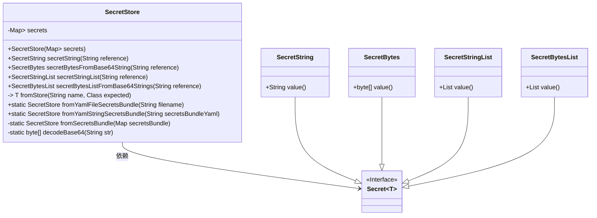
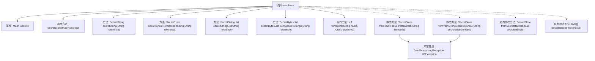

# 基础信息

|      |      |
|------|------|
| 名称 | SecretStore |
| 编码语言 | .java |
| 代码路径 | Signal-Server/service/src/main/java/org/whispersystems/textsecuregcm/configuration/secrets/SecretStore.java |
| 包名 | org.whispersystems.textsecuregcm.configuration.secrets |
| 依赖项 | ['com.fasterxml.jackson.core.JsonProcessingException', 'com.google.common.annotations.VisibleForTesting', 'java.io.File', 'java.io.IOException', 'java.util.Base64', 'java.util.HashMap', 'java.util.List', 'java.util.Map', 'org.whispersystems.textsecuregcm.util.SystemMapper'] |
| 概述说明 | SecretStore类管理密钥，支持YAML或字符串加载，提供多种密钥访问方式。 |

# 说明

SecretStore类是一个用于管理密钥的工具，支持从YAML文件或字符串中加载密钥，并提供多种访问密钥类型的方法，确保密钥管理的灵活性和便捷性。

# 类列表 Class Summary

| 名称   | 类型  | 说明 |
|-------|------|-------------|
| SecretStore | class | SecretStore类用于管理密钥，支持从YAML文件或字符串加载，并提供多种密钥类型访问方法。 |

## 类 SecretStore

|      |      |
|------|------|
| 访问范围 | public |
| 类型 | class |
| 名称 | SecretStore |
| 说明 | SecretStore类用于管理密钥，支持从YAML文件或字符串加载，并提供多种密钥类型访问方法。 |

### UML类图

这段代码定义了一个 `SecretStore` 类，用于管理和检索不同类型的秘密（如字符串、字节数组等）。`SecretStore` 类通过 YAML 文件或字符串初始化，并提供了一系列方法来获取特定类型的秘密。代码中使用了泛型接口 `Secret<T>` 来表示不同类型的秘密，并通过 `SecretString`、`SecretBytes`、`SecretStringList` 和 `SecretBytesList` 等类来实现具体类型的秘密。`SecretStore` 类还包含了一些私有方法，用于从存储中获取秘密并进行类型转换。

### 内部方法调用关系图

这段代码定义了一个`SecretStore`类，用于管理和操作存储在YAML文件或字符串中的秘密数据。类中包含了多个方法，用于从YAML文件中读取秘密数据并将其转换为不同类型的秘密对象（如`SecretString`、`SecretBytes`等）。代码还包含异常处理机制，确保在解析YAML文件或字符串时能够捕获并处理可能出现的错误。流程图展示了类的主要方法和它们之间的调用关系，帮助理解代码的执行流程。

### 字段列表 Field List

| 名称  | 类型  | 说明 |
|-------|-------|------|
| secrets | Map<String, Secret<?>> | 私有不可变映射，键为字符串，值为泛型Secret对象。 |

### 方法列表 Method List

| 名称  | 类型  | 说明 |
|-------|-------|------|
| decodeBase64 | byte[] | 解码Base64字符串为字节数组。 |
| secretBytesListFromBase64Strings | SecretBytesList | 该方法将Base64字符串列表解码为字节数组列表并返回。 |
| fromYamlFileSecretsBundle | SecretStore | 从YAML文件加载秘密存储，解析失败时抛出异常。 |
| secretStringList | SecretStringList | 该方法通过引用从存储中获取并返回秘密字符串列表。 |
| fromSecretsBundle | SecretStore | 从Map创建SecretStore，支持String和String列表值，否则抛出异常。 |
| secretBytesFromBase64String | SecretBytes | 方法将Base64字符串解码为SecretBytes对象。 |
| fromYamlStringSecretsBundle | SecretStore | 从YAML字符串解析并创建SecretStore实例，处理JSON异常。 |
| secretString | SecretString | 该方法通过引用从存储中获取SecretString类型的秘密字符串。 |
| fromStore | T | 从存储中获取指定名称的秘密，验证类型匹配后返回。 |

