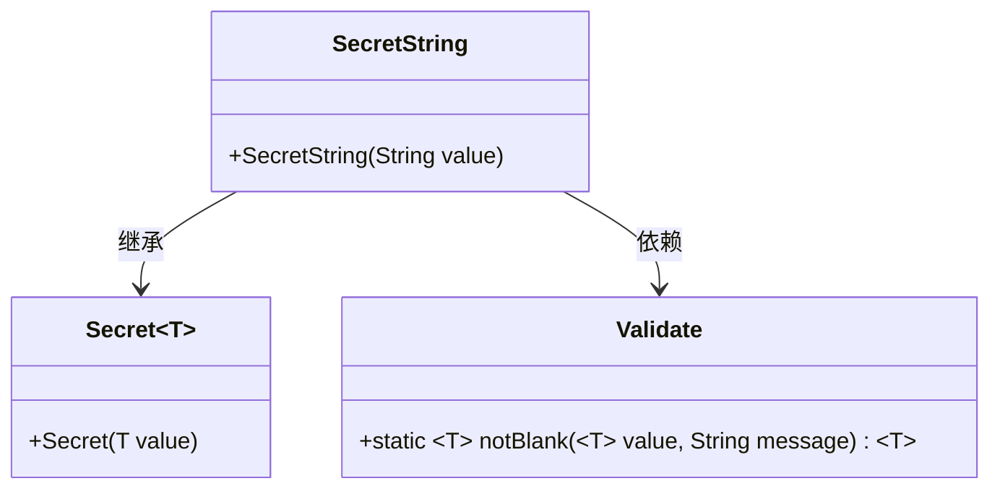
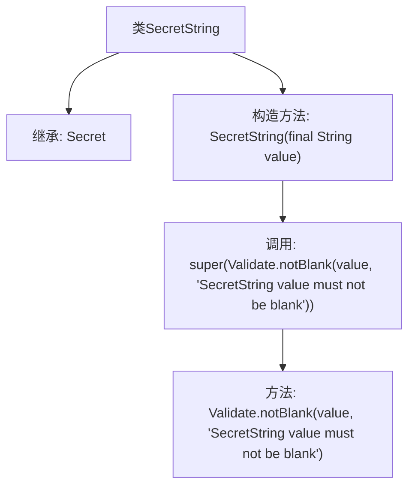

# 基础信息

|      |      |
|------|------|
| 名称 | SecretString |
| 编码语言 | .java |
| 代码路径 | Signal-Server/service/src/main/java/org/whispersystems/textsecuregcm/configuration/secrets/SecretString.java |
| 包名 | org.whispersystems.textsecuregcm.configuration.secrets |
| 依赖项 | ['org.apache.commons.lang3.Validate'] |
| 概述说明 | SecretString类继承Secret，确保字符串非空。 |

# 说明

SecretString类继承自Secret类，其主要功能是确保传入的字符串参数非空。通过继承，SecretString类不仅保留了Secret类的特性，还额外增加了对字符串参数的验证机制，以确保在后续操作中不会因空字符串引发错误或异常。这种设计增强了代码的健壮性和安全性。

# 类列表 Class Summary

| 名称   | 类型  | 说明 |
|-------|------|-------------|
| SecretString | class | SecretString类继承Secret，确保传入字符串非空。 |

## 类 SecretString

|      |      |
|------|------|
| 访问范围 | public |
| 类型 | class |
| 名称 | SecretString |
| 说明 | SecretString类继承Secret，确保传入字符串非空。 |

### UML类图

**描述：**  
`SecretString` 类继承自泛型类 `Secret`，并接受一个 `String` 类型的值作为参数。在构造函数中，它调用 `Validate.notBlank` 方法来确保传入的字符串值不为空或空白。`Validate` 类提供了一个静态方法 `notBlank`，用于验证输入值是否为空或空白，并在验证失败时抛出异常。`SecretString` 依赖于 `Validate` 类来进行输入验证，并通过继承 `Secret` 类来实现其核心功能。

### 内部方法调用关系图

这段代码定义了一个名为 `SecretString` 的类，该类继承自泛型类 `Secret<String>`。`SecretString` 类的构造函数接受一个 `String` 类型的参数 `value`，并在构造函数中调用父类的构造函数。在调用父类构造函数之前，使用 `Validate.notBlank` 方法对 `value` 进行验证，确保其不为空且不为空白字符串。如果 `value` 为空或空白，`Validate.notBlank` 方法将抛出异常。这段代码的主要作用是确保 `SecretString` 类的实例在创建时包含一个有效的非空白字符串值。

### 字段列表 Field List

| 名称  | 类型  | 说明 |
|-------|-------|------|

### 方法列表 Method List

| 名称  | 类型  | 说明 |
|-------|-------|------|

