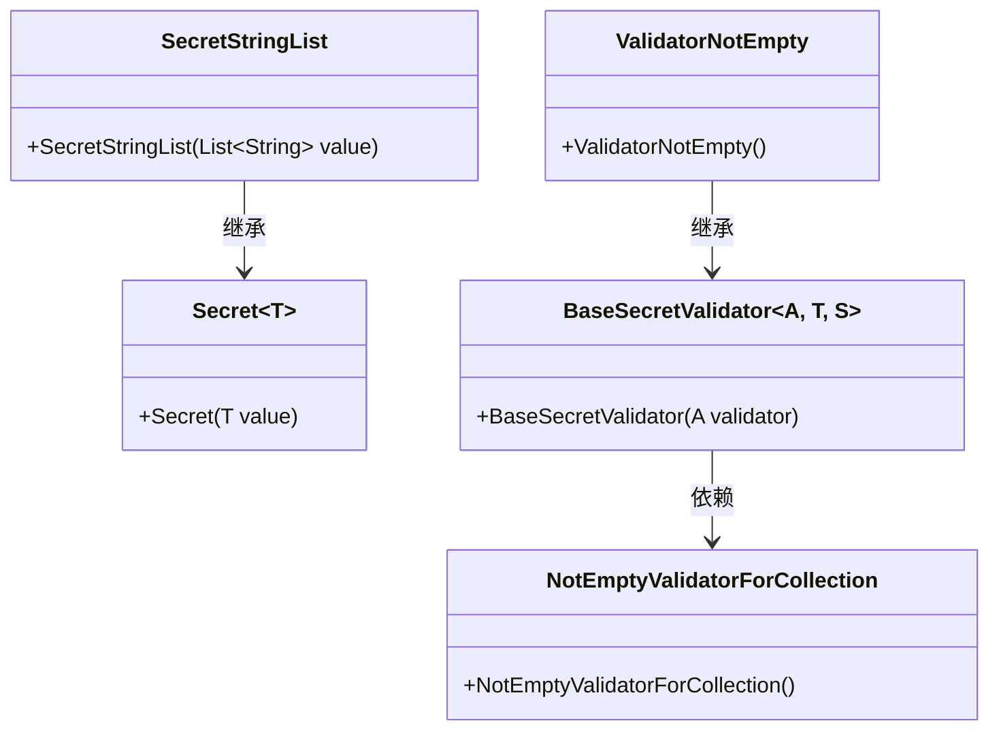
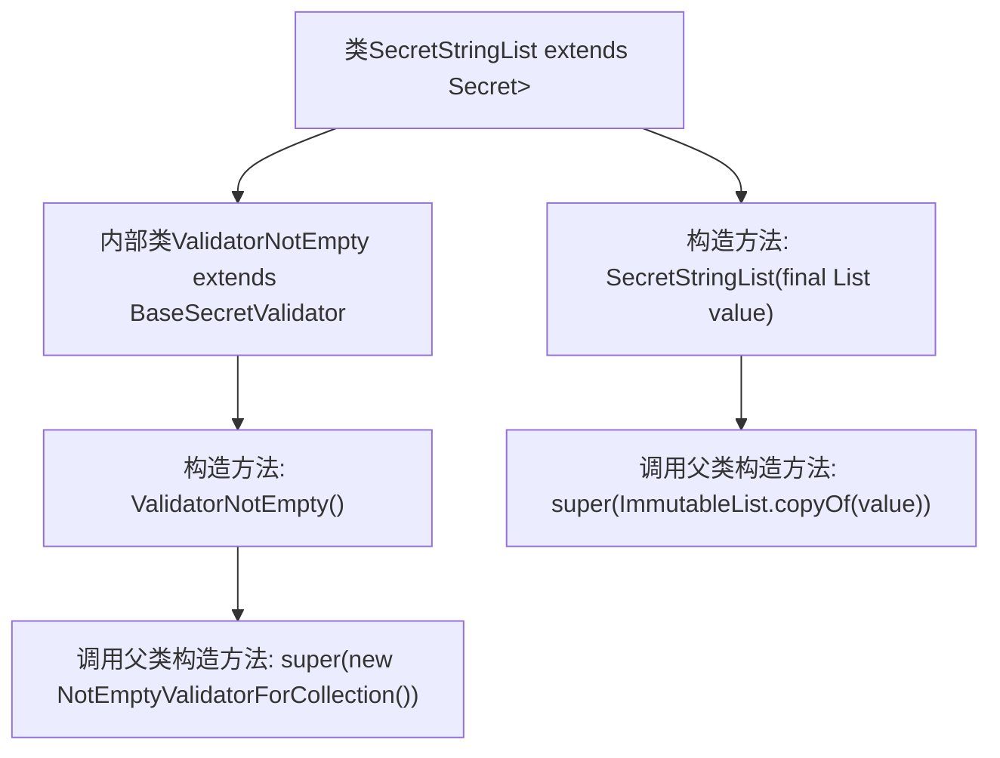

# 基础信息

|      |      |
|------|------|
| 名称 | SecretStringList |
| 编码语言 | .java |
| 代码路径 | Signal-Server/service/src/main/java/org/whispersystems/textsecuregcm/configuration/secrets/SecretStringList.java |
| 包名 | org.whispersystems.textsecuregcm.configuration.secrets |
| 依赖项 | ['com.google.common.collect.ImmutableList', 'jakarta.validation.constraints.NotEmpty', 'java.util.Collection', 'java.util.List', 'org.hibernate.validator.internal.constraintvalidators.bv.notempty.NotEmptyValidatorForCollection'] |
| 概述说明 | SecretStringList继承Secret，包含验证非空的ValidatorNotEmpty子类。 |

# 说明

SecretStringList类继承自Secret类，专门用于处理字符串列表的保密数据。该类包含一个名为ValidatorNotEmpty的子类，负责验证字符串列表是否为空。ValidatorNotEmpty子类确保在操作SecretStringList实例时，列表中的内容必须非空，从而增强数据的安全性和完整性。

# 类列表 Class Summary

| 名称   | 类型  | 说明 |
|-------|------|-------------|
| SecretStringList | class | SecretStringList类继承Secret，包含验证非空的ValidatorNotEmpty子类。 |

## 类 SecretStringList

|      |      |
|------|------|
| 访问范围 | public |
| 类型 | class |
| 名称 | SecretStringList |
| 说明 | SecretStringList类继承Secret，包含验证非空的ValidatorNotEmpty子类。 |

### UML类图

这段代码定义了一个`SecretStringList`类，它继承自`Secret<List<String>>`，并包含一个静态内部类`ValidatorNotEmpty`，后者继承自`BaseSecretValidator`。`BaseSecretValidator`依赖于`NotEmptyValidatorForCollection`来进行验证。`SecretStringList`类通过构造函数接收一个`List<String>`并将其传递给父类`Secret`。整体设计用于封装和验证字符串列表，确保其不为空。

### 内部方法调用关系图

这段代码定义了一个名为 `SecretStringList` 的类，该类继承自 `Secret<List<String>>`。`SecretStringList` 包含一个内部类 `ValidatorNotEmpty`，该类继承自 `BaseSecretValidator`，并在其构造方法中调用了父类的构造方法。`SecretStringList` 类本身也有一个构造方法，接收一个 `List<String>` 类型的参数，并调用父类的构造方法进行初始化。整体结构展示了类的继承关系和内部类的使用。

### 字段列表 Field List

| 名称  | 类型  | 说明 |
|-------|-------|------|

### 方法列表 Method List

| 名称  | 类型  | 说明 |
|-------|-------|------|

