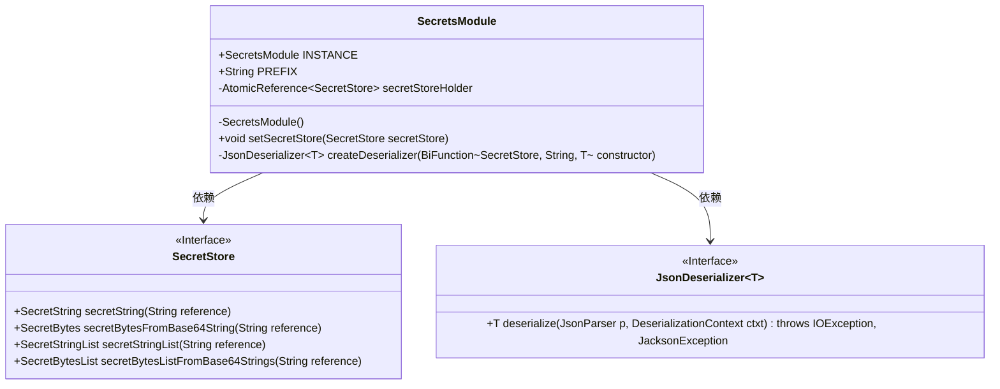
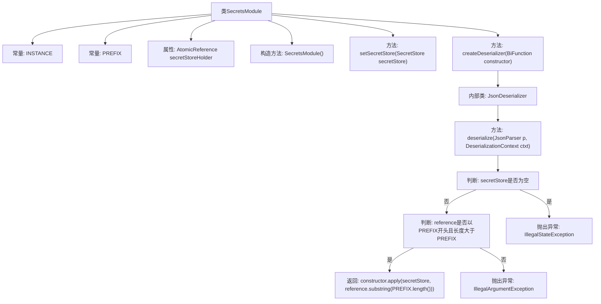

# 基础信息

|      |      |
|------|------|
| 名称 | SecretsModule |
| 编码语言 | .java |
| 代码路径 | Signal-Server/service/src/main/java/org/whispersystems/textsecuregcm/configuration/secrets/SecretsModule.java |
| 包名 | org.whispersystems.textsecuregcm.configuration.secrets |
| 依赖项 | ['java.util.Objects.requireNonNull', 'com.fasterxml.jackson.core.JacksonException', 'com.fasterxml.jackson.core.JsonParser', 'com.fasterxml.jackson.databind.DeserializationContext', 'com.fasterxml.jackson.databind.JsonDeserializer', 'com.fasterxml.jackson.databind.module.SimpleModule', 'java.io.IOException', 'java.util.concurrent.atomic.AtomicReference', 'java.util.function.BiFunction'] |
| 概述说明 | SecretsModule类管理秘密数据反序列化，支持多类型，需配置SecretStore实例。 |

# 说明

SecretsModule类负责管理秘密数据的反序列化，支持处理多种类型的秘密数据。为了正常运作，该类需要配置一个SecretStore实例，以便在反序列化过程中正确访问和解析秘密信息。

# 类列表 Class Summary

| 名称   | 类型  | 说明 |
|-------|------|-------------|
| SecretsModule | class | SecretsModule类用于管理秘密数据的反序列化，支持多种秘密类型，需设置SecretStore实例。 |

## 类 SecretsModule

|      |      |
|------|------|
| 访问范围 | public |
| 类型 | class |
| 名称 | SecretsModule |
| 说明 | SecretsModule类用于管理秘密数据的反序列化，支持多种秘密类型，需设置SecretStore实例。 |

### UML类图

这段代码定义了一个`SecretsModule`类，它是一个扩展自`SimpleModule`的模块，用于处理与秘密存储相关的反序列化操作。`SecretsModule`类包含一个`SecretStore`接口的引用，用于从秘密存储中获取数据。`createDeserializer`方法用于创建不同类型的反序列化器，这些反序列化器会根据输入字符串的前缀来判断是否需要从秘密存储中获取数据，并调用`SecretStore`接口中的相应方法来获取数据。`setSecretStore`方法用于设置`SecretStore`的实例。

### 内部方法调用关系图

这段代码定义了一个名为`SecretsModule`的类，用于处理与秘密存储相关的反序列化操作。类中包含一个常量`INSTANCE`和一个常量`PREFIX`，以及一个`AtomicReference`类型的属性`secretStoreHolder`。构造方法`SecretsModule()`用于添加多个反序列化器。`setSecretStore`方法用于设置`SecretStore`实例。`createDeserializer`方法创建并返回一个`JsonDeserializer`实例，该实例在反序列化时会检查`secretStore`是否为空以及`reference`是否以`PREFIX`开头，并根据检查结果执行相应操作或抛出异常。

### 字段列表 Field List

| 名称  | 类型  | 说明 |
|-------|-------|------|
| INSTANCE = new SecretsModule() | SecretsModule | 单例模式下的SecretsModule实例初始化。 |
| PREFIX = "secret://" | String | 定义常量PREFIX，值为"secret://"。 |
| secretStoreHolder = new AtomicReference<>(null) | AtomicReference<SecretStore> | 使用AtomicReference持有SecretStore实例，初始值为null。 |

### 方法列表 Method List

| 名称  | 类型  | 说明 |
|-------|-------|------|
| setSecretStore | void | 设置密钥存储对象，确保其非空。 |
| createDeserializer | JsonDeserializer<T> | 创建JSON反序列化器，使用构造函数处理SecretStore和字符串引用。 |

