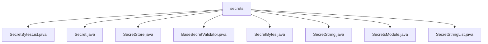

# 基础信息

|      |      |
|------|------|
| 名称 | secrets |
| 编码语言 | .java |
| 代码路径 | Signal-Server/service/src/main/java/org/whispersystems/textsecuregcm/configuration/secrets |
| 包名 | Signal-Server.service.src.main.java.org.whispersystems.textsecuregcm.configuration.secrets |
| 概述说明 | Secret类及其子类用于封装和验证数据，确保安全性和完整性。SecretStore管理密钥，SecretsModule处理秘密数据反序列化。 |

# 说明

## 概述

该代码模块主要围绕秘密数据的管理和安全性设计，提供了一系列用于处理不同类型秘密数据的类。模块的核心是`Secret`类，它是一个泛型类，用于封装值并提供访问和隐藏显示功能，确保数据的安全性和隐私性。基于`Secret`类，模块扩展了多个子类，如`SecretBytes`、`SecretString`、`SecretBytesList`和`SecretStringList`，分别用于处理字节数组、字符串、字节列表和字符串列表的保密数据。这些子类在继承`Secret`类的基础上，增加了对特定数据类型的非空验证，进一步增强了数据的完整性和安全性。

此外，模块还包含了`SecretStore`类，用于从YAML文件或字符串中加载和管理密钥，提供了灵活且便捷的密钥管理功能。`SecretsModule`类则负责秘密数据的反序列化，支持处理多种类型的秘密数据，并依赖于`SecretStore`实例来正确访问和解析秘密信息。模块中还包含`BaseSecretValidator`类，通过实现`ConstraintValidator`接口，封装了具体的验证逻辑，使得验证逻辑更加模块化和可复用。

## 主要业务场景

1. **秘密数据的封装与访问**：通过`Secret`类及其子类，模块能够安全地封装字节数组、字符串、字节列表和字符串列表等数据，并提供安全的访问机制，确保敏感数据不会被意外暴露。

2. **非空验证**：`SecretBytes`、`SecretString`、`SecretBytesList`和`SecretStringList`等子类在继承`Secret`类的基础上，增加了对特定数据类型的非空验证，确保在处理秘密数据时不会出现空值问题，增强了数据的完整性和安全性。

3. **密钥管理**：`SecretStore`类提供了从YAML文件或字符串中加载密钥的功能，支持多种访问密钥类型的方法，使得密钥管理更加灵活和便捷。

4. **秘密数据的反序列化**：`SecretsModule`类负责秘密数据的反序列化，支持处理多种类型的秘密数据，并依赖于`SecretStore`实例来正确访问和解析秘密信息。

5. **验证逻辑的模块化**：`BaseSecretValidator`类通过实现`ConstraintValidator`接口，封装了具体的验证逻辑，使得验证逻辑更加模块化和可复用，便于维护和扩展。

该模块适用于需要处理敏感数据的场景，特别是在需要确保数据安全性和完整性的系统中，如加密通信、密钥管理、用户隐私保护等。

### 包内部结构视图

该流程图展示了`secrets`目录下的文件层级关系。`secrets`作为根节点，包含了多个与密钥管理相关的Java文件，如`SecretBytesList.java`、`Secret.java`、`SecretStore.java`等。这些文件直接隶属于`secrets`目录，没有进一步的子目录层级，所有文件均为`secrets`的直接子节点。

# 文件列表 File List

| 名称   | 类型  | 说明 |
|-------|------|-------------|
| [SecretsModule.java](SecretsModule.md) | file | SecretsModule类管理秘密数据反序列化，支持多类型，需配置SecretStore实例。 |
| [SecretBytes.java](SecretBytes.md) | file | SecretBytes类继承Secret，确保字节数组非空。 |
| [SecretStore.java](SecretStore.md) | file | SecretStore类管理密钥，支持YAML或字符串加载，提供多种密钥访问方式。 |
| [SecretStringList.java](SecretStringList.md) | file | SecretStringList继承Secret，包含验证非空的ValidatorNotEmpty子类。 |
| [SecretString.java](SecretString.md) | file | SecretString类继承Secret，确保字符串非空。 |
| [BaseSecretValidator.java](BaseSecretValidator.md) | file | BaseSecretValidator类实现ConstraintValidator接口，封装验证逻辑并委托内部处理。 |
| [Secret.java](Secret.md) | file | 泛型类Secret封装值，支持访问和隐藏显示功能。 |
| [SecretBytesList.java](SecretBytesList.md) | file | SecretBytesList继承Secret，存储字节列表并验证非空。 |

