# 基础信息

|      |      |
|------|------|
| 名称 | AccountController |
| 编码语言 | .java |
| 代码路径 | Signal-Server/service/src/main/java/org/whispersystems/textsecuregcm/controllers/AccountController.java |
| 包名 | org.whispersystems.textsecuregcm.controllers |
| 依赖项 | ['io.dropwizard.auth.Auth', 'io.swagger.v3.oas.annotations.Operation', 'io.swagger.v3.oas.annotations.Parameter', 'io.swagger.v3.oas.annotations.media.Schema', 'io.swagger.v3.oas.annotations.responses.ApiResponse', 'jakarta.validation.Valid', 'jakarta.validation.constraints.NotNull', 'jakarta.ws.rs.BadRequestException', 'jakarta.ws.rs.Consumes', 'jakarta.ws.rs.DELETE', 'jakarta.ws.rs.ForbiddenException', 'jakarta.ws.rs.GET', 'jakarta.ws.rs.HEAD', 'jakarta.ws.rs.HeaderParam', 'jakarta.ws.rs.NotFoundException', 'jakarta.ws.rs.PUT', 'jakarta.ws.rs.Path', 'jakarta.ws.rs.PathParam', 'jakarta.ws.rs.Produces', 'jakarta.ws.rs.QueryParam', 'jakarta.ws.rs.WebApplicationException', 'jakarta.ws.rs.core.MediaType', 'jakarta.ws.rs.core.Response', 'jakarta.ws.rs.core.Response.Status', 'java.util.Base64', 'java.util.Objects', 'java.util.Optional', 'java.util.UUID', 'java.util.concurrent.CompletableFuture', 'javax.annotation.Nullable', 'org.apache.commons.lang3.StringUtils', 'org.signal.libsignal.usernames.BaseUsernameException', 'org.whispersystems.textsecuregcm.auth.AuthenticatedDevice', 'org.whispersystems.textsecuregcm.auth.SaltedTokenHash', 'org.whispersystems.textsecuregcm.entities.AccountAttributes', 'org.whispersystems.textsecuregcm.entities.AccountIdentifierResponse', 'org.whispersystems.textsecuregcm.entities.AccountIdentityResponse', 'org.whispersystems.textsecuregcm.entities.ApnRegistrationId', 'org.whispersystems.textsecuregcm.entities.ConfirmUsernameHashRequest', 'org.whispersystems.textsecuregcm.entities.DeviceName', 'org.whispersystems.textsecuregcm.entities.EncryptedUsername', 'org.whispersystems.textsecuregcm.entities.GcmRegistrationId', 'org.whispersystems.textsecuregcm.entities.RegistrationLock', 'org.whispersystems.textsecuregcm.entities.ReserveUsernameHashRequest', 'org.whispersystems.textsecuregcm.entities.ReserveUsernameHashResponse', 'org.whispersystems.textsecuregcm.entities.UsernameHashResponse', 'org.whispersystems.textsecuregcm.entities.UsernameLinkHandle', 'org.whispersystems.textsecuregcm.identity.AciServiceIdentifier', 'org.whispersystems.textsecuregcm.identity.IdentityType', 'org.whispersystems.textsecuregcm.identity.ServiceIdentifier', 'org.whispersystems.textsecuregcm.limits.RateLimitedByIp', 'org.whispersystems.textsecuregcm.limits.RateLimiters', 'org.whispersystems.textsecuregcm.storage.Account', 'org.whispersystems.textsecuregcm.storage.AccountsManager', 'org.whispersystems.textsecuregcm.storage.Device', 'org.whispersystems.textsecuregcm.storage.RegistrationRecoveryPasswordsManager', 'org.whispersystems.textsecuregcm.storage.UsernameHashNotAvailableException', 'org.whispersystems.textsecuregcm.storage.UsernameReservationNotFoundException', 'org.whispersystems.textsecuregcm.util.ExceptionUtils', 'org.whispersystems.textsecuregcm.util.HeaderUtils', 'org.whispersystems.textsecuregcm.util.UsernameHashZkProofVerifier', 'org.whispersystems.textsecuregcm.util.Util', 'org.whispersystems.websocket.auth.Mutable', 'org.whispersystems.websocket.auth.ReadOnly'] |
| 概述说明 | AccountController负责设备注册、用户名管理、账户属性和链接操作。 |

# 说明

AccountController负责处理与账户相关的各项操作，涵盖设备注册、用户名管理、账户属性设置以及账户链接等功能。该控制器确保用户能够顺利进行设备绑定、用户名修改、账户信息更新以及与其他账户的关联操作，从而全面管理用户的账户信息。

# 类列表 Class Summary

| 名称   | 类型  | 说明 |
|-------|------|-------------|
| AccountController | class | AccountController处理账户相关操作，包括设备注册、用户名管理、账户属性和链接等。 |


## 类 AccountController

|      |      |
|------|------|
| 访问范围 | @SuppressWarnings("OptionalUsedAsFieldOrParameterType");@Path("/v1/accounts");@io.swagger.v3.oas.annotations.tags.Tag(name = "Account");public |
| 类型 | class |
| 名称 | AccountController |
| 说明 | AccountController处理账户相关操作，包括设备注册、用户名管理、账户属性和链接等。 |


### UML类图

```mermaid
classDiagram
    class AccountController {
        +int MAXIMUM_USERNAME_HASHES_LIST_LENGTH
        +int USERNAME_HASH_LENGTH
        +int MAXIMUM_USERNAME_CIPHERTEXT_LENGTH
        -AccountsManager accounts
        -RateLimiters rateLimiters
        -RegistrationRecoveryPasswordsManager registrationRecoveryPasswordsManager
        -UsernameHashZkProofVerifier usernameHashZkProofVerifier
        +AccountController(AccountsManager, RateLimiters, RegistrationRecoveryPasswordsManager, UsernameHashZkProofVerifier)
        +void setGcmRegistrationId(AuthenticatedDevice, GcmRegistrationId)
        +void deleteGcmRegistrationId(AuthenticatedDevice)
        +void setApnRegistrationId(AuthenticatedDevice, ApnRegistrationId)
        +void deleteApnRegistrationId(AuthenticatedDevice)
        +void setRegistrationLock(AuthenticatedDevice, RegistrationLock)
        +void removeRegistrationLock(AuthenticatedDevice)
        +void setName(AuthenticatedDevice, DeviceName, Byte)
        +void setAccountAttributes(AuthenticatedDevice, String, AccountAttributes)
        +AccountIdentityResponse whoAmI(AuthenticatedDevice)
        +CompletableFuture~Response~ deleteUsernameHash(AuthenticatedDevice)
        +CompletableFuture~ReserveUsernameHashResponse~ reserveUsernameHash(AuthenticatedDevice, ReserveUsernameHashRequest)
        +CompletableFuture~UsernameHashResponse~ confirmUsernameHash(AuthenticatedDevice, ConfirmUsernameHashRequest)
        +CompletableFuture~AccountIdentifierResponse~ lookupUsernameHash(Optional~AuthenticatedDevice~, String)
        +UsernameLinkHandle updateUsernameLink(AuthenticatedDevice, EncryptedUsername)
        +void deleteUsernameLink(AuthenticatedDevice)
        +CompletableFuture~EncryptedUsername~ lookupUsernameLink(Optional~AuthenticatedDevice~, UUID)
        +Response accountExists(Optional~AuthenticatedDevice~, ServiceIdentifier)
        +CompletableFuture~Response~ deleteAccount(AuthenticatedDevice)
        -void clearUsernameLink(Account)
        -void updateUsernameLink(Account, UUID, byte[])
        -void requireNotAuthenticated(Optional~AuthenticatedDevice~)
    }

    class AccountsManager {
        +void updateDevice(Account, byte, Consumer~Device~)
        +void update(Account, Consumer~Account~)
        +CompletableFuture~Void~ clearUsernameHash(Account)
        +CompletableFuture~ReserveUsernameHashResponse~ reserveUsernameHash(Account, List~byte[]~)
        +CompletableFuture~Account~ confirmReservedUsernameHash(Account, byte[], byte[])
        +CompletableFuture~Optional~Account~~ getByUsernameHash(byte[])
        +CompletableFuture~Optional~Account~~ getByUsernameLinkHandle(UUID)
        +Optional~Account~ getByServiceIdentifier(ServiceIdentifier)
        +CompletableFuture~Void~ delete(Account, AccountsManager.DeletionReason)
    }

    class RateLimiters {
        +RateLimiter getUsernameReserveLimiter()
        +RateLimiter getUsernameSetLimiter()
        +RateLimiter forDescriptor(RateLimiters.For)
    }

    class RegistrationRecoveryPasswordsManager {
        +void store(UUID, String)
    }

    class UsernameHashZkProofVerifier {
        +void verifyProof(byte[], byte[])
    }

    class AuthenticatedDevice {
        +Account getAccount()
        +Device getAuthenticatedDevice()
        +boolean isPrimary()
        +byte getId()
    }

    class Account {
        +Optional~Device~ getDevice(byte)
        +void setRegistrationLock(byte[], byte[])
        +void setUnidentifiedAccessKey(byte[])
        +void setUnrestrictedUnidentifiedAccess(boolean)
        +void setDiscoverableByPhoneNumber(boolean)
        +void setUsernameLinkDetails(UUID, byte[])
        +Optional~byte[]~ getUsernameHash()
        +Optional~byte[]~ getEncryptedUsername()
        +UUID getUsernameLinkHandle()
        +UUID getUuid()
    }

    class Device {
        +void setApnId(String)
        +void setGcmId(String)
        +void setFetchesMessages(boolean)
        +void setName(String)
        +void setLastSeen(long)
        +void setCapabilities(DeviceCapabilities)
        +void setUserAgent(String)
        +byte getId()
    }

    class GcmRegistrationId {
        +String gcmRegistrationId()
    }

    class ApnRegistrationId {
        +String apnRegistrationId()
    }

    class RegistrationLock {
        +String getRegistrationLock()
    }

    class DeviceName {
        +String deviceName()
    }

    class AccountAttributes {
        +boolean getFetchesMessages()
        +String getName()
        +DeviceCapabilities getCapabilities()
        +Optional~String~ recoveryPassword()
        +byte[] getUnidentifiedAccessKey()
        +boolean isUnrestrictedUnidentifiedAccess()
        +boolean isDiscoverableByPhoneNumber()
    }

    class AccountIdentityResponse {
        // Response class
    }

    class ReserveUsernameHashRequest {
        +List~byte[]~ usernameHashes()
    }

    class ReserveUsernameHashResponse {
        +byte[] reservedUsernameHash()
    }

    class ConfirmUsernameHashRequest {
        +byte[] zkProof()
        +byte[] usernameHash()
    }

    class UsernameHashResponse {
        +byte[] usernameHash()
        +UUID usernameLinkHandle()
    }

    class AccountIdentifierResponse {
        +ServiceIdentifier identifier()
    }

    class EncryptedUsername {
        +boolean keepLinkHandle()
        +byte[] usernameLinkEncryptedValue()
    }

    class UsernameLinkHandle {
        +UUID handle()
    }

    class ServiceIdentifier {
        // Identifier class
    }

    class DeviceCapabilities {
        // Capabilities class
    }

    class AccountsManager.DeletionReason {
        // Enum for deletion reasons
    }

    class RateLimiters.For {
        // Enum for rate limiter descriptors
    }

    AccountController --> AccountsManager : 依赖
    AccountController --> RateLimiters : 依赖
    AccountController --> RegistrationRecoveryPasswordsManager : 依赖
    AccountController --> UsernameHashZkProofVerifier : 依赖
    AccountController --> AuthenticatedDevice : 依赖
    AccountsManager --> Account : 依赖
    AccountsManager --> Device : 依赖
    AuthenticatedDevice --> Account : 依赖
    AuthenticatedDevice --> Device : 依赖
    Account --> Device : 依赖
    Account --> RegistrationLock : 依赖
    Account --> AccountAttributes : 依赖
    Account --> UsernameHashZkProofVerifier : 依赖
    Device --> GcmRegistrationId : 依赖
    Device --> ApnRegistrationId : 依赖
    Device --> DeviceName : 依赖
    Device --> AccountAttributes : 依赖
    AccountAttributes --> DeviceCapabilities : 依赖
    ReserveUsernameHashRequest --> byte[] : 依赖
    ConfirmUsernameHashRequest --> byte[] : 依赖
    UsernameHashResponse --> byte[] : 依赖
    UsernameHashResponse --> UUID : 依赖
    EncryptedUsername --> byte[] : 依赖
    UsernameLinkHandle --> UUID : 依赖
    AccountIdentifierResponse --> ServiceIdentifier : 依赖
```

**描述**：`AccountController` 是一个处理账户相关操作的控制器类，负责管理设备的注册、删除、账户属性的设置、用户名哈希的保留与确认等操作。它依赖于 `AccountsManager`、`RateLimiters`、`RegistrationRecoveryPasswordsManager` 和 `UsernameHashZkProofVerifier` 等类来执行具体的业务逻辑。`AccountController` 通过 REST API 提供了一系列端点，允许客户端进行账户和设备的管理操作。


### 内部方法调用关系图

```mermaid
graph TD
    A["类AccountController"]
    B["属性: AccountsManager accounts"]
    C["属性: RateLimiters rateLimiters"]
    D["属性: RegistrationRecoveryPasswordsManager registrationRecoveryPasswordsManager"]
    E["属性: UsernameHashZkProofVerifier usernameHashZkProofVerifier"]
    F["构造方法: AccountController(AccountsManager, RateLimiters, RegistrationRecoveryPasswordsManager, UsernameHashZkProofVerifier)"]
    G["方法: setGcmRegistrationId(AuthenticatedDevice, GcmRegistrationId)"]
    H["方法: deleteGcmRegistrationId(AuthenticatedDevice)"]
    I["方法: setApnRegistrationId(AuthenticatedDevice, ApnRegistrationId)"]
    J["方法: deleteApnRegistrationId(AuthenticatedDevice)"]
    K["方法: setRegistrationLock(AuthenticatedDevice, RegistrationLock)"]
    L["方法: removeRegistrationLock(AuthenticatedDevice)"]
    M["方法: setName(AuthenticatedDevice, DeviceName, Byte)"]
    N["方法: setAccountAttributes(AuthenticatedDevice, String, AccountAttributes)"]
    O["方法: whoAmI(AuthenticatedDevice)"]
    P["方法: deleteUsernameHash(AuthenticatedDevice)"]
    Q["方法: reserveUsernameHash(AuthenticatedDevice, ReserveUsernameHashRequest)"]
    R["方法: confirmUsernameHash(AuthenticatedDevice, ConfirmUsernameHashRequest)"]
    S["方法: lookupUsernameHash(Optional<AuthenticatedDevice>, String)"]
    T["方法: updateUsernameLink(AuthenticatedDevice, EncryptedUsername)"]
    U["方法: deleteUsernameLink(AuthenticatedDevice)"]
    V["方法: lookupUsernameLink(Optional<AuthenticatedDevice>, UUID)"]
    W["方法: accountExists(Optional<AuthenticatedDevice>, ServiceIdentifier)"]
    X["方法: deleteAccount(AuthenticatedDevice)"]
    Y["方法: clearUsernameLink(Account)"]
    Z["方法: updateUsernameLink(Account, UUID, byte[])"]
    AA["方法: requireNotAuthenticated(Optional<AuthenticatedDevice>)"]

    A --> B
    A --> C
    A --> D
    A --> E
    A --> F
    A --> G
    A --> H
    A --> I
    A --> J
    A --> K
    A --> L
    A --> M
    A --> N
    A --> O
    A --> P
    A --> Q
    A --> R
    A --> S
    A --> T
    A --> U
    A --> V
    A --> W
    A --> X
    A --> Y
    A --> Z
    A --> AA
```



**描述：**
`AccountController` 类是一个用于管理账户相关操作的控制器，包含多个方法来处理GCM、APN、注册锁、用户名哈希等操作。每个方法都通过 `AccountsManager` 和其他依赖项来执行具体的业务逻辑。该类的设计遵循了RESTful API的原则，通过HTTP方法（如 `PUT`、`DELETE`、`GET`）来执行不同的操作，并通过注解来定义API的路径、请求类型和响应类型。

### 字段列表 Field List

| 名称  | 类型  | 说明 |
|-------|-------|------|
| registrationRecoveryPasswordsManager | RegistrationRecoveryPasswordsManager | 私有注册恢复密码管理器实例。 |
| MAXIMUM_USERNAME_HASHES_LIST_LENGTH = 20 | int | 最大用户名哈希列表长度为20。 |
| rateLimiters | RateLimiters | 私有且不可变的速率限制器实例。 |
| USERNAME_HASH_LENGTH = 32 | int | 定义常量USERNAME_HASH_LENGTH，值为32。 |
| MAXIMUM_USERNAME_CIPHERTEXT_LENGTH = 128 | int | 最大用户名密文长度为128。 |
| accounts | AccountsManager | 私有且不可变的账户管理器实例。 |
| usernameHashZkProofVerifier | UsernameHashZkProofVerifier | 私有成员变量usernameHashZkProofVerifier用于验证用户名哈希零知识证明。 |

### 方法列表 Method List

| 名称  | 类型  | 说明 |
|-------|-------|------|
| removeRegistrationLock | void | 删除注册锁，更新账户信息。 |
| clearUsernameLink | void | 清除账户的用户名链接信息。 |
| deleteAccount | CompletableFuture<Response> | 删除用户账户的API接口，需认证设备信息。 |
| deleteGcmRegistrationId | void | 删除GCM注册ID，更新设备信息。 |
| reserveUsernameHash | CompletableFuture<ReserveUsernameHashResponse> | 认证接口，保留未使用的用户名哈希，返回成功或错误状态。 |
| requireNotAuthenticated | void | 检查设备是否未认证，若已认证则抛出异常。 |
| confirmUsernameHash | CompletableFuture<UsernameHashResponse> | 认证接口，确认用户名哈希，处理多种错误状态。 |
| whoAmI | AccountIdentityResponse | API路径`/whoami`返回认证设备的账户身份信息。 |
| updateUsernameLink | UsernameLinkHandle | 认证接口，生成并更新用户名链接句柄，支持加密用户名查找。 |
| accountExists | Response | 检查账户是否存在的未认证接口，支持多种响应状态码。 |
| deleteUsernameHash | CompletableFuture<Response> | 认证接口，删除账户用户名哈希，成功返回204，认证失败返回401。 |
| setRegistrationLock | void | PUT请求更新注册锁，验证设备权限，生成哈希值并更新账户信息。 |
| updateUsernameLink | void | 更新账户用户名链接，检查参数一致性并调用更新方法。 |
| setName | void | 设置设备加密名称，主设备可修改所有设备名称，关联设备仅能修改自身名称。 |
| lookupUsernameHash | CompletableFuture<AccountIdentifierResponse> | 通过用户名哈希查找用户ID，强制未认证，返回账户信息或错误状态。 |
| setAccountAttributes | void | 更新账户属性，包括设备信息、注册锁、匿名访问密钥等。 |
| setGcmRegistrationId | void | API路径为/gcm/，用于更新设备的GCM注册ID，并清除APN ID和消息获取状态。 |
| deleteApnRegistrationId | void | 删除APN注册ID，更新设备信息，包括清除APN ID和消息获取状态，并设置用户代理。 |
| setApnRegistrationId | void | API路径为/apn/，接受JSON，更新设备APN注册ID，清空GCM ID，禁用消息获取。 |
| deleteUsernameLink | void | 删除用户链接，需认证，删除加密用户名并停用链接。返回204成功，401认证失败，429限速。 |
| lookupUsernameLink | CompletableFuture<EncryptedUsername> | 通过UUID查找加密用户名，未认证请求，返回200/400/404/422/429状态码。 |


