# 基础信息

|      |      |
|------|------|
| 名称 | AccountControllerV2 |
| 编码语言 | .java |
| 代码路径 | Signal-Server/service/src/main/java/org/whispersystems/textsecuregcm/controllers/AccountControllerV2.java |
| 包名 | org.whispersystems.textsecuregcm.controllers |
| 依赖项 | ['org.whispersystems.textsecuregcm.metrics.MetricsUtil.name', 'com.google.common.net.HttpHeaders', 'io.dropwizard.auth.Auth', 'io.micrometer.core.instrument.Metrics', 'io.micrometer.core.instrument.Tag', 'io.micrometer.core.instrument.Tags', 'io.swagger.v3.oas.annotations.Operation', 'io.swagger.v3.oas.annotations.headers.Header', 'io.swagger.v3.oas.annotations.media.Content', 'io.swagger.v3.oas.annotations.media.Schema', 'io.swagger.v3.oas.annotations.responses.ApiResponse', 'jakarta.validation.Valid', 'jakarta.validation.constraints.NotNull', 'jakarta.ws.rs.BadRequestException', 'jakarta.ws.rs.Consumes', 'jakarta.ws.rs.ForbiddenException', 'jakarta.ws.rs.GET', 'jakarta.ws.rs.HeaderParam', 'jakarta.ws.rs.PUT', 'jakarta.ws.rs.Path', 'jakarta.ws.rs.Produces', 'jakarta.ws.rs.WebApplicationException', 'jakarta.ws.rs.container.ContainerRequestContext', 'jakarta.ws.rs.core.Context', 'jakarta.ws.rs.core.MediaType', 'jakarta.ws.rs.core.Response', 'java.time.Instant', 'java.util.Optional', 'java.util.UUID', 'javax.annotation.Nullable', 'org.whispersystems.textsecuregcm.auth.AuthenticatedDevice', 'org.whispersystems.textsecuregcm.auth.ChangesPhoneNumber', 'org.whispersystems.textsecuregcm.auth.PhoneVerificationTokenManager', 'org.whispersystems.textsecuregcm.auth.RegistrationLockVerificationManager', 'org.whispersystems.textsecuregcm.entities.AccountDataReportResponse', 'org.whispersystems.textsecuregcm.entities.AccountIdentityResponse', 'org.whispersystems.textsecuregcm.entities.ChangeNumberRequest', 'org.whispersystems.textsecuregcm.entities.MismatchedDevices', 'org.whispersystems.textsecuregcm.entities.PhoneNumberDiscoverabilityRequest', 'org.whispersystems.textsecuregcm.entities.PhoneNumberIdentityKeyDistributionRequest', 'org.whispersystems.textsecuregcm.entities.PhoneVerificationRequest', 'org.whispersystems.textsecuregcm.entities.RegistrationLockFailure', 'org.whispersystems.textsecuregcm.entities.StaleDevices', 'org.whispersystems.textsecuregcm.limits.RateLimiters', 'org.whispersystems.textsecuregcm.metrics.UserAgentTagUtil', 'org.whispersystems.textsecuregcm.push.MessageTooLargeException', 'org.whispersystems.textsecuregcm.storage.Account', 'org.whispersystems.textsecuregcm.storage.AccountsManager', 'org.whispersystems.textsecuregcm.storage.ChangeNumberManager', 'org.whispersystems.websocket.auth.Mutable', 'org.whispersystems.websocket.auth.ReadOnly'] |
| 概述说明 | AccountControllerV2类负责账户管理，涵盖改号、密钥分发、可发现性设置及数据报告生成。 |

# 说明

AccountControllerV2类负责账户管理的多项功能，包括处理账户号码的更改、密钥的分发、可发现性的设置以及数据报告的生成。该类全面涵盖了账户相关的核心操作，确保账户信息的安全性和可管理性。

# 类列表 Class Summary

| 名称   | 类型  | 说明 |
|-------|------|-------------|
| AccountControllerV2 | class | AccountControllerV2类处理账户管理，包括更改号码、分发密钥、设置可发现性和生成数据报告。 |

## 类 AccountControllerV2

|      |      |
|------|------|
| 访问范围 | @Path("/v2/accounts");@io.swagger.v3.oas.annotations.tags.Tag(name = "Account");public |
| 类型 | class |
| 名称 | AccountControllerV2 |
| 说明 | AccountControllerV2类处理账户管理，包括更改号码、分发密钥、设置可发现性和生成数据报告。 |

### UML类图

```mermaid
classDiagram
    class AccountControllerV2 {
        -String CHANGE_NUMBER_COUNTER_NAME
        -String VERIFICATION_TYPE_TAG_NAME
        -AccountsManager accountsManager
        -ChangeNumberManager changeNumberManager
        -PhoneVerificationTokenManager phoneVerificationTokenManager
        -RegistrationLockVerificationManager registrationLockVerificationManager
        -RateLimiters rateLimiters
        +AccountControllerV2(AccountsManager, ChangeNumberManager, PhoneVerificationTokenManager, RegistrationLockVerificationManager, RateLimiters)
        +AccountIdentityResponse changeNumber(AuthenticatedDevice, ChangeNumberRequest, String, ContainerRequestContext) throws RateLimitExceededException, InterruptedException
        +AccountIdentityResponse distributePhoneNumberIdentityKeys(AuthenticatedDevice, String, PhoneNumberIdentityKeyDistributionRequest)
        +void setPhoneNumberDiscoverability(AuthenticatedDevice, PhoneNumberDiscoverabilityRequest)
        +AccountDataReportResponse getAccountDataReport(AuthenticatedDevice)
    }

    class AccountsManager {
        <<Interface>>
        +Optional~Account~ getByE164(String)
        +void update(Account, Consumer~Account~)
    }

    class ChangeNumberManager {
        <<Interface>>
        +Account changeNumber(Account, String, String, Map~Long, SignedPreKey~, Map~Long, SignedPreKey~, Map~Long, ByteBuffer~, Map~Long, Integer~, String)
        +Account updatePniKeys(Account, String, Map~Long, SignedPreKey~, Map~Long, SignedPreKey~, Map~Long, ByteBuffer~, Map~Long, Integer~, String)
    }

    class PhoneVerificationTokenManager {
        <<Interface>>
        +PhoneVerificationRequest.VerificationType verify(ContainerRequestContext, String, ChangeNumberRequest)
    }

    class RegistrationLockVerificationManager {
        <<Interface>>
        +void verifyRegistrationLock(Account, String, String, Flow, PhoneVerificationRequest.VerificationType)
    }

    class RateLimiters {
        <<Interface>>
        +RateLimiter getRegistrationLimiter()
    }

    class AccountIdentityResponse {
        // Details omitted for brevity
    }

    class AccountDataReportResponse {
        // Details omitted for brevity
    }

    class AuthenticatedDevice {
        // Details omitted for brevity
    }

    class ChangeNumberRequest {
        // Details omitted for brevity
    }

    class PhoneNumberIdentityKeyDistributionRequest {
        // Details omitted for brevity
    }

    class PhoneNumberDiscoverabilityRequest {
        // Details omitted for brevity
    }

    class ContainerRequestContext {
        // Details omitted for brevity
    }

    AccountControllerV2 --> AccountsManager : 依赖
    AccountControllerV2 --> ChangeNumberManager : 依赖
    AccountControllerV2 --> PhoneVerificationTokenManager : 依赖
    AccountControllerV2 --> RegistrationLockVerificationManager : 依赖
    AccountControllerV2 --> RateLimiters : 依赖
```

### 类图描述
`AccountControllerV2` 是一个控制器类，负责处理与账户相关的操作，如更改电话号码、分发电话号码身份密钥、设置电话号码可发现性以及获取账户数据报告。它依赖于多个管理器类（如 `AccountsManager`、`ChangeNumberManager` 等）来执行具体的业务逻辑。这些管理器类通过接口定义，确保代码的灵活性和可扩展性。控制器类中的方法通过注解定义了 RESTful API 的路径、请求方法和响应类型，并处理各种异常情况。

### 内部方法调用关系图

```mermaid
graph TD
    A["类AccountControllerV2"]
    B["属性: String CHANGE_NUMBER_COUNTER_NAME"]
    C["属性: String VERIFICATION_TYPE_TAG_NAME"]
    D["属性: AccountsManager accountsManager"]
    E["属性: ChangeNumberManager changeNumberManager"]
    F["属性: PhoneVerificationTokenManager phoneVerificationTokenManager"]
    G["属性: RegistrationLockVerificationManager registrationLockVerificationManager"]
    H["属性: RateLimiters rateLimiters"]
    I["构造方法: AccountControllerV2"]
    J["方法: AccountIdentityResponse changeNumber"]
    K["方法: AccountIdentityResponse distributePhoneNumberIdentityKeys"]
    L["方法: void setPhoneNumberDiscoverability"]
    M["方法: AccountDataReportResponse getAccountDataReport"]

    A --> B
    A --> C
    A --> D
    A --> E
    A --> F
    A --> G
    A --> H
    A --> I
    A --> J
    A --> K
    A --> L
    A --> M
```

这段代码定义了一个名为 `AccountControllerV2` 的类，用于处理与账户相关的操作。类中包含多个属性，如 `accountsManager`、`changeNumberManager` 等，用于管理账户、电话号码变更、电话验证等功能。类中还定义了多个方法，如 `changeNumber` 用于变更电话号码，`distributePhoneNumberIdentityKeys` 用于分发电话号码身份密钥，`setPhoneNumberDiscoverability` 用于设置电话号码的可发现性，`getAccountDataReport` 用于获取账户数据报告。每个方法都处理特定的业务逻辑，并通过注解定义了相应的API路径和响应。

### 字段列表 Field List

| 名称  | 类型  | 说明 |
|-------|-------|------|
| registrationLockVerificationManager | RegistrationLockVerificationManager | 私有注册锁验证管理器实例。 |
| phoneVerificationTokenManager | PhoneVerificationTokenManager | 私有成员变量，用于管理手机验证令牌。 |
| CHANGE_NUMBER_COUNTER_NAME = name(AccountControllerV2.class, "changeNumber") | String | 定义私有静态常量字符串，用于记录AccountControllerV2类中changeNumber方法的计数器名称。 |
| accountsManager | AccountsManager | 私有且不可变的账户管理器实例。 |
| changeNumberManager | ChangeNumberManager | 私有且不可变的ChangeNumberManager实例。 |
| rateLimiters | RateLimiters | 私有且不可变的RateLimiters实例。 |
| VERIFICATION_TYPE_TAG_NAME = "verification" | String | 定义私有静态常量VERIFICATION_TYPE_TAG_NAME，值为"verification"。 |

### 方法列表 Method List

| 名称  | 类型  | 说明 |
|-------|-------|------|
| setPhoneNumberDiscoverability | void | 设置账户是否可通过电话号码在目录中被发现。 |
| getAccountDataReport | AccountDataReportResponse | 生成账户数据报告，包含账户和设备信息，返回JSON格式响应。 |
| distributePhoneNumberIdentityKeys | AccountIdentityResponse | 更新电话号码身份密钥，验证设备并同步信息，处理多种错误情况。 |
| changeNumber | AccountIdentityResponse | 该API用于更改账户电话号码，支持多种响应状态码，处理验证、设备匹配及消息大小等问题。 |

