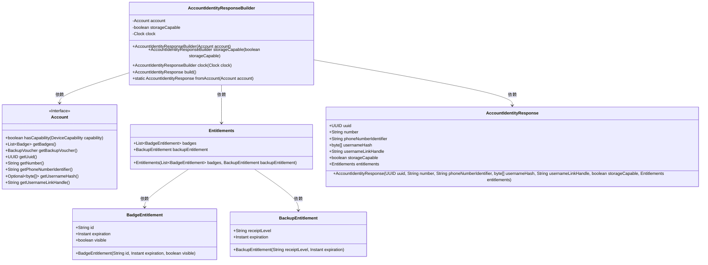
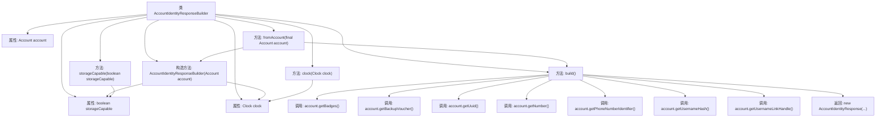

# 基础信息

|      |      |
|------|------|
| 名称 | AccountIdentityResponseBuilder |
| 编码语言 | .java |
| 代码路径 | Signal-Server/service/src/main/java/org/whispersystems/textsecuregcm/controllers/AccountIdentityResponseBuilder.java |
| 包名 | org.whispersystems.textsecuregcm.controllers |
| 依赖项 | ['java.time.Clock', 'java.util.List', 'java.util.Optional', 'org.whispersystems.textsecuregcm.entities.AccountIdentityResponse', 'org.whispersystems.textsecuregcm.entities.Entitlements', 'org.whispersystems.textsecuregcm.storage.Account', 'org.whispersystems.textsecuregcm.storage.DeviceCapability'] |
| 概述说明 | 构建包含账户信息、存储能力、时钟及权益的AccountIdentityResponse对象。 |

# 说明

构建AccountIdentityResponse对象的过程涉及多个关键组件。该对象主要用于封装账户的详细信息，包括账户的基本信息、存储能力、时钟数据以及相关权益。通过这些组件，系统能够全面管理和展示账户的状态和属性，确保账户信息的一致性和完整性。这一过程旨在为后续的账户操作和数据分析提供准确的基础数据支持。

# 类列表 Class Summary

| 名称   | 类型  | 说明 |
|-------|------|-------------|
| AccountIdentityResponseBuilder | class | 构建AccountIdentityResponse对象，包含账户信息、存储能力、时钟及权益。 |

## 类 AccountIdentityResponseBuilder

|      |      |
|------|------|
| 访问范围 | public |
| 类型 | class |
| 名称 | AccountIdentityResponseBuilder |
| 说明 | 构建AccountIdentityResponse对象，包含账户信息、存储能力、时钟及权益。 |

### UML类图

这段代码定义了一个`AccountIdentityResponseBuilder`类，用于构建`AccountIdentityResponse`对象。该类通过`Account`对象获取相关信息，并生成包含用户身份、权限等内容的响应对象。`AccountIdentityResponseBuilder`类提供了设置存储能力和时钟的方法，并通过`build`方法生成最终的响应对象。`Account`接口定义了获取用户信息的方法，`Entitlements`类则用于管理用户的徽章和备份权限。整个流程通过多个类的协作，最终生成一个完整的用户身份响应对象。

### 内部方法调用关系图

**描述：**  
`AccountIdentityResponseBuilder` 类用于构建 `AccountIdentityResponse` 对象。它通过构造方法初始化 `account`、`storageCapable` 和 `clock` 属性，并提供 `storageCapable` 和 `clock` 方法以修改这些属性。`build` 方法通过过滤和映射 `account` 的徽章和备份凭证，最终生成 `AccountIdentityResponse` 对象。`fromAccount` 静态方法则简化了从 `Account` 对象直接生成 `AccountIdentityResponse` 的过程。

### 字段列表 Field List

| 名称  | 类型  | 说明 |
|-------|-------|------|
| account | Account | 声明一个不可变的私有Account类型变量account。 |
| storageCapable | boolean | 存储能力状态标识符。 |
| clock | Clock | 声明一个私有的Clock类型变量clock。 |

### 方法列表 Method List

| 名称  | 类型  | 说明 |
|-------|-------|------|
| fromAccount | AccountIdentityResponse | 静态方法将账户对象转换为账户身份响应对象。 |
| storageCapable | AccountIdentityResponseBuilder | 设置账户身份响应构建器的存储能力属性。 |
| clock | AccountIdentityResponseBuilder | 方法设置时钟并返回当前对象。 |
| build | AccountIdentityResponse | 构建账户身份响应，包含有效徽章、备份凭证及账户信息。 |

