# 基础信息

|      |      |
|------|------|
| 名称 | ArchiveController |
| 编码语言 | .java |
| 代码路径 | Signal-Server/service/src/main/java/org/whispersystems/textsecuregcm/controllers/ArchiveController.java |
| 包名 | org.whispersystems.textsecuregcm.controllers |
| 依赖项 | ['com.fasterxml.jackson.annotation.JsonCreator', 'com.fasterxml.jackson.annotation.JsonValue', 'com.fasterxml.jackson.core.JsonParser', 'com.fasterxml.jackson.databind.DeserializationContext', 'com.fasterxml.jackson.databind.JsonDeserializer', 'com.fasterxml.jackson.databind.annotation.JsonDeserialize', 'com.fasterxml.jackson.databind.annotation.JsonSerialize', 'com.google.common.annotations.VisibleForTesting', 'io.dropwizard.auth.Auth', 'io.swagger.v3.oas.annotations.Operation', 'io.swagger.v3.oas.annotations.Parameter', 'io.swagger.v3.oas.annotations.media.Content', 'io.swagger.v3.oas.annotations.media.Schema', 'io.swagger.v3.oas.annotations.responses.ApiResponse', 'io.swagger.v3.oas.annotations.tags.Tag', 'jakarta.validation.Valid', 'jakarta.validation.constraints.Max', 'jakarta.validation.constraints.Min', 'jakarta.validation.constraints.NotNull', 'jakarta.validation.constraints.PositiveOrZero', 'jakarta.validation.constraints.Size', 'jakarta.ws.rs.BadRequestException', 'jakarta.ws.rs.ClientErrorException', 'jakarta.ws.rs.Consumes', 'jakarta.ws.rs.DELETE', 'jakarta.ws.rs.GET', 'jakarta.ws.rs.HeaderParam', 'jakarta.ws.rs.POST', 'jakarta.ws.rs.PUT', 'jakarta.ws.rs.Path', 'jakarta.ws.rs.Produces', 'jakarta.ws.rs.QueryParam', 'jakarta.ws.rs.core.MediaType', 'jakarta.ws.rs.core.Response', 'java.io.IOException', 'java.lang.annotation.ElementType', 'java.lang.annotation.Retention', 'java.lang.annotation.RetentionPolicy', 'java.lang.annotation.Target', 'java.time.Instant', 'java.util.Arrays', 'java.util.Base64', 'java.util.List', 'java.util.Locale', 'java.util.Map', 'java.util.Optional', 'java.util.concurrent.CompletableFuture', 'java.util.concurrent.CompletionStage', 'java.util.concurrent.ConcurrentHashMap', 'java.util.stream.Collectors', 'java.util.stream.Stream', 'org.signal.libsignal.protocol.ecc.ECPublicKey', 'org.signal.libsignal.zkgroup.InvalidInputException', 'org.signal.libsignal.zkgroup.backups.BackupAuthCredentialPresentation', 'org.signal.libsignal.zkgroup.backups.BackupAuthCredentialRequest', 'org.signal.libsignal.zkgroup.backups.BackupCredentialType', 'org.signal.libsignal.zkgroup.receipts.ReceiptCredentialPresentation', 'org.whispersystems.textsecuregcm.auth.AuthenticatedDevice', 'org.whispersystems.textsecuregcm.backup.BackupAuthManager', 'org.whispersystems.textsecuregcm.backup.BackupManager', 'org.whispersystems.textsecuregcm.backup.CopyParameters', 'org.whispersystems.textsecuregcm.backup.CopyResult', 'org.whispersystems.textsecuregcm.backup.MediaEncryptionParameters', 'org.whispersystems.textsecuregcm.entities.RemoteAttachment', 'org.whispersystems.textsecuregcm.util.BackupAuthCredentialAdapter', 'org.whispersystems.textsecuregcm.util.ByteArrayAdapter', 'org.whispersystems.textsecuregcm.util.ByteArrayBase64UrlAdapter', 'org.whispersystems.textsecuregcm.util.ECPublicKeyAdapter', 'org.whispersystems.textsecuregcm.util.ExactlySize', 'org.whispersystems.textsecuregcm.util.Util', 'org.whispersystems.websocket.auth.Mutable', 'org.whispersystems.websocket.auth.ReadOnly', 'reactor.core.publisher.Mono'] |
| 概述说明 | ArchiveController负责备份操作，管理备份ID、ZK凭证、媒体文件及删除备份。 |

# 说明

ArchiveController负责管理备份操作，主要功能包括设置备份ID、获取ZK凭证、备份媒体文件以及删除备份。该控制器确保备份过程的完整性和安全性，通过精确的操作流程实现数据的有效管理和维护。

# 类列表 Class Summary

| 名称   | 类型  | 说明 |
|-------|------|-------------|
| ArchiveController | class | ArchiveController处理备份操作，包括设置备份ID、获取ZK凭证、备份媒体文件、删除备份等。 |

## 类 ArchiveController

|      |      |
|------|------|
| 访问范围 | @Path("/v1/archives");@Tag(name = "Archive");public |
| 类型 | class |
| 名称 | ArchiveController |
| 说明 | ArchiveController处理备份操作，包括设置备份ID、获取ZK凭证、备份媒体文件、删除备份等。 |

### UML类图

```mermaid
classDiagram
    class ArchiveController {
        <<Interface>>
        +String X_SIGNAL_ZK_AUTH
        +String X_SIGNAL_ZK_AUTH_SIGNATURE
        -BackupAuthManager backupAuthManager
        -BackupManager backupManager
        +ArchiveController(BackupAuthManager backupAuthManager, BackupManager backupManager)
        +CompletionStage~Response~ setBackupId(AuthenticatedDevice account, SetBackupIdRequest setBackupIdRequest)
        +CompletionStage~Response~ redeemReceipt(AuthenticatedDevice account, RedeemBackupReceiptRequest redeemBackupReceiptRequest)
        +CompletionStage~BackupAuthCredentialsResponse~ getBackupZKCredentials(AuthenticatedDevice auth, Long startSeconds, Long endSeconds)
        +CompletionStage~ReadAuthResponse~ readAuth(Optional~AuthenticatedDevice~ account, BackupAuthCredentialPresentationHeader presentation, BackupAuthCredentialPresentationSignature signature, Integer cdn)
        +CompletionStage~BackupInfoResponse~ backupInfo(Optional~AuthenticatedDevice~ account, BackupAuthCredentialPresentationHeader presentation, BackupAuthCredentialPresentationSignature signature)
        +CompletionStage~Response~ setPublicKey(Optional~AuthenticatedDevice~ account, BackupAuthCredentialPresentationHeader presentation, BackupAuthCredentialPresentationSignature signature, SetPublicKeyRequest setPublicKeyRequest)
        +CompletionStage~UploadDescriptorResponse~ backup(Optional~AuthenticatedDevice~ account, BackupAuthCredentialPresentationHeader presentation, BackupAuthCredentialPresentationSignature signature)
        +CompletionStage~UploadDescriptorResponse~ uploadTemporaryAttachment(Optional~AuthenticatedDevice~ account, BackupAuthCredentialPresentationHeader presentation, BackupAuthCredentialPresentationSignature signature)
        +CompletionStage~CopyMediaResponse~ copyMedia(Optional~AuthenticatedDevice~ account, BackupAuthCredentialPresentationHeader presentation, BackupAuthCredentialPresentationSignature signature, CopyMediaRequest copyMediaRequest)
        +CompletionStage~Response~ copyMedia(Optional~AuthenticatedDevice~ account, BackupAuthCredentialPresentationHeader presentation, BackupAuthCredentialPresentationSignature signature, CopyMediaBatchRequest copyMediaRequest)
        +CompletionStage~Response~ refresh(Optional~AuthenticatedDevice~ account, BackupAuthCredentialPresentationHeader presentation, BackupAuthCredentialPresentationSignature signature)
        +CompletionStage~ListResponse~ listMedia(Optional~AuthenticatedDevice~ account, BackupAuthCredentialPresentationHeader presentation, BackupAuthCredentialPresentationSignature signature, Optional~String~ cursor, Optional~Integer~ limit)
        +CompletionStage~Response~ deleteMedia(Optional~AuthenticatedDevice~ account, BackupAuthCredentialPresentationHeader presentation, BackupAuthCredentialPresentationSignature signature, DeleteMedia deleteMedia)
        +CompletionStage~Response~ deleteBackup(Optional~AuthenticatedDevice~ account, BackupAuthCredentialPresentationHeader presentation, BackupAuthCredentialPresentationSignature signature)
    }

    class BackupAuthManager {
        <<Interface>>
        +CompletionStage~Response~ commitBackupId(Account account, BackupAuthCredentialRequest messagesBackupAuthCredentialRequest, BackupAuthCredentialRequest mediaBackupAuthCredentialRequest)
        +CompletionStage~Response~ redeemReceipt(Account account, ReceiptCredentialPresentation receiptCredentialPresentation)
        +CompletionStage~List~BackupAuthCredential~~ getBackupAuthCredentials(Account account, BackupCredentialType credentialType, Instant start, Instant end)
    }

    class BackupManager {
        <<Interface>>
        +CompletionStage~BackupUser~ authenticateBackupUser(BackupAuthCredentialPresentation presentation, byte[] signature)
        +CompletionStage~Map~String, String~~ generateReadAuth(BackupUser user, Integer cdn)
        +CompletionStage~BackupInfo~ backupInfo(BackupUser user)
        +CompletionStage~UploadDescriptor~ createMessageBackupUploadDescriptor(BackupUser user)
        +CompletionStage~UploadDescriptor~ createTemporaryAttachmentUploadDescriptor(BackupUser user)
        +CompletionStage~Response~ setPublicKey(BackupAuthCredentialPresentation presentation, byte[] signature, ECPublicKey backupIdPublicKey)
        +CompletionStage~Response~ ttlRefresh(BackupUser user)
        +CompletionStage~ListResult~ list(BackupUser user, Optional~String~ cursor, Integer limit)
        +CompletionStage~Response~ deleteMedia(BackupUser user, List~StorageDescriptor~ toDelete)
        +CompletionStage~Response~ deleteEntireBackup(BackupUser user)
    }

    class SetBackupIdRequest {
        +BackupAuthCredentialRequest messagesBackupAuthCredentialRequest
        +BackupAuthCredentialRequest mediaBackupAuthCredentialRequest
    }

    class RedeemBackupReceiptRequest {
        +ReceiptCredentialPresentation receiptCredentialPresentation
    }

    class BackupAuthCredentialsResponse {
        +Map~CredentialType, List~BackupAuthCredential~~ credentials
        +enum CredentialType
        +record BackupAuthCredential(byte[] credential, long redemptionTime)
    }

    class BackupAuthCredentialPresentationHeader {
        +BackupAuthCredentialPresentation presentation
        +BackupAuthCredentialPresentationHeader(String header)
    }

    class BackupAuthCredentialPresentationSignature {
        +byte[] signature
        +BackupAuthCredentialPresentationSignature(String header)
    }

    class ReadAuthResponse {
        +Map~String, String~ headers
    }

    class BackupInfoResponse {
        +int cdn
        +String backupDir
        +String mediaDir
        +String backupName
        +long usedSpace
    }

    class SetPublicKeyRequest {
        +ECPublicKey backupIdPublicKey
    }

    class UploadDescriptorResponse {
        +int cdn
        +String key
        +Map~String, String~ headers
        +String signedUploadLocation
    }

    class CopyMediaRequest {
        +RemoteAttachment sourceAttachment
        +int objectLength
        +byte[] mediaId
        +byte[] hmacKey
        +byte[] encryptionKey
        +CopyParameters toCopyParameters()
    }

    class CopyMediaResponse {
        +Integer cdn
    }

    class CopyMediaBatchRequest {
        +List~CopyMediaRequest~ items
    }

    class CopyMediaBatchResponse {
        +List~Entry~ responses
        +record Entry(int status, String failureReason, Integer cdn, byte[] mediaId)
    }

    class ListResponse {
        +List~StoredMediaObject~ storedMediaObjects
        +String backupDir
        +String mediaDir
        +String cursor
    }

    class StoredMediaObject {
        +Integer cdn
        +byte[] mediaId
        +Long objectLength
    }

    class DeleteMedia {
        +List~MediaToDelete~ mediaToDelete
        +record MediaToDelete(Integer cdn, byte[] mediaId)
    }

    ArchiveController --> BackupAuthManager : 依赖
    ArchiveController --> BackupManager : 依赖
    ArchiveController --> SetBackupIdRequest : 依赖
    ArchiveController --> RedeemBackupReceiptRequest : 依赖
    ArchiveController --> BackupAuthCredentialsResponse : 依赖
    ArchiveController --> BackupAuthCredentialPresentationHeader : 依赖
    ArchiveController --> BackupAuthCredentialPresentationSignature : 依赖
    ArchiveController --> ReadAuthResponse : 依赖
    ArchiveController --> BackupInfoResponse : 依赖
    ArchiveController --> SetPublicKeyRequest : 依赖
    ArchiveController --> UploadDescriptorResponse : 依赖
    ArchiveController --> CopyMediaRequest : 依赖
    ArchiveController --> CopyMediaResponse : 依赖
    ArchiveController --> CopyMediaBatchRequest : 依赖
    ArchiveController --> CopyMediaBatchResponse : 依赖
    ArchiveController --> ListResponse : 依赖
    ArchiveController --> StoredMediaObject : 依赖
    ArchiveController --> DeleteMedia : 依赖
```

### 描述
`ArchiveController` 是一个用于管理备份操作的控制器类，依赖于 `BackupAuthManager` 和 `BackupManager` 来处理备份认证和管理操作。它提供了多种方法，如设置备份ID、兑换收据、获取备份凭证、读取认证信息、获取备份信息、设置公钥、上传备份、复制媒体、刷新备份、列出媒体、删除媒体和删除整个备份等。通过这些方法，`ArchiveController` 实现了对备份系统的全面管理，确保数据的安全性和可恢复性。

### 内部方法调用关系图

```mermaid
graph TD
    A["类ArchiveController"]
    B["属性: BackupAuthManager backupAuthManager"]
    C["属性: BackupManager backupManager"]
    D["构造方法: ArchiveController(BackupAuthManager, BackupManager)"]
    E["方法: CompletionStage<Response> setBackupId(AuthenticatedDevice, SetBackupIdRequest)"]
    F["方法: CompletionStage<Response> redeemReceipt(AuthenticatedDevice, RedeemBackupReceiptRequest)"]
    G["方法: CompletionStage<BackupAuthCredentialsResponse> getBackupZKCredentials(AuthenticatedDevice, Long, Long)"]
    H["方法: CompletionStage<ReadAuthResponse> readAuth(Optional<AuthenticatedDevice>, BackupAuthCredentialPresentationHeader, BackupAuthCredentialPresentationSignature, Integer)"]
    I["方法: CompletionStage<BackupInfoResponse> backupInfo(Optional<AuthenticatedDevice>, BackupAuthCredentialPresentationHeader, BackupAuthCredentialPresentationSignature)"]
    J["方法: CompletionStage<Response> setPublicKey(Optional<AuthenticatedDevice>, BackupAuthCredentialPresentationHeader, BackupAuthCredentialPresentationSignature, SetPublicKeyRequest)"]
    K["方法: CompletionStage<UploadDescriptorResponse> backup(Optional<AuthenticatedDevice>, BackupAuthCredentialPresentationHeader, BackupAuthCredentialPresentationSignature)"]
    L["方法: CompletionStage<UploadDescriptorResponse> uploadTemporaryAttachment(Optional<AuthenticatedDevice>, BackupAuthCredentialPresentationHeader, BackupAuthCredentialPresentationSignature)"]
    M["方法: CompletionStage<CopyMediaResponse> copyMedia(Optional<AuthenticatedDevice>, BackupAuthCredentialPresentationHeader, BackupAuthCredentialPresentationSignature, CopyMediaRequest)"]
    N["方法: CompletionStage<Response> copyMedia(Optional<AuthenticatedDevice>, BackupAuthCredentialPresentationHeader, BackupAuthCredentialPresentationSignature, CopyMediaBatchRequest)"]
    O["方法: CompletionStage<Response> refresh(Optional<AuthenticatedDevice>, BackupAuthCredentialPresentationHeader, BackupAuthCredentialPresentationSignature)"]
    P["方法: CompletionStage<ListResponse> listMedia(Optional<AuthenticatedDevice>, BackupAuthCredentialPresentationHeader, BackupAuthCredentialPresentationSignature, Optional<String>, Optional<Integer>)"]
    Q["方法: CompletionStage<Response> deleteMedia(Optional<AuthenticatedDevice>, BackupAuthCredentialPresentationHeader, BackupAuthCredentialPresentationSignature, DeleteMedia)"]
    R["方法: CompletionStage<Response> deleteBackup(Optional<AuthenticatedDevice>, BackupAuthCredentialPresentationHeader, BackupAuthCredentialPresentationSignature)"]

    A --> B
    A --> C
    A --> D
    A --> E
    A --> F
    A --> G
    A --> H
    A --> I
    A --> J
    A --> K
    A --> L
    A --> M
    A --> N
    A --> O
    A --> P
    A --> Q
    A --> R
```

该流程图展示了`ArchiveController`类的结构及其主要方法。`ArchiveController`类负责处理与备份相关的请求，包括设置备份ID、赎回收据、获取ZK凭证、读取认证信息、获取备份信息、设置公钥、上传备份、上传临时附件、复制媒体、批量复制媒体、刷新备份、列出媒体、删除媒体和删除整个备份等操作。每个方法都通过`CompletionStage`异步处理请求，并与`BackupAuthManager`和`BackupManager`进行交互以完成具体任务。

### 字段列表 Field List

| 名称  | 类型  | 说明 |
|-------|-------|------|
| backupManager | BackupManager | 私有备份管理器实例。 |
| backupAuthManager | BackupAuthManager | 私有且不可变的备份认证管理器实例。 |
| X_SIGNAL_ZK_AUTH_SIGNATURE = "X-Signal-ZK-Auth-Signature" | String | 定义常量X_SIGNAL_ZK_AUTH_SIGNATURE为认证签名头字段。 |
| X_SIGNAL_ZK_AUTH = "X-Signal-ZK-Auth" | String | 定义常量字符串X-Signal-ZK-Auth用于认证。 |

### 方法列表 Method List

| 名称  | 类型  | 说明 |
|-------|-------|------|
| uploadTemporaryAttachment | CompletionStage<UploadDescriptorResponse> | 获取媒体附件上传表单，支持断点续传，需身份验证。 |
| getBackupZKCredentials | CompletionStage<BackupAuthCredentialsResponse> | 获取ZK凭证，需UTC对齐，有效期不超7天，需验证凭证级别。 |
| listMedia | CompletionStage<ListResponse> | 通过GET请求获取备份媒体对象列表，支持认证和分页查询。 |
| backupInfo | CompletionStage<BackupInfoResponse> | 获取备份信息接口，支持匿名访问，返回备份详情或错误码。 |
| deleteMedia | CompletionStage<Response> | 删除媒体对象的API，支持匿名操作，需验证身份并处理删除请求。 |
| deleteBackup | CompletionStage<Response> | 删除所有备份元数据、对象和公钥，需重新提供公钥以恢复备份。 |
| setPublicKey | CompletionStage<Response> | 设置ED25519密钥对的公钥，需签名验证，支持204和429响应。 |
| backup | CompletionStage<UploadDescriptorResponse> | 获取消息备份上传表单，支持断点续传，需验证身份。 |
| setBackupId | CompletionStage<Response> | 设置账户的备份ID，用于存储和检索备份，支持204、400、429响应码。 |
| copyMedia | CompletionStage<CopyMediaResponse> | API用于备份媒体，重新加密后从附件CDN复制到备份CDN。支持匿名操作，返回复制结果或错误码。 |
| redeemReceipt | CompletionStage<Response> | 通过API兑换收据，标记账户为付费备份层级，需先设置备份凭证请求。 |
| refresh | CompletionStage<Response> | 刷新备份接口，需定期POST请求，30天未刷新可能删除，返回204成功或429限速。 |
| readAuth | CompletionStage<ReadAuthResponse> | 获取CDN读取凭证，支持匿名操作，验证签名并返回凭证。 |
| copyMedia | CompletionStage<Response> | 批量备份媒体文件，重新加密后从附件CDN复制到备份CDN，返回207状态码表示请求已处理。 |

