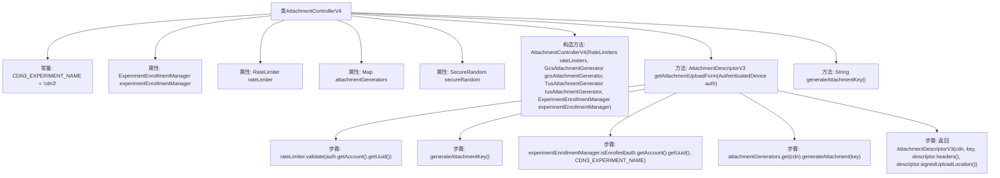

# 基础信息

|      |      |
|------|------|
| 名称 | AttachmentControllerV4 |
| 编码语言 | .java |
| 代码路径 | Signal-Server/service/src/main/java/org/whispersystems/textsecuregcm/controllers/AttachmentControllerV4.java |
| 包名 | org.whispersystems.textsecuregcm.controllers |
| 依赖项 | ['io.dropwizard.auth.Auth', 'io.swagger.v3.oas.annotations.Operation', 'io.swagger.v3.oas.annotations.headers.Header', 'io.swagger.v3.oas.annotations.responses.ApiResponse', 'io.swagger.v3.oas.annotations.tags.Tag', 'jakarta.ws.rs.GET', 'jakarta.ws.rs.Path', 'jakarta.ws.rs.Produces', 'jakarta.ws.rs.core.MediaType', 'java.security.SecureRandom', 'java.util.Base64', 'java.util.Map', 'javax.annotation.Nonnull', 'org.whispersystems.textsecuregcm.attachments.AttachmentGenerator', 'org.whispersystems.textsecuregcm.attachments.GcsAttachmentGenerator', 'org.whispersystems.textsecuregcm.attachments.TusAttachmentGenerator', 'org.whispersystems.textsecuregcm.auth.AuthenticatedDevice', 'org.whispersystems.textsecuregcm.entities.AttachmentDescriptorV3', 'org.whispersystems.textsecuregcm.experiment.ExperimentEnrollmentManager', 'org.whispersystems.textsecuregcm.limits.RateLimiter', 'org.whispersystems.textsecuregcm.limits.RateLimiters', 'org.whispersystems.websocket.auth.ReadOnly'] |
| 概述说明 | AttachmentControllerV4支持多CDN协议，生成唯一密钥处理附件上传。 |

# 说明

AttachmentControllerV4是一个用于处理附件上传的控制器，支持多种CDN协议，能够提供上传表单并生成唯一的附件密钥，确保附件上传过程的安全性和唯一性。

# 类列表 Class Summary

| 名称   | 类型  | 说明 |
|-------|------|-------------|
| AttachmentControllerV4 | class | AttachmentControllerV4处理附件上传，支持不同CDN协议，提供上传表单并生成唯一附件密钥。 |

## 类 AttachmentControllerV4

|      |      |
|------|------|
| 访问范围 | @Path("/v4/attachments");@Tag(name = "Attachments");public |
| 类型 | class |
| 名称 | AttachmentControllerV4 |
| 说明 | AttachmentControllerV4处理附件上传，支持不同CDN协议，提供上传表单并生成唯一附件密钥。 |

### UML类图

```mermaid
classDiagram
    class AttachmentControllerV4 {
        +String CDN3_EXPERIMENT_NAME
        -ExperimentEnrollmentManager experimentEnrollmentManager
        -RateLimiter rateLimiter
        -Map~Integer, AttachmentGenerator~ attachmentGenerators
        -SecureRandom secureRandom
        +AttachmentControllerV4(RateLimiters rateLimiters, GcsAttachmentGenerator gcsAttachmentGenerator, TusAttachmentGenerator tusAttachmentGenerator, ExperimentEnrollmentManager experimentEnrollmentManager)
        +AttachmentDescriptorV3 getAttachmentUploadForm(AuthenticatedDevice auth) throws RateLimitExceededException
        -String generateAttachmentKey()
    }

    class ExperimentEnrollmentManager {
        <<Interface>>
        +boolean isEnrolled(UUID uuid, String experimentName)
    }

    class RateLimiter {
        <<Interface>>
        +void validate(UUID uuid) throws RateLimitExceededException
    }

    class AttachmentGenerator {
        <<Interface>>
        +Descriptor generateAttachment(String key)
    }

    class GcsAttachmentGenerator {
        +Descriptor generateAttachment(String key)
    }

    class TusAttachmentGenerator {
        +Descriptor generateAttachment(String key)
    }

    class AttachmentDescriptorV3 {
        +int cdn
        +String key
        +Map~String, String~ headers
        +String signedUploadLocation
        +AttachmentDescriptorV3(int cdn, String key, Map~String, String~ headers, String signedUploadLocation)
    }

    AttachmentControllerV4 --> ExperimentEnrollmentManager : 依赖
    AttachmentControllerV4 --> RateLimiter : 依赖
    AttachmentControllerV4 --> AttachmentGenerator : 依赖
    GcsAttachmentGenerator ..|> AttachmentGenerator : 实现
    TusAttachmentGenerator ..|> AttachmentGenerator : 实现
```

**描述：**  
`AttachmentControllerV4` 是一个处理附件上传的控制器类，依赖于 `ExperimentEnrollmentManager`、`RateLimiter` 和 `AttachmentGenerator` 接口。它通过 `getAttachmentUploadForm` 方法生成上传表单，并根据实验配置选择不同的附件生成器（如 `GcsAttachmentGenerator` 或 `TusAttachmentGenerator`）。`AttachmentDescriptorV3` 类用于封装上传表单的元数据。

### 内部方法调用关系图

这段代码定义了一个名为 `AttachmentControllerV4` 的类，用于处理附件上传请求。类中包含了一个构造方法和两个主要方法：`getAttachmentUploadForm` 和 `generateAttachmentKey`。`getAttachmentUploadForm` 方法负责验证速率限制、生成附件密钥、检查实验分组并返回上传表单的描述信息。`generateAttachmentKey` 方法则生成一个随机的附件密钥。流程图中展示了类的结构以及方法之间的调用关系。

### 字段列表 Field List

| 名称  | 类型  | 说明 |
|-------|-------|------|
| rateLimiter | RateLimiter | 私有且不可变的限流器实例。 |
| experimentEnrollmentManager | ExperimentEnrollmentManager | 私有不可变的实验注册管理器实例。 |
| secureRandom | SecureRandom | 非空私有终态SecureRandom变量。 |
| CDN3_EXPERIMENT_NAME = "cdn3" | String | 静态常量CDN3_EXPERIMENT_NAME的值为"cdn3"。 |
| attachmentGenerators | Map<Integer, AttachmentGenerator> | 私有映射存储整数与附件生成器的对应关系。 |

### 方法列表 Method List

| 名称  | 类型  | 说明 |
|-------|-------|------|
| generateAttachmentKey | String | 生成15字节随机数并编码为URL安全字符串。 |
| getAttachmentUploadForm | AttachmentDescriptorV3 | 获取上传表单，包含CDN协议号，支持断点续传。 |

