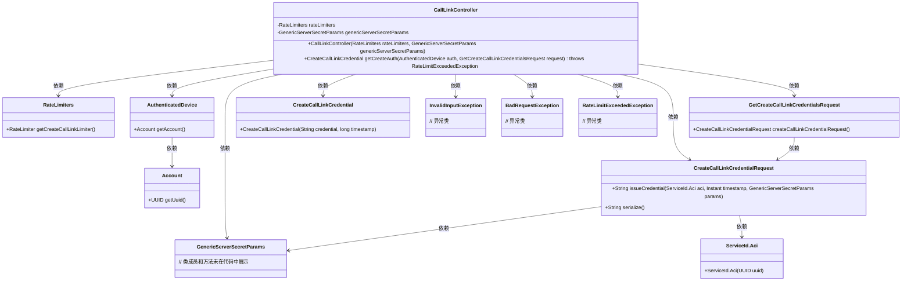
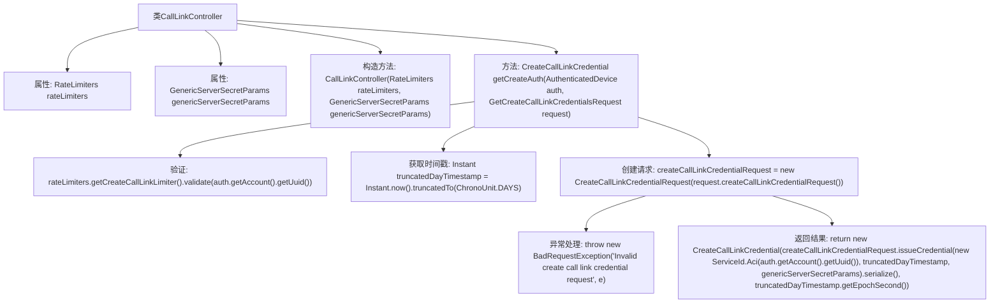

# 基础信息

|      |      |
|------|------|
| 名称 | CallLinkController |
| 编码语言 | .java |
| 代码路径 | Signal-Server/service/src/main/java/org/whispersystems/textsecuregcm/controllers/CallLinkController.java |
| 包名 | org.whispersystems.textsecuregcm.controllers |
| 依赖项 | ['io.dropwizard.auth.Auth', 'io.swagger.v3.oas.annotations.Operation', 'io.swagger.v3.oas.annotations.responses.ApiResponse', 'jakarta.validation.Valid', 'jakarta.validation.constraints.NotNull', 'jakarta.ws.rs.BadRequestException', 'jakarta.ws.rs.POST', 'jakarta.ws.rs.Path', 'jakarta.ws.rs.Produces', 'jakarta.ws.rs.core.MediaType', 'java.time.Instant', 'java.time.temporal.ChronoUnit', 'org.signal.libsignal.protocol.ServiceId', 'org.signal.libsignal.zkgroup.GenericServerSecretParams', 'org.signal.libsignal.zkgroup.InvalidInputException', 'org.signal.libsignal.zkgroup.calllinks.CreateCallLinkCredentialRequest', 'org.whispersystems.textsecuregcm.auth.AuthenticatedDevice', 'org.whispersystems.textsecuregcm.entities.CreateCallLinkCredential', 'org.whispersystems.textsecuregcm.entities.GetCreateCallLinkCredentialsRequest', 'org.whispersystems.textsecuregcm.limits.RateLimiters', 'org.whispersystems.websocket.auth.ReadOnly'] |
| 概述说明 | CallLinkController类处理通话链接凭证生成，支持POST请求，返回JSON凭证，处理错误响应。 |

# 说明

CallLinkController类负责处理创建通话链接凭证的功能。该类包含限速和服务器密钥参数，支持通过POST请求生成凭证，并返回JSON格式的凭证信息。此外，该类还能够处理多种错误响应，确保在异常情况下提供相应的反馈。

# 类列表 Class Summary

| 名称   | 类型  | 说明 |
|-------|------|-------------|
| CallLinkController | class | CallLinkController类处理创建通话链接凭证，包含限速和服务器密钥参数，支持POST请求生成凭证，返回JSON格式凭证，处理多种错误响应。 |

## 类 CallLinkController

|      |      |
|------|------|
| 访问范围 | @Path("/v1/call-link");@io.swagger.v3.oas.annotations.tags.Tag(name = "CallLink");public |
| 类型 | class |
| 名称 | CallLinkController |
| 说明 | CallLinkController类处理创建通话链接凭证，包含限速和服务器密钥参数，支持POST请求生成凭证，返回JSON格式凭证，处理多种错误响应。 |

### UML类图

这段代码定义了一个 `CallLinkController` 类，用于处理创建通话链接凭证的请求。该类依赖于 `RateLimiters` 和 `GenericServerSecretParams` 来执行限流和生成凭证。`getCreateAuth` 方法接收一个已认证的设备和一个请求对象，验证请求并生成凭证。代码中还涉及多个异常类，用于处理不同的错误情况。整体设计体现了分层和依赖注入的思想，确保了代码的可维护性和扩展性。

### 内部方法调用关系图

这段代码定义了一个名为`CallLinkController`的类，该类用于处理创建通话链接凭证的请求。代码首先通过`rateLimiters`进行速率限制验证，然后获取当前时间戳并创建请求对象。如果请求无效，则抛出异常；否则，返回生成的凭证。整个流程展示了从请求验证到凭证生成的全过程，确保了请求的合法性和安全性。

### 字段列表 Field List

| 名称  | 类型  | 说明 |
|-------|-------|------|
| genericServerSecretParams | GenericServerSecretParams | 私有不可变的GenericServerSecretParams实例变量。 |
| rateLimiters | RateLimiters | 私有且不可变的限流器实例。 |

### 方法列表 Method List

| 名称  | 类型  | 说明 |
|-------|-------|------|
| getCreateAuth | CreateCallLinkCredential | 生成通话链接凭证的API，验证请求并返回JSON凭证。 |

