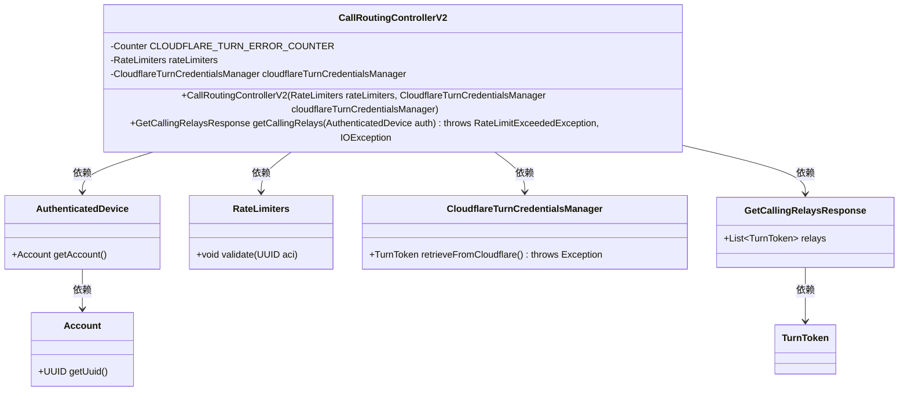
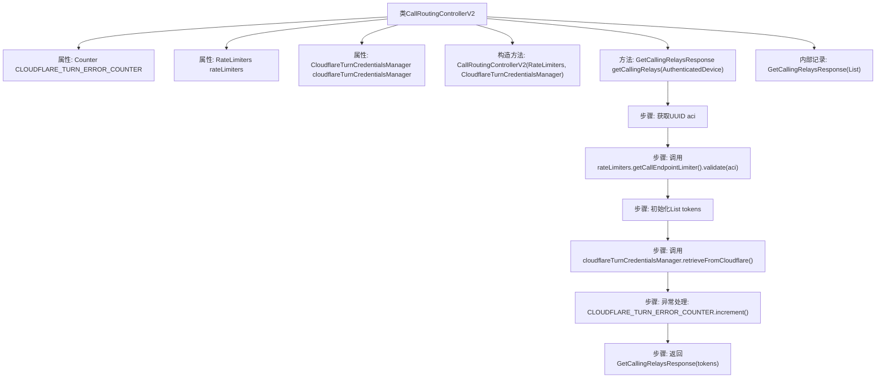

# 基础信息

|      |      |
|------|------|
| 名称 | CallRoutingControllerV2 |
| 编码语言 | .java |
| 代码路径 | Signal-Server/service/src/main/java/org/whispersystems/textsecuregcm/controllers/CallRoutingControllerV2.java |
| 包名 | org.whispersystems.textsecuregcm.controllers |
| 依赖项 | ['org.whispersystems.textsecuregcm.metrics.MetricsUtil.name', 'io.dropwizard.auth.Auth', 'io.micrometer.core.instrument.Counter', 'io.micrometer.core.instrument.Metrics', 'io.swagger.v3.oas.annotations.Operation', 'io.swagger.v3.oas.annotations.responses.ApiResponse', 'jakarta.ws.rs.GET', 'jakarta.ws.rs.Path', 'jakarta.ws.rs.Produces', 'jakarta.ws.rs.container.ContainerRequestContext', 'jakarta.ws.rs.core.Context', 'jakarta.ws.rs.core.MediaType', 'java.io.IOException', 'java.util.ArrayList', 'java.util.List', 'java.util.UUID', 'org.whispersystems.textsecuregcm.auth.AuthenticatedDevice', 'org.whispersystems.textsecuregcm.auth.CloudflareTurnCredentialsManager', 'org.whispersystems.textsecuregcm.auth.TurnToken', 'org.whispersystems.textsecuregcm.limits.RateLimiters', 'org.whispersystems.websocket.auth.ReadOnly'] |
| 概述说明 | CallRoutingControllerV2类处理呼叫中继，支持IPv4、IPv6、URL，含错误计数和速率限制。 |

# 说明

CallRoutingControllerV2类负责处理呼叫中继请求，支持IPv4、IPv6和URL格式的输入。该类具备错误计数功能，能够记录和处理请求中的错误情况。此外，它还包含速率限制功能，用于控制请求的处理速度，确保系统在高负载情况下的稳定性和可靠性。

# 类列表 Class Summary

| 名称   | 类型  | 说明 |
|-------|------|-------------|
| CallRoutingControllerV2 | class | CallRoutingControllerV2类处理呼叫中继请求，支持IPv4、IPv6和URL格式，并包含错误计数和速率限制功能。 |

## 类 CallRoutingControllerV2

|      |      |
|------|------|
| 访问范围 | @io.swagger.v3.oas.annotations.tags.Tag(name = "Calling");@Path("/v2/calling");public |
| 类型 | class |
| 名称 | CallRoutingControllerV2 |
| 说明 | CallRoutingControllerV2类处理呼叫中继请求，支持IPv4、IPv6和URL格式，并包含错误计数和速率限制功能。 |

### UML类图

这段代码定义了一个名为 `CallRoutingControllerV2` 的类，用于处理与呼叫路由相关的请求。该类依赖于 `RateLimiters` 和 `CloudflareTurnCredentialsManager` 来进行限流和凭证管理。`getCallingRelays` 方法用于获取呼叫中继选项，并返回 `GetCallingRelaysResponse` 对象。`GetCallingRelaysResponse` 是一个记录类，包含一个 `TurnToken` 列表。代码还处理了异常情况，并在发生错误时增加计数器。

### 内部方法调用关系图

这段代码是一个用于处理呼叫路由的控制器类 `CallRoutingControllerV2`。它包含一个构造方法和一个 `getCallingRelays` 方法，用于获取客户端的中继选项。方法中首先验证请求的速率限制，然后从 Cloudflare 获取中继凭证，处理可能的异常，并最终返回包含中继凭证的响应。流程图展示了类的结构和方法执行的详细步骤。

### 字段列表 Field List

| 名称  | 类型  | 说明 |
|-------|-------|------|
| CLOUDFLARE_TURN_ERROR_COUNTER = Metrics.counter(name(CallRoutingControllerV2.class, "cloudflareTurnError")) | Counter | Cloudflare转向错误计数器初始化。 |
| rateLimiters | RateLimiters | 私有且不可变的速率限制器实例。 |
| cloudflareTurnCredentialsManager | CloudflareTurnCredentialsManager | 私有成员变量，用于管理Cloudflare TURN凭证。 |

### 方法列表 Method List

| 名称  | 类型  | 说明 |
|-------|-------|------|
| getCallingRelays | GetCallingRelaysResponse | 获取1:1通话中继地址，支持IpV4、Ipv6和URL格式。 |

