# 基础信息

|      |      |
|------|------|
| 名称 | CertificateController |
| 编码语言 | .java |
| 代码路径 | Signal-Server/service/src/main/java/org/whispersystems/textsecuregcm/controllers/CertificateController.java |
| 包名 | org.whispersystems.textsecuregcm.controllers |
| 依赖项 | ['com.codahale.metrics.MetricRegistry.name', 'com.google.common.annotations.VisibleForTesting', 'com.google.common.net.HttpHeaders', 'io.dropwizard.auth.Auth', 'io.micrometer.core.instrument.Metrics', 'io.swagger.v3.oas.annotations.tags.Tag', 'jakarta.ws.rs.BadRequestException', 'jakarta.ws.rs.DefaultValue', 'jakarta.ws.rs.GET', 'jakarta.ws.rs.HeaderParam', 'jakarta.ws.rs.Path', 'jakarta.ws.rs.Produces', 'jakarta.ws.rs.QueryParam', 'jakarta.ws.rs.core.MediaType', 'java.security.InvalidKeyException', 'java.time.Clock', 'java.time.Duration', 'java.time.Instant', 'java.time.temporal.ChronoUnit', 'java.util.ArrayList', 'java.util.List', 'java.util.Objects', 'javax.annotation.Nonnull', 'org.signal.libsignal.protocol.ServiceId', 'org.signal.libsignal.zkgroup.GenericServerSecretParams', 'org.signal.libsignal.zkgroup.auth.AuthCredentialWithPniResponse', 'org.signal.libsignal.zkgroup.auth.ServerZkAuthOperations', 'org.signal.libsignal.zkgroup.calllinks.CallLinkAuthCredentialResponse', 'org.whispersystems.textsecuregcm.auth.AuthenticatedDevice', 'org.whispersystems.textsecuregcm.auth.CertificateGenerator', 'org.whispersystems.textsecuregcm.entities.DeliveryCertificate', 'org.whispersystems.textsecuregcm.entities.GroupCredentials', 'org.whispersystems.websocket.auth.ReadOnly'] |
| 概述说明 | 证书控制器类负责生成交付证书和获取组认证凭证。 |

# 说明

证书控制器类是一个专门用于管理证书相关操作的类。它包含两个主要方法：生成交付证书和获取组认证凭证。生成交付证书方法负责创建并签发用于交付的证书，确保其有效性和安全性。获取组认证凭证方法则用于从系统中提取特定组的认证凭证，以便进行后续的验证或授权操作。这两个方法共同协作，确保证书的生成和认证过程高效且可靠。

# 类列表 Class Summary

| 名称   | 类型  | 说明 |
|-------|------|-------------|
| CertificateController | class | 证书控制器类，包含生成交付证书和获取组认证凭证的方法。 |

## 类 CertificateController

|      |      |
|------|------|
| 访问范围 | @SuppressWarnings("OptionalUsedAsFieldOrParameterType");@Path("/v1/certificate");@Tag(name = "Certificate");public |
| 类型 | class |
| 名称 | CertificateController |
| 说明 | 证书控制器类，包含生成交付证书和获取组认证凭证的方法。 |

### UML类图

```mermaid
classDiagram
    class CertificateController {
        -CertificateGenerator certificateGenerator
        -ServerZkAuthOperations serverZkAuthOperations
        -GenericServerSecretParams genericServerSecretParams
        -Clock clock
        +CertificateController(CertificateGenerator, ServerZkAuthOperations, GenericServerSecretParams, Clock)
        +DeliveryCertificate getDeliveryCertificate(AuthenticatedDevice, boolean) throws InvalidKeyException
        +GroupCredentials getGroupAuthenticationCredentials(AuthenticatedDevice, String, long, long)
    }

    class CertificateGenerator {
        <<Interface>>
        +DeliveryCertificate createFor(Account, AuthenticatedDevice, boolean)
    }

    class ServerZkAuthOperations {
        <<Interface>>
        +AuthCredentialWithPniResponse issueAuthCredentialWithPniZkc(ServiceId.Aci, ServiceId.Pni, Instant)
    }

    class GenericServerSecretParams {
        // 该类用于存储服务器密钥参数
    }

    class Clock {
        <<Interface>>
        +Instant instant()
    }

    class AuthenticatedDevice {
        +Account getAccount()
        +AuthenticatedDevice getAuthenticatedDevice()
    }

    class Account {
        +UUID getUuid()
        +String getPhoneNumberIdentifier()
    }

    class ServiceId {
        <<Interface>>
    }

    class ServiceId.Aci {
        +ServiceId.Aci(UUID)
    }

    class ServiceId.Pni {
        +ServiceId.Pni(String)
    }

    class DeliveryCertificate {
        // 该类用于表示交付证书
    }

    class GroupCredentials {
        +GroupCredentials(List~GroupCredential~, List~CallLinkAuthCredential~, UUID)
    }

    class GroupCredentials.GroupCredential {
        +GroupCredential(byte[], int)
    }

    class GroupCredentials.CallLinkAuthCredential {
        +CallLinkAuthCredential(byte[], long)
    }

    class CallLinkAuthCredentialResponse {
        +static CallLinkAuthCredentialResponse issueCredential(ServiceId.Aci, Instant, GenericServerSecretParams)
    }

    class AuthCredentialWithPniResponse {
        +byte[] serialize()
    }

    CertificateController --> CertificateGenerator : 依赖
    CertificateController --> ServerZkAuthOperations : 依赖
    CertificateController --> GenericServerSecretParams : 依赖
    CertificateController --> Clock : 依赖
    CertificateController --> AuthenticatedDevice : 依赖
    AuthenticatedDevice --> Account : 依赖
    ServerZkAuthOperations --> ServiceId.Aci : 依赖
    ServerZkAuthOperations --> ServiceId.Pni : 依赖
    ServerZkAuthOperations --> Instant : 依赖
    GroupCredentials --> GroupCredentials.GroupCredential : 包含
    GroupCredentials --> GroupCredentials.CallLinkAuthCredential : 包含
    CallLinkAuthCredentialResponse --> ServiceId.Aci : 依赖
    CallLinkAuthCredentialResponse --> Instant : 依赖
    CallLinkAuthCredentialResponse --> GenericServerSecretParams : 依赖
```

### 描述
`CertificateController` 是一个处理证书生成和认证请求的控制器类。它依赖于 `CertificateGenerator`、`ServerZkAuthOperations`、`GenericServerSecretParams` 和 `Clock` 等接口和类来执行其功能。`CertificateController` 提供了两个主要方法：`getDeliveryCertificate` 用于生成交付证书，`getGroupAuthenticationCredentials` 用于生成组认证凭证。这些方法依赖于 `AuthenticatedDevice` 和 `Account` 类来获取用户和设备信息，并通过 `ServerZkAuthOperations` 和 `CallLinkAuthCredentialResponse` 类来生成和序列化认证凭证。

### 内部方法调用关系图

```mermaid
graph TD
    A["类CertificateController"]
    B["属性: CertificateGenerator certificateGenerator"]
    C["属性: ServerZkAuthOperations serverZkAuthOperations"]
    D["属性: GenericServerSecretParams genericServerSecretParams"]
    E["属性: Clock clock"]
    F["常量: MAX_REDEMPTION_DURATION"]
    G["常量: GENERATE_DELIVERY_CERTIFICATE_COUNTER_NAME"]
    H["常量: INCLUDE_E164_TAG_NAME"]
    I["构造方法: CertificateController"]
    J["方法: getDeliveryCertificate"]
    K["方法: getGroupAuthenticationCredentials"]
    L["Metrics.counter"]
    M["DeliveryCertificate"]
    N["GroupCredentials"]
    O["ServiceId.Aci"]
    P["ServiceId.Pni"]
    Q["AuthCredentialWithPniResponse"]
    R["GroupCredentials.GroupCredential"]
    S["GroupCredentials.CallLinkAuthCredential"]
    T["CallLinkAuthCredentialResponse"]
    U["BadRequestException"]

    A --> B
    A --> C
    A --> D
    A --> E
    A --> F
    A --> G
    A --> H
    A --> I
    A --> J
    A --> K
    J --> L
    J --> M
    K --> O
    K --> P
    K --> Q
    K --> R
    K --> S
    K --> T
    K --> U
```

**描述：**
该代码定义了一个名为 `CertificateController` 的类，用于处理证书生成和认证请求。类中包含多个属性和常量，构造方法用于初始化这些属性。类中定义了两个主要方法：`getDeliveryCertificate` 用于生成交付证书，`getGroupAuthenticationCredentials` 用于生成组认证凭证。在 `getGroupAuthenticationCredentials` 方法中，还包含了对时间范围的验证和凭证生成逻辑。整个流程涉及多个内部类的调用和异常处理。

### 字段列表 Field List

| 名称  | 类型  | 说明 |
|-------|-------|------|
| clock | Clock | 私有常量时钟对象。 |
| certificateGenerator | CertificateGenerator | 私有证书生成器实例变量。 |
| genericServerSecretParams | GenericServerSecretParams | 私有不可变的GenericServerSecretParams实例变量。 |
| MAX_REDEMPTION_DURATION = Duration.ofDays(7) | Duration | 测试用最大兑换时长设置为7天。 |
| GENERATE_DELIVERY_CERTIFICATE_COUNTER_NAME = name(CertificateGenerator.class, "generateCertificate") | String | 生成交付证书的计数器名称定义为证书生成类的生成证书方法。 |
| serverZkAuthOperations | ServerZkAuthOperations | 私有且不可变的ServerZkAuthOperations对象。 |
| INCLUDE_E164_TAG_NAME = "includeE164" | String | 定义私有静态常量字符串，变量名为INCLUDE_E164_TAG_NAME，值为"includeE164"。 |

### 方法列表 Method List

| 名称  | 类型  | 说明 |
|-------|-------|------|
| getDeliveryCertificate | DeliveryCertificate | 获取交付证书的API，支持E164参数，统计调用次数。 |
| getGroupAuthenticationCredentials | GroupCredentials | 获取组认证凭证，验证时间范围，生成并返回凭证列表。 |

