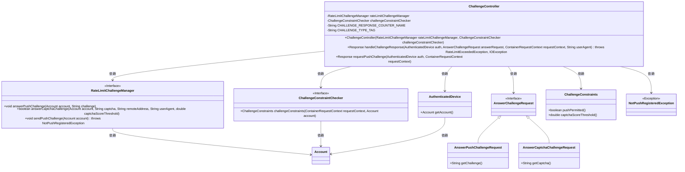

# 基础信息

|      |      |
|------|------|
| 名称 | ChallengeController |
| 编码语言 | .java |
| 代码路径 | Signal-Server/service/src/main/java/org/whispersystems/textsecuregcm/controllers/ChallengeController.java |
| 包名 | org.whispersystems.textsecuregcm.controllers |
| 依赖项 | ['org.whispersystems.textsecuregcm.metrics.MetricsUtil.name', 'com.google.common.net.HttpHeaders', 'io.dropwizard.auth.Auth', 'io.micrometer.core.instrument.Metrics', 'io.micrometer.core.instrument.Tags', 'io.swagger.v3.oas.annotations.Operation', 'io.swagger.v3.oas.annotations.headers.Header', 'io.swagger.v3.oas.annotations.media.Content', 'io.swagger.v3.oas.annotations.media.Schema', 'io.swagger.v3.oas.annotations.parameters.RequestBody', 'io.swagger.v3.oas.annotations.responses.ApiResponse', 'io.swagger.v3.oas.annotations.tags.Tag', 'jakarta.validation.Valid', 'jakarta.ws.rs.Consumes', 'jakarta.ws.rs.HeaderParam', 'jakarta.ws.rs.POST', 'jakarta.ws.rs.PUT', 'jakarta.ws.rs.Path', 'jakarta.ws.rs.Produces', 'jakarta.ws.rs.container.ContainerRequestContext', 'jakarta.ws.rs.core.Context', 'jakarta.ws.rs.core.MediaType', 'jakarta.ws.rs.core.Response', 'java.io.IOException', 'org.whispersystems.textsecuregcm.auth.AuthenticatedDevice', 'org.whispersystems.textsecuregcm.entities.AnswerCaptchaChallengeRequest', 'org.whispersystems.textsecuregcm.entities.AnswerChallengeRequest', 'org.whispersystems.textsecuregcm.entities.AnswerPushChallengeRequest', 'org.whispersystems.textsecuregcm.filters.RemoteAddressFilter', 'org.whispersystems.textsecuregcm.limits.RateLimitChallengeManager', 'org.whispersystems.textsecuregcm.metrics.UserAgentTagUtil', 'org.whispersystems.textsecuregcm.push.NotPushRegisteredException', 'org.whispersystems.textsecuregcm.spam.ChallengeConstraintChecker', 'org.whispersystems.textsecuregcm.spam.ChallengeConstraintChecker.ChallengeConstraints', 'org.whispersystems.websocket.auth.ReadOnly'] |
| 概述说明 | ChallengeController负责处理挑战提交、推送请求，管理验证码、请求限制及约束检查。 |

# 说明

ChallengeController负责处理挑战提交和推送请求，具备验证码和推送挑战功能，同时管理请求限制和约束检查，确保系统安全和高效运行。

# 类列表 Class Summary

| 名称   | 类型  | 说明 |
|-------|------|-------------|
| ChallengeController | class | ChallengeController处理挑战提交和推送请求，支持验证码和推送挑战，并管理请求限制和约束检查。 |

## 类 ChallengeController

|      |      |
|------|------|
| 访问范围 | @Path("/v1/challenge");@Tag(name = "Challenge");public |
| 类型 | class |
| 名称 | ChallengeController |
| 说明 | ChallengeController处理挑战提交和推送请求，支持验证码和推送挑战，并管理请求限制和约束检查。 |

### UML类图

这段代码定义了一个 `ChallengeController` 类，用于处理客户端提交的挑战完成证明和请求推送挑战。`ChallengeController` 依赖于 `RateLimitChallengeManager` 和 `ChallengeConstraintChecker` 接口来管理挑战的限速和约束检查。`handleChallengeResponse` 方法根据不同类型的挑战请求（如推送挑战或验证码挑战）进行相应的处理，并返回适当的HTTP响应。`requestPushChallenge` 方法则用于请求推送挑战，并处理可能的异常情况。整个系统通过多个接口和类的协作，实现了挑战请求的验证和处理。

### 内部方法调用关系图

```mermaid
graph TD
    A["类ChallengeController"]
    B["属性: RateLimitChallengeManager rateLimitChallengeManager"]
    C["属性: ChallengeConstraintChecker challengeConstraintChecker"]
    D["构造方法: ChallengeController(RateLimitChallengeManager, ChallengeConstraintChecker)"]
    E["方法: Response handleChallengeResponse(AuthenticatedDevice, AnswerChallengeRequest, ContainerRequestContext, String)"]
    F["方法: Response requestPushChallenge(AuthenticatedDevice, ContainerRequestContext)"]
    G["静态常量: String CHALLENGE_RESPONSE_COUNTER_NAME"]
    H["静态常量: String CHALLENGE_TYPE_TAG"]
    I["调用: challengeConstraintChecker.challengeConstraints"]
    J["调用: rateLimitChallengeManager.answerPushChallenge"]
    K["调用: rateLimitChallengeManager.answerCaptchaChallenge"]
    L["调用: Metrics.counter(CHALLENGE_RESPONSE_COUNTER_NAME, tags).increment()"]
    M["调用: rateLimitChallengeManager.sendPushChallenge"]
    N["返回: Response.status(200)"]
    O["返回: Response.status(428)"]
    P["返回: Response.status(429)"]
    Q["返回: Response.status(404)"]

    A --> B
    A --> C
    A --> D
    A --> E
    A --> F
    A --> G
    A --> H
    E --> I
    E --> J
    E --> K
    E --> L
    E --> N
    E --> O
    E --> P
    F --> I
    F --> M
    F --> N
    F --> P
    F --> Q
```

这段代码定义了一个`ChallengeController`类，用于处理客户端提交的挑战完成证明。类中包含两个主要方法：`handleChallengeResponse`和`requestPushChallenge`。`handleChallengeResponse`方法根据请求类型（推送或验证码）调用不同的管理器方法来验证挑战，并返回相应的HTTP状态码。`requestPushChallenge`方法用于请求推送挑战，并处理相关异常情况。代码中还使用了`Metrics`类来记录挑战响应的计数器。整个流程涉及多个条件判断和异常处理，确保在挑战验证过程中能够正确处理各种边缘情况。

### 字段列表 Field List

| 名称  | 类型  | 说明 |
|-------|-------|------|
| rateLimitChallengeManager | RateLimitChallengeManager | 私有变量rateLimitChallengeManager管理限流挑战。 |
| challengeConstraintChecker | ChallengeConstraintChecker | 私有常量挑战约束检查器实例。 |
| CHALLENGE_TYPE_TAG = "type" | String | 定义私有静态常量字符串CHALLENGE_TYPE_TAG，值为"type"。 |
| CHALLENGE_RESPONSE_COUNTER_NAME = name(ChallengeController.class, "challengeResponse") | String | 定义常量CHALLENGE_RESPONSE_COUNTER_NAME，用于记录ChallengeController类的挑战响应计数。 |

### 方法列表 Method List

| 名称  | 类型  | 说明 |
|-------|-------|------|
| handleChallengeResponse | Response | 客户端提交挑战完成证明，成功后可继续原操作，支持推送和验证码类型，返回200表示接受，428表示无效，429表示尝试过多。 |
| requestPushChallenge | Response | 客户端通过空POST请求推送挑战，主设备接收后可用于验证。支持APNs和FCM格式，HTTP/5xx可重试但需限次。 |

