# 基础信息

|      |      |
|------|------|
| 名称 | DeviceCheckController |
| 编码语言 | .java |
| 代码路径 | Signal-Server/service/src/main/java/org/whispersystems/textsecuregcm/controllers/DeviceCheckController.java |
| 包名 | org.whispersystems.textsecuregcm.controllers |
| 依赖项 | ['com.fasterxml.jackson.annotation.JsonCreator', 'io.dropwizard.auth.Auth', 'io.swagger.v3.oas.annotations.Operation', 'io.swagger.v3.oas.annotations.Parameter', 'io.swagger.v3.oas.annotations.media.Schema', 'io.swagger.v3.oas.annotations.parameters.RequestBody', 'io.swagger.v3.oas.annotations.responses.ApiResponse', 'jakarta.validation.Valid', 'jakarta.validation.constraints.NotNull', 'jakarta.ws.rs.Consumes', 'jakarta.ws.rs.GET', 'jakarta.ws.rs.POST', 'jakarta.ws.rs.PUT', 'jakarta.ws.rs.Path', 'jakarta.ws.rs.Produces', 'jakarta.ws.rs.QueryParam', 'jakarta.ws.rs.WebApplicationException', 'jakarta.ws.rs.core.MediaType', 'jakarta.ws.rs.core.Response', 'java.io.IOException', 'java.time.Clock', 'java.time.Duration', 'java.util.Base64', 'java.util.Locale', 'org.glassfish.jersey.server.ManagedAsync', 'org.whispersystems.textsecuregcm.auth.AuthenticatedDevice', 'org.whispersystems.textsecuregcm.backup.BackupAuthManager', 'org.whispersystems.textsecuregcm.limits.RateLimiters', 'org.whispersystems.textsecuregcm.storage.Account', 'org.whispersystems.textsecuregcm.storage.devicecheck.AppleDeviceCheckManager', 'org.whispersystems.textsecuregcm.storage.devicecheck.ChallengeNotFoundException', 'org.whispersystems.textsecuregcm.storage.devicecheck.DeviceCheckKeyIdNotFoundException', 'org.whispersystems.textsecuregcm.storage.devicecheck.DeviceCheckVerificationFailedException', 'org.whispersystems.textsecuregcm.storage.devicecheck.DuplicatePublicKeyException', 'org.whispersystems.textsecuregcm.storage.devicecheck.RequestReuseException', 'org.whispersystems.textsecuregcm.storage.devicecheck.TooManyKeysException', 'org.whispersystems.textsecuregcm.util.SystemMapper', 'org.whispersystems.websocket.auth.ReadOnly'] |
| 概述说明 | DeviceCheckController处理设备验证，支持挑战获取、密钥注册和断言操作。 |

# 说明

DeviceCheckController是一个用于处理设备验证和断言请求的控制器。它支持多种操作，包括获取挑战、注册密钥以及执行断言。通过这些功能，DeviceCheckController能够有效地管理和验证设备的身份与安全性，确保设备在系统中的合法性和可信度。

# 类列表 Class Summary

| 名称   | 类型  | 说明 |
|-------|------|-------------|
| DeviceCheckController | class | DeviceCheckController处理设备验证和断言请求，支持获取挑战、注册密钥和执行断言操作。 |

## 类 DeviceCheckController

|      |      |
|------|------|
| 访问范围 | @Path("/v1/devicecheck");@io.swagger.v3.oas.annotations.tags.Tag(name = "DeviceCheck");public |
| 类型 | class |
| 名称 | DeviceCheckController |
| 说明 | DeviceCheckController处理设备验证和断言请求，支持获取挑战、注册密钥和执行断言操作。 |

### UML类图

```mermaid
classDiagram
    class DeviceCheckController {
        -Clock clock
        -BackupAuthManager backupAuthManager
        -AppleDeviceCheckManager deviceCheckManager
        -RateLimiters rateLimiters
        -long backupRedemptionLevel
        -Duration backupRedemptionDuration
        +DeviceCheckController(Clock, BackupAuthManager, AppleDeviceCheckManager, RateLimiters, long, Duration)
        +ChallengeResponse attestChallenge(AuthenticatedDevice) throws RateLimitExceededException
        +void attest(AuthenticatedDevice, String, byte[])
        +ChallengeResponse assertChallenge(AuthenticatedDevice, Action) throws RateLimitExceededException
        +void assertion(AuthenticatedDevice, String, AssertionRequestWrapper, byte[])
        +Action fromString(String)
        +AssertionRequestWrapper fromString(String) throws IOException
        +AppleDeviceCheckManager.ChallengeType toChallengeType(Action)
        +byte[] parseKeyId(String)
    }

    class ChallengeResponse {
        +String challenge
    }

    class Action {
        <<enum>>
        BACKUP
        +Action fromString(String)
    }

    class AssertionRequest {
        +String challenge
        +Action action
    }

    class AssertionRequestWrapper {
        +AssertionRequest assertionRequest
        +byte[] rawJson
        +AssertionRequestWrapper fromString(String) throws IOException
    }

    class AppleDeviceCheckManager {
        <<Interface>>
        +ChallengeType createChallenge(ChallengeType, Account)
        +void registerAttestation(Account, byte[], byte[])
        +void validateAssert(Account, byte[], ChallengeType, String, byte[], byte[])
    }

    class RateLimiters {
        +RateLimiter forDescriptor(RateLimiters.For)
    }

    class BackupAuthManager {
        +CompletableFuture extendBackupVoucher(Account, Account.BackupVoucher)
    }

    class AuthenticatedDevice {
        +Account getAccount()
    }

    class Account {
        +UUID getUuid()
    }

    class RateLimitExceededException {
        <<Exception>>
    }

    class WebApplicationException {
        <<Exception>>
    }

    class TooManyKeysException {
        <<Exception>>
    }

    class ChallengeNotFoundException {
        <<Exception>>
    }

    class DeviceCheckVerificationFailedException {
        <<Exception>>
    }

    class DuplicatePublicKeyException {
        <<Exception>>
    }

    class RequestReuseException {
        <<Exception>>
    }

    class DeviceCheckKeyIdNotFoundException {
        <<Exception>>
    }

    DeviceCheckController --> AppleDeviceCheckManager : 依赖
    DeviceCheckController --> RateLimiters : 依赖
    DeviceCheckController --> BackupAuthManager : 依赖
    DeviceCheckController --> AuthenticatedDevice : 依赖
    DeviceCheckController --> ChallengeResponse : 依赖
    DeviceCheckController --> Action : 依赖
    DeviceCheckController --> AssertionRequest : 依赖
    DeviceCheckController --> AssertionRequestWrapper : 依赖
    DeviceCheckController --> RateLimitExceededException : 依赖
    DeviceCheckController --> WebApplicationException : 依赖
    DeviceCheckController --> TooManyKeysException : 依赖
    DeviceCheckController --> ChallengeNotFoundException : 依赖
    DeviceCheckController --> DeviceCheckVerificationFailedException : 依赖
    DeviceCheckController --> DuplicatePublicKeyException : 依赖
    DeviceCheckController --> RequestReuseException : 依赖
    DeviceCheckController --> DeviceCheckKeyIdNotFoundException : 依赖
    AuthenticatedDevice --> Account : 依赖
```

### 描述
`DeviceCheckController` 是一个用于处理设备检查相关请求的控制器类，它依赖于多个服务类如 `AppleDeviceCheckManager`、`RateLimiters` 和 `BackupAuthManager` 来处理不同的业务逻辑。该类通过多个 HTTP 端点（如 `/attest` 和 `/assert`）与客户端交互，生成和验证设备检查的挑战和断言。它还处理了多种异常情况，如速率限制、密钥过多、挑战未找到等。通过 `ChallengeResponse` 和 `AssertionRequest` 等记录类，它封装了请求和响应的数据结构。

### 内部方法调用关系图

```mermaid
graph TD
    A["类DeviceCheckController"]
    B["属性: Clock clock"]
    C["属性: BackupAuthManager backupAuthManager"]
    D["属性: AppleDeviceCheckManager deviceCheckManager"]
    E["属性: RateLimiters rateLimiters"]
    F["属性: long backupRedemptionLevel"]
    G["属性: Duration backupRedemptionDuration"]
    H["构造方法: DeviceCheckController"]
    I["方法: ChallengeResponse attestChallenge"]
    J["方法: void attest"]
    K["方法: ChallengeResponse assertChallenge"]
    L["方法: void assertion"]
    M["枚举: Action"]
    N["记录: ChallengeResponse"]
    O["记录: AssertionRequest"]
    P["记录: AssertionRequestWrapper"]
    Q["方法: AppleDeviceCheckManager.ChallengeType toChallengeType"]
    R["方法: byte[] parseKeyId"]

    A --> B
    A --> C
    A --> D
    A --> E
    A --> F
    A --> G
    A --> H
    A --> I
    A --> J
    A --> K
    A --> L
    A --> M
    A --> N
    A --> O
    A --> P
    A --> Q
    A --> R
```

这段代码描述了一个名为 `DeviceCheckController` 的类，它主要用于处理设备检查相关的请求。类中包含多个属性、构造方法、以及处理不同HTTP请求的方法。方法 `attestChallenge` 和 `assertChallenge` 分别用于获取挑战，而 `attest` 和 `assertion` 则用于处理验证和断言操作。此外，类中还定义了枚举 `Action` 和多个记录类，用于封装请求和响应的数据结构。整个类的设计旨在与苹果的设备检查服务进行交互，确保设备的安全性和合法性。

### 字段列表 Field List

| 名称  | 类型  | 说明 |
|-------|-------|------|
| deviceCheckManager | AppleDeviceCheckManager | 私有Apple设备检查管理器实例。 |
| clock | Clock | 声明一个私有的不可变时钟变量。 |
| backupRedemptionLevel | long | 私有长整型变量，用于存储备份赎回级别。 |
| rateLimiters | RateLimiters | 私有且不可变的限流器实例。 |
| backupRedemptionDuration | Duration | 备份兑换期限为私有不可变类型。 |
| backupAuthManager | BackupAuthManager | 私有且不可变的备份认证管理器实例。 |

### 方法列表 Method List

| 名称  | 类型  | 说明 |
|-------|-------|------|
| assertion | void | 执行验证操作，处理设备验证请求，确保请求与生成验证时一致，计数器递增，失败返回401或404。 |
| assertChallenge | ChallengeResponse | 获取用于设备验证的挑战，需在POST请求中使用，确保JSON请求体与SHA256哈希一致。 |
| parseKeyId | byte[] | 解析base64KeyId为字节数组，失败时抛出422异常。 |
| toChallengeType | AppleDeviceCheckManager.ChallengeType | 将Action转换为AppleDeviceCheckManager.ChallengeType的私有静态方法。 |
| attest | void | 注册keyId并验证，支持重试，处理多种错误响应。 |
| attestChallenge | ChallengeResponse | 获取设备验证挑战，用于设备验证请求，支持JSON格式，响应包含挑战信息。 |

