# 基础信息

|      |      |
|------|------|
| 名称 | DeviceController |
| 编码语言 | .java |
| 代码路径 | Signal-Server/service/src/main/java/org/whispersystems/textsecuregcm/controllers/DeviceController.java |
| 包名 | org.whispersystems.textsecuregcm.controllers |
| 依赖项 | ['com.google.common.annotations.VisibleForTesting', 'com.google.common.net.HttpHeaders', 'io.dropwizard.auth.Auth', 'io.micrometer.core.instrument.Metrics', 'io.micrometer.core.instrument.Tags', 'io.micrometer.core.instrument.Timer', 'io.swagger.v3.oas.annotations.Operation', 'io.swagger.v3.oas.annotations.headers.Header', 'io.swagger.v3.oas.annotations.media.Content', 'io.swagger.v3.oas.annotations.media.Schema', 'io.swagger.v3.oas.annotations.responses.ApiResponse', 'io.swagger.v3.oas.annotations.tags.Tag', 'jakarta.validation.Valid', 'jakarta.validation.constraints.Max', 'jakarta.validation.constraints.Min', 'jakarta.validation.constraints.NotBlank', 'jakarta.validation.constraints.NotNull', 'jakarta.validation.constraints.Size', 'jakarta.ws.rs.Consumes', 'jakarta.ws.rs.DELETE', 'jakarta.ws.rs.DefaultValue', 'jakarta.ws.rs.ForbiddenException', 'jakarta.ws.rs.GET', 'jakarta.ws.rs.HeaderParam', 'jakarta.ws.rs.PUT', 'jakarta.ws.rs.Path', 'jakarta.ws.rs.PathParam', 'jakarta.ws.rs.Produces', 'jakarta.ws.rs.QueryParam', 'jakarta.ws.rs.WebApplicationException', 'jakarta.ws.rs.core.Context', 'jakarta.ws.rs.core.MediaType', 'jakarta.ws.rs.core.Response', 'java.time.Duration', 'java.time.Instant', 'java.util.Arrays', 'java.util.EnumMap', 'java.util.List', 'java.util.Locale', 'java.util.Map', 'java.util.Optional', 'java.util.Set', 'java.util.concurrent.CompletableFuture', 'java.util.concurrent.CompletionException', 'java.util.concurrent.CompletionStage', 'java.util.concurrent.atomic.AtomicInteger', 'java.util.stream.Collectors', 'javax.annotation.Nullable', 'org.apache.commons.lang3.StringUtils', 'org.glassfish.jersey.server.ContainerRequest', 'org.whispersystems.textsecuregcm.auth.AuthenticatedDevice', 'org.whispersystems.textsecuregcm.auth.BasicAuthorizationHeader', 'org.whispersystems.textsecuregcm.auth.ChangesLinkedDevices', 'org.whispersystems.textsecuregcm.auth.LinkedDeviceRefreshRequirementProvider', 'org.whispersystems.textsecuregcm.entities.AccountAttributes', 'org.whispersystems.textsecuregcm.entities.DeviceActivationRequest', 'org.whispersystems.textsecuregcm.entities.DeviceInfo', 'org.whispersystems.textsecuregcm.entities.DeviceInfoList', 'org.whispersystems.textsecuregcm.entities.LinkDeviceRequest', 'org.whispersystems.textsecuregcm.entities.LinkDeviceResponse', 'org.whispersystems.textsecuregcm.entities.PreKeySignatureValidator', 'org.whispersystems.textsecuregcm.entities.ProvisioningMessage', 'org.whispersystems.textsecuregcm.entities.RemoteAttachment', 'org.whispersystems.textsecuregcm.entities.RemoteAttachmentError', 'org.whispersystems.textsecuregcm.entities.RestoreAccountRequest', 'org.whispersystems.textsecuregcm.entities.SetPublicKeyRequest', 'org.whispersystems.textsecuregcm.entities.TransferArchiveUploadedRequest', 'org.whispersystems.textsecuregcm.identity.IdentityType', 'org.whispersystems.textsecuregcm.limits.RateLimitedByIp', 'org.whispersystems.textsecuregcm.limits.RateLimiters', 'org.whispersystems.textsecuregcm.metrics.MetricsUtil', 'org.whispersystems.textsecuregcm.metrics.UserAgentTagUtil', 'org.whispersystems.textsecuregcm.storage.Account', 'org.whispersystems.textsecuregcm.storage.AccountsManager', 'org.whispersystems.textsecuregcm.storage.ClientPublicKeysManager', 'org.whispersystems.textsecuregcm.storage.Device', 'org.whispersystems.textsecuregcm.storage.DeviceCapability', 'org.whispersystems.textsecuregcm.storage.DeviceSpec', 'org.whispersystems.textsecuregcm.storage.LinkDeviceTokenAlreadyUsedException', 'org.whispersystems.textsecuregcm.storage.PersistentTimer', 'org.whispersystems.textsecuregcm.util.DeviceCapabilityAdapter', 'org.whispersystems.textsecuregcm.util.EnumMapUtil', 'org.whispersystems.textsecuregcm.util.ExceptionUtils', 'org.whispersystems.textsecuregcm.util.LinkDeviceToken', 'org.whispersystems.textsecuregcm.util.ua.ClientPlatform', 'org.whispersystems.textsecuregcm.util.ua.UnrecognizedUserAgentException', 'org.whispersystems.textsecuregcm.util.ua.UserAgentUtil', 'org.whispersystems.websocket.auth.Mutable', 'org.whispersystems.websocket.auth.ReadOnly'] |
| 概述说明 | DeviceController类负责设备操作，涵盖获取、删除、链接、生成令牌、设置公钥、等待链接及传输存档。 |

# 说明

DeviceController类负责管理和执行与设备相关的各项操作。其主要功能包括获取设备信息、删除设备、链接设备、生成设备令牌、设置公钥、等待设备链接以及传输存档。通过这些功能，DeviceController类能够全面控制设备的各项操作，确保设备管理的有效性和安全性。

# 类列表 Class Summary

| 名称   | 类型  | 说明 |
|-------|------|-------------|
| DeviceController | class | DeviceController类管理设备操作，包括获取、删除、链接设备，生成设备令牌，设置公钥，等待设备链接和传输存档。 |

## 类 DeviceController

|      |      |
|------|------|
| 访问范围 | @Path("/v1/devices");@Tag(name = "Devices");public |
| 类型 | class |
| 名称 | DeviceController |
| 说明 | DeviceController类管理设备操作，包括获取、删除、链接设备，生成设备令牌，设置公钥，等待设备链接和传输存档。 |

### UML类图

```mermaid
classDiagram
    class DeviceController {
        -AccountsManager accounts
        -ClientPublicKeysManager clientPublicKeysManager
        -RateLimiters rateLimiters
        -PersistentTimer persistentTimer
        -Map~String, Integer~ maxDeviceConfiguration
        -EnumMap~ClientPlatform, AtomicInteger~ linkedDeviceListenersByPlatform
        -AtomicInteger linkedDeviceListenersForUnrecognizedPlatforms
        +DeviceController(AccountsManager, ClientPublicKeysManager, RateLimiters, PersistentTimer, Map~String, Integer~)
        +DeviceInfoList getDevices(AuthenticatedDevice auth)
        +void removeDevice(AuthenticatedDevice auth, byte deviceId)
        +LinkDeviceToken createDeviceToken(AuthenticatedDevice auth)
        +LinkDeviceResponse linkDevice(BasicAuthorizationHeader authorizationHeader, String userAgent, LinkDeviceRequest linkDeviceRequest, ContainerRequest containerRequest)
        +CompletionStage~Response~ waitForLinkedDevice(AuthenticatedDevice authenticatedDevice, String tokenIdentifier, int timeoutSeconds, String userAgent)
        +void setCapabilities(AuthenticatedDevice auth, Map~String, Boolean~ capabilities)
        +CompletableFuture~Void~ setPublicKey(AuthenticatedDevice auth, SetPublicKeyRequest setPublicKeyRequest)
        +CompletionStage~Void~ recordRestoreAccountRequest(String token, RestoreAccountRequest restoreAccountRequest)
        +CompletionStage~Response~ waitForDeviceTransferRequest(String token, int timeoutSeconds)
        +CompletionStage~Void~ recordTransferArchiveUploaded(AuthenticatedDevice authenticatedDevice, TransferArchiveUploadedRequest transferArchiveUploadedRequest)
        +CompletionStage~Response~ waitForTransferArchive(AuthenticatedDevice authenticatedDevice, int timeoutSeconds, String userAgent)
        -AtomicInteger buildGauge(String clientPlatformName)
        -AtomicInteger getCounterForLinkedDeviceListeners(String userAgent)
        -boolean isCapabilityDowngrade(Account account, Set~DeviceCapability~ capabilities)
        -io.micrometer.core.instrument.Tag primaryPlatformTag(Account account)
    }

    class AccountsManager {
        <<Interface>>
        +Optional~Account~ getByAccountIdentifier(String identifier)
        +void removeDevice(Account account, byte deviceId)
        +String generateLinkDeviceToken(String uuid)
        +CompletionStage~Account~ addDevice(Account account, DeviceSpec deviceSpec, String verificationCode)
        +CompletionStage~Optional~ waitForNewLinkedDevice(String uuid, Device device, String tokenIdentifier, Duration timeout)
        +CompletionStage~Optional~ waitForRestoreAccountRequest(String token, Duration timeout)
        +CompletionStage~Void~ recordRestoreAccountRequest(String token, RestoreAccountRequest restoreAccountRequest)
        +CompletionStage~Optional~ waitForTransferArchive(Account account, Device device, Duration timeout)
        +CompletionStage~Void~ recordTransferArchiveUpload(Account account, byte destinationDeviceId, Instant destinationDeviceCreated, String transferArchive)
    }

    class ClientPublicKeysManager {
        <<Interface>>
        +CompletableFuture~Void~ setPublicKey(Account account, byte deviceId, PublicKey publicKey)
    }

    class RateLimiters {
        <<Interface>>
        +RateLimiter getAllocateDeviceLimiter()
        +RateLimiter getVerifyDeviceLimiter()
        +RateLimiter getWaitForLinkedDeviceLimiter()
        +RateLimiter getUploadTransferArchiveLimiter()
        +RateLimiter getWaitForTransferArchiveLimiter()
    }

    class PersistentTimer {
        <<Interface>>
        +CompletionStage~Sample~ start(String namespace, String key)
    }

    class AuthenticatedDevice {
        +Account getAccount()
        +Device getAuthenticatedDevice()
    }

    class DeviceInfoList {
        +List~DeviceInfo~ devices
    }

    class LinkDeviceToken {
        +String token
        +String identifier
    }

    class LinkDeviceResponse {
        +String aciIdentifier
        +String pniIdentifier
        +byte deviceId
    }

    class RestoreAccountRequest {
        +String token
    }

    class TransferArchiveUploadedRequest {
        +byte destinationDeviceId
        +long destinationDeviceCreated
        +String transferArchive
    }

    DeviceController --> AccountsManager : 依赖
    DeviceController --> ClientPublicKeysManager : 依赖
    DeviceController --> RateLimiters : 依赖
    DeviceController --> PersistentTimer : 依赖
    DeviceController --> AuthenticatedDevice : 依赖
    DeviceController --> DeviceInfoList : 依赖
    DeviceController --> LinkDeviceToken : 依赖
    DeviceController --> LinkDeviceResponse : 依赖
    DeviceController --> RestoreAccountRequest : 依赖
    DeviceController --> TransferArchiveUploadedRequest : 依赖
```

### 描述
`DeviceController` 是一个负责管理设备相关操作的控制器类，主要功能包括获取设备信息、移除设备、生成设备链接令牌、链接设备、等待设备链接、设置设备能力、设置公钥、记录恢复账户请求、等待设备传输请求、记录传输档案上传以及等待传输档案。它依赖于 `AccountsManager`、`ClientPublicKeysManager`、`RateLimiters` 和 `PersistentTimer` 等接口来完成具体的业务逻辑。通过该类，可以实现设备管理的核心功能，确保设备与账户的安全链接和操作。

### 内部方法调用关系图

```mermaid
graph TD
    A["类DeviceController"]
    B["属性: AccountsManager accounts"]
    C["属性: ClientPublicKeysManager clientPublicKeysManager"]
    D["属性: RateLimiters rateLimiters"]
    E["属性: PersistentTimer persistentTimer"]
    F["属性: Map<String, Integer> maxDeviceConfiguration"]
    G["属性: EnumMap<ClientPlatform, AtomicInteger> linkedDeviceListenersByPlatform"]
    H["属性: AtomicInteger linkedDeviceListenersForUnrecognizedPlatforms"]
    I["方法: DeviceInfoList getDevices(AuthenticatedDevice auth)"]
    J["方法: void removeDevice(AuthenticatedDevice auth, byte deviceId)"]
    K["方法: LinkDeviceToken createDeviceToken(AuthenticatedDevice auth)"]
    L["方法: LinkDeviceResponse linkDevice(BasicAuthorizationHeader authorizationHeader, String userAgent, LinkDeviceRequest linkDeviceRequest, ContainerRequest containerRequest)"]
    M["方法: CompletionStage<Response> waitForLinkedDevice(AuthenticatedDevice authenticatedDevice, String tokenIdentifier, int timeoutSeconds, String userAgent)"]
    N["方法: void setCapabilities(AuthenticatedDevice auth, Map<String, Boolean> capabilities)"]
    O["方法: CompletableFuture<Void> setPublicKey(AuthenticatedDevice auth, SetPublicKeyRequest setPublicKeyRequest)"]
    P["方法: CompletionStage<Void> recordRestoreAccountRequest(String token, RestoreAccountRequest restoreAccountRequest)"]
    Q["方法: CompletionStage<Response> waitForDeviceTransferRequest(String token, int timeoutSeconds)"]
    R["方法: CompletionStage<Void> recordTransferArchiveUploaded(AuthenticatedDevice authenticatedDevice, TransferArchiveUploadedRequest transferArchiveUploadedRequest)"]
    S["方法: CompletionStage<Response> waitForTransferArchive(AuthenticatedDevice authenticatedDevice, int timeoutSeconds, String userAgent)"]

    A --> B
    A --> C
    A --> D
    A --> E
    A --> F
    A --> G
    A --> H
    A --> I
    A --> J
    A --> K
    A --> L
    A --> M
    A --> N
    A --> O
    A --> P
    A --> Q
    A --> R
    A --> S
```

**描述：**
`DeviceController` 类是一个处理设备相关操作的控制器，包含多个方法用于管理设备的添加、删除、链接、等待设备链接、设置设备能力、设置公钥、记录和等待恢复账户请求、记录和等待传输存档等操作。每个方法都处理特定的设备管理任务，并通过调用其他管理器类（如 `AccountsManager`、`ClientPublicKeysManager`、`RateLimiters` 等）来完成具体操作。该类还包含多个属性，用于存储设备配置、监听器、计时器等信息。

### 字段列表 Field List

| 名称  | 类型  | 说明 |
|-------|-------|------|
| accounts | AccountsManager | 私有账户管理器实例。 |
| MAX_DEVICES = 6 | int | 定义常量MAX_DEVICES，最大设备数为6。 |
| rateLimiters | RateLimiters | 私有且不可变的速率限制器实例。 |
| persistentTimer | PersistentTimer | 持久化定时器私有实例。 |
| maxDeviceConfiguration | Map<String, Integer> | 私有映射变量存储设备配置的最大值。 |
| WAIT_FOR_LINKED_DEVICE_TIMER_NAME =      MetricsUtil.name(DeviceController.class, "waitForLinkedDeviceDuration") | String | DeviceController类中定义等待连接设备时长的计时器名称。 |
| linkedDeviceListenersByPlatform | EnumMap<ClientPlatform, AtomicInteger> | 私有枚举映射存储各平台关联设备的监听器数量。 |
| clientPublicKeysManager | ClientPublicKeysManager | 私有且不可变的客户端公钥管理器实例。 |
| MIN_TOKEN_IDENTIFIER_LENGTH = 32 | int | 测试可见的最小令牌标识符长度为32。 |
| linkedDeviceListenersForUnrecognizedPlatforms | AtomicInteger | 私有原子整型变量，用于未识别平台的链接设备监听器计数。 |
| WAIT_FOR_TRANSFER_ARCHIVE_TIMER_NAME =      MetricsUtil.name(DeviceController.class, "waitForTransferArchiveDuration") | String | DeviceController类中定义了等待传输存档的计时器名称。 |
| LINKED_DEVICE_LISTENER_GAUGE_NAME =      MetricsUtil.name(DeviceController.class, "linkedDeviceListeners") | String | 定义私有静态常量用于记录设备控制器的链接设备监听器数量。 |
| MAX_TOKEN_IDENTIFIER_LENGTH = 64 | int | 测试可见的静态常量MAX_TOKEN_IDENTIFIER_LENGTH，最大长度为64。 |
| WAIT_FOR_TRANSFER_ARCHIVE_TIMER_NAMESPACE = "wait_for_transfer_archive" | String | 定义了一个静态常量字符串，用于等待传输存档的计时器命名空间。 |
| WAIT_FOR_LINKED_DEVICE_TIMER_NAMESPACE = "wait_for_linked_device" | String | 定义了一个静态常量字符串，用于等待连接设备的计时器命名空间。 |

### 方法列表 Method List

| 名称  | 类型  | 说明 |
|-------|-------|------|
| removeDevice | void | 删除设备接口，验证权限后移除指定设备。 |
| setCapabilities | void | PUT请求设置设备能力，验证设备后更新能力集。 |
| waitForLinkedDevice | CompletionStage<Response> | 等待新设备链接账户，返回设备信息或状态码。 |
| getDevices | DeviceInfoList | 获取设备信息列表，验证账户后返回最新设备状态。 |
| getCounterForLinkedDeviceListeners | AtomicInteger | 根据用户代理获取设备监听器计数器，若无法识别则返回默认值。 |
| buildGauge | AtomicInteger | 创建并返回一个基于客户端平台名称的原子整型度量指标。 |
| createDeviceToken | LinkDeviceToken | 生成设备链接令牌，验证账户设备数量，处理限速和最大设备限制。 |
| primaryPlatformTag | io.micrometer.core.instrument.Tag | 根据账户主设备信息生成平台标签，默认未知。 |
| recordRestoreAccountRequest | CompletionStage<Void> | 新设备请求恢复账户数据，通知等待设备，支持多种响应状态。 |
| setPublicKey | CompletableFuture<Void> | 设置设备认证公钥，用于gRPC-over-Noise API迁移。 |
| linkDevice | LinkDeviceResponse | API用于将设备链接到账户，支持多种响应状态码，验证设备密钥和账户限制。 |
| isCapabilityDowngrade | boolean | 检查账户功能是否降级，缺失必要功能返回真。 |
| waitForDeviceTransferRequest | CompletionStage<Response> | 等待恢复账户请求，支持200、204、400、429状态码，需提供token和超时时间。 |
| recordTransferArchiveUploaded | CompletionStage<Void> | PUT请求通知特定设备传输档案已上传或失败，支持JSON格式，返回204、422、429状态码。 |
| waitForTransferArchive | CompletionStage<Response> | 等待认证设备上传传输存档，返回存档位置或错误信息。支持超时设置，响应码包括200、204、400和429。 |

