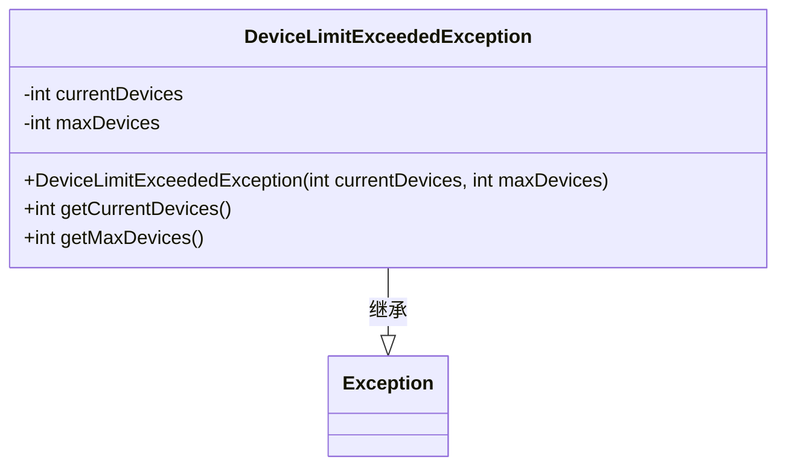
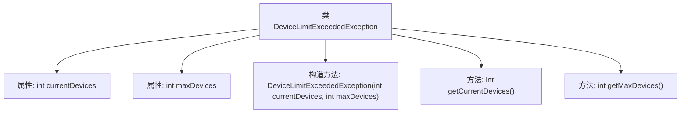

# 基础信息

|      |      |
|------|------|
| 名称 | DeviceLimitExceededException |
| 编码语言 | .java |
| 代码路径 | Signal-Server/service/src/main/java/org/whispersystems/textsecuregcm/controllers/DeviceLimitExceededException.java |
| 包名 | org.whispersystems.textsecuregcm.controllers |
| 依赖项 | [] |
| 概述说明 | 设备数量超限异常，显示当前及最大设备数。 |

# 说明

设备数量超限异常类用于处理设备数量超过预设最大值的情况。该类包含两个关键属性：当前设备数和最大设备数。当前设备数表示当前已连接的设备数量，最大设备数表示系统允许的最大设备连接数量。当当前设备数超过最大设备数时，系统将触发该异常，提示设备数量已超出限制。此异常类有助于系统在设备连接过多时进行有效管理和控制，确保系统资源的合理分配和稳定性。

# 类列表 Class Summary

| 名称   | 类型  | 说明 |
|-------|------|-------------|
| DeviceLimitExceededException | class | 设备数量超限异常类，包含当前和最大设备数。 |

## 类 DeviceLimitExceededException

|      |      |
|------|------|
| 访问范围 | public |
| 类型 | class |
| 名称 | DeviceLimitExceededException |
| 说明 | 设备数量超限异常类，包含当前和最大设备数。 |

### UML类图

这段代码定义了一个名为 `DeviceLimitExceededException` 的自定义异常类，它继承自 `Exception` 类。该异常类用于表示设备数量超过最大限制的情况，包含两个私有属性 `currentDevices` 和 `maxDevices`，分别表示当前设备数量和最大设备数量。类中提供了构造方法和两个公有方法 `getCurrentDevices` 和 `getMaxDevices`，用于获取当前设备数量和最大设备数量。

### 内部方法调用关系图

这段代码定义了一个名为`DeviceLimitExceededException`的自定义异常类，继承自`Exception`。该类包含两个私有属性`currentDevices`和`maxDevices`，分别表示当前设备数量和最大设备数量。构造方法用于初始化这两个属性，并提供了两个公共方法`getCurrentDevices`和`getMaxDevices`来获取这两个属性的值。该异常类通常用于在设备数量超过限制时抛出异常。

### 字段列表 Field List

| 名称  | 类型  | 说明 |
|-------|-------|------|
| maxDevices | int | 最大设备数量为私有整型变量。 |
| currentDevices | int | 当前设备数量为私有整型变量。 |

### 方法列表 Method List

| 名称  | 类型  | 说明 |
|-------|-------|------|
| getCurrentDevices | int | 获取当前设备数量的方法。 |
| getMaxDevices | int | 获取最大设备数的公共方法。 |

