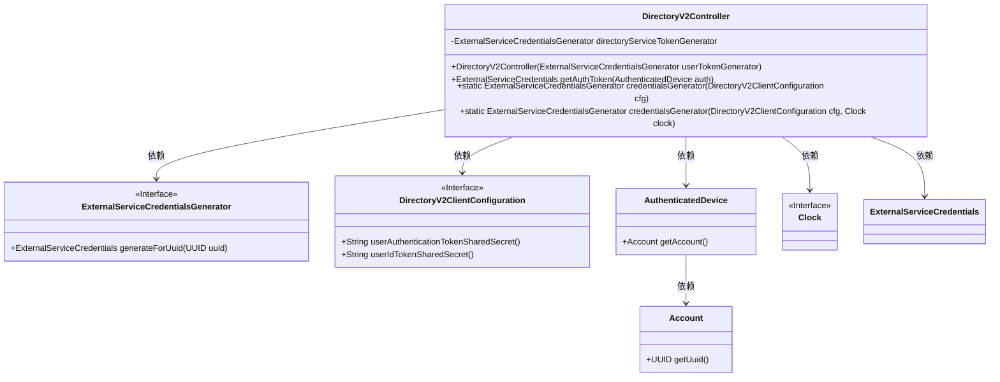
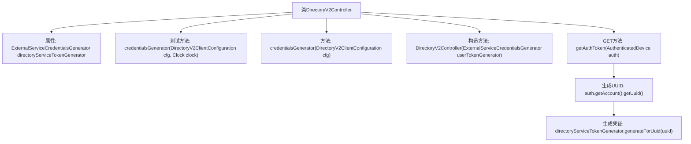

# 基础信息

|      |      |
|------|------|
| 名称 | DirectoryV2Controller |
| 编码语言 | .java |
| 代码路径 | Signal-Server/service/src/main/java/org/whispersystems/textsecuregcm/controllers/DirectoryV2Controller.java |
| 包名 | org.whispersystems.textsecuregcm.controllers |
| 依赖项 | ['com.google.common.annotations.VisibleForTesting', 'io.dropwizard.auth.Auth', 'io.swagger.v3.oas.annotations.Operation', 'io.swagger.v3.oas.annotations.responses.ApiResponse', 'io.swagger.v3.oas.annotations.tags.Tag', 'jakarta.ws.rs.GET', 'jakarta.ws.rs.Path', 'jakarta.ws.rs.Produces', 'jakarta.ws.rs.core.MediaType', 'java.time.Clock', 'java.util.UUID', 'org.whispersystems.textsecuregcm.auth.AuthenticatedDevice', 'org.whispersystems.textsecuregcm.auth.ExternalServiceCredentials', 'org.whispersystems.textsecuregcm.auth.ExternalServiceCredentialsGenerator', 'org.whispersystems.textsecuregcm.configuration.DirectoryV2ClientConfiguration', 'org.whispersystems.websocket.auth.ReadOnly'] |
| 概述说明 | DirectoryV2Controller类生成24小时有效联系人凭证，支持UTC时钟配置。 |

# 说明

DirectoryV2Controller类负责生成有效期为24小时的联系人发现服务凭证，该凭证用于在指定时间内访问相关服务。该类支持配置UTC时钟，确保生成的凭证时间戳与全球标准时间保持一致，适用于跨时区的应用场景。通过这一功能，系统能够提供安全且时效性强的服务凭证，满足用户对联系人发现服务的需求。

# 类列表 Class Summary

| 名称   | 类型  | 说明 |
|-------|------|-------------|
| DirectoryV2Controller | class | DirectoryV2Controller类生成24小时有效期的联系人发现服务凭证，支持UTC时钟配置。 |

## 类 DirectoryV2Controller

|      |      |
|------|------|
| 访问范围 | @Path("/v2/directory");@Tag(name = "Directory");public |
| 类型 | class |
| 名称 | DirectoryV2Controller |
| 说明 | DirectoryV2Controller类生成24小时有效期的联系人发现服务凭证，支持UTC时钟配置。 |

### UML类图

类图描述：`DirectoryV2Controller` 类负责生成外部服务凭证，依赖于 `ExternalServiceCredentialsGenerator` 接口来生成凭证。它通过 `DirectoryV2ClientConfiguration` 接口获取配置信息，并通过 `AuthenticatedDevice` 和 `Account` 类获取用户身份信息。`Clock` 接口用于时间管理，`ExternalServiceCredentials` 类表示生成的凭证。

### 内部方法调用关系图

这段代码定义了一个名为 `DirectoryV2Controller` 的类，用于处理与目录服务相关的请求。类中包含一个私有属性 `directoryServiceTokenGenerator`，用于生成外部服务凭证。类提供了两个静态方法 `credentialsGenerator`，用于创建 `ExternalServiceCredentialsGenerator` 实例，其中一个是测试专用的方法，允许传入自定义的 `Clock` 对象。构造方法 `DirectoryV2Controller` 用于初始化 `directoryServiceTokenGenerator`。`getAuthToken` 方法是一个 GET 请求处理程序，用于生成并返回与设备认证相关的凭证。整个流程从接收请求开始，生成 UUID，并最终生成凭证返回给客户端。

### 字段列表 Field List

| 名称  | 类型  | 说明 |
|-------|-------|------|
| directoryServiceTokenGenerator | ExternalServiceCredentialsGenerator | 私有成员变量，用于生成外部服务凭证。 |

### 方法列表 Method List

| 名称  | 类型  | 说明 |
|-------|-------|------|
| credentialsGenerator | ExternalServiceCredentialsGenerator | 静态方法生成外部服务凭证，使用默认系统时钟。 |
| credentialsGenerator | ExternalServiceCredentialsGenerator | 公开测试方法生成外部服务凭证，使用配置和时钟参数。 |
| getAuthToken | ExternalServiceCredentials | 生成24小时有效期的联系人发现服务凭证，凭证TTL由服务器控制。 |

