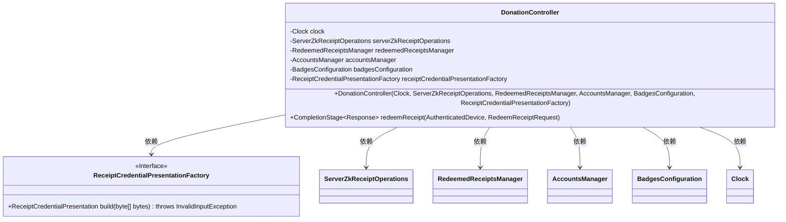
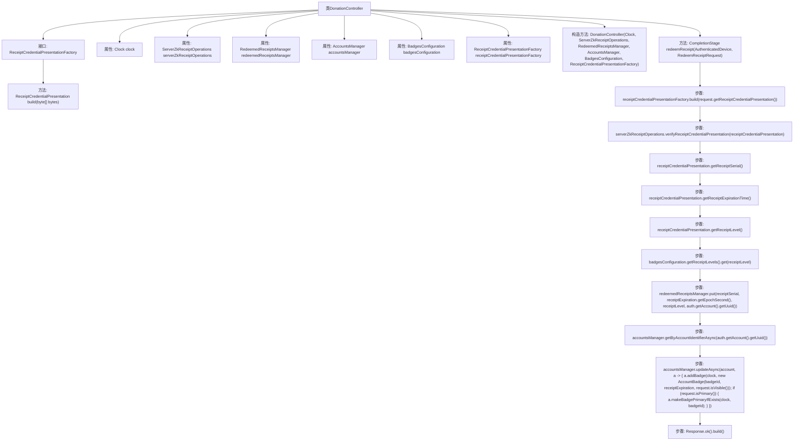

# 基础信息

|      |      |
|------|------|
| 名称 | DonationController |
| 编码语言 | .java |
| 代码路径 | Signal-Server/service/src/main/java/org/whispersystems/textsecuregcm/controllers/DonationController.java |
| 包名 | org.whispersystems.textsecuregcm.controllers |
| 依赖项 | ['io.dropwizard.auth.Auth', 'io.swagger.v3.oas.annotations.tags.Tag', 'jakarta.validation.Valid', 'jakarta.validation.constraints.NotNull', 'jakarta.ws.rs.Consumes', 'jakarta.ws.rs.POST', 'jakarta.ws.rs.Path', 'jakarta.ws.rs.Produces', 'jakarta.ws.rs.core.MediaType', 'jakarta.ws.rs.core.Response', 'jakarta.ws.rs.core.Response.Status', 'java.time.Clock', 'java.time.Instant', 'java.util.Objects', 'java.util.concurrent.CompletableFuture', 'java.util.concurrent.CompletionStage', 'java.util.function.Function', 'javax.annotation.Nonnull', 'org.signal.libsignal.zkgroup.InvalidInputException', 'org.signal.libsignal.zkgroup.VerificationFailedException', 'org.signal.libsignal.zkgroup.receipts.ReceiptCredentialPresentation', 'org.signal.libsignal.zkgroup.receipts.ReceiptSerial', 'org.signal.libsignal.zkgroup.receipts.ServerZkReceiptOperations', 'org.whispersystems.textsecuregcm.auth.AuthenticatedDevice', 'org.whispersystems.textsecuregcm.configuration.BadgesConfiguration', 'org.whispersystems.textsecuregcm.entities.RedeemReceiptRequest', 'org.whispersystems.textsecuregcm.storage.AccountBadge', 'org.whispersystems.textsecuregcm.storage.AccountsManager', 'org.whispersystems.textsecuregcm.storage.RedeemedReceiptsManager', 'org.whispersystems.websocket.auth.Mutable'] |
| 概述说明 | 捐赠控制器负责验证收据、兑换并更新账户徽章信息。 |

# 说明

捐赠控制器负责处理收据兑换流程，首先对用户提交的收据进行验证，确保其有效性和合法性。验证通过后，控制器会更新用户的账户信息，特别是与捐赠相关的徽章信息，以反映用户的捐赠行为。这一过程确保了捐赠记录的准确性和用户账户信息的实时更新，增强了系统的透明度和用户信任度。

# 类列表 Class Summary

| 名称   | 类型  | 说明 |
|-------|------|-------------|
| DonationController | class | 捐赠控制器处理收据兑换，验证收据并更新账户徽章信息。 |

## 类 DonationController

|      |      |
|------|------|
| 访问范围 | @Path("/v1/donation");@Tag(name = "Donations");public |
| 类型 | class |
| 名称 | DonationController |
| 说明 | 捐赠控制器处理收据兑换，验证收据并更新账户徽章信息。 |

### UML类图

### 描述
`DonationController` 是一个控制器类，用于处理捐赠相关的请求。它依赖于多个服务类，如 `ServerZkReceiptOperations`、`RedeemedReceiptsManager`、`AccountsManager` 和 `BadgesConfiguration`，以及一个接口 `ReceiptCredentialPresentationFactory`。`redeemReceipt` 方法是核心方法，用于处理收据兑换请求，验证收据的有效性，并根据收据信息更新账户的徽章状态。该类的设计体现了依赖注入的原则，通过构造函数注入所需的依赖项。

### 内部方法调用关系图

这段代码定义了一个名为 `DonationController` 的类，用于处理捐赠相关的请求。类中包含一个接口 `ReceiptCredentialPresentationFactory` 和多个属性，如 `Clock`、`ServerZkReceiptOperations` 等。构造方法用于初始化这些属性。主要方法 `redeemReceipt` 用于处理收据兑换请求，包括验证收据、更新账户信息等步骤。流程图展示了类内部的方法调用关系和主要处理流程。

### 字段列表 Field List

| 名称  | 类型  | 说明 |
|-------|-------|------|
| clock | Clock | 私有且不可变的时钟对象。 |
| badgesConfiguration | BadgesConfiguration | 私有不可变的BadgesConfiguration对象。 |
| accountsManager | AccountsManager | 私有账户管理器实例变量。 |
| redeemedReceiptsManager | RedeemedReceiptsManager | 私有且不可变的RedeemedReceiptsManager实例。 |
| receiptCredentialPresentationFactory | ReceiptCredentialPresentationFactory | 私有常量ReceiptCredentialPresentationFactory用于凭证展示。 |
| serverZkReceiptOperations | ServerZkReceiptOperations | 私有且不可变的ServerZkReceiptOperations对象。 |

### 方法列表 Method List

| 名称  | 类型  | 说明 |
|-------|-------|------|
| redeemReceipt | CompletionStage<Response> | 处理收据兑换请求，验证并更新用户徽章信息。 |

