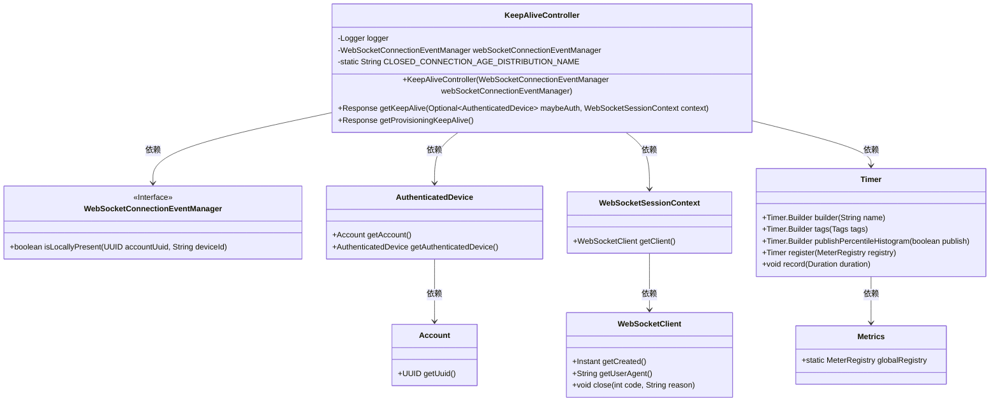
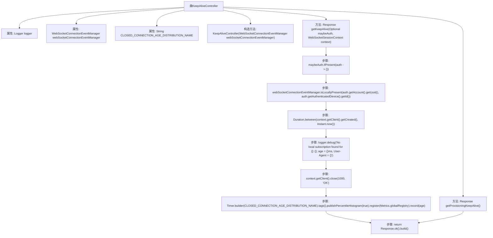

# 基础信息

|      |      |
|------|------|
| 名称 | KeepAliveController |
| 编码语言 | .java |
| 代码路径 | Signal-Server/service/src/main/java/org/whispersystems/textsecuregcm/controllers/KeepAliveController.java |
| 包名 | org.whispersystems.textsecuregcm.controllers |
| 依赖项 | ['com.codahale.metrics.MetricRegistry.name', 'io.dropwizard.auth.Auth', 'io.micrometer.core.instrument.Metrics', 'io.micrometer.core.instrument.Tags', 'io.micrometer.core.instrument.Timer', 'io.swagger.v3.oas.annotations.tags.Tag', 'jakarta.ws.rs.GET', 'jakarta.ws.rs.Path', 'jakarta.ws.rs.core.Response', 'java.time.Duration', 'java.time.Instant', 'java.util.Optional', 'org.slf4j.Logger', 'org.slf4j.LoggerFactory', 'org.whispersystems.textsecuregcm.auth.AuthenticatedDevice', 'org.whispersystems.textsecuregcm.metrics.UserAgentTagUtil', 'org.whispersystems.textsecuregcm.push.WebSocketConnectionEventManager', 'org.whispersystems.websocket.auth.ReadOnly', 'org.whispersystems.websocket.session.WebSocketSession', 'org.whispersystems.websocket.session.WebSocketSessionContext'] |
| 概述说明 | KeepAliveController类管理WebSocket连接保活，监控本地订阅并记录断开时长。 |

# 说明

KeepAliveController类负责管理WebSocket连接的保活机制，通过检查本地订阅状态来确保连接的持续性，并记录连接关闭的时长以便进行后续分析和处理。该类的核心功能是监控和维护WebSocket连接的活跃状态，确保通信的稳定性和可靠性。

# 类列表 Class Summary

| 名称   | 类型  | 说明 |
|-------|------|-------------|
| KeepAliveController | class | KeepAliveController类处理WebSocket连接保活，检查本地订阅并记录关闭连接时长。 |

## 类 KeepAliveController

|      |      |
|------|------|
| 访问范围 | @Path("/v1/keepalive");@Tag(name = "Keep Alive");public |
| 类型 | class |
| 名称 | KeepAliveController |
| 说明 | KeepAliveController类处理WebSocket连接保活，检查本地订阅并记录关闭连接时长。 |

### UML类图

**描述：**  
`KeepAliveController` 是一个用于处理WebSocket连接保活的控制器类，它依赖于 `WebSocketConnectionEventManager` 来管理WebSocket连接事件。该类包含两个主要方法：`getKeepAlive` 和 `getProvisioningKeepAlive`，分别用于处理普通保活请求和配置保活请求。`getKeepAlive` 方法会检查本地是否存在相应的WebSocket连接，如果不存在则关闭连接并记录连接时长。`WebSocketConnectionEventManager` 是一个接口，用于检查WebSocket连接是否存在。`AuthenticatedDevice` 和 `Account` 类用于获取认证设备和账户信息，`WebSocketSessionContext` 和 `WebSocketClient` 类用于管理WebSocket会话和客户端信息。`Timer` 和 `Metrics` 类用于记录和发布连接时长的统计数据。

### 内部方法调用关系图

这段代码定义了一个名为 `KeepAliveController` 的类，用于处理与WebSocket连接的保持活动状态相关的请求。类中包含两个GET请求处理方法：`getKeepAlive` 和 `getProvisioningKeepAlive`。`getKeepAlive` 方法会检查认证设备的本地订阅状态，如果未找到本地订阅，则记录日志并关闭连接，同时记录连接持续时间。`getProvisioningKeepAlive` 方法则直接返回一个成功的响应。流程图展示了类中各个方法的调用关系及主要处理步骤。

### 字段列表 Field List

| 名称  | 类型  | 说明 |
|-------|-------|------|
| logger = LoggerFactory.getLogger(KeepAliveController.class) | Logger | 在KeepAliveController类中定义了一个私有的Logger实例。 |
| CLOSED_CONNECTION_AGE_DISTRIBUTION_NAME = name(KeepAliveController.class,      "closedConnectionAge") | String | 定义了用于记录关闭连接年龄分布的静态常量字符串。 |
| webSocketConnectionEventManager | WebSocketConnectionEventManager | 私有WebSocket连接事件管理器实例。 |

### 方法列表 Method List

| 名称  | 类型  | 说明 |
|-------|-------|------|
| getKeepAlive | Response | 检查设备连接状态，若本地无订阅则记录日志并关闭连接，返回成功响应。 |
| getProvisioningKeepAlive | Response | API路径为/provisioning，返回HTTP 200响应。 |

