# 基础信息

|      |      |
|------|------|
| 名称 | KeyTransparencyController |
| 编码语言 | .java |
| 代码路径 | Signal-Server/service/src/main/java/org/whispersystems/textsecuregcm/controllers/KeyTransparencyController.java |
| 包名 | org.whispersystems.textsecuregcm.controllers |
| 依赖项 | ['com.google.common.annotations.VisibleForTesting', 'com.google.protobuf.ByteString', 'io.dropwizard.auth.Auth', 'io.grpc.Status', 'io.grpc.StatusRuntimeException', 'io.swagger.v3.oas.annotations.Operation', 'io.swagger.v3.oas.annotations.Parameter', 'io.swagger.v3.oas.annotations.responses.ApiResponse', 'io.swagger.v3.oas.annotations.tags.Tag', 'jakarta.validation.Valid', 'jakarta.validation.constraints.NotNull', 'jakarta.validation.constraints.Positive', 'jakarta.ws.rs.BadRequestException', 'jakarta.ws.rs.ForbiddenException', 'jakarta.ws.rs.GET', 'jakarta.ws.rs.NotFoundException', 'jakarta.ws.rs.POST', 'jakarta.ws.rs.Path', 'jakarta.ws.rs.Produces', 'jakarta.ws.rs.QueryParam', 'jakarta.ws.rs.ServerErrorException', 'jakarta.ws.rs.WebApplicationException', 'jakarta.ws.rs.core.MediaType', 'jakarta.ws.rs.core.Response', 'java.time.Duration', 'java.util.Optional', 'java.util.concurrent.CancellationException', 'java.util.concurrent.CompletionException', 'org.signal.keytransparency.client.AciMonitorRequest', 'org.signal.keytransparency.client.E164MonitorRequest', 'org.signal.keytransparency.client.E164SearchRequest', 'org.signal.keytransparency.client.UsernameHashMonitorRequest', 'org.slf4j.Logger', 'org.slf4j.LoggerFactory', 'org.whispersystems.textsecuregcm.auth.AuthenticatedDevice', 'org.whispersystems.textsecuregcm.entities.KeyTransparencyDistinguishedKeyResponse', 'org.whispersystems.textsecuregcm.entities.KeyTransparencyMonitorRequest', 'org.whispersystems.textsecuregcm.entities.KeyTransparencyMonitorResponse', 'org.whispersystems.textsecuregcm.entities.KeyTransparencySearchRequest', 'org.whispersystems.textsecuregcm.entities.KeyTransparencySearchResponse', 'org.whispersystems.textsecuregcm.keytransparency.KeyTransparencyServiceClient', 'org.whispersystems.textsecuregcm.limits.RateLimitedByIp', 'org.whispersystems.textsecuregcm.limits.RateLimiters', 'org.whispersystems.textsecuregcm.util.ExceptionUtils', 'org.whispersystems.websocket.auth.ReadOnly'] |
| 概述说明 | KeyTransparencyController处理密钥日志搜索、监控和获取，支持未认证访问、多种响应状态和限速。 |

# 说明

KeyTransparencyController负责处理密钥透明日志的相关操作，包括搜索、监控和获取特定密钥。这些操作均支持未认证访问，并提供了多种响应状态和限速机制，以确保系统的安全性和稳定性。

# 类列表 Class Summary

| 名称   | 类型  | 说明 |
|-------|------|-------------|
| KeyTransparencyController | class | KeyTransparencyController处理密钥透明日志的搜索、监控和获取特定密钥的操作，均为未认证访问，支持多种响应状态和限速机制。 |

## 类 KeyTransparencyController

|      |      |
|------|------|
| 访问范围 | @Path("/v1/key-transparency");@Tag(name = "KeyTransparency");public |
| 类型 | class |
| 名称 | KeyTransparencyController |
| 说明 | KeyTransparencyController处理密钥透明日志的搜索、监控和获取特定密钥的操作，均为未认证访问，支持多种响应状态和限速机制。 |

### UML类图

```mermaid
classDiagram
    class KeyTransparencyController {
        -Logger LOGGER
        -Duration KEY_TRANSPARENCY_RPC_TIMEOUT
        -KeyTransparencyServiceClient keyTransparencyServiceClient
        +KeyTransparencyController(KeyTransparencyServiceClient keyTransparencyServiceClient)
        +KeyTransparencySearchResponse search(Optional~AuthenticatedDevice~ authenticatedAccount, KeyTransparencySearchRequest request)
        +KeyTransparencyMonitorResponse monitor(Optional~AuthenticatedDevice~ authenticatedAccount, KeyTransparencyMonitorRequest request)
        +KeyTransparencyDistinguishedKeyResponse getDistinguishedKey(Optional~AuthenticatedDevice~ authenticatedAccount, Optional~Long~ lastTreeHeadSize)
        -void handleKeyTransparencyServiceError(CompletionException exception)
        -void requireNotAuthenticated(Optional~AuthenticatedDevice~ authenticatedAccount)
    }

    class KeyTransparencyServiceClient {
        <<Interface>>
        +CompletableFuture~SearchResponse~ search(ByteString aci, ByteString aciIdentityKey, Optional~ByteString~ usernameHash, Optional~E164SearchRequest~ e164SearchRequest, Optional~Long~ lastTreeHeadSize, Optional~Long~ distinguishedTreeHeadSize, Duration timeout)
        +CompletableFuture~MonitorResponse~ monitor(AciMonitorRequest aciMonitorRequest, Optional~UsernameHashMonitorRequest~ usernameHashMonitorRequest, Optional~E164MonitorRequest~ e164MonitorRequest, Optional~Long~ lastNonDistinguishedTreeHeadSize, Optional~Long~ lastDistinguishedTreeHeadSize, Duration timeout)
        +CompletableFuture~DistinguishedKeyResponse~ getDistinguishedKey(Optional~Long~ lastTreeHeadSize, Duration timeout)
    }

    class KeyTransparencySearchRequest {
        +Optional~ByteString~ e164()
        +Optional~ByteString~ unidentifiedAccessKey()
        +ByteString aci()
        +ByteString aciIdentityKey()
        +Optional~ByteString~ usernameHash()
        +Optional~Long~ lastTreeHeadSize()
        +Optional~Long~ distinguishedTreeHeadSize()
    }

    class KeyTransparencyMonitorRequest {
        +Aci aci()
        +Optional~UsernameHash~ usernameHash()
        +Optional~E164~ e164()
        +Optional~Long~ lastNonDistinguishedTreeHeadSize()
        +Optional~Long~ lastDistinguishedTreeHeadSize()
    }

    class KeyTransparencyDistinguishedKeyResponse {
        +KeyTransparencyDistinguishedKeyResponse(DistinguishedKeyResponse response)
    }

    KeyTransparencyController --> KeyTransparencyServiceClient : 依赖
```

### 描述
`KeyTransparencyController` 是一个处理密钥透明度相关请求的控制器类，依赖于 `KeyTransparencyServiceClient` 接口来执行具体的业务逻辑。它提供了三个主要方法：`search` 用于搜索密钥透明度日志，`monitor` 用于监控日志中的标识符，`getDistinguishedKey` 用于获取当前的关键值。每个方法都通过 `KeyTransparencyServiceClient` 与后端服务进行交互，并处理可能的异常情况。

### 内部方法调用关系图

```mermaid
graph TD
    A["类KeyTransparencyController"]
    B["属性: Logger LOGGER"]
    C["属性: Duration KEY_TRANSPARENCY_RPC_TIMEOUT"]
    D["属性: KeyTransparencyServiceClient keyTransparencyServiceClient"]
    E["构造方法: KeyTransparencyController(KeyTransparencyServiceClient keyTransparencyServiceClient)"]
    F["方法: KeyTransparencySearchResponse search(Optional<AuthenticatedDevice> authenticatedAccount, KeyTransparencySearchRequest request)"]
    G["方法: KeyTransparencyMonitorResponse monitor(Optional<AuthenticatedDevice> authenticatedAccount, KeyTransparencyMonitorRequest request)"]
    H["方法: KeyTransparencyDistinguishedKeyResponse getDistinguishedKey(Optional<AuthenticatedDevice> authenticatedAccount, Optional<Long> lastTreeHeadSize)"]
    I["方法: void handleKeyTransparencyServiceError(CompletionException exception)"]
    J["方法: void requireNotAuthenticated(Optional<AuthenticatedDevice> authenticatedAccount)"]

    A --> B
    A --> C
    A --> D
    A --> E
    A --> F
    A --> G
    A --> H
    A --> I
    A --> J
```

**描述：**  
`KeyTransparencyController` 是一个控制器类，用于处理与密钥透明度相关的请求。它包含三个主要方法：`search`、`monitor` 和 `getDistinguishedKey`，分别用于搜索、监控和获取密钥透明度的信息。每个方法都通过 `KeyTransparencyServiceClient` 与后端服务进行交互，并处理可能的异常情况。此外，`handleKeyTransparencyServiceError` 方法用于处理服务调用中的错误，`requireNotAuthenticated` 方法确保某些端点只能由未认证的客户端访问。

### 字段列表 Field List

| 名称  | 类型  | 说明 |
|-------|-------|------|
| keyTransparencyServiceClient | KeyTransparencyServiceClient | 私有且不可变的KeyTransparencyServiceClient实例。 |
| LOGGER = LoggerFactory.getLogger(KeyTransparencyController.class) | Logger | KeyTransparencyController类中定义了一个静态日志记录器LOGGER。 |
| KEY_TRANSPARENCY_RPC_TIMEOUT = Duration.ofSeconds(15) | Duration | 测试用常量KEY_TRANSPARENCY_RPC_TIMEOUT设为15秒。 |

### 方法列表 Method List

| 名称  | 类型  | 说明 |
|-------|-------|------|
| monitor | KeyTransparencyMonitorResponse | 监控指定标识符在密钥透明日志中的正确性，支持多种请求类型并处理相关错误。 |
| getDistinguishedKey | KeyTransparencyDistinguishedKeyResponse | 获取当前区分键值，用于验证一致性，支持未认证访问，包含多种响应状态码。 |
| search | KeyTransparencySearchResponse | 搜索透明日志中的标识符，验证ACI及其映射值，支持用户名哈希和E164搜索，强制未认证访问。 |
| requireNotAuthenticated | void | 方法检查设备是否已认证，若已认证则抛出异常。 |
| handleKeyTransparencyServiceError | void | 处理密钥透明服务错误，根据异常类型抛出不同状态码异常，未捕获异常记录日志并抛出500错误。 |

