# 基础信息

|      |      |
|------|------|
| 名称 | KeysController |
| 编码语言 | .java |
| 代码路径 | Signal-Server/service/src/main/java/org/whispersystems/textsecuregcm/controllers/KeysController.java |
| 包名 | org.whispersystems.textsecuregcm.controllers |
| 依赖项 | ['com.google.common.net.HttpHeaders', 'io.dropwizard.auth.Auth', 'io.micrometer.core.instrument.Metrics', 'io.micrometer.core.instrument.Tag', 'io.micrometer.core.instrument.Tags', 'io.swagger.v3.oas.annotations.Operation', 'io.swagger.v3.oas.annotations.Parameter', 'io.swagger.v3.oas.annotations.headers.Header', 'io.swagger.v3.oas.annotations.media.Schema', 'io.swagger.v3.oas.annotations.parameters.RequestBody', 'io.swagger.v3.oas.annotations.responses.ApiResponse', 'jakarta.validation.Valid', 'jakarta.validation.constraints.NotNull', 'jakarta.ws.rs.BadRequestException', 'jakarta.ws.rs.Consumes', 'jakarta.ws.rs.DefaultValue', 'jakarta.ws.rs.GET', 'jakarta.ws.rs.HeaderParam', 'jakarta.ws.rs.NotAuthorizedException', 'jakarta.ws.rs.NotFoundException', 'jakarta.ws.rs.POST', 'jakarta.ws.rs.PUT', 'jakarta.ws.rs.Path', 'jakarta.ws.rs.PathParam', 'jakarta.ws.rs.Produces', 'jakarta.ws.rs.QueryParam', 'jakarta.ws.rs.WebApplicationException', 'jakarta.ws.rs.core.MediaType', 'jakarta.ws.rs.core.Response', 'java.nio.ByteBuffer', 'java.security.MessageDigest', 'java.security.NoSuchAlgorithmException', 'java.time.Clock', 'java.util.ArrayList', 'java.util.List', 'java.util.Optional', 'java.util.UUID', 'java.util.concurrent.CompletableFuture', 'javax.annotation.Nullable', 'org.signal.libsignal.protocol.IdentityKey', 'org.signal.libsignal.zkgroup.ServerSecretParams', 'org.signal.libsignal.zkgroup.VerificationFailedException', 'org.signal.libsignal.zkgroup.groupsend.GroupSendDerivedKeyPair', 'org.signal.libsignal.zkgroup.groupsend.GroupSendFullToken', 'org.whispersystems.textsecuregcm.auth.Anonymous', 'org.whispersystems.textsecuregcm.auth.AuthenticatedDevice', 'org.whispersystems.textsecuregcm.auth.GroupSendTokenHeader', 'org.whispersystems.textsecuregcm.auth.OptionalAccess', 'org.whispersystems.textsecuregcm.entities.CheckKeysRequest', 'org.whispersystems.textsecuregcm.entities.ECPreKey', 'org.whispersystems.textsecuregcm.entities.ECSignedPreKey', 'org.whispersystems.textsecuregcm.entities.KEMSignedPreKey', 'org.whispersystems.textsecuregcm.entities.PreKeyCount', 'org.whispersystems.textsecuregcm.entities.PreKeyResponse', 'org.whispersystems.textsecuregcm.entities.PreKeyResponseItem', 'org.whispersystems.textsecuregcm.entities.PreKeySignatureValidator', 'org.whispersystems.textsecuregcm.entities.SetKeysRequest', 'org.whispersystems.textsecuregcm.entities.SignedPreKey', 'org.whispersystems.textsecuregcm.identity.IdentityType', 'org.whispersystems.textsecuregcm.identity.ServiceIdentifier', 'org.whispersystems.textsecuregcm.limits.RateLimiters', 'org.whispersystems.textsecuregcm.metrics.MetricsUtil', 'org.whispersystems.textsecuregcm.metrics.UserAgentTagUtil', 'org.whispersystems.textsecuregcm.storage.Account', 'org.whispersystems.textsecuregcm.storage.AccountsManager', 'org.whispersystems.textsecuregcm.storage.Device', 'org.whispersystems.textsecuregcm.storage.KeysManager', 'org.whispersystems.textsecuregcm.util.HeaderUtils', 'org.whispersystems.textsecuregcm.util.Util', 'org.whispersystems.websocket.auth.ReadOnly'] |
| 概述说明 | KeysController负责密钥管理，支持获取、存储、检查及获取设备公钥。 |

# 说明

KeysController是一个用于管理密钥的控制器，主要负责处理与密钥相关的操作。它支持获取密钥、存储密钥、检查密钥状态以及获取设备公钥等功能。通过这些操作，KeysController能够有效地管理和维护系统中的密钥信息，确保密钥的安全性和可用性。

# 类列表 Class Summary

| 名称   | 类型  | 说明 |
|-------|------|-------------|
| KeysController | class | KeysController处理密钥管理，支持获取、存储、检查和获取设备公钥操作。 |

## 类 KeysController

|      |      |
|------|------|
| 访问范围 | @SuppressWarnings("OptionalUsedAsFieldOrParameterType");@Path("/v2/keys");@io.swagger.v3.oas.annotations.tags.Tag(name = "Keys");public |
| 类型 | class |
| 名称 | KeysController |
| 说明 | KeysController处理密钥管理，支持获取、存储、检查和获取设备公钥操作。 |

### UML类图

```mermaid
classDiagram
    class KeysController {
        -RateLimiters rateLimiters
        -KeysManager keysManager
        -AccountsManager accounts
        -ServerSecretParams serverSecretParams
        -Clock clock
        -String GET_KEYS_COUNTER_NAME
        -String STORE_KEYS_COUNTER_NAME
        -String PRIMARY_DEVICE_TAG_NAME
        -String IDENTITY_TYPE_TAG_NAME
        -String KEY_TYPE_TAG_NAME
        -CompletableFuture<?>[] EMPTY_FUTURE_ARRAY
        +KeysController(RateLimiters rateLimiters, KeysManager keysManager, AccountsManager accounts, ServerSecretParams serverSecretParams, Clock clock)
        +CompletableFuture~PreKeyCount~ getStatus(AuthenticatedDevice auth, IdentityType identityType)
        +CompletableFuture~Response~ setKeys(AuthenticatedDevice auth, SetKeysRequest setKeysRequest, IdentityType identityType, String userAgent)
        +CompletableFuture~Response~ checkKeys(AuthenticatedDevice auth, CheckKeysRequest checkKeysRequest, String userAgent)
        +PreKeyResponse getDeviceKeys(Optional~AuthenticatedDevice~ auth, Optional~Anonymous~ accessKey, Optional~GroupSendTokenHeader~ groupSendToken, ServiceIdentifier targetIdentifier, String deviceId, String userAgent)
        -void checkSignedPreKeySignatures(SetKeysRequest setKeysRequest, IdentityKey identityKey, String userAgent)
        -List~Device~ parseDeviceId(String deviceId, Account account)
    }

    class RateLimiters {
        // 限流器相关逻辑
    }

    class KeysManager {
        +CompletableFuture~Integer~ getEcCount(UUID identifier, byte deviceId)
        +CompletableFuture~Integer~ getPqCount(UUID identifier, byte deviceId)
        +CompletableFuture~Void~ storeEcOneTimePreKeys(UUID identifier, byte deviceId, List~PreKey~ preKeys)
        +CompletableFuture~Void~ storeEcSignedPreKeys(UUID identifier, byte deviceId, SignedPreKey~ECPublicKey~ signedPreKey)
        +CompletableFuture~Void~ storeKemOneTimePreKeys(UUID identifier, byte deviceId, List~PreKey~ pqPreKeys)
        +CompletableFuture~Void~ storePqLastResort(UUID identifier, byte deviceId, SignedPreKey~KEMPublicKey~ pqLastResortPreKey)
        +CompletableFuture~Optional~ECSignedPreKey~~ getEcSignedPreKey(UUID identifier, byte deviceId)
        +CompletableFuture~Optional~KEMSignedPreKey~~ getLastResort(UUID identifier, byte deviceId)
        +CompletableFuture~Optional~ECPreKey~~ takeEC(UUID identifier, byte deviceId)
        +CompletableFuture~Optional~KEMSignedPreKey~~ takePQ(UUID identifier, byte deviceId)
    }

    class AccountsManager {
        +Optional~Account~ getByServiceIdentifier(ServiceIdentifier targetIdentifier)
    }

    class ServerSecretParams {
        // 服务器密钥参数相关逻辑
    }

    class Clock {
        // 时钟相关逻辑
    }

    class AuthenticatedDevice {
        +Account getAccount()
        +Device getAuthenticatedDevice()
    }

    class Account {
        +UUID getIdentifier(IdentityType identityType)
        +IdentityKey getIdentityKey(IdentityType identityType)
        +List~Device~ getDevices()
        +Optional~Device~ getDevice(byte id)
    }

    class Device {
        +byte getId()
        +int getRegistrationId()
        +Optional~Integer~ getPhoneNumberIdentityRegistrationId()
    }

    class SetKeysRequest {
        +List~PreKey~ preKeys()
        +SignedPreKey~ECPublicKey~ signedPreKey()
        +List~PreKey~ pqPreKeys()
        +SignedPreKey~KEMPublicKey~ pqLastResortPreKey()
    }

    class CheckKeysRequest {
        +IdentityType identityType()
        +byte[] digest()
    }

    class PreKeyResponse {
        +IdentityKey identityKey
        +List~PreKeyResponseItem~ responseItems
    }

    class PreKeyResponseItem {
        +byte deviceId
        +int registrationId
        +ECSignedPreKey signedEcPreKey
        +ECPreKey unsignedEcPreKey
        +KEMSignedPreKey pqPreKey
    }

    class ECSignedPreKey {
        +long keyId()
        +byte[] serializedPublicKey()
    }

    class KEMSignedPreKey {
        +long keyId()
        +byte[] serializedPublicKey()
    }

    class ECPreKey {
        // EC预密钥相关逻辑
    }

    class IdentityKey {
        +byte[] serialize()
    }

    class GroupSendTokenHeader {
        +GroupSendFullToken token()
    }

    class GroupSendFullToken {
        +void verify(List~ServiceIdentifier~ identifiers, Instant instant, GroupSendDerivedKeyPair keyPair)
    }

    class GroupSendDerivedKeyPair {
        // 群发派生密钥对相关逻辑
    }

    class ServiceIdentifier {
        +UUID uuid()
        +IdentityType identityType()
    }

    class IdentityType {
        // 身份类型相关逻辑
    }

    class Anonymous {
        // 匿名访问相关逻辑
    }

    class PreKeyCount {
        // 预密钥计数相关逻辑
    }

    class PreKey {
        // 预密钥相关逻辑
    }

    class SignedPreKey~T~ {
        // 签名预密钥相关逻辑
    }

    class ECPublicKey {
        // EC公钥相关逻辑
    }

    class KEMPublicKey {
        // KEM公钥相关逻辑
    }

    class Tag {
        +String name()
        +String value()
    }

    class Metrics {
        +Counter counter(String name, Tags tags)
    }

    class Counter {
        +void increment()
    }

    class Tags {
        +static Tags of(Tag... tags)
    }

    class UserAgentTagUtil {
        +static Tag getPlatformTag(String userAgent)
    }

    class PreKeySignatureValidator {
        +static boolean validatePreKeySignatures(IdentityKey identityKey, List~SignedPreKey~ signedPreKeys, String userAgent, String operation)
    }

    class OptionalAccess {
        +static void verify(Optional~Account~ account, Optional~Anonymous~ accessKey, Optional~Account~ maybeTarget, ServiceIdentifier targetIdentifier, String deviceId)
    }

    KeysController --> RateLimiters : 依赖
    KeysController --> KeysManager : 依赖
    KeysController --> AccountsManager : 依赖
    KeysController --> ServerSecretParams : 依赖
    KeysController --> Clock : 依赖
    KeysController --> AuthenticatedDevice : 依赖
    KeysController --> SetKeysRequest : 依赖
    KeysController --> CheckKeysRequest : 依赖
    KeysController --> PreKeyResponse : 依赖
    KeysController --> PreKeyResponseItem : 依赖
    KeysController --> ECSignedPreKey : 依赖
    KeysController --> KEMSignedPreKey : 依赖
    KeysController --> ECPreKey : 依赖
    KeysController --> IdentityKey : 依赖
    KeysController --> GroupSendTokenHeader : 依赖
    KeysController --> GroupSendFullToken : 依赖
    KeysController --> GroupSendDerivedKeyPair : 依赖
    KeysController --> ServiceIdentifier : 依赖
    KeysController --> IdentityType : 依赖
    KeysController --> Anonymous : 依赖
    KeysController --> PreKeyCount : 依赖
    KeysController --> PreKey : 依赖
    KeysController --> SignedPreKey~T~ : 依赖
    KeysController --> ECPublicKey : 依赖
    KeysController --> KEMPublicKey : 依赖
    KeysController --> Tag : 依赖
    KeysController --> Metrics : 依赖
    KeysController --> Counter : 依赖
    KeysController --> Tags : 依赖
    KeysController --> UserAgentTagUtil : 依赖
    KeysController --> PreKeySignatureValidator : 依赖
    KeysController --> OptionalAccess : 依赖
    AuthenticatedDevice --> Account : 依赖
    Account --> Device : 依赖
    SetKeysRequest --> PreKey : 依赖
    SetKeysRequest --> SignedPreKey~ECPublicKey~ : 依赖
    SetKeysRequest --> SignedPreKey~KEMPublicKey~ : 依赖
    CheckKeysRequest --> IdentityType : 依赖
    PreKeyResponse --> IdentityKey : 依赖
    PreKeyResponse --> PreKeyResponseItem : 依赖
    PreKeyResponseItem --> ECSignedPreKey : 依赖
    PreKeyResponseItem --> ECPreKey : 依赖
    PreKeyResponseItem --> KEMSignedPreKey : 依赖
    GroupSendTokenHeader --> GroupSendFullToken : 依赖
    GroupSendFullToken --> GroupSendDerivedKeyPair : 依赖
    ServiceIdentifier --> IdentityType : 依赖
    Metrics --> Counter : 依赖
    Metrics --> Tags : 依赖
    Tags --> Tag : 依赖
    PreKeySignatureValidator --> IdentityKey : 依赖
    PreKeySignatureValidator --> SignedPreKey~T~ : 依赖
    OptionalAccess --> Account : 依赖
    OptionalAccess --> Anonymous : 依赖
    OptionalAccess --> ServiceIdentifier : 依赖
```

这段代码描述了一个名为 `KeysController` 的类，它负责管理与密钥相关的操作，包括获取密钥状态、存储新密钥、检查密钥一致性以及获取设备密钥。该类依赖于多个其他类，如 `RateLimiters`、`KeysManager`、`AccountsManager` 等，来处理限流、密钥管理、账户管理等任务。代码通过 `CompletableFuture` 实现了异步操作，并使用了多种注解来定义API的行为和响应。

### 内部方法调用关系图

```mermaid
graph TD
    A["类KeysController"]
    B["属性: RateLimiters rateLimiters"]
    C["属性: KeysManager keysManager"]
    D["属性: AccountsManager accounts"]
    E["属性: ServerSecretParams serverSecretParams"]
    F["属性: Clock clock"]
    G["构造方法: KeysController(RateLimiters, KeysManager, AccountsManager, ServerSecretParams, Clock)"]
    H["方法: CompletableFuture<PreKeyCount> getStatus(AuthenticatedDevice, IdentityType)"]
    I["方法: CompletableFuture<Response> setKeys(AuthenticatedDevice, SetKeysRequest, IdentityType, String)"]
    J["方法: void checkSignedPreKeySignatures(SetKeysRequest, IdentityKey, String)"]
    K["方法: CompletableFuture<Response> checkKeys(AuthenticatedDevice, CheckKeysRequest, String)"]
    L["方法: PreKeyResponse getDeviceKeys(Optional<AuthenticatedDevice>, Optional<Anonymous>, Optional<GroupSendTokenHeader>, ServiceIdentifier, String, String)"]
    M["方法: List<Device> parseDeviceId(String, Account)"]

    A --> B
    A --> C
    A --> D
    A --> E
    A --> F
    A --> G
    A --> H
    A --> I
    A --> J
    A --> K
    A --> L
    A --> M
```

这段代码定义了一个名为 `KeysController` 的类，主要用于管理密钥的上传、获取和验证操作。类中包含多个方法，分别用于处理不同类型的密钥请求，如获取预密钥数量、上传新预密钥、验证密钥签名以及检查密钥一致性等。每个方法都通过调用 `KeysManager` 和 `AccountsManager` 等依赖对象来完成具体的业务逻辑。代码还包含了对请求参数的验证和错误处理，确保操作的安全性和正确性。

### 字段列表 Field List

| 名称  | 类型  | 说明 |
|-------|-------|------|
| keysManager | KeysManager | 私有不可变的KeysManager实例。 |
| rateLimiters | RateLimiters | 私有且不可变的限流器实例。 |
| accounts | AccountsManager | 私有且不可变的账户管理器实例。 |
| serverSecretParams | ServerSecretParams | 私有且不可变的服务器密钥参数实例。 |
| clock | Clock | 定义了一个私有的不可变时钟对象。 |
| KEY_TYPE_TAG_NAME = "keyType" | String | 定义常量KEY_TYPE_TAG_NAME，值为"keyType"。 |
| IDENTITY_TYPE_TAG_NAME = "identityType" | String | 定义常量字符串IDENTITY_TYPE_TAG_NAME，值为"identityType"。 |
| PRIMARY_DEVICE_TAG_NAME = "isPrimary" | String | 定义私有静态常量字符串PRIMARY_DEVICE_TAG_NAME，值为"isPrimary"。 |
| GET_KEYS_COUNTER_NAME = MetricsUtil.name(KeysController.class, "getKeys") | String | 私有静态常量GET_KEYS_COUNTER_NAME用于记录KeysController类的getKeys方法指标。 |
| STORE_KEYS_COUNTER_NAME = MetricsUtil.name(KeysController.class, "storeKeys") | String | 定义静态常量STORE_KEYS_COUNTER_NAME，用于存储KeysController类的计数器名称。 |
| EMPTY_FUTURE_ARRAY = new CompletableFuture[0] | CompletableFuture<?>[] | 定义空CompletableFuture数组常量EMPTY_FUTURE_ARRAY。 |

### 方法列表 Method List

| 名称  | 类型  | 说明 |
|-------|-------|------|
| getStatus | CompletableFuture<PreKeyCount> | 获取设备可用一次性预密钥数量的API，支持ACI身份验证。 |
| checkSignedPreKeySignatures | void | 检查签名预密钥有效性，验证失败抛出异常。 |
| parseDeviceId | List<Device> | 解析设备ID，返回对应设备列表，异常时抛出422错误。 |
| setKeys | CompletableFuture<Response> | 上传设备新预密钥，支持多种密钥类型，返回存储结果。 |
| getDeviceKeys | PreKeyResponse | 获取指定用户公钥和设备预密钥，处理认证和速率限制。 |
| checkKeys | CompletableFuture<Response> | 检查客户端与服务器重复使用密钥一致性，通过SHA256哈希验证，返回匹配状态。 |

