# 基础信息

|      |      |
|------|------|
| 名称 | MessageController |
| 编码语言 | .java |
| 代码路径 | Signal-Server/service/src/main/java/org/whispersystems/textsecuregcm/controllers/MessageController.java |
| 包名 | org.whispersystems.textsecuregcm.controllers |
| 依赖项 | ['com.codahale.metrics.MetricRegistry.name', 'com.codahale.metrics.annotation.Timed', 'com.google.common.net.HttpHeaders', 'io.dropwizard.auth.Auth', 'io.micrometer.core.instrument.Metrics', 'io.micrometer.core.instrument.Tag', 'io.micrometer.core.instrument.Tags', 'io.micrometer.core.instrument.Timer', 'io.micrometer.core.instrument.Timer.Sample', 'io.swagger.v3.oas.annotations.Operation', 'io.swagger.v3.oas.annotations.Parameter', 'io.swagger.v3.oas.annotations.media.Content', 'io.swagger.v3.oas.annotations.media.Schema', 'io.swagger.v3.oas.annotations.responses.ApiResponse', 'jakarta.validation.Valid', 'jakarta.validation.constraints.NotNull', 'jakarta.ws.rs.BadRequestException', 'jakarta.ws.rs.Consumes', 'jakarta.ws.rs.DELETE', 'jakarta.ws.rs.DefaultValue', 'jakarta.ws.rs.GET', 'jakarta.ws.rs.HeaderParam', 'jakarta.ws.rs.InternalServerErrorException', 'jakarta.ws.rs.NotAuthorizedException', 'jakarta.ws.rs.NotFoundException', 'jakarta.ws.rs.POST', 'jakarta.ws.rs.PUT', 'jakarta.ws.rs.Path', 'jakarta.ws.rs.PathParam', 'jakarta.ws.rs.Produces', 'jakarta.ws.rs.QueryParam', 'jakarta.ws.rs.WebApplicationException', 'jakarta.ws.rs.container.ContainerRequestContext', 'jakarta.ws.rs.core.Context', 'jakarta.ws.rs.core.MediaType', 'jakarta.ws.rs.core.Response', 'jakarta.ws.rs.core.Response.Status', 'java.time.Clock', 'java.time.Duration', 'java.util.ArrayList', 'java.util.Arrays', 'java.util.Collection', 'java.util.Collections', 'java.util.List', 'java.util.Map', 'java.util.Optional', 'java.util.Set', 'java.util.UUID', 'java.util.concurrent.CancellationException', 'java.util.concurrent.CompletableFuture', 'java.util.concurrent.ExecutionException', 'java.util.stream.Collectors', 'java.util.stream.Stream', 'javax.annotation.Nullable', 'org.glassfish.jersey.server.ManagedAsync', 'org.signal.libsignal.protocol.SealedSenderMultiRecipientMessage', 'org.signal.libsignal.protocol.ServiceId', 'org.signal.libsignal.protocol.util.Pair', 'org.signal.libsignal.zkgroup.ServerSecretParams', 'org.signal.libsignal.zkgroup.VerificationFailedException', 'org.signal.libsignal.zkgroup.groupsend.GroupSendDerivedKeyPair', 'org.signal.libsignal.zkgroup.groupsend.GroupSendFullToken', 'org.slf4j.Logger', 'org.slf4j.LoggerFactory', 'org.whispersystems.textsecuregcm.auth.Anonymous', 'org.whispersystems.textsecuregcm.auth.AuthenticatedDevice', 'org.whispersystems.textsecuregcm.auth.CombinedUnidentifiedSenderAccessKeys', 'org.whispersystems.textsecuregcm.auth.GroupSendTokenHeader', 'org.whispersystems.textsecuregcm.auth.OptionalAccess', 'org.whispersystems.textsecuregcm.auth.UnidentifiedAccessUtil', 'org.whispersystems.textsecuregcm.entities.AccountMismatchedDevices', 'org.whispersystems.textsecuregcm.entities.AccountStaleDevices', 'org.whispersystems.textsecuregcm.entities.IncomingMessage', 'org.whispersystems.textsecuregcm.entities.IncomingMessageList', 'org.whispersystems.textsecuregcm.entities.MessageProtos.Envelope', 'org.whispersystems.textsecuregcm.entities.MessageProtos.Envelope.Type', 'org.whispersystems.textsecuregcm.entities.MismatchedDevices', 'org.whispersystems.textsecuregcm.entities.OutgoingMessageEntity', 'org.whispersystems.textsecuregcm.entities.OutgoingMessageEntityList', 'org.whispersystems.textsecuregcm.entities.SendMessageResponse', 'org.whispersystems.textsecuregcm.entities.SendMultiRecipientMessageResponse', 'org.whispersystems.textsecuregcm.entities.SpamReport', 'org.whispersystems.textsecuregcm.entities.StaleDevices', 'org.whispersystems.textsecuregcm.identity.AciServiceIdentifier', 'org.whispersystems.textsecuregcm.identity.IdentityType', 'org.whispersystems.textsecuregcm.identity.ServiceIdentifier', 'org.whispersystems.textsecuregcm.limits.CardinalityEstimator', 'org.whispersystems.textsecuregcm.limits.MessageDeliveryLoopMonitor', 'org.whispersystems.textsecuregcm.limits.RateLimiters', 'org.whispersystems.textsecuregcm.metrics.MessageMetrics', 'org.whispersystems.textsecuregcm.metrics.MetricsUtil', 'org.whispersystems.textsecuregcm.metrics.UserAgentTagUtil', 'org.whispersystems.textsecuregcm.providers.MultiRecipientMessageProvider', 'org.whispersystems.textsecuregcm.push.MessageSender', 'org.whispersystems.textsecuregcm.push.MessageTooLargeException', 'org.whispersystems.textsecuregcm.push.PushNotificationManager', 'org.whispersystems.textsecuregcm.push.PushNotificationScheduler', 'org.whispersystems.textsecuregcm.push.ReceiptSender', 'org.whispersystems.textsecuregcm.spam.SpamChecker', 'org.whispersystems.textsecuregcm.storage.Account', 'org.whispersystems.textsecuregcm.storage.AccountsManager', 'org.whispersystems.textsecuregcm.storage.ClientReleaseManager', 'org.whispersystems.textsecuregcm.storage.Device', 'org.whispersystems.textsecuregcm.storage.MessagesManager', 'org.whispersystems.textsecuregcm.storage.PhoneNumberIdentifiers', 'org.whispersystems.textsecuregcm.storage.ReportMessageManager', 'org.whispersystems.textsecuregcm.util.DestinationDeviceValidator', 'org.whispersystems.textsecuregcm.util.ExceptionUtils', 'org.whispersystems.textsecuregcm.util.HeaderUtils', 'org.whispersystems.textsecuregcm.util.Util', 'org.whispersystems.textsecuregcm.websocket.WebSocketConnection', 'org.whispersystems.websocket.WebsocketHeaders', 'org.whispersystems.websocket.auth.ReadOnly', 'reactor.core.publisher.Flux', 'reactor.core.publisher.Mono', 'reactor.core.scheduler.Scheduler', 'reactor.util.function.Tuple2', 'reactor.util.function.Tuples'] |
| 概述说明 | 消息控制器管理消息发送、接收及报告，支持单多收件人，含速率限制、垃圾检查和通知管理。 |

# 说明

消息控制器负责处理消息的发送、接收和报告功能，支持向单个或多个收件人发送消息。该控制器还集成了速率限制机制，以防止消息发送过于频繁，并具备垃圾检查功能，确保消息内容的安全性。此外，控制器还管理通知功能，确保消息的及时传递和状态反馈。

# 类列表 Class Summary

| 名称   | 类型  | 说明 |
|-------|------|-------------|
| MessageController | class | 消息控制器处理消息发送、接收和报告，支持单收件人和多收件人消息，包含速率限制、垃圾检查和通知管理。 |

## 类 MessageController

|      |      |
|------|------|
| 访问范围 | @SuppressWarnings("OptionalUsedAsFieldOrParameterType");@Path("/v1/messages");@io.swagger.v3.oas.annotations.tags.Tag(name = "Messages");public |
| 类型 | class |
| 名称 | MessageController |
| 说明 | 消息控制器处理消息发送、接收和报告，支持单收件人和多收件人消息，包含速率限制、垃圾检查和通知管理。 |

### UML类图

```mermaid
classDiagram
    class MessageController {
        -Logger logger
        -RateLimiters rateLimiters
        -CardinalityEstimator messageByteLimitEstimator
        -MessageSender messageSender
        -ReceiptSender receiptSender
        -AccountsManager accountsManager
        -MessagesManager messagesManager
        -PhoneNumberIdentifiers phoneNumberIdentifiers
        -PushNotificationManager pushNotificationManager
        -PushNotificationScheduler pushNotificationScheduler
        -ReportMessageManager reportMessageManager
        -Scheduler messageDeliveryScheduler
        -ClientReleaseManager clientReleaseManager
        -ServerSecretParams serverSecretParams
        -SpamChecker spamChecker
        -MessageMetrics messageMetrics
        -MessageDeliveryLoopMonitor messageDeliveryLoopMonitor
        -Clock clock
        -int MAX_FETCH_ACCOUNT_CONCURRENCY
        -CompletableFuture<?>[] EMPTY_FUTURE_ARRAY
        -String SENT_MESSAGE_COUNTER_NAME
        -String OUTGOING_MESSAGE_LIST_SIZE_BYTES_DISTRIBUTION_NAME
        -String RATE_LIMITED_MESSAGE_COUNTER_NAME
        -String SEND_MESSAGE_LATENCY_TIMER_NAME
        -String EPHEMERAL_TAG_NAME
        -String SENDER_TYPE_TAG_NAME
        -String AUTH_TYPE_TAG_NAME
        -String SENDER_COUNTRY_TAG_NAME
        -String RATE_LIMIT_REASON_TAG_NAME
        -String IDENTITY_TYPE_TAG_NAME
        -String ENDPOINT_TYPE_TAG_NAME
        -String SENDER_TYPE_IDENTIFIED
        -String SENDER_TYPE_UNIDENTIFIED
        -String SENDER_TYPE_SELF
        -String AUTH_TYPE_IDENTIFIED
        -String AUTH_TYPE_ACCESS_KEY
        -String AUTH_TYPE_GROUP_SEND_TOKEN
        -String AUTH_TYPE_STORY
        -String ENDPOINT_TYPE_SINGLE
        -String ENDPOINT_TYPE_MULTI
        -long MAX_TIMESTAMP
        -Duration NOTIFY_FOR_REMAINING_MESSAGES_DELAY
        +MessageController(RateLimiters, CardinalityEstimator, MessageSender, ReceiptSender, AccountsManager, MessagesManager, PhoneNumberIdentifiers, PushNotificationManager, PushNotificationScheduler, ReportMessageManager, Scheduler, ClientReleaseManager, ServerSecretParams, SpamChecker, MessageMetrics, MessageDeliveryLoopMonitor, Clock)
        +Response sendMessage(Optional~AuthenticatedDevice~, Optional~Anonymous~, GroupSendTokenHeader, String, ServiceIdentifier, boolean, IncomingMessageList, ContainerRequestContext) throws RateLimitExceededException
        +Response sendMultiRecipientMessage(CombinedUnidentifiedSenderAccessKeys, GroupSendTokenHeader, String, boolean, long, boolean, boolean, SealedSenderMultiRecipientMessage, ContainerRequestContext) throws RateLimitExceededException
        +CompletableFuture~OutgoingMessageEntityList~ getPendingMessages(AuthenticatedDevice, String, String)
        +CompletableFuture~Response~ removePendingMessage(AuthenticatedDevice, UUID)
        +Response reportSpamMessage(AuthenticatedDevice, String, UUID, SpamReport, String)
        -void checkGroupSendToken(Collection~ServiceId~, GroupSendTokenHeader)
        -void checkAccessKeys(CombinedUnidentifiedSenderAccessKeys, SealedSenderMultiRecipientMessage, Map~SealedSenderMultiRecipientMessage.Recipient, Account~)
        -void checkMessageRateLimit(AuthenticatedDevice, Account, String) throws RateLimitExceededException
    }

    class RateLimiters {
        <<Interface>>
        +void validate(UUID, int)
    }

    class CardinalityEstimator {
        <<Interface>>
        +void add(String)
    }

    class MessageSender {
        <<Interface>>
        +void sendMessages(Account, Map~Byte, Envelope~)
        +void sendMultiRecipientMessage(SealedSenderMultiRecipientMessage, Map~SealedSenderMultiRecipientMessage.Recipient, Account~, long, boolean, boolean, boolean)
    }

    class ReceiptSender {
        <<Interface>>
        +void sendReceipt(ServiceIdentifier, byte, AciServiceIdentifier, long)
    }

    class AccountsManager {
        <<Interface>>
        +Optional~Account~ getByServiceIdentifier(ServiceIdentifier)
        +CompletableFuture~Optional~Account~~ getByServiceIdentifierAsync(ServiceIdentifier)
    }

    class MessagesManager {
        <<Interface>>
        +CompletableFuture~Pair~List~Envelope~, boolean~~ getMessagesForDevice(UUID, AuthenticatedDevice, boolean)
        +CompletableFuture~Optional~Envelope~~ delete(UUID, AuthenticatedDevice, UUID, String)
    }

    class PhoneNumberIdentifiers {
        <<Interface>>
        +CompletableFuture~UUID~ getPhoneNumberIdentifier(String)
        +CompletableFuture~String~ getPhoneNumber(UUID)
    }

    class PushNotificationManager {
        <<Interface>>
        +void handleMessagesRetrieved(Account, AuthenticatedDevice, String)
    }

    class PushNotificationScheduler {
        <<Interface>>
        +void scheduleDelayedNotification(Account, AuthenticatedDevice, Duration)
    }

    class ReportMessageManager {
        <<Interface>>
        +void report(Optional~String~, Optional~UUID~, Optional~UUID~, UUID, UUID, Optional~byte[]~, String)
    }

    class Scheduler {
        <<Interface>>
        +void subscribeOn(Scheduler)
    }

    class ClientReleaseManager {
        <<Interface>>
        +void measureOutgoingMessageLatency(long, String, boolean, String, ClientReleaseManager)
    }

    class ServerSecretParams {
        <<Interface>>
        +GroupSendDerivedKeyPair forExpiration(Instant, ServerSecretParams)
    }

    class SpamChecker {
        <<Interface>>
        +SpamCheckResult checkForSpam(ContainerRequestContext, Optional~AuthenticatedDevice~, Optional~Account~, Optional~ServiceIdentifier~)
    }

    class MessageMetrics {
        <<Interface>>
        +void measureAccountOutgoingMessageUuidMismatches(Account, OutgoingMessageEntity)
        +void measureOutgoingMessageLatency(long, String, boolean, String, ClientReleaseManager)
    }

    class MessageDeliveryLoopMonitor {
        <<Interface>>
        +void recordDeliveryAttempt(UUID, byte, String, String, String)
    }

    class Clock {
        <<Interface>>
        +Instant instant()
    }

    MessageController --> RateLimiters : 依赖
    MessageController --> CardinalityEstimator : 依赖
    MessageController --> MessageSender : 依赖
    MessageController --> ReceiptSender : 依赖
    MessageController --> AccountsManager : 依赖
    MessageController --> MessagesManager : 依赖
    MessageController --> PhoneNumberIdentifiers : 依赖
    MessageController --> PushNotificationManager : 依赖
    MessageController --> PushNotificationScheduler : 依赖
    MessageController --> ReportMessageManager : 依赖
    MessageController --> Scheduler : 依赖
    MessageController --> ClientReleaseManager : 依赖
    MessageController --> ServerSecretParams : 依赖
    MessageController --> SpamChecker : 依赖
    MessageController --> MessageMetrics : 依赖
    MessageController --> MessageDeliveryLoopMonitor : 依赖
    MessageController --> Clock : 依赖
```

**类图描述：**

`MessageController` 是一个负责处理消息发送、接收、删除和举报的核心控制器类。它依赖于多个接口和类，如 `RateLimiters`、`MessageSender`、`AccountsManager` 等，来实现消息的限流、发送、账户管理等功能。`MessageController` 提供了多个公共方法，如 `sendMessage` 和 `sendMultiRecipientMessage`，用于处理不同类型的消息发送请求。此外，它还包含一些私有方法，如 `checkGroupSendToken` 和 `checkMessageRateLimit`，用于验证消息发送的权限和限流规则。

### 内部方法调用关系图

```mermaid
graph TD
    A["类MessageController"]
    B["属性: Logger logger"]
    C["属性: RateLimiters rateLimiters"]
    D["属性: CardinalityEstimator messageByteLimitEstimator"]
    E["属性: MessageSender messageSender"]
    F["属性: ReceiptSender receiptSender"]
    G["属性: AccountsManager accountsManager"]
    H["属性: MessagesManager messagesManager"]
    I["属性: PhoneNumberIdentifiers phoneNumberIdentifiers"]
    J["属性: PushNotificationManager pushNotificationManager"]
    K["属性: PushNotificationScheduler pushNotificationScheduler"]
    L["属性: ReportMessageManager reportMessageManager"]
    M["属性: Scheduler messageDeliveryScheduler"]
    N["属性: ClientReleaseManager clientReleaseManager"]
    O["属性: ServerSecretParams serverSecretParams"]
    P["属性: SpamChecker spamChecker"]
    Q["属性: MessageMetrics messageMetrics"]
    R["属性: MessageDeliveryLoopMonitor messageDeliveryLoopMonitor"]
    S["属性: Clock clock"]
    T["方法: sendMessage"]
    U["方法: sendMultiRecipientMessage"]
    V["方法: getPendingMessages"]
    W["方法: removePendingMessage"]
    X["方法: reportSpamMessage"]
    Y["方法: checkGroupSendToken"]
    Z["方法: checkAccessKeys"]
    AA["方法: checkMessageRateLimit"]

    A --> B
    A --> C
    A --> D
    A --> E
    A --> F
    A --> G
    A --> H
    A --> I
    A --> J
    A --> K
    A --> L
    A --> M
    A --> N
    A --> O
    A --> P
    A --> Q
    A --> R
    A --> S
    A --> T
    A --> U
    A --> V
    A --> W
    A --> X
    A --> Y
    A --> Z
    A --> AA
```

**描述：**  
`MessageController` 是一个用于处理消息发送、接收、删除和举报的控制器类。它包含多个属性，如`RateLimiters`、`MessageSender`、`AccountsManager`等，用于管理消息的发送和接收逻辑。类中定义了多个方法，包括`sendMessage`用于发送单条消息，`sendMultiRecipientMessage`用于发送多条消息，`getPendingMessages`用于获取待处理消息，`removePendingMessage`用于删除待处理消息，`reportSpamMessage`用于举报垃圾消息。此外，还有一些辅助方法如`checkGroupSendToken`、`checkAccessKeys`和`checkMessageRateLimit`，用于验证群组发送令牌、访问密钥和消息发送速率限制。

### 字段列表 Field List

| 名称  | 类型  | 说明 |
|-------|-------|------|
| messageSender | MessageSender | 私有消息发送器实例。 |
| messageMetrics | MessageMetrics | 私有消息度量对象。 |
| rateLimiters | RateLimiters | 私有常量RateLimiters类型变量rateLimiters。 |
| messageByteLimitEstimator | CardinalityEstimator | 私有常量消息字节限制估算器。 |
| accountsManager | AccountsManager | 私有且不可变的账户管理器实例。 |
| MAX_FETCH_ACCOUNT_CONCURRENCY = 8 | int | 最大并发获取账户数设为8。 |
| reportMessageManager | ReportMessageManager | 私有且不可变的报告消息管理器实例。 |
| SEND_MESSAGE_LATENCY_TIMER_NAME = MetricsUtil.name(MessageController.class, "sendMessageLatency") | String | 定义消息发送延迟的计时器名称。 |
| receiptSender | ReceiptSender | 包含私有且不可变的ReceiptSender实例。 |
| phoneNumberIdentifiers | PhoneNumberIdentifiers | 私有且不可变的电话号码标识符对象。 |
| logger = LoggerFactory.getLogger(MessageController.class) | Logger | MessageController类中定义了一个私有的静态日志记录器。 |
| pushNotificationScheduler | PushNotificationScheduler | 私有PushNotificationScheduler实例。 |
| messageDeliveryScheduler | Scheduler | 私有调度器用于消息传递。 |
| spamChecker | SpamChecker | 私有且不可变的SpamChecker实例。 |
| serverSecretParams | ServerSecretParams | 包含私有且不可变的服务器密钥参数对象。 |
| MAX_TIMESTAMP = 86_400_000L * 100_000_000L | long | 定义最大时间戳常量为8640000000000000L。 |
| SENDER_TYPE_SELF = "self" | String | 定义私有静态常量SENDER_TYPE_SELF，值为"self"。 |
| SENDER_TYPE_TAG_NAME = "senderType" | String | 定义常量SENDER_TYPE_TAG_NAME，值为"senderType"。 |
| pushNotificationManager | PushNotificationManager | 私有且不可变的推送通知管理器实例。 |
| ENDPOINT_TYPE_MULTI = "multi" | String | 定义私有静态常量字符串ENDPOINT_TYPE_MULTI值为multi。 |
| messageDeliveryLoopMonitor | MessageDeliveryLoopMonitor | 私有消息传递循环监控器实例。 |
| AUTH_TYPE_ACCESS_KEY = "accessKey" | String | 定义了一个私有静态常量字符串，值为"accessKey"。 |
| NOTIFY_FOR_REMAINING_MESSAGES_DELAY = Duration.ofMinutes(1) | Duration | 设置剩余消息通知延迟为1分钟。 |
| AUTH_TYPE_STORY = "story" | String | 定义常量AUTH_TYPE_STORY，值为"story"。 |
| clientReleaseManager | ClientReleaseManager | 私有且不可变的客户端发布管理器实例。 |
| SENDER_TYPE_UNIDENTIFIED = "unidentified" | String | 定义常量SENDER_TYPE_UNIDENTIFIED，值为"unidentified"。 |
| SENDER_COUNTRY_TAG_NAME = "senderCountry" | String | 定义常量SENDER_COUNTRY_TAG_NAME，值为"senderCountry"。 |
| AUTH_TYPE_IDENTIFIED = "identified" | String | 定义私有静态常量字符串AUTH_TYPE_IDENTIFIED为"identified"。 |
| EMPTY_FUTURE_ARRAY = new CompletableFuture<?>[0] | CompletableFuture<?>[] | 定义空CompletableFuture数组常量EMPTY_FUTURE_ARRAY。 |
| messagesManager | MessagesManager | 私有成员变量messagesManager，类型为MessagesManager。 |
| ENDPOINT_TYPE_SINGLE = "single" | String | 定义私有静态常量字符串ENDPOINT_TYPE_SINGLE，值为"single"。 |
| AUTH_TYPE_TAG_NAME = "authType" | String | 定义常量字符串AUTH_TYPE_TAG_NAME，值为"authType"。 |
| ENDPOINT_TYPE_TAG_NAME = "endpoint" | String | 定义常量字符串ENDPOINT_TYPE_TAG_NAME为"endpoint"。 |
| RATE_LIMIT_REASON_TAG_NAME = "rateLimitReason" | String | 定义静态常量RATE_LIMIT_REASON_TAG_NAME为rateLimitReason。 |
| EPHEMERAL_TAG_NAME = "ephemeral" | String | 定义了一个私有静态常量字符串变量EPHEMERAL_TAG_NAME，值为"ephemeral"。 |
| AUTH_TYPE_GROUP_SEND_TOKEN = "groupSendToken" | String | 定义私有静态常量AUTH_TYPE_GROUP_SEND_TOKEN，值为"groupSendToken"。 |
| RATE_LIMITED_MESSAGE_COUNTER_NAME = name(MessageController.class, "rateLimitedMessage") | String | 定义静态常量RATE_LIMITED_MESSAGE_COUNTER_NAME用于限流消息计数。 |
| OUTGOING_MESSAGE_LIST_SIZE_BYTES_DISTRIBUTION_NAME = name(MessageController.class, "outgoingMessageListSizeBytes") | String | 定义消息控制器类中发送消息列表大小的字节分布名称。 |
| IDENTITY_TYPE_TAG_NAME = "identityType" | String | 定义了一个私有静态常量字符串IDENTITY_TYPE_TAG_NAME，值为"identityType"。 |
| clock | Clock | 私有且不可变的时钟实例。 |
| SENDER_TYPE_IDENTIFIED = "identified" | String | 定义常量SENDER_TYPE_IDENTIFIED，值为"identified"。 |
| SENT_MESSAGE_COUNTER_NAME = name(MessageController.class, "sentMessages") | String | 定义静态常量SENT_MESSAGE_COUNTER_NAME，用于统计发送消息数量。 |

### 方法列表 Method List

| 名称  | 类型  | 说明 |
|-------|-------|------|
| removePendingMessage | CompletableFuture<Response> | 通过UUID删除待处理消息，记录交付时间，发送回执。 |
| checkAccessKeys | void | 检查访问密钥，确保多接收者消息仅使用ACI服务ID，验证未识别访问权限。 |
| estimateMessageListSizeBytes | long | 计算消息列表总字节数，包括内容和源UUID长度。 |
| checkGroupSendToken | void | 验证群发令牌，检查接收者与令牌匹配，失败则抛出未授权异常。 |
| reportSpamMessage | Response | POST请求处理举报垃圾信息，验证来源和账户信息，调用管理器处理举报。 |
| getPendingMessages | CompletableFuture<OutgoingMessageEntityList> | 获取设备待处理消息的异步方法，支持过滤故事消息，记录消息指标并调度通知。 |
| sendMessage | Response | 发送消息接口，支持认证或匿名发送，验证接收者设备，处理消息长度和速率限制，返回发送结果。 |
| checkMessageRateLimit | void | 检查消息发送频率限制，验证发送方与接收方UUID，超出限制时记录并抛出异常。 |
| sendMultiRecipientMessage | Response | 发送多接收者密封消息，需提供访问密钥或群发令牌，支持在线、紧急和故事消息选项。 |

