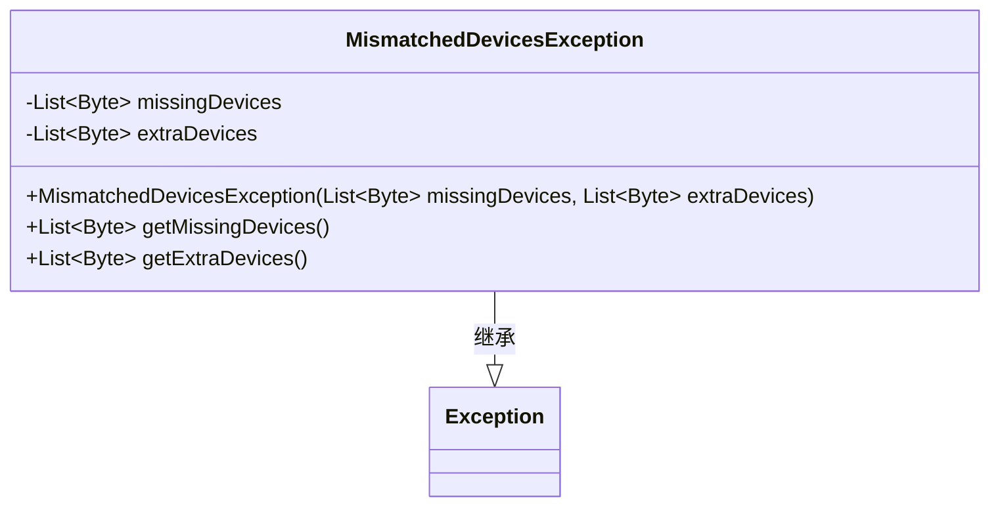
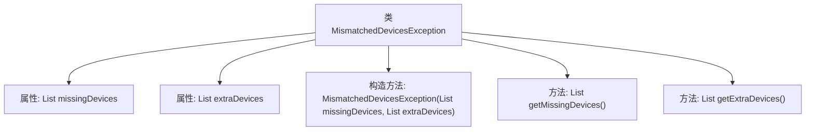

# 基础信息

|      |      |
|------|------|
| 名称 | MismatchedDevicesException |
| 编码语言 | .java |
| 代码路径 | Signal-Server/service/src/main/java/org/whispersystems/textsecuregcm/controllers/MismatchedDevicesException.java |
| 包名 | org.whispersystems.textsecuregcm.controllers |
| 依赖项 | ['java.util.List'] |
| 概述说明 | MismatchedDevicesException类处理设备不匹配异常，记录缺失和额外设备。 |

# 说明

MismatchedDevicesException类专门用于处理设备不匹配的异常情况。该类包含两个关键列表：缺失设备列表和额外设备列表。缺失设备列表记录了系统中缺少的设备，而额外设备列表则记录了系统中多出的设备。通过这两个列表，该类能够全面描述设备不匹配的具体情况，帮助开发人员快速定位和解决问题。

# 类列表 Class Summary

| 名称   | 类型  | 说明 |
|-------|------|-------------|
| MismatchedDevicesException | class | MismatchedDevicesException类用于处理设备不匹配异常，包含缺失和额外设备列表。 |

## 类 MismatchedDevicesException

|      |      |
|------|------|
| 访问范围 | public |
| 类型 | class |
| 名称 | MismatchedDevicesException |
| 说明 | MismatchedDevicesException类用于处理设备不匹配异常，包含缺失和额外设备列表。 |

### UML类图

**描述：**  
`MismatchedDevicesException` 是一个自定义异常类，继承自 `Exception`。它包含两个私有成员变量：`missingDevices` 和 `extraDevices`，分别表示缺失的设备和多余的设备。类中提供了构造函数用于初始化这两个列表，并提供了两个公有方法 `getMissingDevices` 和 `getExtraDevices` 用于获取相应的设备列表。该异常类用于处理设备不匹配的情况。

### 内部方法调用关系图

这段代码定义了一个名为 `MismatchedDevicesException` 的自定义异常类，继承自 `Exception`。该类包含两个私有属性 `missingDevices` 和 `extraDevices`，分别表示缺失的设备和多余的设备。通过构造方法 `MismatchedDevicesException` 初始化这两个属性，并提供了两个公共方法 `getMissingDevices` 和 `getExtraDevices` 来获取这些属性的值。该异常类主要用于处理设备不匹配的情况，便于在程序中捕获和处理此类异常。

### 字段列表 Field List

| 名称  | 类型  | 说明 |
|-------|-------|------|
| missingDevices | List<Byte> | 私有字节列表存储缺失设备信息。 |
| extraDevices | List<Byte> | 私有字节列表存储额外设备信息。 |

### 方法列表 Method List

| 名称  | 类型  | 说明 |
|-------|-------|------|
| getExtraDevices | List<Byte> | 返回额外设备列表的方法。 |
| getMissingDevices | List<Byte> | 获取缺失设备列表的方法。 |

