# 基础信息

|      |      |
|------|------|
| 名称 | OneTimeDonationController |
| 编码语言 | .java |
| 代码路径 | Signal-Server/service/src/main/java/org/whispersystems/textsecuregcm/controllers/OneTimeDonationController.java |
| 包名 | org.whispersystems.textsecuregcm.controllers |
| 依赖项 | ['com.fasterxml.jackson.annotation.JsonInclude', 'com.google.common.net.HttpHeaders', 'io.dropwizard.auth.Auth', 'io.micrometer.core.instrument.Metrics', 'io.micrometer.core.instrument.Tag', 'io.micrometer.core.instrument.Tags', 'io.swagger.v3.oas.annotations.Operation', 'io.swagger.v3.oas.annotations.StringToClassMapItem', 'io.swagger.v3.oas.annotations.media.Content', 'io.swagger.v3.oas.annotations.media.Schema', 'io.swagger.v3.oas.annotations.responses.ApiResponse', 'jakarta.validation.Valid', 'jakarta.validation.constraints.Min', 'jakarta.validation.constraints.NotEmpty', 'jakarta.validation.constraints.NotNull', 'jakarta.ws.rs.BadRequestException', 'jakarta.ws.rs.Consumes', 'jakarta.ws.rs.ForbiddenException', 'jakarta.ws.rs.HeaderParam', 'jakarta.ws.rs.POST', 'jakarta.ws.rs.Path', 'jakarta.ws.rs.Produces', 'jakarta.ws.rs.WebApplicationException', 'jakarta.ws.rs.container.ContainerRequestContext', 'jakarta.ws.rs.core.Context', 'jakarta.ws.rs.core.MediaType', 'jakarta.ws.rs.core.Response', 'java.math.BigDecimal', 'java.time.Clock', 'java.time.Duration', 'java.time.Instant', 'java.time.temporal.ChronoUnit', 'java.util.Locale', 'java.util.Map', 'java.util.Objects', 'java.util.Optional', 'java.util.concurrent.CompletableFuture', 'javax.annotation.Nonnull', 'javax.annotation.Nullable', 'org.signal.libsignal.zkgroup.InvalidInputException', 'org.signal.libsignal.zkgroup.VerificationFailedException', 'org.signal.libsignal.zkgroup.receipts.ReceiptCredentialRequest', 'org.signal.libsignal.zkgroup.receipts.ReceiptCredentialResponse', 'org.signal.libsignal.zkgroup.receipts.ServerZkReceiptOperations', 'org.slf4j.Logger', 'org.slf4j.LoggerFactory', 'org.whispersystems.textsecuregcm.auth.AuthenticatedDevice', 'org.whispersystems.textsecuregcm.configuration.OneTimeDonationConfiguration', 'org.whispersystems.textsecuregcm.metrics.UserAgentTagUtil', 'org.whispersystems.textsecuregcm.storage.IssuedReceiptsManager', 'org.whispersystems.textsecuregcm.storage.OneTimeDonationsManager', 'org.whispersystems.textsecuregcm.subscriptions.BraintreeManager', 'org.whispersystems.textsecuregcm.subscriptions.ChargeFailure', 'org.whispersystems.textsecuregcm.subscriptions.CustomerAwareSubscriptionPaymentProcessor', 'org.whispersystems.textsecuregcm.subscriptions.PaymentDetails', 'org.whispersystems.textsecuregcm.subscriptions.PaymentMethod', 'org.whispersystems.textsecuregcm.subscriptions.PaymentProvider', 'org.whispersystems.textsecuregcm.subscriptions.PaymentStatus', 'org.whispersystems.textsecuregcm.subscriptions.StripeManager', 'org.whispersystems.textsecuregcm.subscriptions.SubscriptionCurrencyUtil', 'org.whispersystems.textsecuregcm.util.ExactlySize', 'org.whispersystems.textsecuregcm.util.HeaderUtils', 'org.whispersystems.textsecuregcm.util.ua.ClientPlatform', 'org.whispersystems.textsecuregcm.util.ua.UnrecognizedUserAgentException', 'org.whispersystems.textsecuregcm.util.ua.UserAgentUtil', 'org.whispersystems.websocket.auth.ReadOnly'] |
| 概述说明 | 控制器处理捐赠，支持Stripe和PayPal，验证货币金额，生成支付凭证。 |

# 说明

该控制器专门用于处理一次性捐赠事务，支持通过Stripe和PayPal两种主流支付平台进行交易。其主要功能包括验证捐赠所使用的货币类型和金额的合法性，确保交易信息的准确性和安全性。此外，控制器还会生成相应的支付凭据，用于记录和确认每笔捐赠的详细信息，以便后续查询和管理。整个流程设计简洁高效，旨在为用户提供便捷可靠的捐赠体验。

# 类列表 Class Summary

| 名称   | 类型  | 说明 |
|-------|------|-------------|
| OneTimeDonationController | class | 处理一次性捐赠的控制器，支持Stripe和PayPal支付，验证货币和金额，生成支付凭据。 |

## 类 OneTimeDonationController

|      |      |
|------|------|
| 访问范围 | @Path("/v1/subscription/boost");@io.swagger.v3.oas.annotations.tags.Tag(name = "OneTimeDonations");public |
| 类型 | class |
| 名称 | OneTimeDonationController |
| 说明 | 处理一次性捐赠的控制器，支持Stripe和PayPal支付，验证货币和金额，生成支付凭据。 |

### UML类图

```mermaid
classDiagram
    class OneTimeDonationController {
        -Logger logger
        -String EURO_CURRENCY_CODE
        -Clock clock
        -OneTimeDonationConfiguration oneTimeDonationConfiguration
        -StripeManager stripeManager
        -BraintreeManager braintreeManager
        -ServerZkReceiptOperations zkReceiptOperations
        -IssuedReceiptsManager issuedReceiptsManager
        -OneTimeDonationsManager oneTimeDonationsManager
        +OneTimeDonationController(Clock clock, OneTimeDonationConfiguration oneTimeDonationConfiguration, StripeManager stripeManager, BraintreeManager braintreeManager, ServerZkReceiptOperations zkReceiptOperations, IssuedReceiptsManager issuedReceiptsManager, OneTimeDonationsManager oneTimeDonationsManager)
        +CompletableFuture~Response~ createBoostPaymentIntent(Optional~AuthenticatedDevice~ authenticatedAccount, CreateBoostRequest request, String userAgent)
        -void validateRequestCurrencyAmount(CreateBoostRequest request, BigDecimal amount, CustomerAwareSubscriptionPaymentProcessor manager)
        +CompletableFuture~Response~ createPayPalBoost(Optional~AuthenticatedDevice~ authenticatedAccount, CreatePayPalBoostRequest request, String userAgent, ContainerRequestContext containerRequestContext)
        +CompletableFuture~Response~ confirmPayPalBoost(Optional~AuthenticatedDevice~ authenticatedAccount, ConfirmPayPalBoostRequest request, String userAgent)
        +CompletableFuture~Response~ createBoostReceiptCredentials(Optional~AuthenticatedDevice~ authenticatedAccount, CreateBoostReceiptCredentialsRequest request, String userAgent)
        -ClientPlatform getClientPlatform(String userAgentString)
    }

    class CreateBoostRequest {
        +String currency
        +long amount
        +Long level
        +PaymentMethod paymentMethod
    }

    class CreateBoostResponse {
        +String clientSecret
    }

    class CreatePayPalBoostRequest {
        +String returnUrl
        +String cancelUrl
    }

    class CreatePayPalBoostResponse {
        +String approvalUrl
        +String paymentId
    }

    class ConfirmPayPalBoostRequest {
        +String payerId
        +String paymentId
        +String paymentToken
    }

    class ConfirmPayPalBoostResponse {
        +String paymentId
    }

    class CreateBoostReceiptCredentialsRequest {
        +String paymentIntentId
        +byte[] receiptCredentialRequest
        +PaymentProvider processor
    }

    class CreateBoostReceiptCredentialsSuccessResponse {
        +byte[] receiptCredentialResponse
    }

    class CreateBoostReceiptCredentialsErrorResponse {
        +ChargeFailure chargeFailure
    }

    OneTimeDonationController --> CreateBoostRequest : 使用
    OneTimeDonationController --> CreateBoostResponse : 返回
    OneTimeDonationController --> CreatePayPalBoostRequest : 使用
    OneTimeDonationController --> CreatePayPalBoostResponse : 返回
    OneTimeDonationController --> ConfirmPayPalBoostRequest : 使用
    OneTimeDonationController --> ConfirmPayPalBoostResponse : 返回
    OneTimeDonationController --> CreateBoostReceiptCredentialsRequest : 使用
    OneTimeDonationController --> CreateBoostReceiptCredentialsSuccessResponse : 返回
    OneTimeDonationController --> CreateBoostReceiptCredentialsErrorResponse : 返回
```

这段代码定义了一个名为 `OneTimeDonationController` 的控制器类，用于处理一次性捐赠相关的操作。该类依赖于多个管理器和服务类，如 `StripeManager`、`BraintreeManager` 等，来处理支付、收据生成等逻辑。控制器提供了多个方法，如 `createBoostPaymentIntent`、`createPayPalBoost` 等，用于创建支付意图、处理 PayPal 支付、确认支付以及生成收据凭证。每个方法都通过不同的请求和响应类来处理输入和输出。整体设计旨在提供一次性捐赠的完整流程，并确保支付和收据生成的安全性和准确性。

### 内部方法调用关系图

```mermaid
graph TD
    A["类OneTimeDonationController"]
    B["属性: Logger logger"]
    C["属性: String EURO_CURRENCY_CODE"]
    D["属性: Clock clock"]
    E["属性: OneTimeDonationConfiguration oneTimeDonationConfiguration"]
    F["属性: StripeManager stripeManager"]
    G["属性: BraintreeManager braintreeManager"]
    H["属性: ServerZkReceiptOperations zkReceiptOperations"]
    I["属性: IssuedReceiptsManager issuedReceiptsManager"]
    J["属性: OneTimeDonationsManager oneTimeDonationsManager"]
    K["构造方法: OneTimeDonationController"]
    L["内部类: CreateBoostRequest"]
    M["内部类: CreateBoostResponse"]
    N["方法: createBoostPaymentIntent"]
    O["方法: validateRequestCurrencyAmount"]
    P["内部类: CreatePayPalBoostRequest"]
    Q["内部类: CreatePayPalBoostResponse"]
    R["方法: createPayPalBoost"]
    S["内部类: ConfirmPayPalBoostRequest"]
    T["内部类: ConfirmPayPalBoostResponse"]
    U["方法: confirmPayPalBoost"]
    V["内部类: CreateBoostReceiptCredentialsRequest"]
    W["内部类: CreateBoostReceiptCredentialsSuccessResponse"]
    X["内部类: CreateBoostReceiptCredentialsErrorResponse"]
    Y["方法: createBoostReceiptCredentials"]
    Z["方法: getClientPlatform"]

    A --> B
    A --> C
    A --> D
    A --> E
    A --> F
    A --> G
    A --> H
    A --> I
    A --> J
    A --> K
    A --> L
    A --> M
    A --> N
    A --> O
    A --> P
    A --> Q
    A --> R
    A --> S
    A --> T
    A --> U
    A --> V
    A --> W
    A --> X
    A --> Y
    A --> Z
```

这段代码定义了一个名为 `OneTimeDonationController` 的类，用于处理一次性捐赠的相关操作。类中包含多个内部类和属性，用于管理不同的支付方式和捐赠流程。主要方法包括创建支付意图、验证请求金额、处理 PayPal 支付请求以及生成收据凭证等。每个方法都通过 `CompletableFuture` 实现异步操作，确保在处理支付请求时不会阻塞主线程。

### 字段列表 Field List

| 名称  | 类型  | 说明 |
|-------|-------|------|
| clock | Clock | 类中定义了一个私有的Clock类型变量clock。 |
| stripeManager | StripeManager | 私有StripeManager实例。 |
| oneTimeDonationsManager | OneTimeDonationsManager | 私有且不可变的单次捐赠管理器实例。 |
| EURO_CURRENCY_CODE = "EUR" | String | 定义私有静态常量EURO_CURRENCY_CODE，值为"EUR"。 |
| logger = LoggerFactory.getLogger(OneTimeDonationController.class) | Logger | 定义OneTimeDonationController类的私有静态日志记录器。 |
| braintreeManager | BraintreeManager | 私有不可变的Braintree管理器实例。 |
| oneTimeDonationConfiguration | OneTimeDonationConfiguration | 私有且不可变的一次性捐赠配置对象。 |
| issuedReceiptsManager | IssuedReceiptsManager | 私有且不可变的已发行收据管理器实例。 |
| zkReceiptOperations | ServerZkReceiptOperations | 私有变量zkReceiptOperations用于服务器ZKP收据操作。 |

### 方法列表 Method List

| 名称  | 类型  | 说明 |
|-------|-------|------|
| getClientPlatform | ClientPlatform | 解析用户代理字符串获取客户端平台，失败返回空值。 |
| validateRequestCurrencyAmount | void | 验证请求金额是否支持货币、满足最低金额及SEPA限额。 |
| createPayPalBoost | CompletableFuture<Response> | 创建PayPal支付接口，验证请求并处理一次性捐赠操作。 |
| confirmPayPalBoost | CompletableFuture<Response> | 确认PayPal支付的API，处理一次性捐赠请求，验证用户身份并完成支付。 |
| createBoostPaymentIntent | CompletableFuture<Response> | 创建Stripe支付意图，返回客户端密钥，处理支付完成。支持错误处理和金额验证。 |
| createBoostReceiptCredentials | CompletableFuture<Response> | 处理一次性捐赠收据凭证请求，验证支付状态并生成凭证。 |

