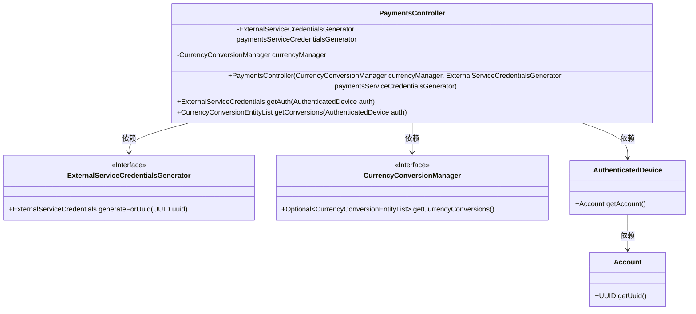

# 基础信息

|      |      |
|------|------|
| 名称 | PaymentsController |
| 编码语言 | .java |
| 代码路径 | Signal-Server/service/src/main/java/org/whispersystems/textsecuregcm/controllers/PaymentsController.java |
| 包名 | org.whispersystems.textsecuregcm.controllers |
| 依赖项 | ['io.dropwizard.auth.Auth', 'io.swagger.v3.oas.annotations.tags.Tag', 'jakarta.ws.rs.GET', 'jakarta.ws.rs.Path', 'jakarta.ws.rs.Produces', 'jakarta.ws.rs.core.MediaType', 'org.whispersystems.textsecuregcm.auth.AuthenticatedDevice', 'org.whispersystems.textsecuregcm.auth.ExternalServiceCredentials', 'org.whispersystems.textsecuregcm.auth.ExternalServiceCredentialsGenerator', 'org.whispersystems.textsecuregcm.configuration.PaymentsServiceConfiguration', 'org.whispersystems.textsecuregcm.currency.CurrencyConversionManager', 'org.whispersystems.textsecuregcm.entities.CurrencyConversionEntityList', 'org.whispersystems.websocket.auth.ReadOnly'] |
| 概述说明 | 支付控制器负责认证和货币转换，依赖外部服务及凭证生成器。 |

# 说明

支付控制器负责处理用户认证和货币转换功能，其实现依赖于外部服务和凭证生成器。认证功能确保用户身份合法，货币转换功能则处理不同币种之间的兑换。外部服务提供必要的支持，如汇率数据和支付网关，而凭证生成器则用于生成交易凭证，确保每笔交易的安全性和可追溯性。整体设计旨在确保支付过程的准确性和安全性。

# 类列表 Class Summary

| 名称   | 类型  | 说明 |
|-------|------|-------------|
| PaymentsController | class | 支付控制器处理认证和货币转换，依赖外部服务和凭证生成器。 |

## 类 PaymentsController

|      |      |
|------|------|
| 访问范围 | @Path("/v1/payments");@Tag(name = "Payments");public |
| 类型 | class |
| 名称 | PaymentsController |
| 说明 | 支付控制器处理认证和货币转换，依赖外部服务和凭证生成器。 |

### UML类图

这段代码定义了一个名为 `PaymentsController` 的类，它是一个REST控制器，负责处理与支付相关的请求。该类依赖于 `ExternalServiceCredentialsGenerator` 和 `CurrencyConversionManager` 两个接口，分别用于生成认证凭证和管理货币转换。`PaymentsController` 提供了两个GET方法：`getAuth` 用于获取认证凭证，`getConversions` 用于获取货币转换列表。`AuthenticatedDevice` 和 `Account` 类用于处理认证相关的信息。

### 内部方法调用关系图

这段代码定义了一个名为`PaymentsController`的类，主要用于处理支付相关的请求。类中包含两个属性：`paymentsServiceCredentialsGenerator`和`currencyManager`，分别用于生成外部服务凭证和管理货币转换。类中还包含一个静态方法`credentialsGenerator`用于生成凭证生成器，以及两个GET请求处理方法`getAuth`和`getConversions`，分别用于获取认证信息和货币转换信息。流程图展示了类内部各方法之间的调用关系。

### 字段列表 Field List

| 名称  | 类型  | 说明 |
|-------|-------|------|
| currencyManager | CurrencyConversionManager | 私有且不可变的货币转换管理器实例。 |
| paymentsServiceCredentialsGenerator | ExternalServiceCredentialsGenerator | 支付服务凭证生成器为私有且不可变的。 |

### 方法列表 Method List

| 名称  | 类型  | 说明 |
|-------|-------|------|
| getAuth | ExternalServiceCredentials | 获取认证设备的外部服务凭证。 |
| getConversions | CurrencyConversionEntityList | 通过认证设备获取货币转换列表并返回JSON格式数据。 |
| credentialsGenerator | ExternalServiceCredentialsGenerator | 静态方法生成外部服务凭证生成器，使用配置中的共享密钥并预置用户名。 |

