# 基础信息

|      |      |
|------|------|
| 名称 | ProfileController |
| 编码语言 | .java |
| 代码路径 | Signal-Server/service/src/main/java/org/whispersystems/textsecuregcm/controllers/ProfileController.java |
| 包名 | org.whispersystems.textsecuregcm.controllers |
| 依赖项 | ['org.whispersystems.textsecuregcm.metrics.MetricsUtil.name', 'com.google.common.base.Preconditions', 'io.dropwizard.auth.Auth', 'io.micrometer.core.instrument.Metrics', 'io.micrometer.core.instrument.Tags', 'io.swagger.v3.oas.annotations.tags.Tag', 'jakarta.validation.Valid', 'jakarta.validation.constraints.NotNull', 'jakarta.ws.rs.BadRequestException', 'jakarta.ws.rs.Consumes', 'jakarta.ws.rs.GET', 'jakarta.ws.rs.HeaderParam', 'jakarta.ws.rs.NotAuthorizedException', 'jakarta.ws.rs.NotFoundException', 'jakarta.ws.rs.POST', 'jakarta.ws.rs.PUT', 'jakarta.ws.rs.Path', 'jakarta.ws.rs.PathParam', 'jakarta.ws.rs.Produces', 'jakarta.ws.rs.QueryParam', 'jakarta.ws.rs.container.ContainerRequestContext', 'jakarta.ws.rs.core.Context', 'jakarta.ws.rs.core.HttpHeaders', 'jakarta.ws.rs.core.MediaType', 'jakarta.ws.rs.core.Response', 'java.security.MessageDigest', 'java.security.NoSuchAlgorithmException', 'java.time.Clock', 'java.time.ZonedDateTime', 'java.util.ArrayList', 'java.util.Arrays', 'java.util.Collection', 'java.util.Collections', 'java.util.HexFormat', 'java.util.List', 'java.util.Map', 'java.util.Optional', 'java.util.concurrent.CompletableFuture', 'java.util.concurrent.Executor', 'java.util.function.Function', 'java.util.stream.Collectors', 'org.glassfish.jersey.server.ManagedAsync', 'org.signal.libsignal.protocol.IdentityKey', 'org.signal.libsignal.protocol.ServiceId', 'org.signal.libsignal.zkgroup.InvalidInputException', 'org.signal.libsignal.zkgroup.ServerSecretParams', 'org.signal.libsignal.zkgroup.VerificationFailedException', 'org.signal.libsignal.zkgroup.groupsend.GroupSendDerivedKeyPair', 'org.signal.libsignal.zkgroup.groupsend.GroupSendFullToken', 'org.signal.libsignal.zkgroup.profiles.ExpiringProfileKeyCredentialResponse', 'org.signal.libsignal.zkgroup.profiles.ServerZkProfileOperations', 'org.whispersystems.textsecuregcm.auth.Anonymous', 'org.whispersystems.textsecuregcm.auth.AuthenticatedDevice', 'org.whispersystems.textsecuregcm.auth.GroupSendTokenHeader', 'org.whispersystems.textsecuregcm.auth.OptionalAccess', 'org.whispersystems.textsecuregcm.auth.UnidentifiedAccessChecksum', 'org.whispersystems.textsecuregcm.badges.ProfileBadgeConverter', 'org.whispersystems.textsecuregcm.configuration.BadgeConfiguration', 'org.whispersystems.textsecuregcm.configuration.BadgesConfiguration', 'org.whispersystems.textsecuregcm.configuration.dynamic.DynamicConfiguration', 'org.whispersystems.textsecuregcm.entities.BaseProfileResponse', 'org.whispersystems.textsecuregcm.entities.BatchIdentityCheckRequest', 'org.whispersystems.textsecuregcm.entities.BatchIdentityCheckResponse', 'org.whispersystems.textsecuregcm.entities.CreateProfileRequest', 'org.whispersystems.textsecuregcm.entities.CredentialProfileResponse', 'org.whispersystems.textsecuregcm.entities.ExpiringProfileKeyCredentialProfileResponse', 'org.whispersystems.textsecuregcm.entities.ProfileAvatarUploadAttributes', 'org.whispersystems.textsecuregcm.entities.VersionedProfileResponse', 'org.whispersystems.textsecuregcm.identity.AciServiceIdentifier', 'org.whispersystems.textsecuregcm.identity.IdentityType', 'org.whispersystems.textsecuregcm.identity.PniServiceIdentifier', 'org.whispersystems.textsecuregcm.identity.ServiceIdentifier', 'org.whispersystems.textsecuregcm.limits.RateLimiters', 'org.whispersystems.textsecuregcm.metrics.UserAgentTagUtil', 'org.whispersystems.textsecuregcm.s3.PolicySigner', 'org.whispersystems.textsecuregcm.s3.PostPolicyGenerator', 'org.whispersystems.textsecuregcm.storage.Account', 'org.whispersystems.textsecuregcm.storage.AccountBadge', 'org.whispersystems.textsecuregcm.storage.AccountsManager', 'org.whispersystems.textsecuregcm.storage.DeviceCapability', 'org.whispersystems.textsecuregcm.storage.DynamicConfigurationManager', 'org.whispersystems.textsecuregcm.storage.ProfilesManager', 'org.whispersystems.textsecuregcm.storage.VersionedProfile', 'org.whispersystems.textsecuregcm.util.HeaderUtils', 'org.whispersystems.textsecuregcm.util.Pair', 'org.whispersystems.textsecuregcm.util.ProfileHelper', 'org.whispersystems.textsecuregcm.util.Util', 'org.whispersystems.websocket.auth.Mutable', 'org.whispersystems.websocket.auth.ReadOnly', 'software.amazon.awssdk.services.s3.S3Client', 'software.amazon.awssdk.services.s3.model.DeleteObjectRequest'] |
| 概述说明 | ProfileController类负责用户配置文件的设置、获取、验证及头像上传等操作。 |

# 说明

ProfileController类负责管理用户配置文件的相关操作，涵盖配置文件的设置、获取和验证功能。此外，该类还处理用户头像的上传、徽章的管理以及用户身份的检查。通过这些功能，ProfileController确保用户配置文件信息的完整性和准确性，同时支持用户个性化设置和身份验证需求。

# 类列表 Class Summary

| 名称   | 类型  | 说明 |
|-------|------|-------------|
| ProfileController | class | ProfileController类管理用户配置文件操作，包括设置、获取和验证配置文件，处理头像上传、徽章管理和身份检查。 |


## 类 ProfileController

|      |      |
|------|------|
| 访问范围 | @SuppressWarnings("OptionalUsedAsFieldOrParameterType");@Path("/v1/profile");@Tag(name = "Profile");public |
| 类型 | class |
| 名称 | ProfileController |
| 说明 | ProfileController类管理用户配置文件操作，包括设置、获取和验证配置文件，处理头像上传、徽章管理和身份检查。 |


### UML类图

```mermaid
classDiagram
    class ProfileController {
        -Clock clock
        -RateLimiters rateLimiters
        -ProfilesManager profilesManager
        -AccountsManager accountsManager
        -DynamicConfigurationManager~DynamicConfiguration~ dynamicConfigurationManager
        -ProfileBadgeConverter profileBadgeConverter
        -Map~String, BadgeConfiguration~ badgeConfigurationMap
        -PolicySigner policySigner
        -PostPolicyGenerator policyGenerator
        -ServerSecretParams serverSecretParams
        -ServerZkProfileOperations zkProfileOperations
        -S3Client s3client
        -String bucket
        -Executor batchIdentityCheckExecutor
        -static String EXPIRING_PROFILE_KEY_CREDENTIAL_TYPE
        -static String VERSION_NOT_FOUND_COUNTER_NAME
        +ProfileController(Clock, RateLimiters, AccountsManager, ProfilesManager, DynamicConfigurationManager~DynamicConfiguration~, ProfileBadgeConverter, BadgesConfiguration, S3Client, PostPolicyGenerator, PolicySigner, String, ServerSecretParams, ServerZkProfileOperations, Executor)
        +Response setProfile(AuthenticatedDevice, CreateProfileRequest)
        +VersionedProfileResponse getProfile(Optional~AuthenticatedDevice~, Optional~Anonymous~, ContainerRequestContext, AciServiceIdentifier, String)
        +CredentialProfileResponse getProfile(Optional~AuthenticatedDevice~, Optional~Anonymous~, ContainerRequestContext, AciServiceIdentifier, String, String, String)
        +BaseProfileResponse getUnversionedProfile(Optional~AuthenticatedDevice~, Optional~Anonymous~, Optional~GroupSendTokenHeader~, ContainerRequestContext, String, ServiceIdentifier, boolean)
        +CompletableFuture~BatchIdentityCheckResponse~ runBatchIdentityCheck(BatchIdentityCheckRequest)
        -void checkFingerprintAndAdd(BatchIdentityCheckRequest.Element, Collection~BatchIdentityCheckResponse.Element~, MessageDigest)
        -ExpiringProfileKeyCredentialProfileResponse buildExpiringProfileKeyCredentialProfileResponse(Account, String, String, boolean, ContainerRequestContext)
        -VersionedProfileResponse buildVersionedProfileResponse(Account, String, boolean, boolean, ContainerRequestContext)
        -BaseProfileResponse buildBaseProfileResponseForAccountIdentity(Account, boolean, ContainerRequestContext)
        -BaseProfileResponse buildBaseProfileResponseForPhoneNumberIdentity(Account)
        -Account verifyPermissionToReceiveProfile(Optional~Account~, Optional~Anonymous~, ServiceIdentifier)
        -ProfileAvatarUploadAttributes generateAvatarUploadForm(String)
        -static Map~String, Boolean~ getAccountCapabilities(Account)
    }

    class <<Interface>> ProfilesManager {
        +Optional~VersionedProfile~ get(UUID, String)
        +void set(UUID, VersionedProfile)
    }

    class <<Interface>> AccountsManager {
        +Optional~Account~ getByServiceIdentifier(ServiceIdentifier)
        +void update(Account, Consumer~Account~)
    }

    class <<Interface>> DynamicConfigurationManager~T~ {
        +T getConfiguration()
    }

    class <<Interface>> ProfileBadgeConverter {
        +List~ProfileBadge~ convert(List~Locale~, List~AccountBadge~, boolean)
    }

    class <<Interface>> RateLimiters {
        +RateLimiter getProfileLimiter()
    }

    class <<Interface>> S3Client {
        +void deleteObject(DeleteObjectRequest)
    }

    class <<Interface>> PostPolicyGenerator {
        +Pair~String, String~ createFor(ZonedDateTime, String, long)
    }

    class <<Interface>> PolicySigner {
        +String getSignature(ZonedDateTime, String)
    }

    class <<Interface>> ServerZkProfileOperations {
        +ExpiringProfileKeyCredentialResponse getExpiringProfileKeyCredential(byte[], VersionedProfile, ServiceId.Aci, ServerZkProfileOperations)
    }

    class <<Interface>> Executor {
        +void execute(Runnable)
    }

    class <<Interface>> MessageDigest {
        +void reset()
        +byte[] digest(byte[])
    }

    ProfileController --> ProfilesManager : 依赖
    ProfileController --> AccountsManager : 依赖
    ProfileController --> DynamicConfigurationManager~DynamicConfiguration~ : 依赖
    ProfileController --> ProfileBadgeConverter : 依赖
    ProfileController --> RateLimiters : 依赖
    ProfileController --> S3Client : 依赖
    ProfileController --> PostPolicyGenerator : 依赖
    ProfileController --> PolicySigner : 依赖
    ProfileController --> ServerZkProfileOperations : 依赖
    ProfileController --> Executor : 依赖
    ProfileController --> MessageDigest : 依赖
```

### 描述
`ProfileController` 是一个处理用户档案相关请求的控制器类，依赖于多个管理器和服务接口，如 `ProfilesManager`、`AccountsManager`、`DynamicConfigurationManager` 等。它提供了设置和获取用户档案的功能，包括处理头像上传、身份验证、权限检查等。通过 `S3Client` 处理头像存储，`RateLimiters` 控制请求频率，`ServerZkProfileOperations` 处理加密操作。该类还包含批量身份检查的功能，使用 `Executor` 并发处理请求。


### 内部方法调用关系图

```mermaid
graph TD
    A["类ProfileController"]
    B["属性: Clock clock"]
    C["属性: RateLimiters rateLimiters"]
    D["属性: ProfilesManager profilesManager"]
    E["属性: AccountsManager accountsManager"]
    F["属性: DynamicConfigurationManager<DynamicConfiguration> dynamicConfigurationManager"]
    G["属性: ProfileBadgeConverter profileBadgeConverter"]
    H["属性: Map<String, BadgeConfiguration> badgeConfigurationMap"]
    I["属性: PolicySigner policySigner"]
    J["属性: PostPolicyGenerator policyGenerator"]
    K["属性: ServerSecretParams serverSecretParams"]
    L["属性: ServerZkProfileOperations zkProfileOperations"]
    M["属性: S3Client s3client"]
    N["属性: String bucket"]
    O["属性: Executor batchIdentityCheckExecutor"]
    P["构造方法: ProfileController(...)"]
    Q["方法: Response setProfile(...)"]
    R["方法: VersionedProfileResponse getProfile(...)"]
    S["方法: CredentialProfileResponse getProfile(...)"]
    T["方法: BaseProfileResponse getUnversionedProfile(...)"]
    U["方法: CompletableFuture<BatchIdentityCheckResponse> runBatchIdentityCheck(...)"]
    V["方法: void checkFingerprintAndAdd(...)"]
    W["方法: ExpiringProfileKeyCredentialProfileResponse buildExpiringProfileKeyCredentialProfileResponse(...)"]
    X["方法: VersionedProfileResponse buildVersionedProfileResponse(...)"]
    Y["方法: BaseProfileResponse buildBaseProfileResponseForAccountIdentity(...)"]
    Z["方法: BaseProfileResponse buildBaseProfileResponseForPhoneNumberIdentity(...)"]
    AA["方法: Account verifyPermissionToReceiveProfile(...)"]
    AB["方法: ProfileAvatarUploadAttributes generateAvatarUploadForm(...)"]
    AC["方法: Map<String, Boolean> getAccountCapabilities(...)"]

    A --> B
    A --> C
    A --> D
    A --> E
    A --> F
    A --> G
    A --> H
    A --> I
    A --> J
    A --> K
    A --> L
    A --> M
    A --> N
    A --> O
    A --> P
    A --> Q
    A --> R
    A --> S
    A --> T
    A --> U
    A --> V
    A --> W
    A --> X
    A --> Y
    A --> Z
    A --> AA
    A --> AB
    A --> AC
```



该流程图展示了`ProfileController`类的结构，包括其属性和方法。`ProfileController`类负责处理与用户档案相关的各种操作，如设置档案、获取档案、验证权限、生成头像上传表单等。每个方法都有其特定的功能，并通过属性与其他方法进行交互，确保档案管理的完整性和安全性。

### 字段列表 Field List

| 名称  | 类型  | 说明 |
|-------|-------|------|
| clock | Clock | 私有且不可变的时钟对象。 |
| serverSecretParams | ServerSecretParams | 私有且不可变的服务器密钥参数对象。 |
| profileBadgeConverter | ProfileBadgeConverter | 私有且不可变的ProfileBadgeConverter实例。 |
| rateLimiters | RateLimiters | 私有且不可变的速率限制器实例。 |
| profilesManager | ProfilesManager | 私有且不可变的ProfilesManager实例。 |
| accountsManager | AccountsManager | 私有且不可变的账户管理器实例。 |
| bucket | String | 私有字符串变量bucket声明为final。 |
| policySigner | PolicySigner | 私有最终类型的PolicySigner对象policySigner。 |
| VERSION_NOT_FOUND_COUNTER_NAME = name(ProfileController.class, "versionNotFound") | String | ProfileController类中定义版本未找到计数器名称。 |
| s3client | S3Client | 私有且不可变的S3客户端实例。 |
| EXPIRING_PROFILE_KEY_CREDENTIAL_TYPE = "expiringProfileKey" | String | 定义私有静态常量，表示过期配置文件密钥的凭证类型。 |
| dynamicConfigurationManager | DynamicConfigurationManager<DynamicConfiguration> | 私有动态配置管理器实例用于管理动态配置。 |
| policyGenerator | PostPolicyGenerator | 私有且不可变的PostPolicyGenerator实例变量。 |
| zkProfileOperations | ServerZkProfileOperations | 私有终态的ServerZkProfileOperations对象zkProfileOperations。 |
| badgeConfigurationMap | Map<String, BadgeConfiguration> | 私有最终映射存储徽章配置，键为字符串，值为徽章配置对象。 |
| batchIdentityCheckExecutor | Executor | 私有线程池用于批量身份验证。 |

### 方法列表 Method List

| 名称  | 类型  | 说明 |
|-------|-------|------|
| getProfile | VersionedProfileResponse | 通过路径获取指定版本的用户档案，验证权限后返回响应。 |
| verifyPermissionToReceiveProfile | Account | 验证接收配置文件的权限，检查请求者和访问密钥，返回目标账户。 |
| getAccountCapabilities | Map<String, Boolean> | 获取账户设备能力映射，过滤并收集包含在配置文件中的能力。 |
| checkFingerprintAndAdd | void | 检查指纹并添加响应元素，若指纹不匹配则更新响应集合。 |
| getUnversionedProfile | BaseProfileResponse | 获取未版本化配置文件，验证权限并返回响应。 |
| getProfile | CredentialProfileResponse | GET请求获取凭证配置文件，验证权限并构建响应。 |
| buildBaseProfileResponseForPhoneNumberIdentity | BaseProfileResponse | 构建基于电话号码身份的基本资料响应，包含身份密钥、账户能力和PNI服务标识符。 |
| setProfile | Response | 处理用户资料更新，包括头像、支付地址和徽章，验证权限并返回响应。 |
| generateAvatarUploadForm | ProfileAvatarUploadAttributes | 生成头像上传表单，包含对象名、策略、签名和时间戳。 |
| buildVersionedProfileResponse | VersionedProfileResponse | 构建版本化个人资料响应，包含名称、简介、表情、头像、支付地址和电话号码共享信息。 |
| buildBaseProfileResponseForAccountIdentity | BaseProfileResponse | 构建账户身份的基本配置文件响应，包含身份密钥、访问权限、账户能力和徽章信息。 |
| runBatchIdentityCheck | CompletableFuture<BatchIdentityCheckResponse> | 该方法异步批量处理身份检查请求，分批计算指纹并返回响应。 |
| buildExpiringProfileKeyCredentialProfileResponse | ExpiringProfileKeyCredentialProfileResponse | 构建过期配置文件凭证响应，处理账户、版本、凭证请求等参数，返回响应对象。 |


