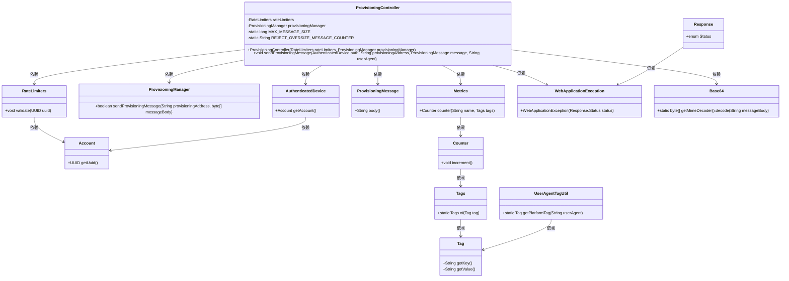
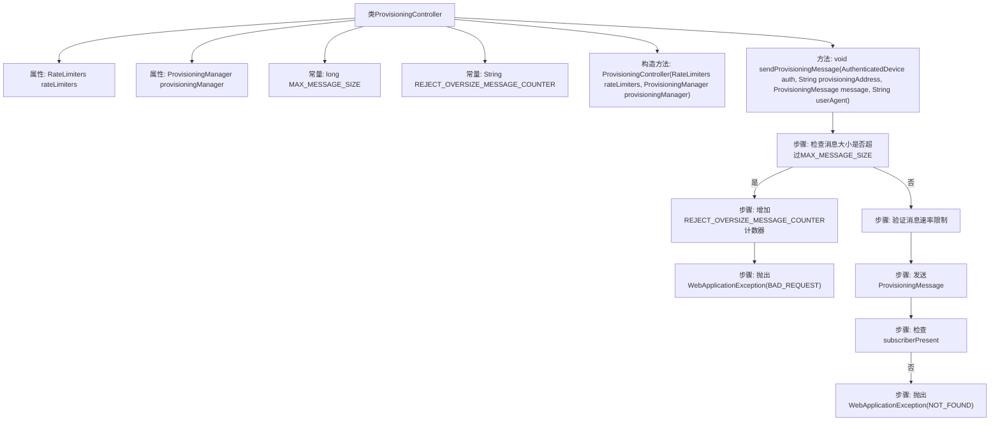

# 基础信息

|      |      |
|------|------|
| 名称 | ProvisioningController |
| 编码语言 | .java |
| 代码路径 | Signal-Server/service/src/main/java/org/whispersystems/textsecuregcm/controllers/ProvisioningController.java |
| 包名 | org.whispersystems.textsecuregcm.controllers |
| 依赖项 | ['com.codahale.metrics.MetricRegistry.name', 'com.google.common.annotations.VisibleForTesting', 'com.google.common.net.HttpHeaders', 'io.dropwizard.auth.Auth', 'io.dropwizard.util.DataSize', 'io.micrometer.core.instrument.Metrics', 'io.micrometer.core.instrument.Tags', 'io.swagger.v3.oas.annotations.Operation', 'io.swagger.v3.oas.annotations.Parameter', 'io.swagger.v3.oas.annotations.responses.ApiResponse', 'io.swagger.v3.oas.annotations.tags.Tag', 'jakarta.validation.Valid', 'jakarta.validation.constraints.NotNull', 'jakarta.ws.rs.Consumes', 'jakarta.ws.rs.HeaderParam', 'jakarta.ws.rs.PUT', 'jakarta.ws.rs.Path', 'jakarta.ws.rs.PathParam', 'jakarta.ws.rs.Produces', 'jakarta.ws.rs.WebApplicationException', 'jakarta.ws.rs.core.MediaType', 'jakarta.ws.rs.core.Response', 'java.util.Base64', 'org.whispersystems.textsecuregcm.auth.AuthenticatedDevice', 'org.whispersystems.textsecuregcm.entities.ProvisioningMessage', 'org.whispersystems.textsecuregcm.limits.RateLimiters', 'org.whispersystems.textsecuregcm.metrics.UserAgentTagUtil', 'org.whispersystems.textsecuregcm.push.ProvisioningManager', 'org.whispersystems.websocket.auth.ReadOnly'] |
| 概述说明 | ProvisioningController验证设备配置消息大小与速率限制，发送消息并返回状态码。 |

# 说明

ProvisioningController负责处理设备配置消息，首先验证消息的大小和速率是否符合限制要求，然后发送消息并返回相应的状态码，确保配置过程的准确性和安全性。

# 类列表 Class Summary

| 名称   | 类型  | 说明 |
|-------|------|-------------|
| ProvisioningController | class | ProvisioningController处理设备配置消息，验证消息大小和速率限制，发送消息并返回状态码。 |

## 类 ProvisioningController

|      |      |
|------|------|
| 访问范围 | @Path("/v1/provisioning");@Tag(name = "Provisioning");public |
| 类型 | class |
| 名称 | ProvisioningController |
| 说明 | ProvisioningController处理设备配置消息，验证消息大小和速率限制，发送消息并返回状态码。 |

### UML类图

### 描述
`ProvisioningController` 是一个处理设备配置消息的控制器类，依赖 `RateLimiters` 和 `ProvisioningManager` 来执行限流和消息发送操作。它通过 `sendProvisioningMessage` 方法接收并验证消息，若消息过大或设备不存在，则抛出相应的异常。`Metrics` 用于记录拒绝的消息数量，`Base64` 用于解码消息体。整个流程涉及多个类的协作，确保消息的安全传输和处理。

### 内部方法调用关系图

这段代码定义了一个`ProvisioningController`类，用于处理设备配置消息的发送。代码首先检查消息大小是否超过预设的最大值，如果超过则增加计数器并抛出异常。接着验证消息速率限制，然后发送配置消息。如果目标设备未连接，则抛出未找到异常。流程图展示了这些步骤的逻辑顺序和条件判断。

### 字段列表 Field List

| 名称  | 类型  | 说明 |
|-------|-------|------|
| provisioningManager | ProvisioningManager | 私有且不可变的ProvisioningManager实例。 |
| rateLimiters | RateLimiters | 私有且不可变的限流器实例。 |
| REJECT_OVERSIZE_MESSAGE_COUNTER =      name(ProvisioningController.class, "rejectOversizeMessage") | String | ProvisioningController类中定义拒绝超限消息的静态常量。 |
| MAX_MESSAGE_SIZE = DataSize.kibibytes(256).toBytes() | long | 测试可见的私有常量MAX_MESSAGE_SIZE，值为256KiB。 |

### 方法列表 Method List

| 名称  | 类型  | 说明 |
|-------|-------|------|
| sendProvisioningMessage | void | 发送配置消息至新设备，处理204、400、404响应。 |

