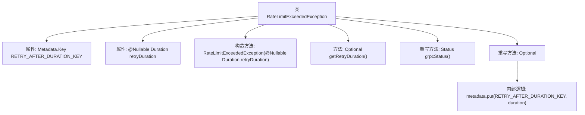

# 基础信息

|      |      |
|------|------|
| 名称 | RateLimitExceededException |
| 编码语言 | .java |
| 代码路径 | Signal-Server/service/src/main/java/org/whispersystems/textsecuregcm/controllers/RateLimitExceededException.java |
| 包名 | org.whispersystems.textsecuregcm.controllers |
| 依赖项 | ['io.grpc.Metadata', 'io.grpc.Status', 'java.time.Duration', 'java.util.Optional', 'javax.annotation.Nullable', 'org.whispersystems.textsecuregcm.grpc.ConvertibleToGrpcStatus'] |
| 概述说明 | RateLimitExceededException处理限流异常，支持重试和gRPC状态转换。 |

# 说明

RateLimitExceededException类用于处理限流异常，主要功能包括提供重试时长和进行gRPC状态转换。该类确保在系统达到限流阈值时，能够通过设定合理的重试时间来控制请求频率，并将异常状态转换为gRPC标准状态，以便于后续处理。

# 类列表 Class Summary

| 名称   | 类型  | 说明 |
|-------|------|-------------|
| RateLimitExceededException | class | RateLimitExceededException类处理限流异常，提供重试时长和gRPC状态转换。 |


## 类 RateLimitExceededException

|      |      |
|------|------|
| 访问范围 | public |
| 类型 | class |
| 名称 | RateLimitExceededException |
| 说明 | RateLimitExceededException类处理限流异常，提供重试时长和gRPC状态转换。 |


### UML类图

```mermaid
classDiagram
    class RateLimitExceededException {
        <<Interface>> ConvertibleToGrpcStatus
        +static final Metadata.Key~Duration~ RETRY_AFTER_DURATION_KEY
        -final Duration retryDuration
        +RateLimitExceededException(Duration retryDuration)
        +Optional~Duration~ getRetryDuration()
        +Status grpcStatus()
        +Optional~Metadata~ grpcMetadata()
    }
    interface ConvertibleToGrpcStatus {
        +Status grpcStatus()
        +Optional~Metadata~ grpcMetadata()
    }
    RateLimitExceededException --|> Exception
    RateLimitExceededException ..|> ConvertibleToGrpcStatus
```

这段代码定义了一个 `RateLimitExceededException` 类，该类继承自 `Exception` 并实现了 `ConvertibleToGrpcStatus` 接口。该类用于表示速率限制被超过的异常，并提供了与 gRPC 状态和元数据相关的功能。`RETRY_AFTER_DURATION_KEY` 是一个静态常量，用于存储重试等待时间的元数据键。`retryDuration` 是一个私有成员，表示重试等待时间。类中提供了获取重试时间、返回 gRPC 状态和元数据的方法。


### 内部方法调用关系图



这段代码定义了一个`RateLimitExceededException`类，继承自`Exception`并实现了`ConvertibleToGrpcStatus`接口。类中包含一个静态常量`RETRY_AFTER_DURATION_KEY`，用于存储重试时间间隔的元数据键。构造方法接受一个可空的`Duration`参数，表示重试时间间隔。`getRetryDuration`方法返回该时间间隔的`Optional`对象。`grpcStatus`方法返回`RESOURCE_EXHAUSTED`状态，`grpcMetadata`方法根据重试时间间隔生成相应的元数据。

### 字段列表 Field List

| 名称  | 类型  | 说明 |
|-------|-------|------|
| retryDuration | Duration | 可空的最终私有重试时长变量。 |
| RETRY_AFTER_DURATION_KEY =      Metadata.Key.of("retry-after", new Metadata.AsciiMarshaller<>() {        @Override        public String toAsciiString(final Duration value) {          return value.toString();        }        @Override        public Duration parseAsciiString(final String serialized) {          return Duration.parse(serialized);        }      }) | Metadata.Key<Duration> | 定义元数据键RETRY_AFTER_DURATION_KEY，用于处理Duration类型的ASCII字符串转换。 |

### 方法列表 Method List

| 名称  | 类型  | 说明 |
|-------|-------|------|
| getRetryDuration | Optional<Duration> | 方法返回可空的重试时长，封装在Optional中。 |
| grpcStatus | Status | 方法重写返回资源耗尽状态。 |
| grpcMetadata | Optional<Metadata> | 重写方法返回包含重试时长的gRPC元数据。 |


