# 基础信息

|      |      |
|------|------|
| 名称 | RegistrationController |
| 编码语言 | .java |
| 代码路径 | Signal-Server/service/src/main/java/org/whispersystems/textsecuregcm/controllers/RegistrationController.java |
| 包名 | org.whispersystems.textsecuregcm.controllers |
| 依赖项 | ['org.whispersystems.textsecuregcm.metrics.MetricsUtil.name', 'com.google.common.net.HttpHeaders', 'io.micrometer.core.instrument.DistributionSummary', 'io.micrometer.core.instrument.Metrics', 'io.micrometer.core.instrument.Tag', 'io.micrometer.core.instrument.Tags', 'io.swagger.v3.oas.annotations.Operation', 'io.swagger.v3.oas.annotations.headers.Header', 'io.swagger.v3.oas.annotations.media.Content', 'io.swagger.v3.oas.annotations.media.Schema', 'io.swagger.v3.oas.annotations.responses.ApiResponse', 'jakarta.validation.Valid', 'jakarta.validation.constraints.NotNull', 'jakarta.ws.rs.Consumes', 'jakarta.ws.rs.HeaderParam', 'jakarta.ws.rs.POST', 'jakarta.ws.rs.Path', 'jakarta.ws.rs.Produces', 'jakarta.ws.rs.WebApplicationException', 'jakarta.ws.rs.container.ContainerRequestContext', 'jakarta.ws.rs.core.Context', 'jakarta.ws.rs.core.MediaType', 'jakarta.ws.rs.core.Response', 'java.time.Duration', 'java.time.Instant', 'java.util.ArrayList', 'java.util.Optional', 'org.whispersystems.textsecuregcm.auth.BasicAuthorizationHeader', 'org.whispersystems.textsecuregcm.auth.PhoneVerificationTokenManager', 'org.whispersystems.textsecuregcm.auth.RegistrationLockVerificationManager', 'org.whispersystems.textsecuregcm.entities.AccountCreationResponse', 'org.whispersystems.textsecuregcm.entities.AccountIdentityResponse', 'org.whispersystems.textsecuregcm.entities.PhoneVerificationRequest', 'org.whispersystems.textsecuregcm.entities.RegistrationLockFailure', 'org.whispersystems.textsecuregcm.entities.RegistrationRequest', 'org.whispersystems.textsecuregcm.limits.RateLimiters', 'org.whispersystems.textsecuregcm.metrics.UserAgentTagUtil', 'org.whispersystems.textsecuregcm.storage.Account', 'org.whispersystems.textsecuregcm.storage.AccountsManager', 'org.whispersystems.textsecuregcm.storage.DeviceCapability', 'org.whispersystems.textsecuregcm.storage.DeviceSpec', 'org.whispersystems.textsecuregcm.util.HeaderUtils', 'org.whispersystems.textsecuregcm.util.Util'] |
| 概述说明 | 注册控制器处理账户注册、设备验证及统计记录，返回创建响应。 |

# 说明

注册控制器负责处理账户的注册和重新注册流程，验证设备转移和注册锁的状态，记录相关统计信息，并最终返回账户创建的响应。该控制器确保注册过程的完整性和安全性，同时提供必要的统计数据和响应信息。

# 类列表 Class Summary

| 名称   | 类型  | 说明 |
|-------|------|-------------|
| RegistrationController | class | 注册控制器处理账户注册和重新注册，验证设备转移和注册锁，记录统计信息并返回账户创建响应。 |

## 类 RegistrationController

|      |      |
|------|------|
| 访问范围 | @Path("/v1/registration");@io.swagger.v3.oas.annotations.tags.Tag(name = "Registration");public |
| 类型 | class |
| 名称 | RegistrationController |
| 说明 | 注册控制器处理账户注册和重新注册，验证设备转移和注册锁，记录统计信息并返回账户创建响应。 |

### UML类图

```mermaid
classDiagram
    class RegistrationController {
        -DistributionSummary REREGISTRATION_IDLE_DAYS_DISTRIBUTION
        -String ACCOUNT_CREATED_COUNTER_NAME
        -String COUNTRY_CODE_TAG_NAME
        -String REGION_CODE_TAG_NAME
        -String VERIFICATION_TYPE_TAG_NAME
        -String INVALID_ACCOUNT_ATTRS_COUNTER_NAME
        -AccountsManager accounts
        -PhoneVerificationTokenManager phoneVerificationTokenManager
        -RegistrationLockVerificationManager registrationLockVerificationManager
        -RateLimiters rateLimiters
        +RegistrationController(AccountsManager, PhoneVerificationTokenManager, RegistrationLockVerificationManager, RateLimiters)
        +AccountCreationResponse register(BasicAuthorizationHeader, String, String, RegistrationRequest, ContainerRequestContext) throws RateLimitExceededException, InterruptedException
    }

    class AccountsManager {
        +Optional~Account~ getByE164(String)
        +Account create(String, AccountAttributes, List~Badge~, String, String, DeviceSpec, String)
    }

    class PhoneVerificationTokenManager {
        +VerificationType verify(ContainerRequestContext, String, RegistrationRequest)
    }

    class RegistrationLockVerificationManager {
        +void verifyRegistrationLock(Account, String, String, Flow, VerificationType)
    }

    class RateLimiters {
        +RateLimiter getRegistrationLimiter()
    }

    class Account {
        +Instant getLastSeen()
        +boolean hasCapability(DeviceCapability)
        +List~Badge~ getBadges()
    }

    class DeviceSpec {
        +DeviceSpec(String, String, String, List~DeviceCapability~, int, int, boolean, String, String, SignedPreKey, SignedPreKey, SignedPreKey, SignedPreKey)
    }

    class AccountIdentityResponseBuilder {
        +AccountIdentityResponseBuilder(Account)
        +AccountIdentityResponse storageCapable(boolean)
    }

    class AccountIdentityResponse {
    }

    class AccountCreationResponse {
        +AccountCreationResponse(AccountIdentityResponse, boolean)
    }

    class BasicAuthorizationHeader {
        +String getUsername()
        +String getPassword()
    }

    class RegistrationRequest {
        +boolean isEverySignedKeyValid(String)
        +boolean skipDeviceTransfer()
        +AccountAttributes accountAttributes()
        +String aciIdentityKey()
        +String pniIdentityKey()
        +DeviceActivationRequest deviceActivationRequest()
    }

    class AccountAttributes {
        +String getName()
        +String getRegistrationLock()
        +List~DeviceCapability~ getCapabilities()
        +int getRegistrationId()
        +int getPhoneNumberIdentityRegistrationId()
        +boolean getFetchesMessages()
    }

    class DeviceActivationRequest {
        +String apnToken()
        +String gcmToken()
        +SignedPreKey aciSignedPreKey()
        +SignedPreKey pniSignedPreKey()
        +SignedPreKey aciPqLastResortPreKey()
        +SignedPreKey pniPqLastResortPreKey()
    }

    class SignedPreKey {
    }

    class Badge {
    }

    class DeviceCapability {
    }

    class VerificationType {
    }

    class Flow {
    }

    RegistrationController --> AccountsManager : 依赖
    RegistrationController --> PhoneVerificationTokenManager : 依赖
    RegistrationController --> RegistrationLockVerificationManager : 依赖
    RegistrationController --> RateLimiters : 依赖
    AccountsManager --> Account : 依赖
    PhoneVerificationTokenManager --> VerificationType : 依赖
    RegistrationLockVerificationManager --> Flow : 依赖
    RegistrationLockVerificationManager --> VerificationType : 依赖
    AccountIdentityResponseBuilder --> AccountIdentityResponse : 依赖
    AccountCreationResponse --> AccountIdentityResponse : 依赖
    RegistrationRequest --> AccountAttributes : 依赖
    RegistrationRequest --> DeviceActivationRequest : 依赖
    DeviceActivationRequest --> SignedPreKey : 依赖
    Account --> DeviceCapability : 依赖
    Account --> Badge : 依赖
    AccountAttributes --> DeviceCapability : 依赖
```

### 描述
`RegistrationController` 是一个用于处理用户注册请求的控制器类，依赖多个管理器类（如 `AccountsManager`、`PhoneVerificationTokenManager` 等）来执行注册流程。它通过验证用户信息、处理设备转移、检查注册锁等步骤，最终创建或更新用户账户。类图中展示了 `RegistrationController` 与其他相关类之间的依赖关系，以及这些类的成员方法和属性。

### 内部方法调用关系图

```mermaid
graph TD
    A["类RegistrationController"]
    B["属性: DistributionSummary REREGISTRATION_IDLE_DAYS_DISTRIBUTION"]
    C["属性: String ACCOUNT_CREATED_COUNTER_NAME"]
    D["属性: String COUNTRY_CODE_TAG_NAME"]
    E["属性: String REGION_CODE_TAG_NAME"]
    F["属性: String VERIFICATION_TYPE_TAG_NAME"]
    G["属性: String INVALID_ACCOUNT_ATTRS_COUNTER_NAME"]
    H["属性: AccountsManager accounts"]
    I["属性: PhoneVerificationTokenManager phoneVerificationTokenManager"]
    J["属性: RegistrationLockVerificationManager registrationLockVerificationManager"]
    K["属性: RateLimiters rateLimiters"]
    L["构造方法: RegistrationController(AccountsManager, PhoneVerificationTokenManager, RegistrationLockVerificationManager, RateLimiters)"]
    M["方法: AccountCreationResponse register(BasicAuthorizationHeader, String, String, RegistrationRequest, ContainerRequestContext)"]
    N["方法: void verifyRegistrationLock(Account, String, String, Flow, VerificationType)"]
    O["方法: Account create(String, AccountAttributes, List<Badge>, String, String, DeviceSpec, String)"]
    P["方法: void validate(String)"]
    Q["方法: Optional<Account> getByE164(String)"]
    R["方法: PhoneVerificationRequest.VerificationType verify(ContainerRequestContext, String, RegistrationRequest)"]
    S["方法: boolean isEverySignedKeyValid(String)"]
    T["方法: boolean skipDeviceTransfer()"]
    U["方法: boolean hasCapability(DeviceCapability)"]
    V["方法: void record(long)"]
    W["方法: void increment()"]
    X["方法: Counter counter(String, Tags)"]
    Y["方法: AccountIdentityResponseBuilder storageCapable(boolean)"]
    Z["方法: AccountIdentityResponse build()"]

    A --> B
    A --> C
    A --> D
    A --> E
    A --> F
    A --> G
    A --> H
    A --> I
    A --> J
    A --> K
    A --> L
    A --> M
    M --> N
    M --> O
    M --> P
    M --> Q
    M --> R
    M --> S
    M --> T
    M --> U
    M --> V
    M --> W
    M --> X
    M --> Y
    M --> Z
```

这段代码是一个用于处理用户注册的控制器类 `RegistrationController`。它包含了多个属性、构造方法和一个主要的 `register` 方法。`register` 方法负责处理用户注册请求，验证用户信息、检查设备转移选项、验证注册锁、创建新账户，并返回注册结果。代码中还使用了多个辅助方法来处理验证、记录统计信息和构建响应。

### 字段列表 Field List

| 名称  | 类型  | 说明 |
|-------|-------|------|
| accounts | AccountsManager | 私有账户管理器实例。 |
| ACCOUNT_CREATED_COUNTER_NAME = name(RegistrationController.class, "accountCreated") | String | 注册控制器中定义账户创建计数器名称。 |
| COUNTRY_CODE_TAG_NAME = "countryCode" | String | 定义静态常量COUNTRY_CODE_TAG_NAME，值为"countryCode"。 |
| REREGISTRATION_IDLE_DAYS_DISTRIBUTION = DistributionSummary      .builder(name(RegistrationController.class, "reregistrationIdleDays"))      .publishPercentiles(0.75, 0.95, 0.99, 0.999)      .distributionStatisticExpiry(Duration.ofHours(2))      .register(Metrics.globalRegistry) | DistributionSummary | 定义静态分布统计变量，记录注册空闲天数，发布百分位数，有效期2小时。 |
| INVALID_ACCOUNT_ATTRS_COUNTER_NAME = name(RegistrationController.class, "invalidAccountAttrs") | String | 注册控制器中无效账户属性计数器名称定义。 |
| phoneVerificationTokenManager | PhoneVerificationTokenManager | 私有成员变量phoneVerificationTokenManager用于管理手机验证令牌。 |
| VERIFICATION_TYPE_TAG_NAME = "verification" | String | 定义私有静态常量VERIFICATION_TYPE_TAG_NAME，值为"verification"。 |
| rateLimiters | RateLimiters | 私有且不可变的速率限制器实例。 |
| REGION_CODE_TAG_NAME = "regionCode" | String | 定义常量字符串变量REGION_CODE_TAG_NAME，值为"regionCode"。 |
| registrationLockVerificationManager | RegistrationLockVerificationManager | 注册锁验证管理器为私有且不可变。 |

### 方法列表 Method List

| 名称  | 类型  | 说明 |
|-------|-------|------|
| register | AccountCreationResponse | 注册账户API，处理新账户注册或重新注册，支持设备转移，返回多种状态码。 |

