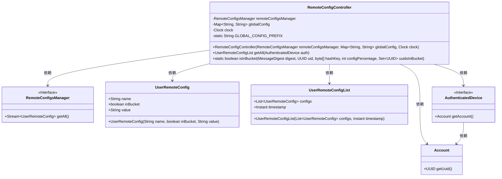
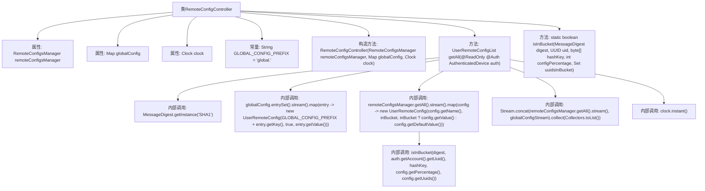

# 基础信息

|      |      |
|------|------|
| 名称 | RemoteConfigController |
| 编码语言 | .java |
| 代码路径 | Signal-Server/service/src/main/java/org/whispersystems/textsecuregcm/controllers/RemoteConfigController.java |
| 包名 | org.whispersystems.textsecuregcm.controllers |
| 依赖项 | ['com.google.common.annotations.VisibleForTesting', 'io.dropwizard.auth.Auth', 'io.swagger.v3.oas.annotations.Operation', 'io.swagger.v3.oas.annotations.responses.ApiResponse', 'io.swagger.v3.oas.annotations.tags.Tag', 'jakarta.ws.rs.GET', 'jakarta.ws.rs.Path', 'jakarta.ws.rs.Produces', 'jakarta.ws.rs.core.MediaType', 'java.nio.ByteBuffer', 'java.nio.charset.StandardCharsets', 'java.security.MessageDigest', 'java.security.NoSuchAlgorithmException', 'java.time.Clock', 'java.util.Map', 'java.util.Set', 'java.util.UUID', 'java.util.stream.Collectors', 'java.util.stream.Stream', 'org.whispersystems.textsecuregcm.auth.AuthenticatedDevice', 'org.whispersystems.textsecuregcm.entities.UserRemoteConfig', 'org.whispersystems.textsecuregcm.entities.UserRemoteConfigList', 'org.whispersystems.textsecuregcm.storage.RemoteConfigsManager', 'org.whispersystems.textsecuregcm.util.Conversions', 'org.whispersystems.textsecuregcm.util.Util', 'org.whispersystems.websocket.auth.ReadOnly'] |
| 概述说明 | 远程配置控制器提供API，支持全局和动态配置管理。 |

# 说明

远程配置控制器是一个用于管理用户远程配置的工具，提供了获取用户远程配置列表的API。该控制器支持全局配置和动态配置的管理，能够根据需求灵活调整配置。全局配置适用于所有用户，而动态配置则允许针对特定用户或场景进行个性化设置。通过该控制器，用户可以高效地管理和获取所需的远程配置，确保系统的灵活性和可扩展性。

# 类列表 Class Summary

| 名称   | 类型  | 说明 |
|-------|------|-------------|
| RemoteConfigController | class | 远程配置控制器，提供获取用户远程配置列表的API，支持全局配置和动态配置管理。 |

## 类 RemoteConfigController

|      |      |
|------|------|
| 访问范围 | @Path("/v1/config");@Tag(name = "Remote Config");public |
| 类型 | class |
| 名称 | RemoteConfigController |
| 说明 | 远程配置控制器，提供获取用户远程配置列表的API，支持全局配置和动态配置管理。 |

### UML类图

### 描述
`RemoteConfigController` 是一个用于获取远程配置的控制器类，它依赖于 `RemoteConfigsManager` 来获取配置数据，并通过 `AuthenticatedDevice` 获取用户信息。`UserRemoteConfig` 和 `UserRemoteConfigList` 分别表示单个配置项和配置项列表。`isInBucket` 方法用于判断用户是否在特定配置的百分比范围内。整体结构展示了控制器如何通过依赖注入和流处理来获取和返回配置数据。

### 内部方法调用关系图

该流程图展示了`RemoteConfigController`类的结构及其内部方法调用关系。类包含多个属性和一个构造方法，主要方法`getAll`用于获取远程配置，并通过内部调用`isInBucket`方法来判断用户是否在配置的百分比范围内。整个流程涉及流操作、哈希计算和配置合并，最终返回用户远程配置列表。

### 字段列表 Field List

| 名称  | 类型  | 说明 |
|-------|-------|------|
| globalConfig | Map<String, String> | 全局配置使用私有不可变的Map存储键值对。 |
| clock | Clock | 定义了一个不可变的时钟对象。 |
| remoteConfigsManager | RemoteConfigsManager | 私有且不可变的远程配置管理器实例。 |
| GLOBAL_CONFIG_PREFIX = "global." | String | 定义全局配置前缀为"global."的静态常量。 |

### 方法列表 Method List

| 名称  | 类型  | 说明 |
|-------|-------|------|
| isInBucket | boolean | 该方法检查UUID是否在指定哈希桶中，返回布尔值。 |
| getAll | UserRemoteConfigList | 获取远程配置列表，包含命名空间键值，定期刷新，适用于认证用户。 |

