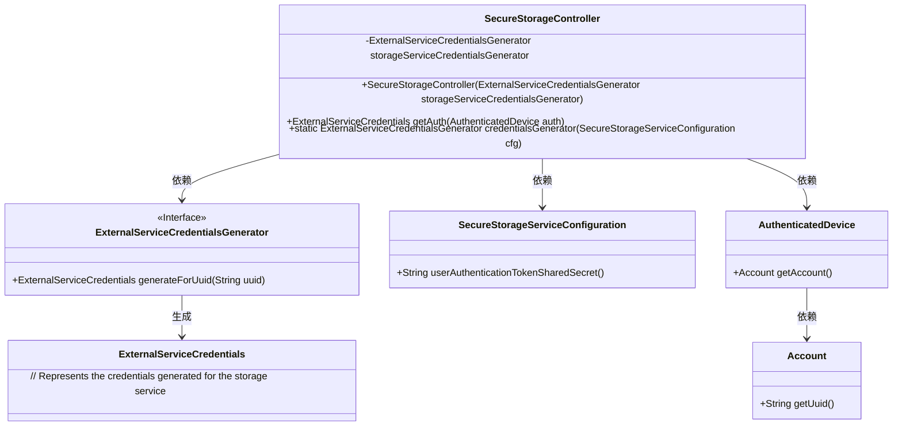
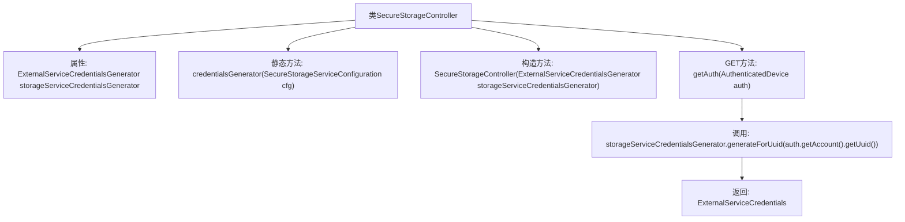

# 基础信息

|      |      |
|------|------|
| 名称 | SecureStorageController |
| 编码语言 | .java |
| 代码路径 | Signal-Server/service/src/main/java/org/whispersystems/textsecuregcm/controllers/SecureStorageController.java |
| 包名 | org.whispersystems.textsecuregcm.controllers |
| 依赖项 | ['io.dropwizard.auth.Auth', 'io.swagger.v3.oas.annotations.Operation', 'io.swagger.v3.oas.annotations.responses.ApiResponse', 'io.swagger.v3.oas.annotations.tags.Tag', 'jakarta.ws.rs.GET', 'jakarta.ws.rs.Path', 'jakarta.ws.rs.Produces', 'jakarta.ws.rs.core.MediaType', 'org.whispersystems.textsecuregcm.auth.AuthenticatedDevice', 'org.whispersystems.textsecuregcm.auth.ExternalServiceCredentials', 'org.whispersystems.textsecuregcm.auth.ExternalServiceCredentialsGenerator', 'org.whispersystems.textsecuregcm.configuration.SecureStorageServiceConfiguration', 'org.whispersystems.websocket.auth.ReadOnly'] |
| 概述说明 | SecureStorageController生成24小时有效凭证，支持UUID认证。 |

# 说明

SecureStorageController负责生成有效期为24小时的存储服务凭证，该凭证支持通过UUID进行身份认证。这一功能确保了存储服务的安全性和时效性，适用于需要短期安全存储的场景。

# 类列表 Class Summary

| 名称   | 类型  | 说明 |
|-------|------|-------------|
| SecureStorageController | class | SecureStorageController生成24小时有效存储服务凭证，支持UUID认证。 |

## 类 SecureStorageController

|      |      |
|------|------|
| 访问范围 | @Path("/v1/storage");@Tag(name = "Secure Storage");public |
| 类型 | class |
| 名称 | SecureStorageController |
| 说明 | SecureStorageController生成24小时有效存储服务凭证，支持UUID认证。 |

### UML类图

### 描述
`SecureStorageController` 是一个控制器类，负责生成存储服务的凭证。它依赖于 `ExternalServiceCredentialsGenerator` 接口来生成凭证，并使用 `SecureStorageServiceConfiguration` 来获取配置信息。`getAuth` 方法接收 `AuthenticatedDevice` 对象，从中获取账户信息并生成凭证。`credentialsGenerator` 方法是一个静态工厂方法，用于创建 `ExternalServiceCredentialsGenerator` 的实例。

### 内部方法调用关系图

这段代码定义了一个名为 `SecureStorageController` 的类，用于生成存储服务的认证凭证。类中包含一个属性 `storageServiceCredentialsGenerator`，用于生成凭证。静态方法 `credentialsGenerator` 用于创建 `ExternalServiceCredentialsGenerator` 实例，构造方法用于初始化 `storageServiceCredentialsGenerator`。`getAuth` 方法通过 `storageServiceCredentialsGenerator` 生成并返回认证凭证。

### 字段列表 Field List

| 名称  | 类型  | 说明 |
|-------|-------|------|
| storageServiceCredentialsGenerator | ExternalServiceCredentialsGenerator | 私有外部服务凭证生成器存储服务凭证生成器。 |

### 方法列表 Method List

| 名称  | 类型  | 说明 |
|-------|-------|------|
| getAuth | ExternalServiceCredentials | 生成存储服务凭证，有效期24小时，返回JSON格式凭证。 |
| credentialsGenerator | ExternalServiceCredentialsGenerator | 静态方法生成外部服务凭证生成器，配置包含用户认证令牌共享密钥并前置用户名。 |

