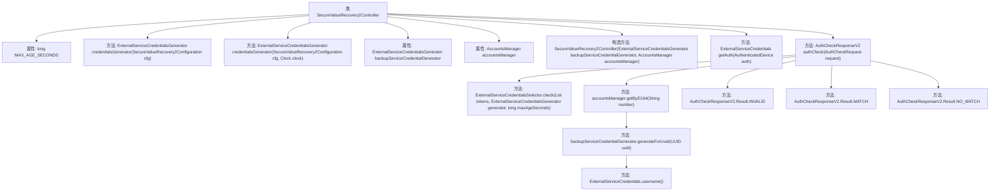

# 基础信息

|      |      |
|------|------|
| 名称 | SecureValueRecovery2Controller |
| 编码语言 | .java |
| 代码路径 | Signal-Server/service/src/main/java/org/whispersystems/textsecuregcm/controllers/SecureValueRecovery2Controller.java |
| 包名 | org.whispersystems.textsecuregcm.controllers |
| 依赖项 | ['com.google.common.annotations.VisibleForTesting', 'io.dropwizard.auth.Auth', 'io.swagger.v3.oas.annotations.Operation', 'io.swagger.v3.oas.annotations.responses.ApiResponse', 'io.swagger.v3.oas.annotations.tags.Tag', 'jakarta.validation.Valid', 'jakarta.validation.constraints.NotNull', 'jakarta.ws.rs.Consumes', 'jakarta.ws.rs.GET', 'jakarta.ws.rs.POST', 'jakarta.ws.rs.Path', 'jakarta.ws.rs.Produces', 'jakarta.ws.rs.core.MediaType', 'java.time.Clock', 'java.util.List', 'java.util.Optional', 'java.util.concurrent.TimeUnit', 'java.util.stream.Collectors', 'org.whispersystems.textsecuregcm.auth.AuthenticatedDevice', 'org.whispersystems.textsecuregcm.auth.ExternalServiceCredentials', 'org.whispersystems.textsecuregcm.auth.ExternalServiceCredentialsGenerator', 'org.whispersystems.textsecuregcm.auth.ExternalServiceCredentialsSelector', 'org.whispersystems.textsecuregcm.configuration.SecureValueRecovery2Configuration', 'org.whispersystems.textsecuregcm.entities.AuthCheckRequest', 'org.whispersystems.textsecuregcm.entities.AuthCheckResponseV2', 'org.whispersystems.textsecuregcm.limits.RateLimitedByIp', 'org.whispersystems.textsecuregcm.limits.RateLimiters', 'org.whispersystems.textsecuregcm.storage.Account', 'org.whispersystems.textsecuregcm.storage.AccountsManager', 'org.whispersystems.websocket.auth.ReadOnly'] |
| 概述说明 | SecureValueRecovery2Controller提供SVR2认证和验证，支持30天有效期凭证。 |

# 说明

SecureValueRecovery2Controller是一个提供SVR2服务认证和检查功能的控制器。它支持生成和验证有效期为30天的凭证，确保在指定时间范围内进行安全可靠的操作。该控制器专注于凭证的有效性管理，为用户提供便捷的认证和验证服务。

# 类列表 Class Summary

| 名称   | 类型  | 说明 |
|-------|------|-------------|
| SecureValueRecovery2Controller | class | SecureValueRecovery2Controller提供SVR2服务认证和检查功能，支持30天有效期的凭证生成和验证。 |


## 类 SecureValueRecovery2Controller

|      |      |
|------|------|
| 访问范围 | @Path("/v2/backup");@Tag(name = "Secure Value Recovery");public |
| 类型 | class |
| 名称 | SecureValueRecovery2Controller |
| 说明 | SecureValueRecovery2Controller提供SVR2服务认证和检查功能，支持30天有效期的凭证生成和验证。 |


### UML类图

```mermaid
classDiagram
    class SecureValueRecovery2Controller {
        -ExternalServiceCredentialsGenerator backupServiceCredentialGenerator
        -AccountsManager accountsManager
        +SecureValueRecovery2Controller(ExternalServiceCredentialsGenerator backupServiceCredentialGenerator, AccountsManager accountsManager)
        +ExternalServiceCredentials getAuth(AuthenticatedDevice auth)
        +AuthCheckResponseV2 authCheck(AuthCheckRequest request)
    }

    class ExternalServiceCredentialsGenerator {
        <<Interface>>
        +ExternalServiceCredentials generateFor(String uuid)
        +ExternalServiceCredentials generateForUuid(UUID uuid)
        +String username()
    }

    class AccountsManager {
        <<Interface>>
        +Optional<Account> getByE164(String number)
    }

    class Account {
        +UUID getUuid()
    }

    class AuthCheckRequest {
        +List<String> tokens()
        +String number()
    }

    class AuthCheckResponseV2 {
        +Map<String, AuthCheckResponseV2.Result> results
    }

    class ExternalServiceCredentialsSelector {
        +static List<CredentialInfo> check(List<String> tokens, ExternalServiceCredentialsGenerator generator, long maxAgeSeconds)
        class CredentialInfo {
            +String token()
            +boolean valid()
            +ExternalServiceCredentials credentials()
        }
    }

    SecureValueRecovery2Controller --> ExternalServiceCredentialsGenerator : 依赖
    SecureValueRecovery2Controller --> AccountsManager : 依赖
    AccountsManager --> Account : 依赖
    ExternalServiceCredentialsSelector --> ExternalServiceCredentialsGenerator : 依赖
    AuthCheckRequest --> ExternalServiceCredentialsSelector : 依赖
    AuthCheckResponseV2 --> ExternalServiceCredentialsSelector : 依赖
```

### 描述
`SecureValueRecovery2Controller` 是一个用于生成和验证安全值恢复（SVR2）服务凭证的控制器类。它依赖于 `ExternalServiceCredentialsGenerator` 来生成凭证，并依赖于 `AccountsManager` 来管理账户信息。`AuthCheckRequest` 类用于接收验证请求，`AuthCheckResponseV2` 类用于返回验证结果。`ExternalServiceCredentialsSelector` 类负责检查凭证的有效性，并返回包含凭证信息的 `CredentialInfo` 对象。整个类图展示了控制器与各个依赖类之间的交互关系。


### 内部方法调用关系图



这段代码描述了一个名为`SecureValueRecovery2Controller`的类，主要用于生成和验证SVR2服务的凭证。类中包含两个主要方法：`getAuth`用于生成凭证，`authCheck`用于验证凭证的有效性。`authCheck`方法通过调用`ExternalServiceCredentialsSelector.check`来检查凭证的有效性，并根据结果返回相应的响应。整个流程涉及到多个内部方法调用，确保凭证的生成和验证过程准确无误。

### 字段列表 Field List

| 名称  | 类型  | 说明 |
|-------|-------|------|
| accountsManager | AccountsManager | 私有账户管理器实例变量。 |
| MAX_AGE_SECONDS = TimeUnit.DAYS.toSeconds(30) | long | 定义30天最大时长秒数的常量。 |
| backupServiceCredentialGenerator | ExternalServiceCredentialsGenerator | 私有外部服务凭证生成器备份实例。 |

### 方法列表 Method List

| 名称  | 类型  | 说明 |
|-------|-------|------|
| authCheck | AuthCheckResponseV2 | 验证SVR2凭证，返回匹配结果。 |
| credentialsGenerator | ExternalServiceCredentialsGenerator | 静态方法生成外部服务凭证生成器，使用配置和系统时钟。 |
| credentialsGenerator | ExternalServiceCredentialsGenerator | 创建外部服务凭证生成器，配置用户认证和ID令牌密钥，并指定时钟和用户名截断长度。 |
| getAuth | ExternalServiceCredentials | 生成SVR2服务凭证，有效期30天，服务器可调整。返回JSON凭证，认证失败返回401。 |


