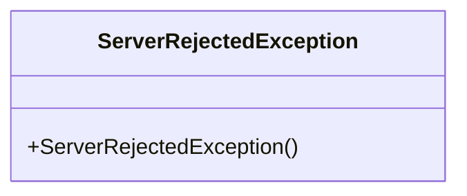
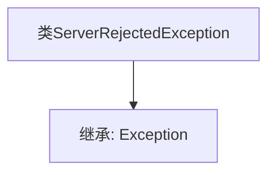

# 基础信息

|      |      |
|------|------|
| 名称 | ServerRejectedException |
| 编码语言 | .java |
| 代码路径 | Signal-Server/service/src/main/java/org/whispersystems/textsecuregcm/controllers/ServerRejectedException.java |
| 包名 | org.whispersystems.textsecuregcm.controllers |
| 依赖项 | [] |
| 概述说明 | ServerRejectedException继承自Exception类。 |

# 说明

ServerRejectedException类是一个自定义异常类，它继承自Python内置的Exception类。作为Exception的子类，ServerRejectedException用于表示与服务器拒绝请求相关的错误情况。通过继承Exception，ServerRejectedException具备了异常处理的基本功能，可以在程序运行过程中捕获和处理特定的服务器拒绝异常，从而提高代码的健壮性和可维护性。

# 类列表 Class Summary

| 名称   | 类型  | 说明 |
|-------|------|-------------|
| ServerRejectedException | class | ServerRejectedException类继承自Exception。 |

## 类 ServerRejectedException

|      |      |
|------|------|
| 访问范围 | public |
| 类型 | class |
| 名称 | ServerRejectedException |
| 说明 | ServerRejectedException类继承自Exception。 |

### UML类图

ServerRejectedException 是一个自定义异常类，继承自 Java 的 `Exception` 类。它用于表示服务器拒绝请求的情况。该类没有定义任何额外的成员变量或方法，仅提供了一个默认的构造函数。通过继承 `Exception`，它具备了异常处理的基本功能，可以在需要时抛出并捕获该异常。

### 内部方法调用关系图

这段代码定义了一个名为 `ServerRejectedException` 的类，该类继承自 `Exception` 类。通过继承 `Exception`，`ServerRejectedException` 成为了一个自定义的异常类，可以在程序中被抛出和捕获，用于处理服务器拒绝请求等特定场景。代码简洁明了，符合异常处理的基本设计原则。

### 字段列表 Field List

| 名称  | 类型  | 说明 |
|-------|-------|------|

### 方法列表 Method List

| 名称  | 类型  | 说明 |
|-------|-------|------|

