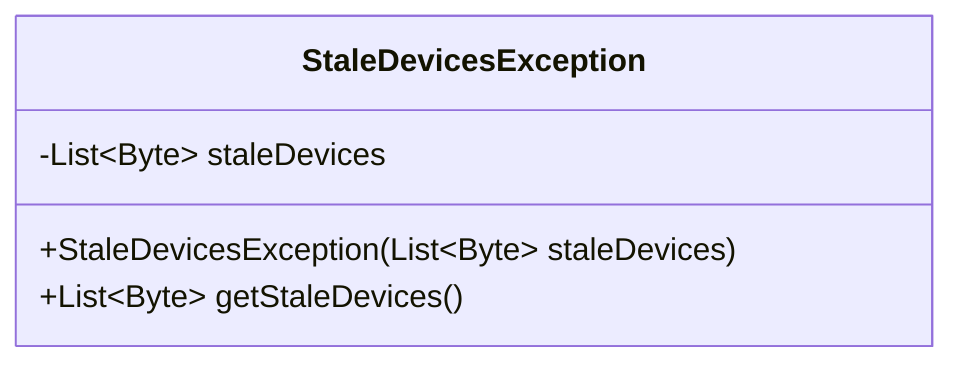
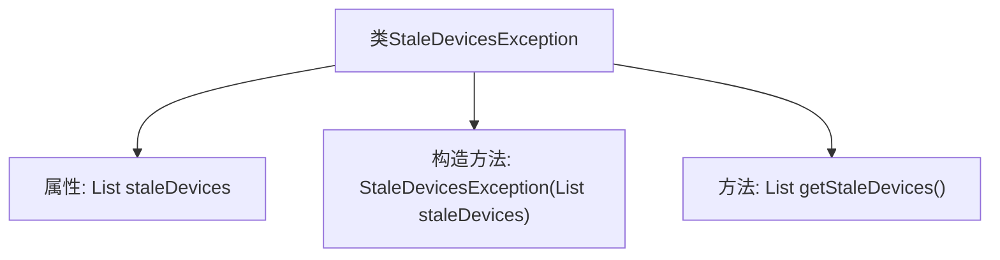

# 基础信息

|      |      |
|------|------|
| 名称 | StaleDevicesException |
| 编码语言 | .java |
| 代码路径 | Signal-Server/service/src/main/java/org/whispersystems/textsecuregcm/controllers/StaleDevicesException.java |
| 包名 | org.whispersystems.textsecuregcm.controllers |
| 依赖项 | ['java.util.List'] |
| 概述说明 | StaleDevicesException继承Exception，包含过时设备列表及获取方法。 |

# 说明

StaleDevicesException类继承自Exception类，主要用于处理与过时设备相关的异常情况。该类包含一个过时设备列表，用于存储和管理过时的设备信息。此外，该类还提供了一个获取方法，用于从列表中检索过时设备的信息。通过这些功能，StaleDevicesException类能够有效地处理和传递与过时设备相关的异常信息。

# 类列表 Class Summary

| 名称   | 类型  | 说明 |
|-------|------|-------------|
| StaleDevicesException | class | StaleDevicesException类继承Exception，包含过时设备列表及获取方法。 |

## 类 StaleDevicesException

|      |      |
|------|------|
| 访问范围 | public |
| 类型 | class |
| 名称 | StaleDevicesException |
| 说明 | StaleDevicesException类继承Exception，包含过时设备列表及获取方法。 |

### UML类图

这段代码定义了一个名为 `StaleDevicesException` 的异常类，继承自 `Exception`。该类包含一个私有成员 `staleDevices`，类型为 `List<Byte>`，用于存储过时的设备列表。构造函数 `StaleDevicesException` 接受一个 `List<Byte>` 参数，并将其赋值给 `staleDevices`。此外，类中提供了一个公有方法 `getStaleDevices`，用于返回 `staleDevices` 列表。该类的主要作用是封装过时设备信息，并在需要时抛出该异常。

### 内部方法调用关系图

这段代码定义了一个名为 `StaleDevicesException` 的自定义异常类，继承自 `Exception`。该类包含一个 `List<Byte>` 类型的属性 `staleDevices`，用于存储异常相关的设备列表。通过构造方法 `StaleDevicesException(List<Byte> staleDevices)` 初始化该属性，并提供了一个公共方法 `getStaleDevices()` 来获取该列表。这个类主要用于在特定情况下抛出异常，并携带相关的设备信息。

### 字段列表 Field List

| 名称  | 类型  | 说明 |
|-------|-------|------|
| staleDevices | List<Byte> | 私有不可变字节列表存储陈旧设备。 |

### 方法列表 Method List

| 名称  | 类型  | 说明 |
|-------|-------|------|
| getStaleDevices | List<Byte> | 获取陈旧设备列表的方法。 |

