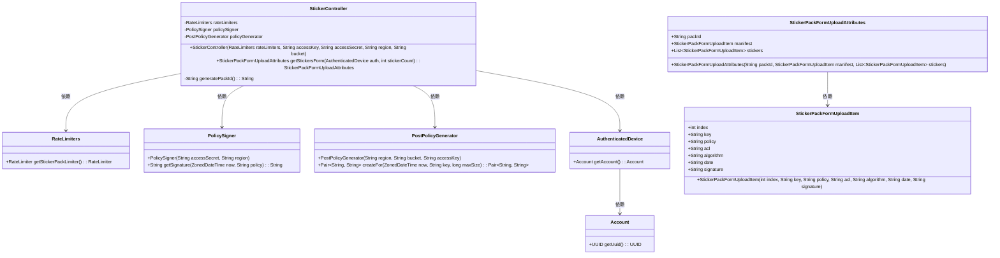

# 基础信息

|      |      |
|------|------|
| 名称 | StickerController |
| 编码语言 | .java |
| 代码路径 | Signal-Server/service/src/main/java/org/whispersystems/textsecuregcm/controllers/StickerController.java |
| 包名 | org.whispersystems.textsecuregcm.controllers |
| 依赖项 | ['io.dropwizard.auth.Auth', 'io.swagger.v3.oas.annotations.tags.Tag', 'jakarta.validation.constraints.Max', 'jakarta.validation.constraints.Min', 'jakarta.ws.rs.GET', 'jakarta.ws.rs.Path', 'jakarta.ws.rs.PathParam', 'jakarta.ws.rs.Produces', 'jakarta.ws.rs.core.MediaType', 'java.security.SecureRandom', 'java.time.ZoneOffset', 'java.time.ZonedDateTime', 'java.util.HexFormat', 'java.util.LinkedList', 'java.util.List', 'org.whispersystems.textsecuregcm.auth.AuthenticatedDevice', 'org.whispersystems.textsecuregcm.entities.StickerPackFormUploadAttributes', 'org.whispersystems.textsecuregcm.entities.StickerPackFormUploadAttributes.StickerPackFormUploadItem', 'org.whispersystems.textsecuregcm.limits.RateLimiters', 'org.whispersystems.textsecuregcm.s3.PolicySigner', 'org.whispersystems.textsecuregcm.s3.PostPolicyGenerator', 'org.whispersystems.textsecuregcm.util.Constants', 'org.whispersystems.textsecuregcm.util.Pair', 'org.whispersystems.websocket.auth.ReadOnly'] |
| 概述说明 | StickerController负责贴纸包上传及表单属性与签名生成。 |

# 说明

StickerController负责处理贴纸包的上传任务，包括生成表单属性和签名。该控制器确保上传过程顺利进行，通过生成必要的表单属性来捕获用户输入，并生成签名以验证数据的完整性和真实性。这一流程保证了贴纸包上传的安全性和准确性，确保用户能够成功上传并使用贴纸包。

# 类列表 Class Summary

| 名称   | 类型  | 说明 |
|-------|------|-------------|
| StickerController | class | StickerController处理贴纸包上传，生成表单属性和签名。 |

## 类 StickerController

|      |      |
|------|------|
| 访问范围 | @Path("/v1/sticker");@Tag(name = "Stickers");public |
| 类型 | class |
| 名称 | StickerController |
| 说明 | StickerController处理贴纸包上传，生成表单属性和签名。 |

### UML类图

### 描述
该代码实现了一个用于生成贴纸包上传表单的控制器 `StickerController`。它依赖于 `RateLimiters`、`PolicySigner` 和 `PostPolicyGenerator` 类来执行限流、签名和策略生成等操作。`getStickersForm` 方法根据传入的贴纸数量生成上传表单属性，包括清单和贴纸的签名信息。`generatePackId` 方法用于生成唯一的贴纸包ID。整个流程涉及多个类的协作，确保生成的上传表单符合安全性和业务需求。

### 内部方法调用关系图

```mermaid
graph TD
    A["类StickerController"]
    B["属性: RateLimiters rateLimiters"]
    C["属性: PolicySigner policySigner"]
    D["属性: PostPolicyGenerator policyGenerator"]
    E["构造方法: StickerController(RateLimiters rateLimiters, String accessKey, String accessSecret, String region, String bucket)"]
    F["方法: StickerPackFormUploadAttributes getStickersForm(AuthenticatedDevice auth, int stickerCount)"]
    G["方法: String generatePackId()"]
    H["步骤: rateLimiters.getStickerPackLimiter().validate(auth.getAccount().getUuid())"]
    I["步骤: ZonedDateTime now = ZonedDateTime.now(ZoneOffset.UTC)"]
    J["步骤: String packId = generatePackId()"]
    K["步骤: String packLocation = 'stickers/' + packId"]
    L["步骤: String manifestKey = packLocation + '/manifest.proto'"]
    M["步骤: Pair<String, String> manifestPolicy = policyGenerator.createFor(now, manifestKey, Constants.MAXIMUM_STICKER_MANIFEST_SIZE_BYTES)"]
    N["步骤: String manifestSignature = policySigner.getSignature(now, manifestPolicy.second())"]
    O["步骤: StickerPackFormUploadItem manifest = new StickerPackFormUploadItem(-1, manifestKey, manifestPolicy.first(), 'private', 'AWS4-HMAC-SHA256', now.format(PostPolicyGenerator.AWS_DATE_TIME), manifestPolicy.second(), manifestSignature)"]
    P["步骤: List<StickerPackFormUploadItem> stickers = new LinkedList<>()"]
    Q["步骤: for (int i = 0; i < stickerCount; i++)"]
    R["步骤: String stickerKey = packLocation + '/full/' + i"]
    S["步骤: Pair<String, String> stickerPolicy = policyGenerator.createFor(now, stickerKey, Constants.MAXIMUM_STICKER_SIZE_BYTES)"]
    T["步骤: String stickerSignature = policySigner.getSignature(now, stickerPolicy.second())"]
    U["步骤: stickers.add(new StickerPackFormUploadItem(i, stickerKey, stickerPolicy.first(), 'private', 'AWS4-HMAC-SHA256', now.format(PostPolicyGenerator.AWS_DATE_TIME), stickerPolicy.second(), stickerSignature))"]
    V["步骤: return new StickerPackFormUploadAttributes(packId, manifest, stickers)"]

    A --> B
    A --> C
    A --> D
    A --> E
    A --> F
    A --> G
    F --> H
    F --> I
    F --> J
    F --> K
    F --> L
    F --> M
    F --> N
    F --> O
    F --> P
    F --> Q
    Q --> R
    Q --> S
    Q --> T
    Q --> U
    F --> V
```

这段代码描述了一个`StickerController`类，用于生成和管理贴纸包的上传属性。类中包含一个构造方法和两个主要方法：`getStickersForm`和`generatePackId`。`getStickersForm`方法首先验证请求是否超出速率限制，然后生成贴纸包的ID和位置，创建并签名贴纸包清单和每个贴纸的策略，最后返回包含所有信息的`StickerPackFormUploadAttributes`对象。`generatePackId`方法用于生成随机的贴纸包ID。

### 字段列表 Field List

| 名称  | 类型  | 说明 |
|-------|-------|------|
| rateLimiters | RateLimiters | 私有且不可变的限流器实例。 |
| policyGenerator | PostPolicyGenerator | 私有且不可变的PostPolicyGenerator实例。 |
| policySigner | PolicySigner | 私有且不可变的PolicySigner实例。 |

### 方法列表 Method List

| 名称  | 类型  | 说明 |
|-------|-------|------|
| generatePackId | String | 生成16字节随机数并转换为16进制字符串作为ID。 |
| getStickersForm | StickerPackFormUploadAttributes | 获取贴纸包上传属性，生成ID、策略和签名。 |

