# 基础信息

|      |      |
|------|------|
| 名称 | SubscriptionController |
| 编码语言 | .java |
| 代码路径 | Signal-Server/service/src/main/java/org/whispersystems/textsecuregcm/controllers/SubscriptionController.java |
| 包名 | org.whispersystems.textsecuregcm.controllers |
| 依赖项 | ['com.fasterxml.jackson.annotation.JsonInclude', 'com.fasterxml.jackson.annotation.JsonInclude.Include', 'com.google.common.annotations.VisibleForTesting', 'com.google.common.net.HttpHeaders', 'io.dropwizard.auth.Auth', 'io.micrometer.core.instrument.Metrics', 'io.micrometer.core.instrument.Tag', 'io.micrometer.core.instrument.Tags', 'io.swagger.v3.oas.annotations.ExternalDocumentation', 'io.swagger.v3.oas.annotations.Operation', 'io.swagger.v3.oas.annotations.media.Content', 'io.swagger.v3.oas.annotations.media.Schema', 'io.swagger.v3.oas.annotations.responses.ApiResponse', 'jakarta.validation.Valid', 'jakarta.validation.constraints.NotBlank', 'jakarta.validation.constraints.NotEmpty', 'jakarta.validation.constraints.NotNull', 'jakarta.ws.rs.BadRequestException', 'jakarta.ws.rs.ClientErrorException', 'jakarta.ws.rs.Consumes', 'jakarta.ws.rs.DELETE', 'jakarta.ws.rs.DefaultValue', 'jakarta.ws.rs.GET', 'jakarta.ws.rs.HeaderParam', 'jakarta.ws.rs.POST', 'jakarta.ws.rs.PUT', 'jakarta.ws.rs.Path', 'jakarta.ws.rs.PathParam', 'jakarta.ws.rs.Produces', 'jakarta.ws.rs.QueryParam', 'jakarta.ws.rs.container.ContainerRequestContext', 'jakarta.ws.rs.core.Context', 'jakarta.ws.rs.core.MediaType', 'jakarta.ws.rs.core.Response', 'jakarta.ws.rs.core.Response.Status', 'java.math.BigDecimal', 'java.time.Clock', 'java.time.Instant', 'java.util.Arrays', 'java.util.HashMap', 'java.util.List', 'java.util.Locale', 'java.util.Map', 'java.util.Map.Entry', 'java.util.Objects', 'java.util.Optional', 'java.util.concurrent.CompletableFuture', 'java.util.function.Function', 'java.util.stream.Collectors', 'javax.annotation.Nonnull', 'javax.annotation.Nullable', 'org.signal.libsignal.zkgroup.receipts.ReceiptCredentialResponse', 'org.whispersystems.textsecuregcm.auth.AuthenticatedDevice', 'org.whispersystems.textsecuregcm.backup.BackupManager', 'org.whispersystems.textsecuregcm.badges.BadgeTranslator', 'org.whispersystems.textsecuregcm.configuration.OneTimeDonationConfiguration', 'org.whispersystems.textsecuregcm.configuration.OneTimeDonationCurrencyConfiguration', 'org.whispersystems.textsecuregcm.configuration.SubscriptionConfiguration', 'org.whispersystems.textsecuregcm.configuration.SubscriptionLevelConfiguration', 'org.whispersystems.textsecuregcm.entities.Badge', 'org.whispersystems.textsecuregcm.entities.PurchasableBadge', 'org.whispersystems.textsecuregcm.metrics.MetricsUtil', 'org.whispersystems.textsecuregcm.metrics.UserAgentTagUtil', 'org.whispersystems.textsecuregcm.storage.PaymentTime', 'org.whispersystems.textsecuregcm.storage.SubscriberCredentials', 'org.whispersystems.textsecuregcm.storage.SubscriptionException', 'org.whispersystems.textsecuregcm.storage.SubscriptionManager', 'org.whispersystems.textsecuregcm.subscriptions.AppleAppStoreManager', 'org.whispersystems.textsecuregcm.subscriptions.BankMandateTranslator', 'org.whispersystems.textsecuregcm.subscriptions.BankTransferType', 'org.whispersystems.textsecuregcm.subscriptions.BraintreeManager', 'org.whispersystems.textsecuregcm.subscriptions.ChargeFailure', 'org.whispersystems.textsecuregcm.subscriptions.CustomerAwareSubscriptionPaymentProcessor', 'org.whispersystems.textsecuregcm.subscriptions.GooglePlayBillingManager', 'org.whispersystems.textsecuregcm.subscriptions.PaymentMethod', 'org.whispersystems.textsecuregcm.subscriptions.PaymentProvider', 'org.whispersystems.textsecuregcm.subscriptions.ProcessorCustomer', 'org.whispersystems.textsecuregcm.subscriptions.StripeManager', 'org.whispersystems.textsecuregcm.util.ExceptionUtils', 'org.whispersystems.textsecuregcm.util.HeaderUtils', 'org.whispersystems.textsecuregcm.util.ua.ClientPlatform', 'org.whispersystems.textsecuregcm.util.ua.UnrecognizedUserAgentException', 'org.whispersystems.textsecuregcm.util.ua.UserAgentUtil', 'org.whispersystems.websocket.auth.ReadOnly'] |
| 概述说明 | SubscriptionController处理订阅操作，支持多支付方式，管理配置和订阅信息。 |

# 说明

SubscriptionController负责处理与订阅相关的操作，支持多种支付方式，能够管理订阅配置、支付方法以及订阅信息。该控制器确保订阅流程的顺利进行，涵盖从支付到信息管理的各个方面，为用户提供全面的订阅服务支持。

# 类列表 Class Summary

| 名称   | 类型  | 说明 |
|-------|------|-------------|
| SubscriptionController | class | SubscriptionController处理订阅相关操作，支持多种支付方式，管理订阅配置、支付方法和订阅信息。 |


## 类 SubscriptionController

|      |      |
|------|------|
| 访问范围 | @Path("/v1/subscription");@io.swagger.v3.oas.annotations.tags.Tag(name = "Subscriptions");public |
| 类型 | class |
| 名称 | SubscriptionController |
| 说明 | SubscriptionController处理订阅相关操作，支持多种支付方式，管理订阅配置、支付方法和订阅信息。 |


### UML类图

```mermaid
classDiagram
    class SubscriptionController {
        -Clock clock
        -SubscriptionConfiguration subscriptionConfiguration
        -OneTimeDonationConfiguration oneTimeDonationConfiguration
        -SubscriptionManager subscriptionManager
        -StripeManager stripeManager
        -BraintreeManager braintreeManager
        -GooglePlayBillingManager googlePlayBillingManager
        -AppleAppStoreManager appleAppStoreManager
        -BadgeTranslator badgeTranslator
        -BankMandateTranslator bankMandateTranslator
        +SubscriptionController(Clock, SubscriptionConfiguration, OneTimeDonationConfiguration, SubscriptionManager, StripeManager, BraintreeManager, GooglePlayBillingManager, AppleAppStoreManager, BadgeTranslator, BankMandateTranslator)
        -Map~String, CurrencyConfiguration~ buildCurrencyConfiguration()
        +GetSubscriptionConfigurationResponse buildGetSubscriptionConfigurationResponse(List~Locale~)
        +CompletableFuture~Response~ deleteSubscriber(Optional~AuthenticatedDevice~, String)
        +CompletableFuture~Response~ updateSubscriber(Optional~AuthenticatedDevice~, String)
        +CompletableFuture~Response~ createPaymentMethod(Optional~AuthenticatedDevice~, String, PaymentMethod, String)
        +CompletableFuture~Response~ createPayPalPaymentMethod(Optional~AuthenticatedDevice~, String, CreatePayPalBillingAgreementRequest, ContainerRequestContext, String)
        -CustomerAwareSubscriptionPaymentProcessor getCustomerAwareProcessor(PaymentProvider)
        +CompletableFuture~Response~ setDefaultPaymentMethodWithProcessor(Optional~AuthenticatedDevice~, String, PaymentProvider, String)
        +CompletableFuture~Response~ setSubscriptionLevel(Optional~AuthenticatedDevice~, String, long, String, String)
        +boolean subscriptionsAreSameType(long, long)
        +CompletableFuture~SetSubscriptionLevelSuccessResponse~ setAppStoreSubscription(Optional~AuthenticatedDevice~, String, String)
        +CompletableFuture~SetSubscriptionLevelSuccessResponse~ setPlayStoreSubscription(Optional~AuthenticatedDevice~, String, String)
        +CompletableFuture~Response~ getConfiguration(ContainerRequestContext)
        +CompletableFuture~Response~ getBankMandate(ContainerRequestContext, BankTransferType)
        +CompletableFuture~Response~ getSubscriptionInformation(Optional~AuthenticatedDevice~, String)
        +CompletableFuture~Response~ createSubscriptionReceiptCredentials(Optional~AuthenticatedDevice~, String, String, GetReceiptCredentialsRequest)
        +CompletableFuture~Response~ setDefaultPaymentMethodForIdeal(Optional~AuthenticatedDevice~, String, String)
        -CompletableFuture~Response~ setDefaultPaymentMethod(CustomerAwareSubscriptionPaymentProcessor, String, SubscriberCredentials)
        -Instant receiptExpirationWithGracePeriod(CustomerAwareSubscriptionPaymentProcessor.ReceiptItem)
        -String getSubscriptionTemplateId(long, String, PaymentProvider)
        -ClientPlatform getClientPlatform(String)
    }

    class SubscriptionManager {
        <<Interface>>
        +CompletableFuture~Void~ deleteSubscriber(SubscriberCredentials)
        +CompletableFuture~Void~ updateSubscriber(SubscriberCredentials)
        +CompletableFuture~String~ addPaymentMethodToCustomer(SubscriberCredentials, CustomerAwareSubscriptionPaymentProcessor, ClientPlatform, BiFunction~CustomerAwareSubscriptionPaymentProcessor, String, String~)
        +CompletableFuture~Void~ updateAppStoreTransactionId(SubscriberCredentials, AppleAppStoreManager, String)
        +CompletableFuture~Void~ updatePlayBillingPurchaseToken(SubscriberCredentials, GooglePlayBillingManager, String)
        +CompletableFuture~Optional~SubscriptionInformation~~ getSubscriptionInformation(SubscriberCredentials)
        +CompletableFuture~ReceiptCredential~ createReceiptCredentials(SubscriberCredentials, GetReceiptCredentialsRequest, Function~CustomerAwareSubscriptionPaymentProcessor.ReceiptItem, Instant~)
    }

    class CustomerAwareSubscriptionPaymentProcessor {
        <<Interface>>
        +boolean supportsPaymentMethod(PaymentMethod)
        +Set~String~ getSupportedCurrenciesForPaymentMethod(PaymentMethod)
        +String createPaymentMethodSetupToken(String, String)
        +String createPayPalBillingAgreement(String, String, String)
        +CompletableFuture~Void~ setDefaultPaymentMethodForCustomer(String, String, String)
    }

    class StripeManager {
        +CompletableFuture~String~ getGeneratedSepaIdFromSetupIntent(String)
    }

    class BraintreeManager {
    }

    class GooglePlayBillingManager {
    }

    class AppleAppStoreManager {
    }

    class BadgeTranslator {
        +Badge translate(List~Locale~, Badge)
    }

    class BankMandateTranslator {
        +String translate(List~Locale~, BankTransferType)
    }

    class SubscriberCredentials {
        +static SubscriberCredentials process(Optional~AuthenticatedDevice~, String, Clock)
    }

    class AuthenticatedDevice {
    }

    class Clock {
    }

    class SubscriptionConfiguration {
        +Map~Long, SubscriptionLevelConfiguration~ getDonationLevels()
        +Map~Long, SubscriptionLevelConfiguration~ getBackupLevels()
        +SubscriptionLevelConfiguration getSubscriptionLevel(long)
        +Duration getBadgeExpiration()
        +Duration getBadgeGracePeriod()
        +Duration getBackupExpiration()
        +Duration getBackupGracePeriod()
    }

    class OneTimeDonationConfiguration {
        +Map~String, OneTimeDonationCurrencyConfiguration~ currencies()
        +BoostConfiguration boost()
        +GiftConfiguration gift()
    }

    class SubscriptionLevelConfiguration {
        +String type()
        +Map~String, PriceConfiguration~ prices()
    }

    class OneTimeDonationCurrencyConfiguration {
        +BigDecimal minimum()
        +List~BigDecimal~ boosts()
        +BigDecimal gift()
    }

    class BoostConfiguration {
        +long level()
        +Badge badge()
        +Duration expiration()
    }

    class GiftConfiguration {
        +long level()
        +Badge badge()
        +Duration expiration()
    }

    class PriceConfiguration {
        +BigDecimal amount()
        +Map~PaymentProvider, String~ processorIds()
    }

    class Badge {
    }

    class BankTransferType {
    }

    class PaymentMethod {
    }

    class PaymentProvider {
    }

    class ClientPlatform {
    }

    class ReceiptCredential {
        +byte[] receiptCredentialResponse()
        +PaymentProvider paymentProvider()
        +CustomerAwareSubscriptionPaymentProcessor.ReceiptItem receiptItem()
    }

    class ReceiptCredentialResponse {
        +byte[] serialize()
    }

    class SubscriptionInformation {
        +long level()
        +Instant billingCycleAnchor()
        +Instant endOfCurrentPeriod()
        +boolean active()
        +boolean cancelAtPeriodEnd()
        +Price price()
        +String status()
        +PaymentProvider paymentProvider()
        +PaymentMethod paymentMethod()
        +boolean paymentProcessing()
        +ChargeFailure chargeFailure()
    }

    class Price {
        +String currency()
        +BigDecimal amount()
    }

    class ChargeFailure {
    }

    class GetSubscriptionConfigurationResponse {
        +Map~String, CurrencyConfiguration~ currencies
        +Map~String, LevelConfiguration~ levels
        +BackupConfiguration backup
        +BigDecimal sepaMaximumEuros
    }

    class CurrencyConfiguration {
        +BigDecimal minimum
        +Map~String, List~BigDecimal~~ oneTime
        +Map~String, BigDecimal~ subscription
        +Map~String, BigDecimal~ backupSubscription
        +List~String~ supportedPaymentMethods
    }

    class LevelConfiguration {
        +String name
        +Badge badge
    }

    class BackupConfiguration {
        +Map~String, BackupLevelConfiguration~ levels
        +long freeTierMediaDays
    }

    class BackupLevelConfiguration {
        +long storageAllowanceBytes
        +String playProductId
        +long mediaTtlDays
    }

    class GetBankMandateResponse {
        +String mandate
    }

    class GetSubscriptionInformationResponse {
        +Subscription subscription
        +ChargeFailure chargeFailure
    }

    class SetSubscriptionLevelSuccessResponse {
        +long level
    }

    class SetSubscriptionLevelErrorResponse {
        +List~Error~ errors
    }

    class GetReceiptCredentialsRequest {
        +byte[] receiptCredentialRequest
    }

    class GetReceiptCredentialsResponse {
        +byte[] receiptCredentialResponse
    }

    class CreatePayPalBillingAgreementRequest {
        +String returnUrl
        +String cancelUrl
    }

    class CreatePayPalBillingAgreementResponse {
        +String approvalUrl
        +String token
    }

    SubscriptionController --> SubscriptionManager : 依赖
    SubscriptionController --> CustomerAwareSubscriptionPaymentProcessor : 依赖
    SubscriptionController --> StripeManager : 依赖
    SubscriptionController --> BraintreeManager : 依赖
    SubscriptionController --> GooglePlayBillingManager : 依赖
    SubscriptionController --> AppleAppStoreManager : 依赖
    SubscriptionController --> BadgeTranslator : 依赖
    SubscriptionController --> BankMandateTranslator : 依赖
    SubscriptionController --> SubscriberCredentials : 依赖
    SubscriptionController --> AuthenticatedDevice : 依赖
    SubscriptionController --> Clock : 依赖
    SubscriptionController --> SubscriptionConfiguration : 依赖
    SubscriptionController --> OneTimeDonationConfiguration : 依赖
    SubscriptionManager --> CustomerAwareSubscriptionPaymentProcessor : 依赖
    SubscriptionManager --> SubscriberCredentials : 依赖
    SubscriptionManager --> ReceiptCredential : 依赖
    SubscriptionManager --> SubscriptionInformation : 依赖
    CustomerAwareSubscriptionPaymentProcessor --> PaymentMethod : 依赖
    CustomerAwareSubscriptionPaymentProcessor --> PaymentProvider : 依赖
    StripeManager --> CustomerAwareSubscriptionPaymentProcessor : 依赖
    BraintreeManager --> CustomerAwareSubscriptionPaymentProcessor : 依赖
    GooglePlayBillingManager --> CustomerAwareSubscriptionPaymentProcessor : 依赖
    AppleAppStoreManager --> CustomerAwareSubscriptionPaymentProcessor : 依赖
    BadgeTranslator --> Badge : 依赖
    BankMandateTranslator --> BankTransferType : 依赖
    SubscriptionConfiguration --> SubscriptionLevelConfiguration : 依赖
    OneTimeDonationConfiguration --> OneTimeDonationCurrencyConfiguration : 依赖
    OneTimeDonationConfiguration --> BoostConfiguration : 依赖
    OneTimeDonationConfiguration --> GiftConfiguration : 依赖
    SubscriptionLevelConfiguration --> PriceConfiguration : 依赖
    PriceConfiguration --> PaymentProvider : 依赖
    ReceiptCredential --> PaymentProvider : 依赖
    ReceiptCredential --> CustomerAwareSubscriptionPaymentProcessor.ReceiptItem : 依赖
    SubscriptionInformation --> Price : 依赖
    SubscriptionInformation --> PaymentProvider : 依赖
    SubscriptionInformation --> PaymentMethod : 依赖
    SubscriptionInformation --> ChargeFailure : 依赖
    GetSubscriptionConfigurationResponse --> CurrencyConfiguration : 依赖
    GetSubscriptionConfigurationResponse --> LevelConfiguration : 依赖
    GetSubscriptionConfigurationResponse --> BackupConfiguration : 依赖
    CurrencyConfiguration --> BigDecimal : 依赖
    LevelConfiguration --> Badge : 依赖
    BackupConfiguration --> BackupLevelConfiguration : 依赖
    BackupLevelConfiguration --> long : 依赖
    GetBankMandateResponse --> String : 依赖
    GetSubscriptionInformationResponse --> Subscription : 依赖
    GetSubscriptionInformationResponse --> ChargeFailure : 依赖
    SetSubscriptionLevelSuccessResponse --> long : 依赖
    SetSubscriptionLevelErrorResponse --> Error : 依赖
    GetReceiptCredentialsRequest --> byte[] : 依赖
    GetReceiptCredentialsResponse --> byte[] : 依赖
    CreatePayPalBillingAgreementRequest --> String : 依赖
    CreatePayPalBillingAgreementResponse --> String : 依赖
```

### 描述
`SubscriptionController` 是一个负责处理订阅相关请求的控制器类，依赖于多个管理器和配置类来实现其功能。它通过 `SubscriptionManager` 管理订阅的创建、更新和删除操作，并通过 `CustomerAwareSubscriptionPaymentProcessor` 接口与不同的支付处理器（如 `StripeManager` 和 `BraintreeManager`）进行交互。此外，它还依赖于 `BadgeTranslator` 和 `BankMandateTranslator` 来处理与徽章和银行授权相关的翻译任务。该类通过 `SubscriberCredentials` 处理用户认证，并通过 `SubscriptionConfiguration` 和 `OneTimeDonationConfiguration` 获取订阅和一次性捐赠的配置信息。


### 内部方法调用关系图

```mermaid
graph TD
    A["类SubscriptionController"]
    B["属性: Clock clock"]
    C["属性: SubscriptionConfiguration subscriptionConfiguration"]
    D["属性: OneTimeDonationConfiguration oneTimeDonationConfiguration"]
    E["属性: SubscriptionManager subscriptionManager"]
    F["属性: StripeManager stripeManager"]
    G["属性: BraintreeManager braintreeManager"]
    H["属性: GooglePlayBillingManager googlePlayBillingManager"]
    I["属性: AppleAppStoreManager appleAppStoreManager"]
    J["属性: BadgeTranslator badgeTranslator"]
    K["属性: BankMandateTranslator bankMandateTranslator"]
    L["构造方法: SubscriptionController(Clock clock, ...)"]
    M["方法: Map<String, CurrencyConfiguration> buildCurrencyConfiguration()"]
    N["方法: GetSubscriptionConfigurationResponse buildGetSubscriptionConfigurationResponse(List<Locale> acceptableLanguages)"]
    O["方法: CompletableFuture<Response> deleteSubscriber(Optional<AuthenticatedDevice> authenticatedAccount, String subscriberId)"]
    P["方法: CompletableFuture<Response> updateSubscriber(Optional<AuthenticatedDevice> authenticatedAccount, String subscriberId)"]
    Q["方法: CompletableFuture<Response> createPaymentMethod(Optional<AuthenticatedDevice> authenticatedAccount, String subscriberId, PaymentMethod paymentMethodType, String userAgentString)"]
    R["方法: CompletableFuture<Response> createPayPalPaymentMethod(Optional<AuthenticatedDevice> authenticatedAccount, String subscriberId, CreatePayPalBillingAgreementRequest request, ContainerRequestContext containerRequestContext, String userAgentString)"]
    S["方法: CustomerAwareSubscriptionPaymentProcessor getCustomerAwareProcessor(PaymentProvider processor)"]
    T["方法: CompletableFuture<Response> setDefaultPaymentMethodWithProcessor(Optional<AuthenticatedDevice> authenticatedAccount, String subscriberId, PaymentProvider processor, String paymentMethodToken)"]
    U["方法: CompletableFuture<Response> setSubscriptionLevel(Optional<AuthenticatedDevice> authenticatedAccount, String subscriberId, long level, String currency, String idempotencyKey)"]
    V["方法: boolean subscriptionsAreSameType(long level1, long level2)"]
    W["方法: CompletableFuture<SetSubscriptionLevelSuccessResponse> setAppStoreSubscription(Optional<AuthenticatedDevice> authenticatedAccount, String subscriberId, String originalTransactionId)"]
    X["方法: CompletableFuture<SetSubscriptionLevelSuccessResponse> setPlayStoreSubscription(Optional<AuthenticatedDevice> authenticatedAccount, String subscriberId, String purchaseToken)"]
    Y["方法: CompletableFuture<Response> getConfiguration(ContainerRequestContext containerRequestContext)"]
    Z["方法: CompletableFuture<Response> getBankMandate(ContainerRequestContext containerRequestContext, BankTransferType bankTransferType)"]
    AA["方法: CompletableFuture<Response> getSubscriptionInformation(Optional<AuthenticatedDevice> authenticatedAccount, String subscriberId)"]
    AB["方法: CompletableFuture<Response> createSubscriptionReceiptCredentials(Optional<AuthenticatedDevice> authenticatedAccount, String userAgent, String subscriberId, GetReceiptCredentialsRequest request)"]
    AC["方法: CompletableFuture<Response> setDefaultPaymentMethodForIdeal(Optional<AuthenticatedDevice> authenticatedAccount, String subscriberId, String setupIntentId)"]
    AD["方法: CompletableFuture<Response> setDefaultPaymentMethod(CustomerAwareSubscriptionPaymentProcessor manager, String paymentMethodId, SubscriberCredentials requestData)"]
    AE["方法: Instant receiptExpirationWithGracePeriod(CustomerAwareSubscriptionPaymentProcessor.ReceiptItem receiptItem)"]
    AF["方法: String getSubscriptionTemplateId(long level, String currency, PaymentProvider processor)"]
    AG["方法: ClientPlatform getClientPlatform(String userAgentString)"]

    A --> B
    A --> C
    A --> D
    A --> E
    A --> F
    A --> G
    A --> H
    A --> I
    A --> J
    A --> K
    A --> L
    A --> M
    A --> N
    A --> O
    A --> P
    A --> Q
    A --> R
    A --> S
    A --> T
    A --> U
    A --> V
    A --> W
    A --> X
    A --> Y
    A --> Z
    A --> AA
    A --> AB
    A --> AC
    A --> AD
    A --> AE
    A --> AF
    A --> AG
```



这段代码是一个名为 `SubscriptionController` 的 Java 类，主要用于处理订阅相关的业务逻辑。它包含了多个属性和方法，用于管理订阅的创建、更新、删除、支付方式设置等操作。类中使用了多种支付处理器（如 `StripeManager`、`BraintreeManager` 等）来处理不同的支付方式，并通过 `SubscriptionManager` 来管理订阅的持久化和业务逻辑。代码还包含了多个 RESTful API 方法，用于处理客户端请求，并返回相应的响应。

### 字段列表 Field List

| 名称  | 类型  | 说明 |
|-------|-------|------|
| clock | Clock | 类中声明了一个私有的Clock类型变量clock。 |
| braintreeManager | BraintreeManager | 私有BraintreeManager实例变量。 |
| subscriptionConfiguration | SubscriptionConfiguration | 私有订阅配置对象。 |
| subscriptionManager | SubscriptionManager | SubscriptionManager私有实例变量。 |
| stripeManager | StripeManager | 私有不可变的StripeManager实例。 |
| RECEIPT_ISSUED_COUNTER_NAME = MetricsUtil.name(SubscriptionController.class, "receiptIssued") | String | 订阅控制器中定义收据计数器变量。 |
| googlePlayBillingManager | GooglePlayBillingManager | 私有且不可变的GooglePlayBillingManager实例。 |
| badgeTranslator | BadgeTranslator | 私有不可变的BadgeTranslator实例。 |
| appleAppStoreManager | AppleAppStoreManager | 私有成员变量：AppleAppStoreManager实例。 |
| bankMandateTranslator | BankMandateTranslator | 私有变量bankMandateTranslator用于银行授权翻译。 |
| TYPE_TAG_NAME = "type" | String | 定义静态常量字符串TYPE_TAG_NAME，值为"type"。 |
| PROCESSOR_TAG_NAME = "processor" | String | 定义静态常量PROCESSOR_TAG_NAME，值为"processor"。 |
| SUBSCRIPTION_TYPE_TAG_NAME = "subscriptionType" | String | 定义私有静态常量字符串SUBSCRIPTION_TYPE_TAG_NAME为"subscriptionType"。 |
| oneTimeDonationConfiguration | OneTimeDonationConfiguration | 私有一次性捐赠配置对象。 |

### 方法列表 Method List

| 名称  | 类型  | 说明 |
|-------|-------|------|
| getBankMandate | CompletableFuture<Response> | 异步获取银行授权，根据语言和转账类型返回响应。 |
| subscriptionsAreSameType | boolean | 比较两个订阅级别类型是否相同。 |
| receiptExpirationWithGracePeriod | Instant | 根据订阅类型计算收据过期时间，考虑宽限期。 |
| updateSubscriber | CompletableFuture<Response> | 通过PUT请求更新订阅者信息，需验证设备并处理订阅者凭证。 |
| buildCurrencyConfiguration | Map<String, CurrencyConfiguration> | 构建货币配置，包含最小金额、建议金额、订阅金额及支持的支付方式。 |
| setPlayStoreSubscription | CompletableFuture<SetSubscriptionLevelSuccessResponse> | 设置Google Play购买令牌以确认订阅支付。 |
| deleteSubscriber | CompletableFuture<Response> | 删除订阅者信息的API接口，需认证并处理订阅者ID。 |
| getCustomerAwareProcessor | CustomerAwareSubscriptionPaymentProcessor | 根据支付处理器返回相应管理器，不支持Google Play和Apple App Store。 |
| getSubscriptionTemplateId | String | 根据订阅级别、货币和支付处理器获取模板ID，若无效则抛出异常。 |
| setDefaultPaymentMethod | CompletableFuture<Response> | 设置默认支付方法，处理客户信息缺失和参数错误。 |
| buildGetSubscriptionConfigurationResponse | GetSubscriptionConfigurationResponse | 构建订阅配置响应，包含捐赠等级和备份配置信息。 |
| setAppStoreSubscription | CompletableFuture<SetSubscriptionLevelSuccessResponse> | 设置应用商店订阅，需提供subscriberId和originalTransactionId，支持多种响应状态码。 |
| setDefaultPaymentMethodWithProcessor | CompletableFuture<Response> | API设置默认支付方式，需认证账户、订阅者ID、支付处理器和支付方法令牌。 |
| getClientPlatform | ClientPlatform | 根据用户代理字符串解析客户端平台，若无法识别则返回空。 |
| createSubscriptionReceiptCredentials | CompletableFuture<Response> | API创建订阅收据凭证，处理认证、用户代理和订阅ID，返回凭证响应并记录指标。 |
| setSubscriptionLevel | CompletableFuture<Response> | API路径更新订阅等级，处理客户信息和支付处理器，返回成功或错误响应。 |
| setDefaultPaymentMethodForIdeal | CompletableFuture<Response> | 设置默认支付方法，需验证用户和设备，处理订阅凭证并更新支付方式。 |
| getConfiguration | CompletableFuture<Response> | 获取订阅配置信息，返回徽章、捐赠、备份订阅及一次性捐赠的最低和建议金额。 |
| createPaymentMethod | CompletableFuture<Response> | API创建支付方式，支持多种类型，默认CARD，特定类型抛出异常，使用Stripe处理非PayPal类型。 |
| getSubscriptionInformation | CompletableFuture<Response> | 通过subscriberId获取订阅信息，支持Stripe和Braintree状态映射，返回200、403、404状态码。 |
| createPayPalPaymentMethod | CompletableFuture<Response> | 创建PayPal支付方法的API，处理用户认证、订阅者ID和请求参数，返回支付协议详情。 |


