# 基础信息

|      |      |
|------|------|
| 名称 | VerificationController |
| 编码语言 | .java |
| 代码路径 | Signal-Server/service/src/main/java/org/whispersystems/textsecuregcm/controllers/VerificationController.java |
| 包名 | org.whispersystems.textsecuregcm.controllers |
| 依赖项 | ['org.whispersystems.textsecuregcm.metrics.MetricsUtil.name', 'com.google.i18n.phonenumbers.NumberParseException', 'com.google.i18n.phonenumbers.PhoneNumberUtil', 'com.google.i18n.phonenumbers.Phonenumber', 'io.grpc.Status', 'io.grpc.StatusRuntimeException', 'io.micrometer.core.instrument.Metrics', 'io.micrometer.core.instrument.Tag', 'io.micrometer.core.instrument.Tags', 'io.swagger.v3.oas.annotations.Operation', 'io.swagger.v3.oas.annotations.Parameter', 'io.swagger.v3.oas.annotations.enums.ParameterIn', 'io.swagger.v3.oas.annotations.headers.Header', 'io.swagger.v3.oas.annotations.media.Content', 'io.swagger.v3.oas.annotations.media.Schema', 'io.swagger.v3.oas.annotations.responses.ApiResponse', 'jakarta.validation.Valid', 'jakarta.validation.constraints.NotNull', 'jakarta.ws.rs.BadRequestException', 'jakarta.ws.rs.ClientErrorException', 'jakarta.ws.rs.Consumes', 'jakarta.ws.rs.ForbiddenException', 'jakarta.ws.rs.GET', 'jakarta.ws.rs.HeaderParam', 'jakarta.ws.rs.NotFoundException', 'jakarta.ws.rs.PATCH', 'jakarta.ws.rs.POST', 'jakarta.ws.rs.PUT', 'jakarta.ws.rs.Path', 'jakarta.ws.rs.PathParam', 'jakarta.ws.rs.Produces', 'jakarta.ws.rs.ServerErrorException', 'jakarta.ws.rs.WebApplicationException', 'jakarta.ws.rs.container.ContainerRequestContext', 'jakarta.ws.rs.core.Context', 'jakarta.ws.rs.core.HttpHeaders', 'jakarta.ws.rs.core.MediaType', 'jakarta.ws.rs.core.Response', 'java.io.IOException', 'java.nio.charset.StandardCharsets', 'java.security.MessageDigest', 'java.security.SecureRandom', 'java.time.Clock', 'java.time.Duration', 'java.util.ArrayList', 'java.util.Base64', 'java.util.Collections', 'java.util.HexFormat', 'java.util.List', 'java.util.Objects', 'java.util.Optional', 'java.util.concurrent.CancellationException', 'java.util.concurrent.CompletionException', 'java.util.concurrent.TimeUnit', 'org.apache.commons.lang3.StringUtils', 'org.apache.http.HttpStatus', 'org.slf4j.Logger', 'org.slf4j.LoggerFactory', 'org.whispersystems.textsecuregcm.captcha.AssessmentResult', 'org.whispersystems.textsecuregcm.captcha.RegistrationCaptchaManager', 'org.whispersystems.textsecuregcm.configuration.dynamic.DynamicConfiguration', 'org.whispersystems.textsecuregcm.entities.CreateVerificationSessionRequest', 'org.whispersystems.textsecuregcm.entities.RegistrationServiceSession', 'org.whispersystems.textsecuregcm.entities.SubmitVerificationCodeRequest', 'org.whispersystems.textsecuregcm.entities.UpdateVerificationSessionRequest', 'org.whispersystems.textsecuregcm.entities.VerificationCodeRequest', 'org.whispersystems.textsecuregcm.entities.VerificationSessionResponse', 'org.whispersystems.textsecuregcm.filters.RemoteAddressFilter', 'org.whispersystems.textsecuregcm.limits.RateLimiters', 'org.whispersystems.textsecuregcm.mappers.RegistrationServiceSenderExceptionMapper', 'org.whispersystems.textsecuregcm.metrics.UserAgentTagUtil', 'org.whispersystems.textsecuregcm.push.PushNotification', 'org.whispersystems.textsecuregcm.push.PushNotificationManager', 'org.whispersystems.textsecuregcm.registration.ClientType', 'org.whispersystems.textsecuregcm.registration.MessageTransport', 'org.whispersystems.textsecuregcm.registration.RegistrationFraudException', 'org.whispersystems.textsecuregcm.registration.RegistrationServiceClient', 'org.whispersystems.textsecuregcm.registration.RegistrationServiceException', 'org.whispersystems.textsecuregcm.registration.RegistrationServiceSenderException', 'org.whispersystems.textsecuregcm.registration.TransportNotAllowedException', 'org.whispersystems.textsecuregcm.registration.VerificationSession', 'org.whispersystems.textsecuregcm.spam.RegistrationFraudChecker', 'org.whispersystems.textsecuregcm.spam.RegistrationFraudChecker.VerificationCheck', 'org.whispersystems.textsecuregcm.storage.AccountsManager', 'org.whispersystems.textsecuregcm.storage.DynamicConfigurationManager', 'org.whispersystems.textsecuregcm.storage.PhoneNumberIdentifiers', 'org.whispersystems.textsecuregcm.storage.RegistrationRecoveryPasswordsManager', 'org.whispersystems.textsecuregcm.storage.VerificationSessionManager', 'org.whispersystems.textsecuregcm.util.ExceptionUtils', 'org.whispersystems.textsecuregcm.util.ObsoletePhoneNumberFormatException', 'org.whispersystems.textsecuregcm.util.Pair', 'org.whispersystems.textsecuregcm.util.Util'] |
| 概述说明 | 验证控制器处理用户注册验证，涵盖会话操作和验证码管理。 |

# 说明

验证控制器负责处理用户注册过程中的验证操作，包括创建新的会话、更新现有会话、请求验证码以及提交验证码。该控制器确保用户在注册过程中能够顺利进行身份验证，通过管理会话和验证码的生成与验证，保障注册流程的安全性和有效性。

# 类列表 Class Summary

| 名称   | 类型  | 说明 |
|-------|------|-------------|
| VerificationController | class | 验证控制器处理用户注册验证，包括创建会话、更新会话、请求验证码和提交验证码。 |

## 类 VerificationController

|      |      |
|------|------|
| 访问范围 | @Path("/v1/verification");@io.swagger.v3.oas.annotations.tags.Tag(name = "Verification");public |
| 类型 | class |
| 名称 | VerificationController |
| 说明 | 验证控制器处理用户注册验证，包括创建会话、更新会话、请求验证码和提交验证码。 |

### UML类图

```mermaid
classDiagram
    class VerificationController {
        -Logger logger
        -Duration REGISTRATION_RPC_TIMEOUT
        -Duration DYNAMODB_TIMEOUT
        -SecureRandom RANDOM
        -String PUSH_CHALLENGE_COUNTER_NAME
        -String CHALLENGE_PRESENT_TAG_NAME
        -String CHALLENGE_MATCH_TAG_NAME
        -String CAPTCHA_ATTEMPT_COUNTER_NAME
        -String COUNTRY_CODE_TAG_NAME
        -String REGION_CODE_TAG_NAME
        -String SCORE_TAG_NAME
        -String CODE_REQUESTED_COUNTER_NAME
        -String VERIFICATION_TRANSPORT_TAG_NAME
        -String VERIFIED_COUNTER_NAME
        -String SUCCESS_TAG_NAME
        -RegistrationServiceClient registrationServiceClient
        -VerificationSessionManager verificationSessionManager
        -PushNotificationManager pushNotificationManager
        -RegistrationCaptchaManager registrationCaptchaManager
        -RegistrationRecoveryPasswordsManager registrationRecoveryPasswordsManager
        -PhoneNumberIdentifiers phoneNumberIdentifiers
        -RateLimiters rateLimiters
        -AccountsManager accountsManager
        -RegistrationFraudChecker registrationFraudChecker
        -DynamicConfigurationManager~DynamicConfiguration~ dynamicConfigurationManager
        -Clock clock
        +VerificationController(RegistrationServiceClient, VerificationSessionManager, PushNotificationManager, RegistrationCaptchaManager, RegistrationRecoveryPasswordsManager, PhoneNumberIdentifiers, RateLimiters, AccountsManager, RegistrationFraudChecker, DynamicConfigurationManager~DynamicConfiguration~, Clock)
        +VerificationSessionResponse createSession(CreateVerificationSessionRequest, ContainerRequestContext) throws RateLimitExceededException, ObsoletePhoneNumberFormatException
        +VerificationSessionResponse updateSession(String, String, ContainerRequestContext, UpdateVerificationSessionRequest)
        +VerificationSessionResponse getSession(String)
        +VerificationSessionResponse requestVerificationCode(String, String, Optional~String~, VerificationCodeRequest) throws Throwable
        +VerificationSessionResponse verifyCode(String, String, SubmitVerificationCodeRequest) throws RateLimitExceededException
        -void storeVerificationSession(RegistrationServiceSession, VerificationSession)
        -void updateStoredVerificationSession(RegistrationServiceSession, VerificationSession)
        -VerificationSession handlePushToken(Pair~String, PushNotification.TokenType~, VerificationSession)
        -VerificationSession handlePushChallenge(UpdateVerificationSessionRequest, RegistrationServiceSession, VerificationSession) throws RateLimitExceededException
        -VerificationSession handleCaptcha(String, UpdateVerificationSessionRequest, RegistrationServiceSession, VerificationSession, String, Optional~Float~) throws RateLimitExceededException
        -Response buildResponseForRateLimitExceeded(VerificationSession, RegistrationServiceSession, Optional~Duration~)
        -RegistrationServiceSession retrieveRegistrationServiceSession(String)
        -VerificationSession retrieveVerificationSession(RegistrationServiceSession)
        -Pair~String, PushNotification.TokenType~ validateAndExtractPushToken(UpdateVerificationSessionRequest)
        -VerificationSessionResponse buildResponse(RegistrationServiceSession, VerificationSession)
        +static byte[] decodeSessionId(String)
        -static String generatePushChallenge()
    }

    class RegistrationServiceClient {
        <<Interface>>
        +RegistrationServiceSession createRegistrationSession(Phonenumber.PhoneNumber, String, boolean, Duration) CompletionStage~RegistrationServiceSession~
        +RegistrationServiceSession sendVerificationCode(byte[], MessageTransport, ClientType, String, String, Duration) CompletionStage~RegistrationServiceSession~
        +RegistrationServiceSession checkVerificationCode(byte[], String, Duration) CompletionStage~RegistrationServiceSession~
        +CompletionStage~Optional~RegistrationServiceSession~~ getSession(byte[], Duration)
    }

    class VerificationSessionManager {
        <<Interface>>
        +CompletionStage~Optional~VerificationSession~~ insert(String, VerificationSession)
        +CompletionStage~Optional~VerificationSession~~ update(String, VerificationSession)
        +CompletionStage~Optional~VerificationSession~~ findForId(String)
    }

    class PushNotificationManager {
        <<Interface>>
        +void sendRegistrationChallengeNotification(String, PushNotification.TokenType, String)
    }

    class RegistrationCaptchaManager {
        <<Interface>>
        +Optional~AssessmentResult~ assessCaptcha(Optional~String~, Optional~String~, String, String)
    }

    class RegistrationRecoveryPasswordsManager {
        <<Interface>>
        +void remove(String)
    }

    class PhoneNumberIdentifiers {
        <<Interface>>
        +CompletionStage~String~ getPhoneNumberIdentifier(Phonenumber.PhoneNumber)
    }

    class RateLimiters {
        <<Interface>>
        +RateLimiter getVerificationPushChallengeLimiter()
        +RateLimiter getVerificationCaptchaLimiter()
    }

    class AccountsManager {
        <<Interface>>
        +Optional~Account~ getByE164(String)
    }

    class RegistrationFraudChecker {
        <<Interface>>
        +VerificationCheck checkVerificationAttempt(ContainerRequestContext, VerificationSession, Phonenumber.PhoneNumber, UpdateVerificationSessionRequest)
    }

    class DynamicConfigurationManager~T~ {
        <<Interface>>
        +T getConfiguration()
    }

    class Clock {
        <<Interface>>
        +long millis()
    }

    VerificationController --> RegistrationServiceClient : 依赖
    VerificationController --> VerificationSessionManager : 依赖
    VerificationController --> PushNotificationManager : 依赖
    VerificationController --> RegistrationCaptchaManager : 依赖
    VerificationController --> RegistrationRecoveryPasswordsManager : 依赖
    VerificationController --> PhoneNumberIdentifiers : 依赖
    VerificationController --> RateLimiters : 依赖
    VerificationController --> AccountsManager : 依赖
    VerificationController --> RegistrationFraudChecker : 依赖
    VerificationController --> DynamicConfigurationManager~DynamicConfiguration~ : 依赖
    VerificationController --> Clock : 依赖
```

### 描述
`VerificationController` 是一个处理验证会话的控制器类，负责创建、更新、获取验证会话，并处理验证码的请求和提交。它依赖于多个服务接口，如 `RegistrationServiceClient`、`VerificationSessionManager`、`PushNotificationManager` 等，通过这些接口与外部系统进行交互。该类通过处理各种验证流程（如推送挑战、验证码等）来确保验证会话的正确性和安全性。

### 内部方法调用关系图

```mermaid
graph TD
    A["类VerificationController"]
    B["属性: Logger logger"]
    C["属性: Duration REGISTRATION_RPC_TIMEOUT"]
    D["属性: Duration DYNAMODB_TIMEOUT"]
    E["属性: SecureRandom RANDOM"]
    F["属性: String PUSH_CHALLENGE_COUNTER_NAME"]
    G["属性: String CHALLENGE_PRESENT_TAG_NAME"]
    H["属性: String CHALLENGE_MATCH_TAG_NAME"]
    I["属性: String CAPTCHA_ATTEMPT_COUNTER_NAME"]
    J["属性: String COUNTRY_CODE_TAG_NAME"]
    K["属性: String REGION_CODE_TAG_NAME"]
    L["属性: String SCORE_TAG_NAME"]
    M["属性: String CODE_REQUESTED_COUNTER_NAME"]
    N["属性: String VERIFICATION_TRANSPORT_TAG_NAME"]
    O["属性: String VERIFIED_COUNTER_NAME"]
    P["属性: String SUCCESS_TAG_NAME"]
    Q["属性: RegistrationServiceClient registrationServiceClient"]
    R["属性: VerificationSessionManager verificationSessionManager"]
    S["属性: PushNotificationManager pushNotificationManager"]
    T["属性: RegistrationCaptchaManager registrationCaptchaManager"]
    U["属性: RegistrationRecoveryPasswordsManager registrationRecoveryPasswordsManager"]
    V["属性: PhoneNumberIdentifiers phoneNumberIdentifiers"]
    W["属性: RateLimiters rateLimiters"]
    X["属性: AccountsManager accountsManager"]
    Y["属性: RegistrationFraudChecker registrationFraudChecker"]
    Z["属性: DynamicConfigurationManager dynamicConfigurationManager"]
    AA["属性: Clock clock"]
    AB["构造方法: VerificationController"]
    AC["方法: createSession"]
    AD["方法: updateSession"]
    AE["方法: getSession"]
    AF["方法: requestVerificationCode"]
    AG["方法: verifyCode"]
    AH["方法: storeVerificationSession"]
    AI["方法: updateStoredVerificationSession"]
    AJ["方法: handlePushToken"]
    AK["方法: handlePushChallenge"]
    AL["方法: handleCaptcha"]
    AM["方法: retrieveRegistrationServiceSession"]
    AN["方法: retrieveVerificationSession"]
    AO["方法: validateAndExtractPushToken"]
    AP["方法: buildResponse"]
    AQ["方法: decodeSessionId"]
    AR["方法: generatePushChallenge"]

    A --> B
    A --> C
    A --> D
    A --> E
    A --> F
    A --> G
    A --> H
    A --> I
    A --> J
    A --> K
    A --> L
    A --> M
    A --> N
    A --> O
    A --> P
    A --> Q
    A --> R
    A --> S
    A --> T
    A --> U
    A --> V
    A --> W
    A --> X
    A --> Y
    A --> Z
    A --> AA
    A --> AB
    A --> AC
    A --> AD
    A --> AE
    A --> AF
    A --> AG
    A --> AH
    A --> AI
    A --> AJ
    A --> AK
    A --> AL
    A --> AM
    A --> AN
    A --> AO
    A --> AP
    A --> AQ
    A --> AR
```

**描述：**
`VerificationController` 类是一个用于处理验证会话的控制器，包含多个属性和方法。它负责创建、更新、获取验证会话，以及处理验证码的请求和提交。类中的方法包括处理推送令牌、推送挑战、验证码等操作，并通过多个管理器和服务来实现这些功能。类中的属性包括日志记录器、超时设置、随机数生成器等，用于支持验证流程的各个步骤。

### 字段列表 Field List

| 名称  | 类型  | 说明 |
|-------|-------|------|
| registrationServiceClient | RegistrationServiceClient | 私有注册服务客户端实例。 |
| verificationSessionManager | VerificationSessionManager | 私有验证会话管理器实例。 |
| accountsManager | AccountsManager | 私有不可变的账户管理器实例。 |
| pushNotificationManager | PushNotificationManager | 私有且不可变的推送通知管理器实例。 |
| registrationFraudChecker | RegistrationFraudChecker | 私有注册欺诈检查器实例变量。 |
| registrationRecoveryPasswordsManager | RegistrationRecoveryPasswordsManager | 私有且不可变的注册恢复密码管理器实例。 |
| clock | Clock | 声明了一个私有且不可变的Clock类型变量clock。 |
| CAPTCHA_ATTEMPT_COUNTER_NAME = name(VerificationController.class, "captcha") | String | 定义验证码尝试计数器的静态常量名称。 |
| rateLimiters | RateLimiters | 私有且不可变的速率限制器实例。 |
| phoneNumberIdentifiers | PhoneNumberIdentifiers | 私有且不可变的PhoneNumberIdentifiers类实例。 |
| SCORE_TAG_NAME = "score" | String | 定义常量字符串SCORE_TAG_NAME，值为"score"。 |
| COUNTRY_CODE_TAG_NAME = "countryCode" | String | 定义常量字符串COUNTRY_CODE_TAG_NAME，值为"countryCode"。 |
| REGION_CODE_TAG_NAME = "regionCode" | String | 定义静态常量REGION_CODE_TAG_NAME，值为"regionCode"。 |
| CHALLENGE_PRESENT_TAG_NAME = "present" | String | 定义常量字符串CHALLENGE_PRESENT_TAG_NAME，值为"present"。 |
| RANDOM = new SecureRandom() | SecureRandom | 定义了一个私有的静态不可变的SecureRandom实例。 |
| logger = LoggerFactory.getLogger(VerificationController.class) | Logger | VerificationController类中定义了一个静态的日志记录器。 |
| dynamicConfigurationManager | DynamicConfigurationManager<DynamicConfiguration> | 动态配置管理器实例用于管理动态配置。 |
| DYNAMODB_TIMEOUT = Duration.ofSeconds(5) | Duration | 私有静态常量DYNAMODB_TIMEOUT设置为5秒。 |
| registrationCaptchaManager | RegistrationCaptchaManager | 私有注册验证码管理器实例变量。 |
| VERIFIED_COUNTER_NAME = name(VerificationController.class, "verified") | String | 定义静态常量VERIFIED_COUNTER_NAME，用于存储验证控制器的计数器名称。 |
| CHALLENGE_MATCH_TAG_NAME = "matches" | String | 定义常量CHALLENGE_MATCH_TAG_NAME，值为"matches"。 |
| VERIFICATION_TRANSPORT_TAG_NAME = "transport" | String | 定义私有静态常量VERIFICATION_TRANSPORT_TAG_NAME，值为"transport"。 |
| CODE_REQUESTED_COUNTER_NAME = name(VerificationController.class, "codeRequested") | String | VerificationController类中定义了一个名为codeRequested的静态常量。 |
| SUCCESS_TAG_NAME = "success" | String | 定义了一个私有静态常量字符串SUCCESS_TAG_NAME，值为"success"。 |
| PUSH_CHALLENGE_COUNTER_NAME = name(VerificationController.class, "pushChallenge") | String | 定义了一个私有静态常量字符串，用于表示推送挑战计数器的名称。 |
| REGISTRATION_RPC_TIMEOUT = Duration.ofSeconds(15) | Duration | 注册RPC超时时间为15秒。 |

### 方法列表 Method List

| 名称  | 类型  | 说明 |
|-------|-------|------|
| generatePushChallenge | String | 生成16字节随机数并转换为十六进制字符串。 |
| buildResponse | VerificationSessionResponse | 构建验证会话响应，包含会话ID、短信、语音、验证尝试、允许请求码、请求信息和验证状态。 |
| decodeSessionId | byte[] | 解码Base64编码的会话ID为字节数组。 |
| storeVerificationSession | void | 存储验证会话并设置超时处理。 |
| handlePushToken | VerificationSession | 处理推送令牌，更新验证会话并发送注册挑战通知。 |
| validateAndExtractPushToken | Pair<String, PushNotification.TokenType> | 验证并提取推送令牌，确保令牌和类型同时存在或为空。 |
| handlePushChallenge | VerificationSession | 处理推送挑战验证，检查挑战匹配并更新会话信息。 |
| retrieveVerificationSession | VerificationSession | 根据注册会话ID查找验证会话，超时5秒，未找到则抛出异常。 |
| requestVerificationCode | VerificationSessionResponse | 发送验证码至指定会话关联手机号，需会话元数据允许。 |
| handleCaptcha | VerificationSession | 处理验证码验证，更新验证会话状态，检查限流并记录指标。 |
| createSession | VerificationSessionResponse | 创建验证会话以验证电话号码，支持成功、验证失败和请求过多三种响应。 |
| retrieveRegistrationServiceSession | RegistrationServiceSession | 通过编码会话ID获取注册服务会话，处理异常并返回会话信息。 |
| updateSession | VerificationSessionResponse | 更新验证会话信息，处理推送挑战或验证码，返回更新结果。 |
| getSession | VerificationSessionResponse | 通过ID获取注册验证会话的元数据，支持200、400、404、422响应码。 |
| updateStoredVerificationSession | void | 更新存储的验证会话，设置超时并等待完成。 |
| verifyCode | VerificationSessionResponse | 提交验证码接口，处理验证码验证，返回会话元数据，支持多种响应状态码。 |
| buildResponseForRateLimitExceeded | Response | 构建速率限制超限响应，包含重试时长头信息。 |

