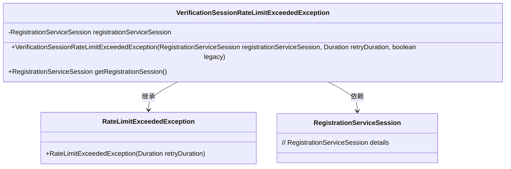
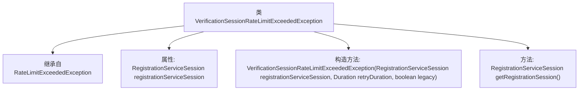

# 基础信息

|      |      |
|------|------|
| 名称 | VerificationSessionRateLimitExceededException |
| 编码语言 | .java |
| 代码路径 | Signal-Server/service/src/main/java/org/whispersystems/textsecuregcm/controllers/VerificationSessionRateLimitExceededException.java |
| 包名 | org.whispersystems.textsecuregcm.controllers |
| 依赖项 | ['org.whispersystems.textsecuregcm.entities.RegistrationServiceSession', 'javax.annotation.Nullable', 'java.time.Duration'] |
| 概述说明 | 验证会话速率限制异常类，含注册会话和重试时长。 |

# 说明

验证会话速率限制异常类用于处理会话验证过程中的速率限制问题。该类包含注册会话功能，用于记录和跟踪会话的创建与验证请求。同时，它还定义了重试时长，用于控制用户在达到速率限制后重新尝试验证的时间间隔。该异常类旨在确保系统在验证会话时能够有效管理请求频率，防止滥用或过载，从而维护系统的稳定性和安全性。

# 类列表 Class Summary

| 名称   | 类型  | 说明 |
|-------|------|-------------|
| VerificationSessionRateLimitExceededException | class | 验证会话速率限制异常类，包含注册会话和重试时长。 |

## 类 VerificationSessionRateLimitExceededException

|      |      |
|------|------|
| 访问范围 | public |
| 类型 | class |
| 名称 | VerificationSessionRateLimitExceededException |
| 说明 | 验证会话速率限制异常类，包含注册会话和重试时长。 |

### UML类图

这段代码定义了一个`VerificationSessionRateLimitExceededException`类，它继承自`RateLimitExceededException`类，并包含一个`RegistrationServiceSession`类型的私有成员变量。构造函数接受`RegistrationServiceSession`、`Duration`和`boolean`参数，并将`retryDuration`传递给父类的构造函数。`getRegistrationSession`方法用于返回`registrationServiceSession`。类图展示了继承关系和依赖关系。

### 内部方法调用关系图

这段代码定义了一个名为 `VerificationSessionRateLimitExceededException` 的异常类，它继承自 `RateLimitExceededException`。该类包含一个 `RegistrationServiceSession` 类型的属性 `registrationServiceSession`，并通过构造方法进行初始化。构造方法接受三个参数：`registrationServiceSession`、`retryDuration` 和 `legacy`，其中 `retryDuration` 可以为空。此外，类中还提供了一个 `getRegistrationSession` 方法，用于返回 `registrationServiceSession` 属性的值。

### 字段列表 Field List

| 名称  | 类型  | 说明 |
|-------|-------|------|
| registrationServiceSession | RegistrationServiceSession | 包含私有不可变的注册服务会话实例。 |

### 方法列表 Method List

| 名称  | 类型  | 说明 |
|-------|-------|------|
| getRegistrationSession | RegistrationServiceSession | 获取注册服务会话实例。 |

