# 基础信息

|      |      |
|------|------|
| 名称 | controllers |
| 编码语言 | .java |
| 代码路径 | Signal-Server/service/src/main/java/org/whispersystems/textsecuregcm/controllers |
| 包名 | Signal-Server.service.src.main.java.org.whispersystems.textsecuregcm.controllers |
| 概述说明 | Signal-Server控制器模块，涵盖附件、账户、限流、设备、备份、密钥、支付等功能，确保系统安全性和高效性。 |

# 说明

## 概述
该代码模块是一个功能丰富的后端服务模块，主要用于处理与账户管理、消息传递、设备验证、支付、捐赠、密钥管理、配置文件管理、订阅管理、备份管理等多种业务场景相关的操作。模块包含多个控制器，每个控制器负责处理特定的业务逻辑，并通过异常处理、限流机制、凭证生成等功能确保系统的安全性、稳定性和可扩展性。模块设计注重安全性，支持多种认证和验证机制，确保用户数据和系统资源的安全。

## 主要业务场景
1. **账户管理**：处理账户的注册、设备绑定、用户名管理、账户属性设置、账户链接等操作，确保账户信息的一致性和完整性。
2. **消息传递**：支持消息的发送、接收、报告功能，集成速率限制和垃圾检查机制，确保消息传递的安全性和及时性。
3. **设备验证与管理**：处理设备的验证、断言、设备信息获取、设备删除、设备链接等操作，确保设备在系统中的合法性和安全性。
4. **支付与捐赠**：支持通过Stripe和PayPal进行支付和捐赠，处理货币转换、收据验证、账户更新等操作，确保支付流程的准确性和安全性。
5. **密钥与证书管理**：管理密钥的生成、存储、状态检查，以及证书的生成和认证，确保密钥和证书的安全性和可用性。
6. **配置文件管理**：处理用户配置文件的设置、获取、验证，支持用户头像上传、徽章管理，确保用户信息的完整性和个性化。
7. **订阅管理**：处理订阅配置、支付方法、订阅信息的管理，确保订阅流程的顺利进行。
8. **备份与存档管理**：处理备份ID设置、媒体文件备份、备份删除等操作，确保数据备份的完整性和安全性。
9. **限流与异常处理**：通过限流机制和自定义异常类（如`RateLimitExceededException`、`DeviceLimitExceededException`等）控制请求频率，处理设备数量超限、会话验证速率限制等异常情况，确保系统的稳定性和安全性。
10. **凭证生成与管理**：生成有效期有限的凭证（如24小时的存储服务凭证、30天的SVR2服务凭证），确保短期操作的安全性和时效性。
11. **远程配置管理**：支持全局和动态配置的管理，确保系统配置的灵活性和可扩展性。
12. **挑战与验证**：处理挑战提交、验证码生成、会话验证等操作，确保用户身份验证的安全性和有效性。

该模块通过多种控制器和异常处理机制，全面覆盖了复杂的业务场景，确保系统在高效运行的同时，具备高度的安全性和可维护性。

### 包内部结构视图

```mermaid
graph TD
    controllers --> AttachmentControllerV4.java
    controllers --> AccountIdentityResponseBuilder.java
    controllers --> RateLimitExceededException.java
    controllers --> ProvisioningController.java
    controllers --> DeviceLimitExceededException.java
    controllers --> ArchiveController.java
    controllers --> KeyTransparencyController.java
    controllers --> SecureStorageController.java
    controllers --> DeviceCheckController.java
    controllers --> CallLinkController.java
    controllers --> ServerRejectedException.java
    controllers --> AccountController.java
    controllers --> MessageController.java
    controllers --> SecureValueRecovery2Controller.java
    controllers --> OneTimeDonationController.java
    controllers --> StaleDevicesException.java
    controllers --> KeepAliveController.java
    controllers --> VerificationSessionRateLimitExceededException.java
    controllers --> VerificationController.java
    controllers --> StickerController.java
    controllers --> SubscriptionController.java
    controllers --> ProfileController.java
    controllers --> DeviceController.java
    controllers --> KeysController.java
    controllers --> RemoteConfigController.java
    controllers --> MismatchedDevicesException.java
    controllers --> PaymentsController.java
    controllers --> DonationController.java
    controllers --> RegistrationController.java
    controllers --> DirectoryV2Controller.java
    controllers --> CallRoutingControllerV2.java
    controllers --> CertificateController.java
    controllers --> AccountControllerV2.java
    controllers --> ChallengeController.java
```

该流程图展示了Signal-Server项目中`controllers`目录下的所有文件及其层级关系。每个文件都直接隶属于`controllers`节点，反映了这些文件在项目中的组织结构。

# 文件列表 File List

| 名称   | 类型  | 说明 |
|-------|------|-------------|
| [AccountIdentityResponseBuilder.java](AccountIdentityResponseBuilder.md) | file | 构建包含账户信息、存储能力、时钟及权益的AccountIdentityResponse对象。 |
| [AttachmentControllerV4.java](AttachmentControllerV4.md) | file | AttachmentControllerV4支持多CDN协议，生成唯一密钥处理附件上传。 |
| [DeviceCheckController.java](DeviceCheckController.md) | file | DeviceCheckController处理设备验证，支持挑战获取、密钥注册和断言操作。 |
| [ArchiveController.java](ArchiveController.md) | file | ArchiveController负责备份操作，管理备份ID、ZK凭证、媒体文件及删除备份。 |
| [ProvisioningController.java](ProvisioningController.md) | file | ProvisioningController验证设备配置消息大小与速率限制，发送消息并返回状态码。 |
| [KeepAliveController.java](KeepAliveController.md) | file | KeepAliveController类管理WebSocket连接保活，监控本地订阅并记录断开时长。 |
| [SecureValueRecovery2Controller.java](SecureValueRecovery2Controller.md) | file | SecureValueRecovery2Controller提供SVR2认证和验证，支持30天有效期凭证。 |
| [MismatchedDevicesException.java](MismatchedDevicesException.md) | file | MismatchedDevicesException类处理设备不匹配异常，记录缺失和额外设备。 |
| [ProfileController.java](ProfileController.md) | file | ProfileController类负责用户配置文件的设置、获取、验证及头像上传等操作。 |
| [VerificationController.java](VerificationController.md) | file | 验证控制器处理用户注册验证，涵盖会话操作和验证码管理。 |
| [ChallengeController.java](ChallengeController.md) | file | ChallengeController负责处理挑战提交、推送请求，管理验证码、请求限制及约束检查。 |
| [CallRoutingControllerV2.java](CallRoutingControllerV2.md) | file | CallRoutingControllerV2类处理呼叫中继，支持IPv4、IPv6、URL，含错误计数和速率限制。 |
| [AccountControllerV2.java](AccountControllerV2.md) | file | AccountControllerV2类负责账户管理，涵盖改号、密钥分发、可发现性设置及数据报告生成。 |
| [CertificateController.java](CertificateController.md) | file | 证书控制器类负责生成交付证书和获取组认证凭证。 |
| [DirectoryV2Controller.java](DirectoryV2Controller.md) | file | DirectoryV2Controller类生成24小时有效联系人凭证，支持UTC时钟配置。 |
| [RegistrationController.java](RegistrationController.md) | file | 注册控制器处理账户注册、设备验证及统计记录，返回创建响应。 |
| [DonationController.java](DonationController.md) | file | 捐赠控制器负责验证收据、兑换并更新账户徽章信息。 |
| [PaymentsController.java](PaymentsController.md) | file | 支付控制器负责认证和货币转换，依赖外部服务及凭证生成器。 |
| [RemoteConfigController.java](RemoteConfigController.md) | file | 远程配置控制器提供API，支持全局和动态配置管理。 |
| [KeysController.java](KeysController.md) | file | KeysController负责密钥管理，支持获取、存储、检查及获取设备公钥。 |
| [DeviceController.java](DeviceController.md) | file | DeviceController类负责设备操作，涵盖获取、删除、链接、生成令牌、设置公钥、等待链接及传输存档。 |
| [SubscriptionController.java](SubscriptionController.md) | file | SubscriptionController处理订阅操作，支持多支付方式，管理配置和订阅信息。 |
| [StickerController.java](StickerController.md) | file | StickerController负责贴纸包上传及表单属性与签名生成。 |
| [VerificationSessionRateLimitExceededException.java](VerificationSessionRateLimitExceededException.md) | file | 验证会话速率限制异常类，含注册会话和重试时长。 |
| [StaleDevicesException.java](StaleDevicesException.md) | file | StaleDevicesException继承Exception，包含过时设备列表及获取方法。 |
| [OneTimeDonationController.java](OneTimeDonationController.md) | file | 控制器处理捐赠，支持Stripe和PayPal，验证货币金额，生成支付凭证。 |
| [MessageController.java](MessageController.md) | file | 消息控制器管理消息发送、接收及报告，支持单多收件人，含速率限制、垃圾检查和通知管理。 |
| [AccountController.java](AccountController.md) | file | AccountController负责设备注册、用户名管理、账户属性和链接操作。 |
| [ServerRejectedException.java](ServerRejectedException.md) | file | ServerRejectedException继承自Exception类。 |
| [CallLinkController.java](CallLinkController.md) | file | CallLinkController类处理通话链接凭证生成，支持POST请求，返回JSON凭证，处理错误响应。 |
| [SecureStorageController.java](SecureStorageController.md) | file | SecureStorageController生成24小时有效凭证，支持UUID认证。 |
| [KeyTransparencyController.java](KeyTransparencyController.md) | file | KeyTransparencyController处理密钥日志搜索、监控和获取，支持未认证访问、多种响应状态和限速。 |
| [DeviceLimitExceededException.java](DeviceLimitExceededException.md) | file | 设备数量超限异常，显示当前及最大设备数。 |
| [RateLimitExceededException.java](RateLimitExceededException.md) | file | RateLimitExceededException处理限流异常，支持重试和gRPC状态转换。 |

