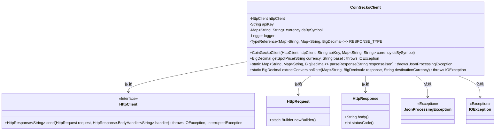
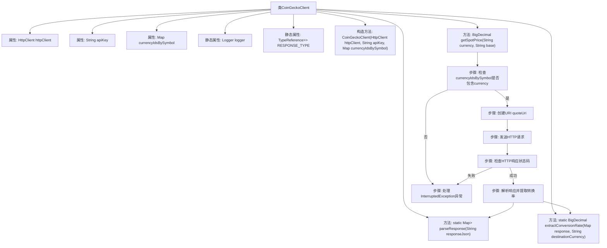

# 基础信息

|      |      |
|------|------|
| 名称 | CoinGeckoClient |
| 编码语言 | .java |
| 代码路径 | Signal-Server/service/src/main/java/org/whispersystems/textsecuregcm/currency/CoinGeckoClient.java |
| 包名 | org.whispersystems.textsecuregcm.currency |
| 依赖项 | ['com.fasterxml.jackson.core.JsonProcessingException', 'com.fasterxml.jackson.core.type.TypeReference', 'com.google.common.annotations.VisibleForTesting', 'java.io.IOException', 'java.math.BigDecimal', 'java.net.URI', 'java.net.http.HttpClient', 'java.net.http.HttpRequest', 'java.net.http.HttpResponse', 'java.util.Locale', 'java.util.Map', 'org.slf4j.Logger', 'org.slf4j.LoggerFactory', 'org.whispersystems.textsecuregcm.util.SystemMapper'] |
| 概述说明 | CoinGeckoClient类用于获取加密货币现货价格，支持HTTP请求、API密钥和货币符号映射。 |

# 说明

CoinGeckoClient类是一个用于获取加密货币现货价格的工具，它集成了HTTP请求功能，支持API密钥的使用，并提供了货币符号的映射功能，以便准确识别和查询不同加密货币的价格信息。

# 类列表 Class Summary

| 名称   | 类型  | 说明 |
|-------|------|-------------|
| CoinGeckoClient | class | CoinGeckoClient类用于获取加密货币现货价格，包含HTTP请求、API密钥和货币符号映射。 |

## 类 CoinGeckoClient

|      |      |
|------|------|
| 访问范围 | public |
| 类型 | class |
| 名称 | CoinGeckoClient |
| 说明 | CoinGeckoClient类用于获取加密货币现货价格，包含HTTP请求、API密钥和货币符号映射。 |

### UML类图

类图描述：
`CoinGeckoClient` 类用于与 CoinGecko API 进行交互，获取加密货币的现货价格。它依赖于 `HttpClient` 来发送 HTTP 请求，并使用 `HttpRequest` 和 `HttpResponse` 处理请求和响应。类中包含解析 JSON 响应和提取转换率的方法，并处理可能出现的 `JsonProcessingException` 和 `IOException` 异常。

### 内部方法调用关系图

**描述：**  
该流程图描述了`CoinGeckoClient`类的主要结构和功能。`CoinGeckoClient`类用于通过HTTP请求获取加密货币的现货价格。流程从`getSpotPrice`方法开始，首先检查传入的货币符号是否有效，然后构建请求URI并发送HTTP请求。根据响应状态码，决定是否继续解析响应并提取转换率，或者在请求失败时抛出异常。流程图还展示了类的构造方法和两个静态辅助方法`parseResponse`和`extractConversionRate`的调用关系。

### 字段列表 Field List

| 名称  | 类型  | 说明 |
|-------|-------|------|
| httpClient | HttpClient | 私有且不可变的HttpClient实例。 |
| currencyIdsBySymbol | Map<String, String> | 私有映射存储货币符号与ID对应关系。 |
| apiKey | String | 声明一个私有的不可变字符串变量apiKey。 |
| logger = LoggerFactory.getLogger(CoinGeckoClient.class) | Logger | CoinGeckoClient类中定义了一个静态且私有的Logger实例。 |
| RESPONSE_TYPE = new TypeReference<>() {} | TypeReference<Map<String, Map<String, BigDecimal>>> | 定义静态常量RESPONSE_TYPE，用于映射字符串键到嵌套的字符串与BigDecimal映射。 |

### 方法列表 Method List

| 名称  | 类型  | 说明 |
|-------|-------|------|
| extractConversionRate | BigDecimal | 从响应中提取指定货币的汇率，若不存在则抛出异常。 |
| getSpotPrice | BigDecimal | 获取指定货币的实时价格，处理异常和响应状态码。 |
| parseResponse | Map<String, Map<String,BigDecimal>> | 解析JSON响应并返回映射类型结果。 |

