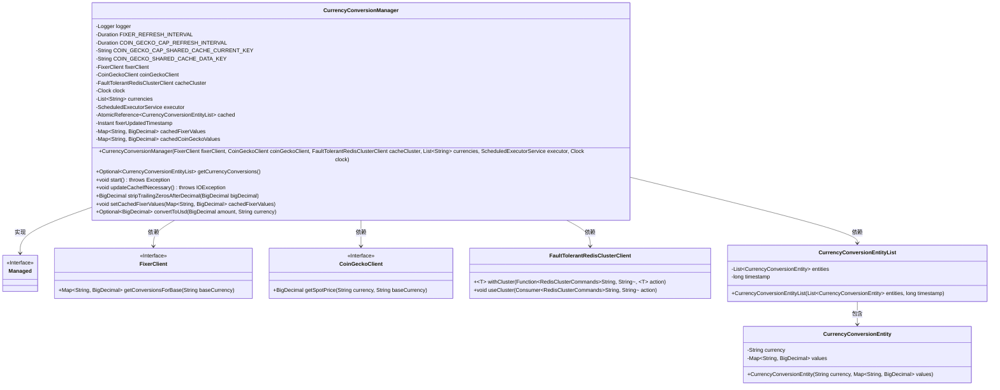

# 基础信息

|      |      |
|------|------|
| 名称 | CurrencyConversionManager |
| 编码语言 | .java |
| 代码路径 | Signal-Server/service/src/main/java/org/whispersystems/textsecuregcm/currency/CurrencyConversionManager.java |
| 包名 | org.whispersystems.textsecuregcm.currency |
| 依赖项 | ['com.google.common.annotations.VisibleForTesting', 'io.dropwizard.lifecycle.Managed', 'io.lettuce.core.SetArgs', 'java.io.IOException', 'java.math.BigDecimal', 'java.math.RoundingMode', 'java.time.Clock', 'java.time.Duration', 'java.time.Instant', 'java.util.HashMap', 'java.util.LinkedList', 'java.util.List', 'java.util.Locale', 'java.util.Map', 'java.util.Optional', 'java.util.concurrent.ScheduledExecutorService', 'java.util.concurrent.TimeUnit', 'java.util.concurrent.atomic.AtomicReference', 'org.slf4j.Logger', 'org.slf4j.LoggerFactory', 'org.whispersystems.textsecuregcm.entities.CurrencyConversionEntity', 'org.whispersystems.textsecuregcm.entities.CurrencyConversionEntityList', 'org.whispersystems.textsecuregcm.redis.FaultTolerantRedisClusterClient'] |
| 概述说明 | CurrencyConversionManager管理货币转换，定时更新缓存，支持多种客户端。 |

# 说明

CurrencyConversionManager负责管理货币转换，具备定时更新缓存的功能，支持Fixer和CoinGecko两种客户端，提供全面的货币转换服务。

# 类列表 Class Summary

| 名称   | 类型  | 说明 |
|-------|------|-------------|
| CurrencyConversionManager | class | CurrencyConversionManager管理货币转换，定时更新缓存，支持Fixer和CoinGecko客户端，提供货币转换功能。 |

## 类 CurrencyConversionManager

|      |      |
|------|------|
| 访问范围 | public |
| 类型 | class |
| 名称 | CurrencyConversionManager |
| 说明 | CurrencyConversionManager管理货币转换，定时更新缓存，支持Fixer和CoinGecko客户端，提供货币转换功能。 |

### UML类图

**描述**：  
`CurrencyConversionManager` 是一个用于管理货币转换的类，实现了 `Managed` 接口。它依赖于 `FixerClient` 和 `CoinGeckoClient` 来获取货币转换率，并使用 `FaultTolerantRedisClusterClient` 进行缓存管理。该类通过定期更新缓存来确保转换率的实时性，并提供了将任意货币转换为美元的功能。`CurrencyConversionEntityList` 和 `CurrencyConversionEntity` 用于存储和表示转换后的货币数据。

### 内部方法调用关系图

```mermaid
graph TD
    A["类CurrencyConversionManager"]
    B["属性: Logger logger"]
    C["属性: Duration FIXER_REFRESH_INTERVAL"]
    D["属性: Duration COIN_GECKO_CAP_REFRESH_INTERVAL"]
    E["属性: String COIN_GECKO_CAP_SHARED_CACHE_CURRENT_KEY"]
    F["属性: String COIN_GECKO_SHARED_CACHE_DATA_KEY"]
    G["属性: FixerClient fixerClient"]
    H["属性: CoinGeckoClient coinGeckoClient"]
    I["属性: FaultTolerantRedisClusterClient cacheCluster"]
    J["属性: Clock clock"]
    K["属性: List<String> currencies"]
    L["属性: ScheduledExecutorService executor"]
    M["属性: AtomicReference<CurrencyConversionEntityList> cached"]
    N["属性: Instant fixerUpdatedTimestamp"]
    O["属性: Map<String, BigDecimal> cachedFixerValues"]
    P["属性: Map<String, BigDecimal> cachedCoinGeckoValues"]
    Q["构造方法: CurrencyConversionManager(FixerClient, CoinGeckoClient, FaultTolerantRedisClusterClient, List<String>, ScheduledExecutorService, Clock)"]
    R["方法: Optional<CurrencyConversionEntityList> getCurrencyConversions()"]
    S["方法: void start()"]
    T["方法: void updateCacheIfNecessary()"]
    U["方法: BigDecimal stripTrailingZerosAfterDecimal(BigDecimal)"]
    V["方法: void setCachedFixerValues(Map<String, BigDecimal>)"]
    W["方法: Optional<BigDecimal> convertToUsd(BigDecimal, String)"]

    A --> B
    A --> C
    A --> D
    A --> E
    A --> F
    A --> G
    A --> H
    A --> I
    A --> J
    A --> K
    A --> L
    A --> M
    A --> N
    A --> O
    A --> P
    A --> Q
    A --> R
    A --> S
    A --> T
    A --> U
    A --> V
    A --> W
```

**描述：**  
`CurrencyConversionManager` 类负责管理货币转换操作，主要功能包括定期更新缓存中的货币转换数据、从外部API获取汇率信息、以及将金额转换为美元。类中包含多个属性用于存储配置信息和缓存数据，构造方法用于初始化这些属性。`start` 方法启动定期任务，`updateCacheIfNecessary` 方法负责更新缓存数据，`convertToUsd` 方法用于将指定货币金额转换为美元。

### 字段列表 Field List

| 名称  | 类型  | 说明 |
|-------|-------|------|
| fixerUpdatedTimestamp = Instant.MIN | Instant | 私有变量fixerUpdatedTimestamp初始化为最小时间戳。 |
| cachedCoinGeckoValues | Map<String, BigDecimal> | 私有映射存储币值缓存。 |
| currencies | List<String> | 私有且不可变的字符串列表，用于存储货币数据。 |
| FIXER_REFRESH_INTERVAL = Duration.ofHours(2) | Duration | 测试可见的固定刷新间隔为2小时。 |
| cached = new AtomicReference<>(null) | AtomicReference<CurrencyConversionEntityList> | 私有原子引用缓存货币转换实体列表，初始值为空。 |
| clock | Clock | 类中定义了一个私有且不可变的Clock类型变量clock。 |
| coinGeckoClient | CoinGeckoClient | 私有变量coinGeckoClient为CoinGeckoClient类型。 |
| logger = LoggerFactory.getLogger(CurrencyConversionManager.class) | Logger | CurrencyConversionManager类中定义了一个私有的静态Logger实例。 |
| COIN_GECKO_CAP_SHARED_CACHE_CURRENT_KEY = "CurrencyConversionManager::CoinGeckoCacheCurrent" | String | 测试可见的静态字符串常量，用于币值转换管理缓存键。 |
| cacheCluster | FaultTolerantRedisClusterClient | 私有终态变量cacheCluster，类型为FaultTolerantRedisClusterClient。 |
| fixerClient | FixerClient | 私有不可变的FixerClient实例。 |
| COIN_GECKO_CAP_REFRESH_INTERVAL = Duration.ofMinutes(5) | Duration | 私有静态常量，定义CoinGecko数据刷新间隔为5分钟。 |
| cachedFixerValues | Map<String, BigDecimal> | 私有缓存映射，键为字符串，值为BigDecimal类型。 |
| executor | ScheduledExecutorService | 私有且不可变的定时任务执行器。 |
| COIN_GECKO_SHARED_CACHE_DATA_KEY = "CurrencyConversionManager::CoinGeckoCacheData" | String | COIN_GECKO_SHARED_CACHE_DATA_KEY定义为货币转换管理器的缓存数据键。 |

### 方法列表 Method List

| 名称  | 类型  | 说明 |
|-------|-------|------|
| setCachedFixerValues | void | 测试可见方法，设置缓存汇率值。 |
| stripTrailingZerosAfterDecimal | BigDecimal | 去除BigDecimal小数末尾零并调整精度。 |
| start | void | 方法定期更新缓存，每15秒执行一次，出错时记录警告。 |
| updateCacheIfNecessary | void | 更新缓存，获取并处理货币汇率数据，存储到本地和共享缓存中。 |
| convertToUsd | Optional<BigDecimal> | 将金额转换为美元，若币种为USD则直接返回，否则使用缓存汇率计算。 |
| getCurrencyConversions | Optional<CurrencyConversionEntityList> | 该方法返回可选的货币转换实体列表，若缓存存在则返回其值。 |

