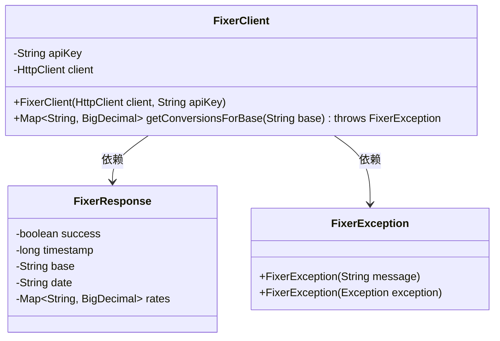
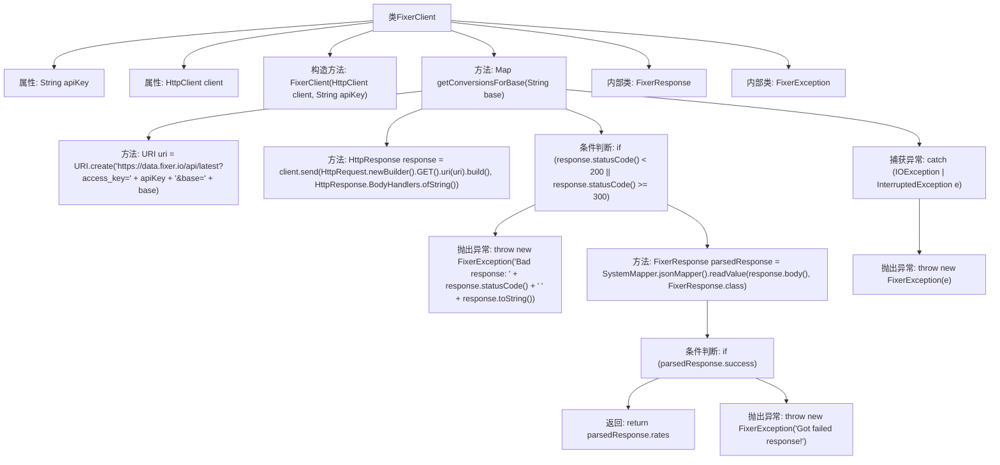

# 基础信息

|      |      |
|------|------|
| 名称 | FixerClient |
| 编码语言 | .java |
| 代码路径 | Signal-Server/service/src/main/java/org/whispersystems/textsecuregcm/currency/FixerClient.java |
| 包名 | org.whispersystems.textsecuregcm.currency |
| 依赖项 | ['com.fasterxml.jackson.annotation.JsonProperty', 'java.io.IOException', 'java.math.BigDecimal', 'java.net.URI', 'java.net.http.HttpClient', 'java.net.http.HttpRequest', 'java.net.http.HttpResponse', 'java.util.Map', 'org.whispersystems.textsecuregcm.util.SystemMapper'] |
| 概述说明 | FixerClient类用于获取货币汇率，包含API密钥和HTTP客户端。 |

# 说明

FixerClient类是一个用于获取货币汇率的工具，包含API密钥和HTTP客户端。该类提供了获取基础货币汇率的方法，使用户能够方便地查询和处理汇率数据。通过集成API密钥和HTTP客户端，FixerClient类能够有效地与外部汇率服务进行通信，确保数据的准确性和实时性。

# 类列表 Class Summary

| 名称   | 类型  | 说明 |
|-------|------|-------------|
| FixerClient | class | FixerClient类用于获取货币汇率，包含API密钥和HTTP客户端，提供获取基础货币汇率的方法。 |

## 类 FixerClient

|      |      |
|------|------|
| 访问范围 | public |
| 类型 | class |
| 名称 | FixerClient |
| 说明 | FixerClient类用于获取货币汇率，包含API密钥和HTTP客户端，提供获取基础货币汇率的方法。 |

### UML类图

这段代码定义了一个 `FixerClient` 类，用于与 Fixer API 进行交互，获取货币转换率。`FixerClient` 类包含一个私有成员 `apiKey` 和 `HttpClient`，并通过构造函数初始化。`getConversionsForBase` 方法用于发送 HTTP 请求并解析响应，返回货币转换率的映射。`FixerResponse` 是一个内部类，用于存储 API 响应的数据。`FixerException` 是一个自定义异常类，用于处理请求过程中的异常情况。

### 内部方法调用关系图

这段代码描述了一个名为 `FixerClient` 的类，该类用于与 Fixer API 进行交互，获取货币转换率。代码通过构造方法初始化 API 密钥和 HTTP 客户端，并通过 `getConversionsForBase` 方法发送请求并处理响应。如果响应状态码不在 200 到 299 之间，或者 API 返回失败状态，代码会抛出 `FixerException` 异常。内部类 `FixerResponse` 用于解析 API 响应，`FixerException` 用于处理异常情况。

### 字段列表 Field List

| 名称  | 类型  | 说明 |
|-------|-------|------|
| apiKey | String | 声明一个私有的不可变字符串变量apiKey。 |
| client | HttpClient | 定义了一个私有的HttpClient类型变量client。 |

### 方法列表 Method List

| 名称  | 类型  | 说明 |
|-------|-------|------|
| getConversionsForBase | Map<String, BigDecimal> | 获取指定货币的汇率转换数据，处理异常并返回结果。 |

