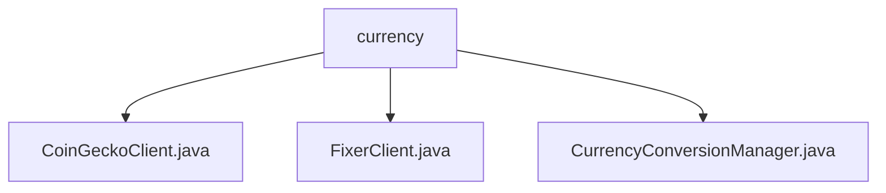

# 基础信息

|      |      |
|------|------|
| 名称 | currency |
| 编码语言 | .java |
| 代码路径 | Signal-Server/service/src/main/java/org/whispersystems/textsecuregcm/currency |
| 包名 | Signal-Server.service.src.main.java.org.whispersystems.textsecuregcm.currency |
| 概述说明 | CoinGeckoClient获取加密货币价格，FixerClient获取汇率，CurrencyConversionManager管理货币转换。 |

# 说明

## 概述

该代码模块主要提供加密货币和法定货币的实时价格获取与转换服务。模块的核心功能包括通过集成外部API获取加密货币现货价格和货币汇率，并支持定时更新缓存以确保数据的实时性和准确性。模块包含三个主要类：`CoinGeckoClient`、`FixerClient` 和 `CurrencyConversionManager`，分别负责加密货币价格获取、汇率获取以及货币转换的管理。

## 主要业务场景

1. **加密货币价格获取**：  
   `CoinGeckoClient` 类用于从外部API获取加密货币的现货价格。它集成了HTTP请求功能，支持API密钥的使用，并提供货币符号的映射功能，以便准确识别和查询不同加密货币的价格信息。适用于需要实时获取加密货币价格的场景，如交易平台或投资分析工具。

2. **货币汇率获取**：  
   `FixerClient` 类用于从外部API获取法定货币的汇率信息。它包含API密钥和HTTP客户端，提供获取基础货币汇率的方法，使用户能够方便地查询和处理汇率数据。适用于需要实时汇率转换的场景，如跨境支付或外汇交易系统。

3. **货币转换管理**：  
   `CurrencyConversionManager` 类负责管理货币转换服务，支持 `FixerClient` 和 `CoinGeckoClient` 两种客户端。它具备定时更新缓存的功能，确保货币转换数据的实时性和准确性。适用于需要综合加密货币和法定货币转换的场景，如多币种钱包或国际支付系统。

### 包内部结构视图

该流程图展示了Signal-Server项目中`currency`目录下的文件结构。`currency`目录包含三个文件：`CoinGeckoClient.java`、`FixerClient.java`和`CurrencyConversionManager.java`。这些文件都与货币转换和汇率管理相关，分别负责与不同API的交互和货币转换的逻辑处理。

# 文件列表 File List

| 名称   | 类型  | 说明 |
|-------|------|-------------|
| [FixerClient.java](FixerClient.md) | file | FixerClient类用于获取货币汇率，包含API密钥和HTTP客户端。 |
| [CurrencyConversionManager.java](CurrencyConversionManager.md) | file | CurrencyConversionManager管理货币转换，定时更新缓存，支持多种客户端。 |
| [CoinGeckoClient.java](CoinGeckoClient.md) | file | CoinGeckoClient类用于获取加密货币现货价格，支持HTTP请求、API密钥和货币符号映射。 |

