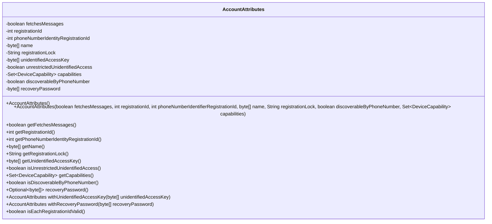

# 基础信息

|      |      |
|------|------|
| 名称 | AccountAttributes |
| 编码语言 | .java |
| 代码路径 | Signal-Server/service/src/main/java/org/whispersystems/textsecuregcm/entities/AccountAttributes.java |
| 包名 | org.whispersystems.textsecuregcm.entities |
| 依赖项 | ['org.whispersystems.textsecuregcm.util.RegistrationIdValidator.validRegistrationId', 'com.fasterxml.jackson.annotation.JsonProperty', 'com.fasterxml.jackson.databind.annotation.JsonDeserialize', 'com.fasterxml.jackson.databind.annotation.JsonSerialize', 'com.google.common.annotations.VisibleForTesting', 'jakarta.validation.constraints.AssertTrue', 'jakarta.validation.constraints.Size', 'java.util.Optional', 'java.util.Set', 'javax.annotation.Nullable', 'org.whispersystems.textsecuregcm.auth.UnidentifiedAccessUtil', 'org.whispersystems.textsecuregcm.storage.DeviceCapability', 'org.whispersystems.textsecuregcm.util.ByteArrayAdapter', 'org.whispersystems.textsecuregcm.util.DeviceCapabilityAdapter', 'org.whispersystems.textsecuregcm.util.ExactlySize'] |
| 概述说明 | AccountAttributes类管理账户属性，支持测试和验证。 |

# 说明

AccountAttributes类用于管理账户的相关属性，包括消息获取、注册ID、名称、注册锁、设备能力等信息。该类支持对这些属性进行测试和验证，确保账户信息的准确性和完整性。通过该类，可以有效地管理和控制账户的各项属性，满足系统对账户管理的需求。

# 类列表 Class Summary

| 名称   | 类型  | 说明 |
|-------|------|-------------|
| AccountAttributes | class | AccountAttributes类包含账户属性，如消息获取、注册ID、名称、注册锁、设备能力等，支持测试和验证。 |

## 类 AccountAttributes

|      |      |
|------|------|
| 访问范围 | public |
| 类型 | class |
| 名称 | AccountAttributes |
| 说明 | AccountAttributes类包含账户属性，如消息获取、注册ID、名称、注册锁、设备能力等，支持测试和验证。 |

### UML类图

### 描述
`AccountAttributes` 类用于存储和管理账户的相关属性，包括消息获取状态、注册ID、电话号码标识注册ID、名称、注册锁、未识别访问密钥、无限制未识别访问状态、设备能力集、电话号码可发现性以及恢复密码等。该类提供了多个构造函数和getter方法，以及用于测试的`with`方法，用于设置特定属性。此外，`isEachRegistrationIdValid`方法用于验证注册ID的有效性。

### 内部方法调用关系图

```mermaid
graph TD
    A["类AccountAttributes"]
    B["属性: boolean fetchesMessages"]
    C["属性: int registrationId"]
    D["属性: int phoneNumberIdentityRegistrationId"]
    E["属性: byte[] name"]
    F["属性: String registrationLock"]
    G["属性: byte[] unidentifiedAccessKey"]
    H["属性: boolean unrestrictedUnidentifiedAccess"]
    I["属性: Set<DeviceCapability> capabilities"]
    J["属性: boolean discoverableByPhoneNumber"]
    K["属性: byte[] recoveryPassword"]
    L["构造方法: AccountAttributes()"]
    M["构造方法: AccountAttributes(boolean fetchesMessages, int registrationId, int phoneNumberIdentifierRegistrationId, byte[] name, String registrationLock, boolean discoverableByPhoneNumber, Set<DeviceCapability> capabilities)"]
    N["方法: boolean getFetchesMessages()"]
    O["方法: int getRegistrationId()"]
    P["方法: int getPhoneNumberIdentityRegistrationId()"]
    Q["方法: byte[] getName()"]
    R["方法: String getRegistrationLock()"]
    S["方法: byte[] getUnidentifiedAccessKey()"]
    T["方法: boolean isUnrestrictedUnidentifiedAccess()"]
    U["方法: Set<DeviceCapability> getCapabilities()"]
    V["方法: boolean isDiscoverableByPhoneNumber()"]
    W["方法: Optional<byte[]> recoveryPassword()"]
    X["方法: AccountAttributes withUnidentifiedAccessKey(byte[] unidentifiedAccessKey)"]
    Y["方法: AccountAttributes withRecoveryPassword(byte[] recoveryPassword)"]
    Z["方法: boolean isEachRegistrationIdValid()"]

    A --> B
    A --> C
    A --> D
    A --> E
    A --> F
    A --> G
    A --> H
    A --> I
    A --> J
    A --> K
    A --> L
    A --> M
    A --> N
    A --> O
    A --> P
    A --> Q
    A --> R
    A --> S
    A --> T
    A --> U
    A --> V
    A --> W
    A --> X
    A --> Y
    A --> Z
```

这段代码定义了一个名为`AccountAttributes`的类，该类包含多个属性，如`fetchesMessages`、`registrationId`、`phoneNumberIdentityRegistrationId`等，并且提供了相应的getter方法。类中还包括两个构造方法，一个默认构造方法和一个用于测试的构造方法。此外，类中还定义了一些辅助方法，如`withUnidentifiedAccessKey`、`withRecoveryPassword`和`isEachRegistrationIdValid`，用于设置属性和验证注册ID的有效性。这个类主要用于管理和操作账户相关的属性。

### 字段列表 Field List

| 名称  | 类型  | 说明 |
|-------|-------|------|
| registrationId | int | 属性registrationId使用JsonProperty注解。 |
| unrestrictedUnidentifiedAccess | boolean | 属性定义：允许无限制的匿名访问。 |
| phoneNumberIdentityRegistrationId | int | PNI注册ID为整型变量。 |
| discoverableByPhoneNumber = true | boolean | 属性discoverableByPhoneNumber默认值为true。 |
| registrationLock | String | 注册锁属性声明，使用JsonProperty注解。 |
| fetchesMessages | boolean | 该代码定义了一个私有布尔变量`fetchesMessages`，用于表示是否获取消息。 |
| name | byte[] | 字节数组属性name，最大长度225，支持JSON序列化和反序列化。 |
| recoveryPassword = null | byte[] | 可空字节数组，用于存储恢复密码，使用自定义反序列化器。 |
| capabilities | Set<DeviceCapability> | 设备能力集合，支持JSON序列化与反序列化，可为空。 |
| unidentifiedAccessKey | byte[] | 未识别访问密钥的字节数组属性，大小限制为0到未识别访问密钥长度。 |

### 方法列表 Method List

| 名称  | 类型  | 说明 |
|-------|-------|------|
| getFetchesMessages | boolean | 该方法返回布尔值，表示是否获取消息。 |
| getRegistrationId | int | 获取注册ID的公共方法。 |
| isEachRegistrationIdValid | boolean | 验证注册ID和电话号码ID的有效性。 |
| isDiscoverableByPhoneNumber | boolean | 该方法返回一个布尔值，表示是否可通过电话号码发现。 |
| getRegistrationLock | String | 获取注册锁的方法，返回registrationLock值。 |
| getPhoneNumberIdentityRegistrationId | int | 获取电话号码身份注册ID的方法。 |
| getUnidentifiedAccessKey | byte[] | 获取未识别访问密钥的字节数组。 |
| recoveryPassword | Optional<byte[]> | 该方法返回一个包含恢复密码的可选字节数组。 |
| withRecoveryPassword | AccountAttributes | 公开测试方法，设置账户恢复密码并返回当前对象。 |
| getName | byte[] | 该方法返回名为name的字节数组。 |
| withUnidentifiedAccessKey | AccountAttributes | 测试可见方法，设置未识别访问密钥并返回当前对象。 |
| isUnrestrictedUnidentifiedAccess | boolean | 该方法返回未受限制的未识别访问状态。 |
| getCapabilities | Set<DeviceCapability> | 方法返回设备能力集合，可能为空。 |

