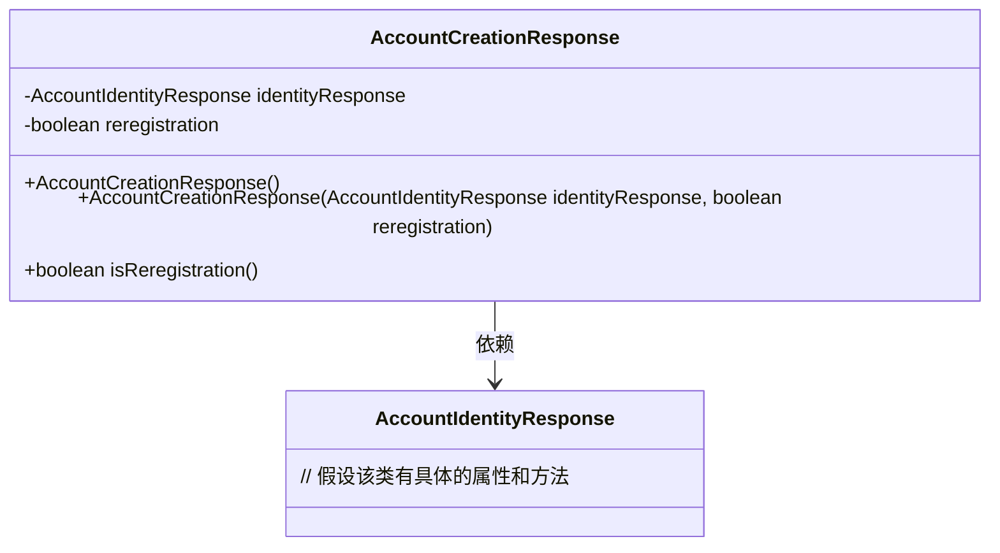
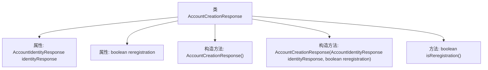

# 基础信息

|      |      |
|------|------|
| 名称 | AccountCreationResponse |
| 编码语言 | .java |
| 代码路径 | Signal-Server/service/src/main/java/org/whispersystems/textsecuregcm/entities/AccountCreationResponse.java |
| 包名 | org.whispersystems.textsecuregcm.entities |
| 依赖项 | ['com.fasterxml.jackson.annotation.JsonUnwrapped', 'io.swagger.v3.oas.annotations.media.Schema'] |
| 概述说明 | 账户创建响应类包含身份信息和重新注册标识。 |

# 说明

账户创建响应类是一个用于处理账户创建请求的响应结构，主要包含两个关键信息：身份响应和是否重新注册标识。身份响应用于返回与账户创建相关的身份验证或确认信息，而是否重新注册标识则用于指示当前账户是否属于重新注册的情况。该响应类旨在提供账户创建过程中所需的核心反馈，确保用户能够明确了解账户创建的状态和结果。

# 类列表 Class Summary

| 名称   | 类型  | 说明 |
|-------|------|-------------|
| AccountCreationResponse | class | 账户创建响应类，包含身份响应和是否重新注册标识。 |

## 类 AccountCreationResponse

|      |      |
|------|------|
| 访问范围 | public |
| 类型 | class |
| 名称 | AccountCreationResponse |
| 说明 | 账户创建响应类，包含身份响应和是否重新注册标识。 |

### UML类图

**描述：**  
`AccountCreationResponse` 类用于表示账户创建响应，包含一个 `AccountIdentityResponse` 类型的 `identityResponse` 属性和一个 `boolean` 类型的 `reregistration` 属性。该类提供了两个构造函数，分别用于无参初始化和带参初始化，并提供了一个 `isReregistration` 方法用于获取 `reregistration` 的值。`AccountCreationResponse` 类依赖于 `AccountIdentityResponse` 类，后者可能包含账户身份相关的具体信息。

### 内部方法调用关系图

这段代码定义了一个名为`AccountCreationResponse`的类，该类包含两个属性：`identityResponse`和`reregistration`。类中提供了两个构造方法，一个无参构造方法和一个带参构造方法，用于初始化这两个属性。此外，类中还提供了一个`isReregistration`方法，用于返回`reregistration`属性的值。该类的设计主要用于处理账户创建响应，记录账户身份信息和是否重新注册的状态。

### 字段列表 Field List

| 名称  | 类型  | 说明 |
|-------|-------|------|
| identityResponse | AccountIdentityResponse | 包含AccountIdentityResponse对象的身份响应信息。 |
| reregistration | boolean | 若为真，表示该号码已注册过账户。 |

### 方法列表 Method List

| 名称  | 类型  | 说明 |
|-------|-------|------|
| isReregistration | boolean | 判断是否为重新注册的方法。 |

