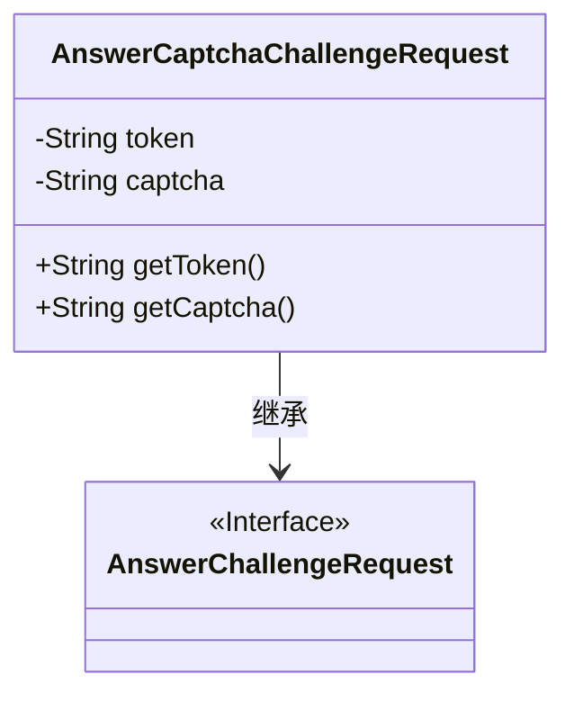
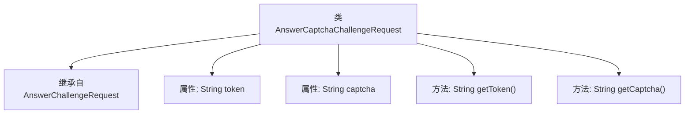

# 基础信息

|      |      |
|------|------|
| 名称 | AnswerCaptchaChallengeRequest |
| 编码语言 | .java |
| 代码路径 | Signal-Server/service/src/main/java/org/whispersystems/textsecuregcm/entities/AnswerCaptchaChallengeRequest.java |
| 包名 | org.whispersystems.textsecuregcm.entities |
| 依赖项 | ['io.swagger.v3.oas.annotations.media.Schema', 'jakarta.validation.constraints.NotBlank'] |
| 概述说明 | 类AnswerCaptchaChallengeRequest继承AnswerChallengeRequest，包含token和captcha字段及其获取方法。 |

# 说明

类AnswerCaptchaChallengeRequest继承自AnswerChallengeRequest，包含两个关键字段：token和captcha，并提供了相应的获取方法。token字段用于标识验证请求，captcha字段则存储用户输入的验证码信息。该类的设计旨在处理验证码挑战的响应，确保验证过程的安全性和准确性。

# 类列表 Class Summary

| 名称   | 类型  | 说明 |
|-------|------|-------------|
| AnswerCaptchaChallengeRequest | class | 类AnswerCaptchaChallengeRequest继承AnswerChallengeRequest，包含token和captcha字段及获取方法。 |

## 类 AnswerCaptchaChallengeRequest

|      |      |
|------|------|
| 访问范围 | public |
| 类型 | class |
| 名称 | AnswerCaptchaChallengeRequest |
| 说明 | 类AnswerCaptchaChallengeRequest继承AnswerChallengeRequest，包含token和captcha字段及获取方法。 |

### UML类图

**描述：**  
`AnswerCaptchaChallengeRequest` 类继承自 `AnswerChallengeRequest` 接口，包含两个私有属性 `token` 和 `captcha`，分别用于存储服务器返回的令牌和已解决的验证码。该类提供了 `getToken` 和 `getCaptcha` 方法用于获取这两个属性的值。通过继承关系，`AnswerCaptchaChallengeRequest` 实现了 `AnswerChallengeRequest` 接口的功能。

### 内部方法调用关系图

该流程图描述了`AnswerCaptchaChallengeRequest`类的结构，该类继承自`AnswerChallengeRequest`，并包含两个属性`token`和`captcha`，以及两个方法`getToken()`和`getCaptcha()`。流程图清晰地展示了类与父类的关系以及类内部的属性和方法的调用关系。

### 字段列表 Field List

| 名称  | 类型  | 说明 |
|-------|-------|------|
| token | String | 服务器428响应的token字段值，不能为空。 |
| captcha | String | captcha字段表示已解决的验证码字符串，不能为空。 |

### 方法列表 Method List

| 名称  | 类型  | 说明 |
|-------|-------|------|
| getToken | String | 获取并返回token值。 |
| getCaptcha | String | 获取验证码的方法，返回字符串类型。 |

