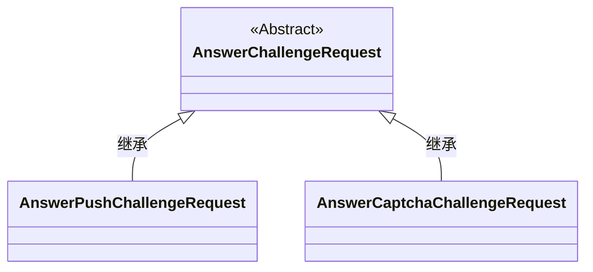
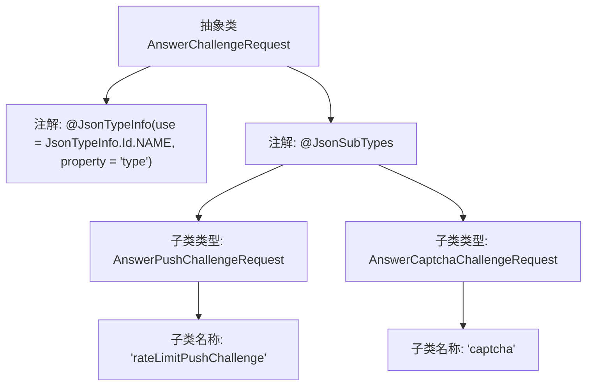

# 基础信息

|      |      |
|------|------|
| 名称 | AnswerChallengeRequest |
| 编码语言 | .java |
| 代码路径 | Signal-Server/service/src/main/java/org/whispersystems/textsecuregcm/entities/AnswerChallengeRequest.java |
| 包名 | org.whispersystems.textsecuregcm.entities |
| 依赖项 | ['com.fasterxml.jackson.annotation.JsonSubTypes', 'com.fasterxml.jackson.annotation.JsonTypeInfo'] |
| 概述说明 | 抽象类AnswerChallengeRequest支持rateLimitPushChallenge和captcha两种类型。 |

# 说明

定义了一个抽象类AnswerChallengeRequest，该类支持两种类型的挑战：rateLimitPushChallenge和captcha。rateLimitPushChallenge通常用于限制请求频率，防止滥用；captcha则用于验证用户是否为人类，防止自动化攻击。通过支持这两种挑战类型，该抽象类能够应对多种安全验证需求，确保系统的安全性和稳定性。

# 类列表 Class Summary

| 名称   | 类型  | 说明 |
|-------|------|-------------|
| AnswerChallengeRequest | class | 定义抽象类AnswerChallengeRequest，支持rateLimitPushChallenge和captcha两种类型。 |

## 类 AnswerChallengeRequest

|      |      |
|------|------|
| 访问范围 | @JsonTypeInfo(use = JsonTypeInfo.Id.NAME, property = "type");@JsonSubTypes({;    @JsonSubTypes.Type(value = AnswerPushChallengeRequest.class, name = "rateLimitPushChallenge"),;    @JsonSubTypes.Type(value = AnswerCaptchaChallengeRequest.class, name = "captcha");});public abstract |
| 类型 | class |
| 名称 | AnswerChallengeRequest |
| 说明 | 定义抽象类AnswerChallengeRequest，支持rateLimitPushChallenge和captcha两种类型。 |

### UML类图

这段代码定义了一个抽象类 `AnswerChallengeRequest`，并通过 `@JsonSubTypes` 注解指定了两个具体的子类 `AnswerPushChallengeRequest` 和 `AnswerCaptchaChallengeRequest`。这些子类分别代表了不同类型的挑战请求，`AnswerPushChallengeRequest` 用于处理限速推送挑战，而 `AnswerCaptchaChallengeRequest` 用于处理验证码挑战。抽象类 `AnswerChallengeRequest` 提供了共同的基类，子类通过继承来扩展具体的功能。

### 内部方法调用关系图

这段代码定义了一个抽象类 `AnswerChallengeRequest`，并使用了 Jackson 库的注解 `@JsonTypeInfo` 和 `@JsonSubTypes` 来支持多态 JSON 反序列化。`@JsonTypeInfo` 指定了使用类型名称来标识子类，`@JsonSubTypes` 列出了两个具体的子类 `AnswerPushChallengeRequest` 和 `AnswerCaptchaChallengeRequest`，并分别为它们指定了名称 `rateLimitPushChallenge` 和 `captcha`。这些注解帮助 Jackson 在反序列化时根据 `type` 属性识别并实例化正确的子类。

### 字段列表 Field List

| 名称  | 类型  | 说明 |
|-------|-------|------|

### 方法列表 Method List

| 名称  | 类型  | 说明 |
|-------|-------|------|

