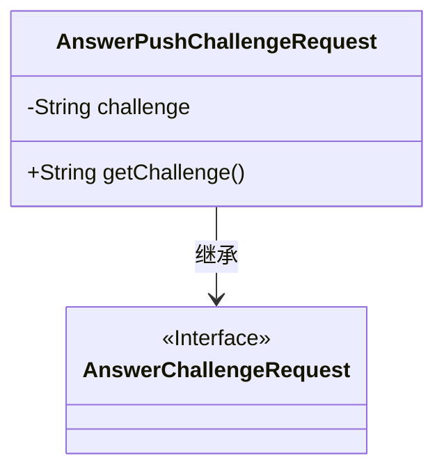
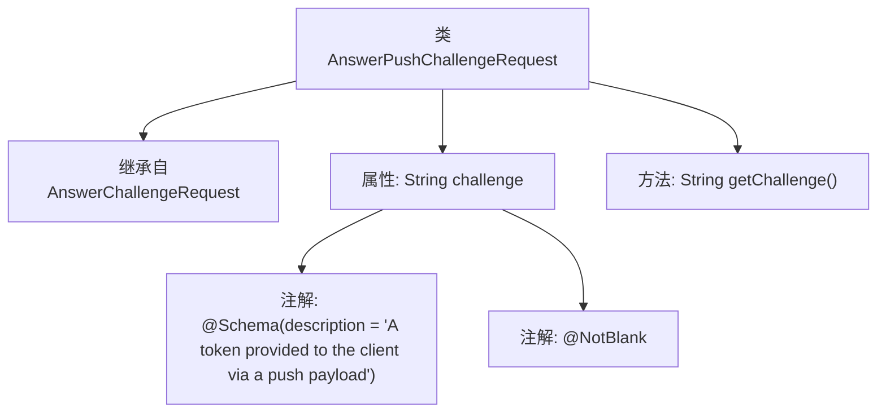

# 基础信息

|      |      |
|------|------|
| 名称 | AnswerPushChallengeRequest |
| 编码语言 | .java |
| 代码路径 | Signal-Server/service/src/main/java/org/whispersystems/textsecuregcm/entities/AnswerPushChallengeRequest.java |
| 包名 | org.whispersystems.textsecuregcm.entities |
| 依赖项 | ['io.swagger.v3.oas.annotations.media.Schema', 'jakarta.validation.constraints.NotBlank'] |
| 概述说明 | 类AnswerPushChallengeRequest继承AnswerChallengeRequest，含挑战令牌字段。 |

# 说明

类AnswerPushChallengeRequest继承自AnswerChallengeRequest，并包含一个挑战令牌字段。该字段用于在处理推送挑战请求时标识和验证特定的挑战实例。

# 类列表 Class Summary

| 名称   | 类型  | 说明 |
|-------|------|-------------|
| AnswerPushChallengeRequest | class | 类AnswerPushChallengeRequest继承AnswerChallengeRequest，包含挑战令牌字段。 |

## 类 AnswerPushChallengeRequest

|      |      |
|------|------|
| 访问范围 | public |
| 类型 | class |
| 名称 | AnswerPushChallengeRequest |
| 说明 | 类AnswerPushChallengeRequest继承AnswerChallengeRequest，包含挑战令牌字段。 |

### UML类图

**描述：**  
`AnswerPushChallengeRequest` 类继承自 `AnswerChallengeRequest` 接口，并包含一个私有成员 `challenge` 和一个公有方法 `getChallenge()` 用于获取该成员的值。`AnswerChallengeRequest` 是一个接口，标记为 `<<Interface>>`，表示它定义了一个契约，`AnswerPushChallengeRequest` 类实现了该契约。

### 内部方法调用关系图

该流程图描述了`AnswerPushChallengeRequest`类的结构。该类继承自`AnswerChallengeRequest`，包含一个私有属性`challenge`，并使用了两个注解`@Schema`和`@NotBlank`来定义该属性的描述和验证规则。类中还定义了一个`getChallenge`方法，用于获取`challenge`属性的值。流程图清晰地展示了类的继承关系、属性定义、注解使用以及方法调用。

### 字段列表 Field List

| 名称  | 类型  | 说明 |
|-------|-------|------|
| challenge | String | 客户端通过推送载荷获取的挑战令牌。 |

### 方法列表 Method List

| 名称  | 类型  | 说明 |
|-------|-------|------|
| getChallenge | String | 获取挑战值的方法，返回字符串类型。 |

