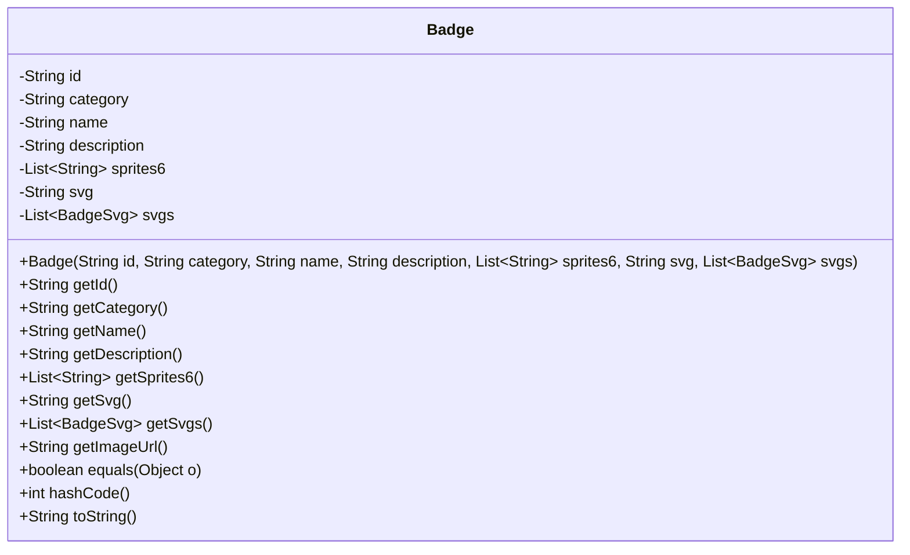

# 基础信息

|      |      |
|------|------|
| 名称 | Badge |
| 编码语言 | .java |
| 代码路径 | Signal-Server/service/src/main/java/org/whispersystems/textsecuregcm/entities/Badge.java |
| 包名 | org.whispersystems.textsecuregcm.entities |
| 依赖项 | ['com.fasterxml.jackson.annotation.JsonCreator', 'com.fasterxml.jackson.annotation.JsonProperty', 'com.google.common.base.Strings', 'java.util.List', 'java.util.Objects'] |
| 概述说明 | Badge类包含ID、类别、名称、描述、6精灵图、SVG及列表，含数据验证和重写方法。 |

# 说明

Badge类是一个用于管理徽章数据的类，包含多个属性和方法。其主要属性包括ID、类别、名称、描述、6个精灵图、SVG及SVG列表。该类还具备数据验证功能，确保输入数据的准确性和完整性。此外，Badge类还提供了重写方法，允许对现有数据进行修改和更新。通过这些功能，Badge类能够有效地管理和操作徽章相关数据，确保其一致性和可靠性。

# 类列表 Class Summary

| 名称   | 类型  | 说明 |
|-------|------|-------------|
| Badge | class | Badge类包含ID、类别、名称、描述、6个精灵图、SVG及SVG列表，并进行数据验证和重写方法。 |

## 类 Badge

|      |      |
|------|------|
| 访问范围 | public |
| 类型 | class |
| 名称 | Badge |
| 说明 | Badge类包含ID、类别、名称、描述、6个精灵图、SVG及SVG列表，并进行数据验证和重写方法。 |

### UML类图

**描述：**  
`Badge`类用于表示徽章对象，包含徽章的ID、类别、名称、描述、6个精灵图、SVG图像和多个SVG对象。构造函数通过`@JsonCreator`注解支持反序列化，并在初始化时对`sprites6`和`svg`进行非空和有效性检查。类提供了多个getter方法用于访问私有字段，并重写了`equals`、`hashCode`和`toString`方法以实现对象比较和字符串表示。此外，还包含一个已弃用的`getImageUrl`方法，用于兼容旧版Android构建。

### 内部方法调用关系图

```mermaid
graph TD
    A["类Badge"]
    B["属性: String id"]
    C["属性: String category"]
    D["属性: String name"]
    E["属性: String description"]
    F["属性: List<String> sprites6"]
    G["属性: String svg"]
    H["属性: List<BadgeSvg> svgs"]
    I["构造方法: Badge(String id, String category, String name, String description, List<String> sprites6, String svg, List<BadgeSvg> svgs)"]
    J["方法: String getId()"]
    K["方法: String getCategory()"]
    L["方法: String getName()"]
    M["方法: String getDescription()"]
    N["方法: List<String> getSprites6()"]
    O["方法: String getSvg()"]
    P["方法: List<BadgeSvg> getSvgs()"]
    Q["方法: String getImageUrl()"]
    R["重写方法: boolean equals(Object o)"]
    S["重写方法: int hashCode()"]
    T["重写方法: String toString()"]

    A --> B
    A --> C
    A --> D
    A --> E
    A --> F
    A --> G
    A --> H
    A --> I
    A --> J
    A --> K
    A --> L
    A --> M
    A --> N
    A --> O
    A --> P
    A --> Q
    A --> R
    A --> S
    A --> T
```

该流程图展示了`Badge`类的结构和内部方法调用关系。`Badge`类包含多个属性，如`id`、`category`、`name`等，以及相应的getter方法。构造方法`Badge`用于初始化这些属性，并在初始化过程中进行了一些验证，如`sprites6`的大小必须为6，`svg`不能为空。此外，类中还重写了`equals`、`hashCode`和`toString`方法，用于对象的比较、哈希码生成和字符串表示。`getImageUrl`方法是一个过时的方法，返回空字符串，用于兼容旧版本的Android构建。

### 字段列表 Field List

| 名称  | 类型  | 说明 |
|-------|-------|------|
| id | String | 定义了一个私有的不可变字符串变量id。 |
| svgs | List<BadgeSvg> | 私有不可变列表存储BadgeSvg对象。 |
| svg | String | 定义了一个私有且不可变的字符串变量svg。 |
| name | String | 定义了一个私有且不可变的字符串变量name。 |
| sprites6 | List<String> | 私有字符串列表变量sprites6。 |
| category | String | 私有不可变字符串变量category。 |
| description | String | 私有不可变的字符串描述字段。 |

### 方法列表 Method List

| 名称  | 类型  | 说明 |
|-------|-------|------|
| getDescription | String | 该方法返回描述字符串。 |
| getId | String | 该方法返回对象的ID值。 |
| getSvg | String | 该方法返回字符串类型的svg变量值。 |
| getCategory | String | 获取分类信息的字符串方法。 |
| getSvgs | List<BadgeSvg> | 方法返回BadgeSvg类型的列表svgs。 |
| getName | String | 该方法返回对象的名称属性。 |
| getImageUrl | String | 已弃用的方法，返回空字符串的图片URL获取函数。 |
| hashCode | int | 重写hashCode方法，使用Objects.hash计算id等字段的哈希值。 |
| getSprites6 | List<String> | 该方法返回名为sprites6的字符串列表。 |
| equals | boolean | 重写equals方法，比较对象ID、类别、名称、描述、sprites6、svg和svgs属性。 |
| toString | String | 重写toString方法，返回Badge对象的属性信息。 |

